# Experience Manager ニュースレターの作成{#creating-an-experience-manager-newsletter}

この統合を利用して、例えば、Adobe Experience Manager で作成したニュースレターを Adobe Campaign で E メールキャンペーンの一部として使用できます。

この統合を利用する方法の詳細な例については、この[詳細な手順ガイド](https://docs.campaign.adobe.com/doc/AC/getting_started/JA/aem.html)を参照してください。

**Adobe Experience Manager から：**

1. AEM オーサーインスタンスから、ページの左上にある **Adobe Experience** ロゴをクリックし、「**[!UICONTROL サイト]**」を選択します。

   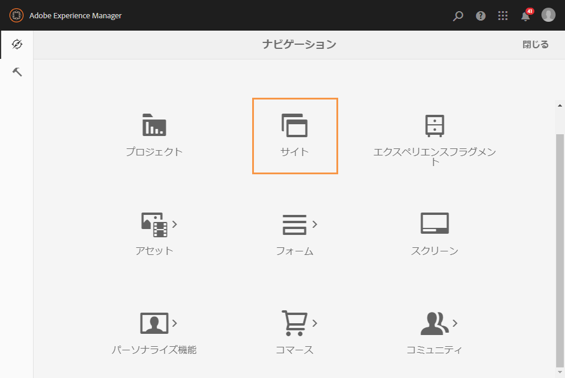

1. **[!UICONTROL キャンペーン／ブランド名（ここでは We.Retail）／マスター領域／電子メールキャンペーン]**&#x200B;を選択します。
1. ページの右上にある「**[!UICONTROL 作成]**」ボタンをクリックし、「**[!UICONTROL ページ]**」を選択します。

   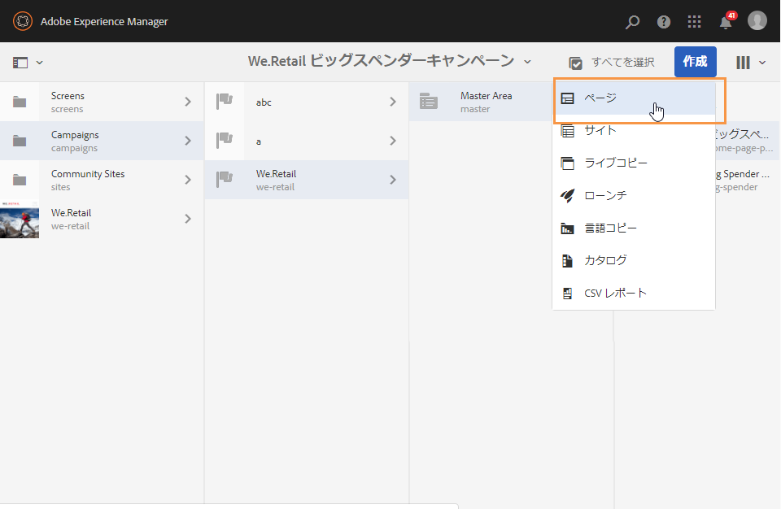

1. 「**[!UICONTROL Adobe Campaign 電子メール (AC 6.1)]**」テンプレートを選択し、ニュースレターに名前を付けます。
1. ページが作成されたら、**[!UICONTROL ページ情報]**&#x200B;メニューにアクセスし、「**[!UICONTROL プロパティを開く]**」をクリックします。

   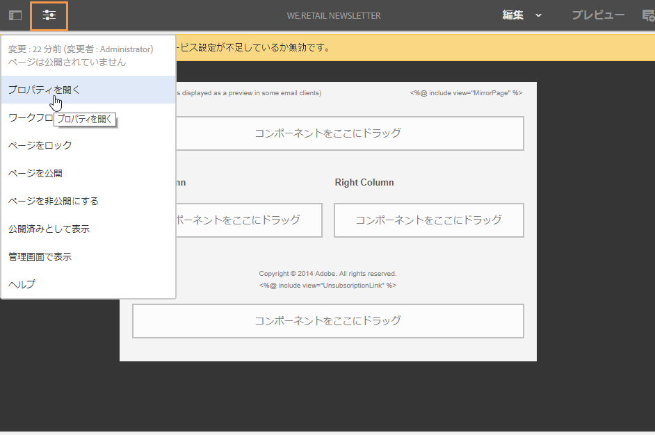

1. 「**[!UICONTROL クラウドサービス]**」タブで、「**[!UICONTROL クラウドサービスの設定]**」として「**[!UICONTROL Adobe Campaign]**」を、2 番目のドロップダウンで Adobe Campaign インスタンスを選択します。

   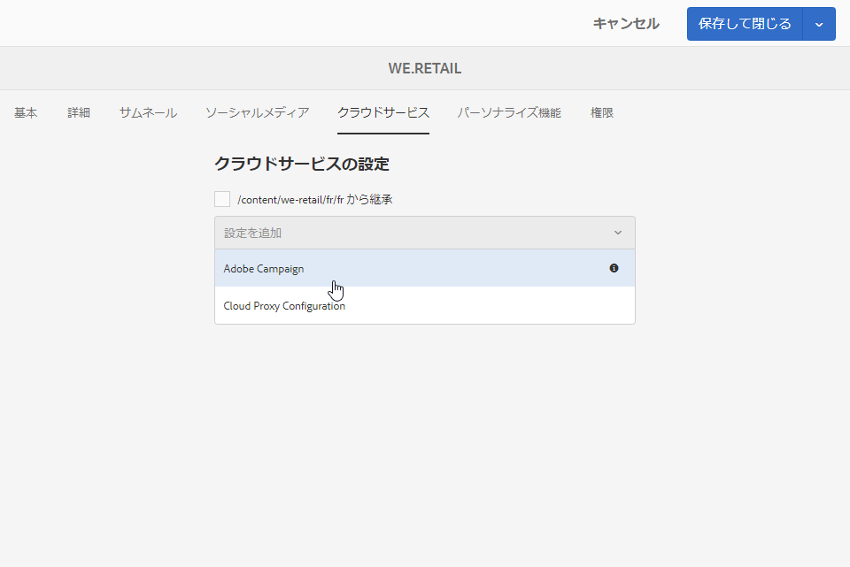

1. Adobe Campaign のパーソナライゼーションフィールドなどのコンポーネントを追加して E メールコンテンツを編集します。
1. E メールが準備できたら、**[!UICONTROL ページ情報]**&#x200B;メニューにアクセスし、「**[!UICONTROL ワークフローを開始]**」をクリックします。

   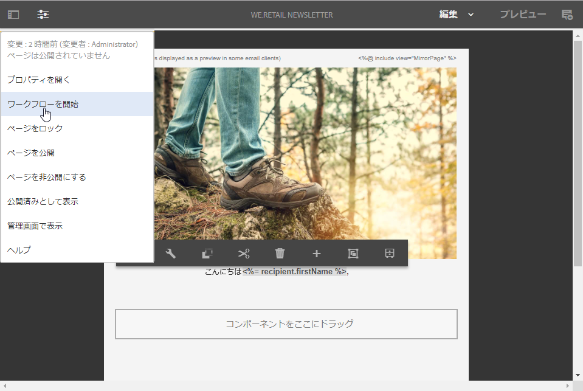

1. 最初のドロップダウンから、ワークフローモデルとして「**[!UICONTROL Adobe Campaign に公開]**」を選択し、「**[!UICONTROL ワークフローを開始]**」をクリックします。

   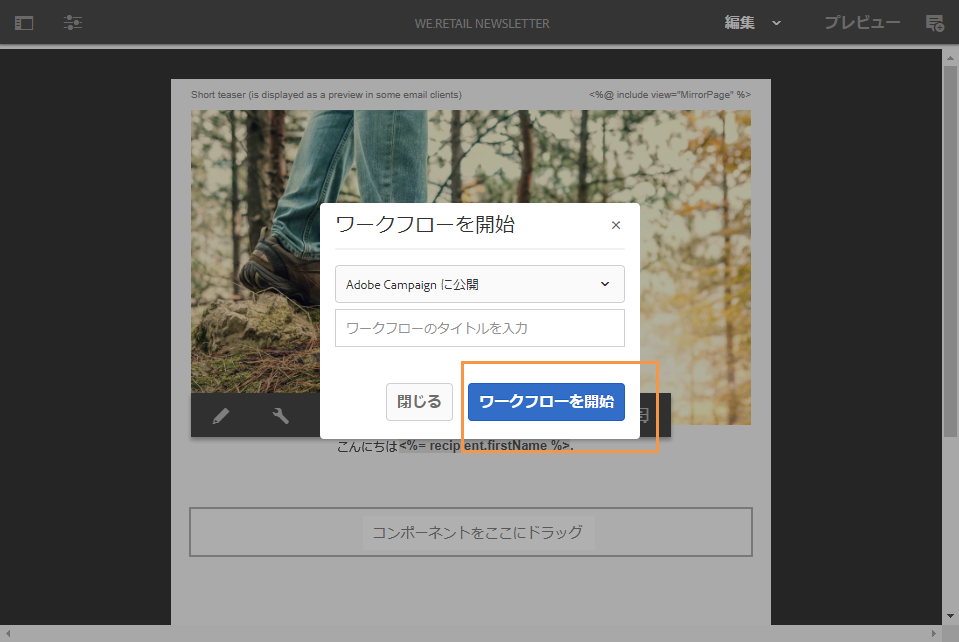

1. 次に、前の手順と同じように、**[!UICONTROL Campaign 用に承認]**&#x200B;ワークフローを開始します。
1. ページの上部に免責事項が表示されます。「**[!UICONTROL 完了]**」をクリックしてレビューを確認し、「**[!UICONTROL OK]**」をクリックします。

   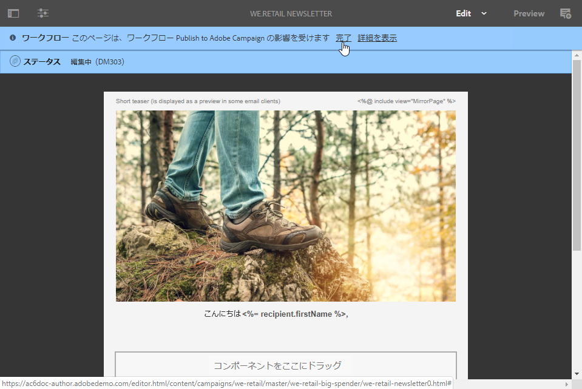

1. もう一度「**[!UICONTROL 完了]**」をクリックし、「**[!UICONTROL 次のステップ]**」ドロップダウンで「**[!UICONTROL ニュースレターの承認]**」を選択します。

   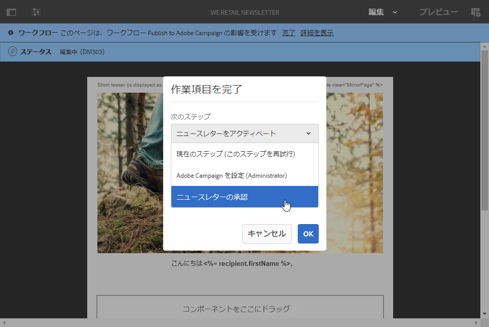

これでニュースレターが準備でき、Adobe Campaign で同期されました。

**Adobe Campaign から：**

1. 「**[!UICONTROL キャンペーン]**」タブで、「**[!UICONTROL 配信]**」、「**[!UICONTROL 作成]**」の順にクリックします。

   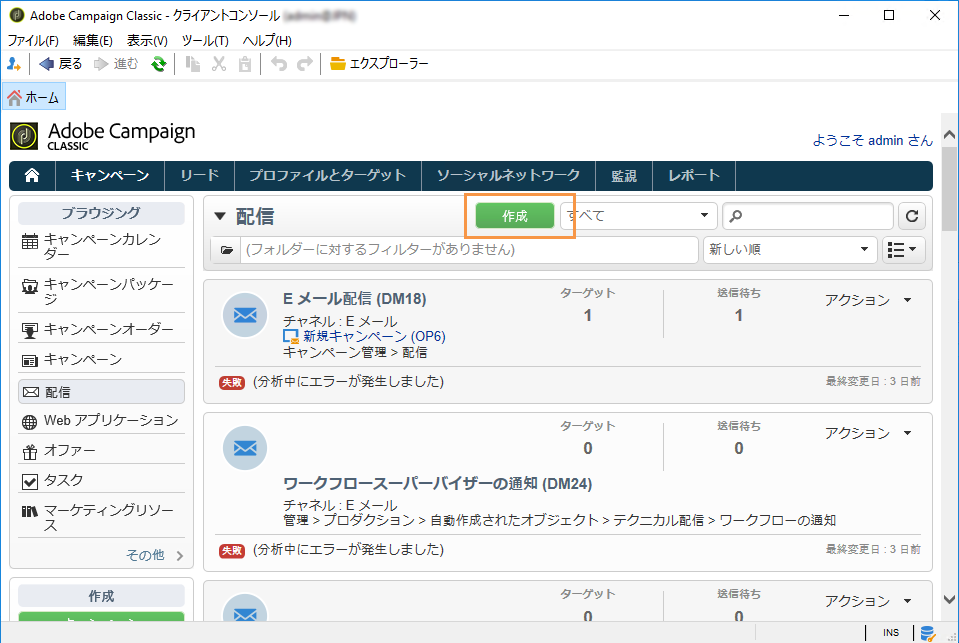

1. 「**[!UICONTROL 配信テンプレート]**」ドロップダウンで、「**[!UICONTROL AEM コンテンツで E メール配信 (mailAEMContent)]**」テンプレートを選択します。

   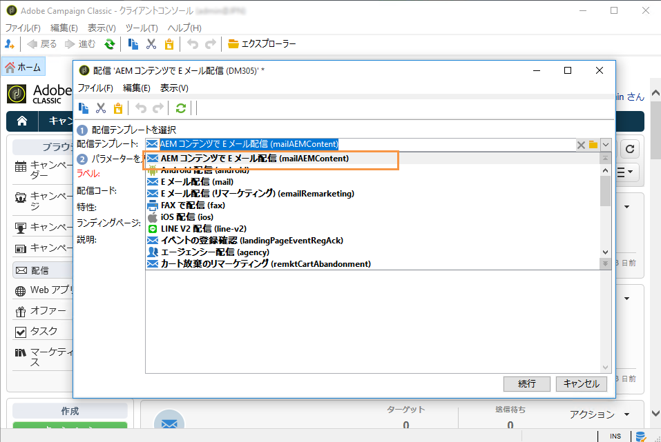

1. 配信に&#x200B;**[!UICONTROL ラベル]**&#x200B;を追加し、「**[!UICONTROL 続行]**」をクリックします。
1. 「**[!UICONTROL 同期]**」ボタンをクリックします。

   このボタンがインターフェイスに表示されていない場合は、「**[!UICONTROL プロパティ]**」ボタンをクリックし、「**[!UICONTROL 詳細設定]**」タブを選択します。「**[!UICONTROL コンテンツ編集モード]**」フィールドを「**[!UICONTROL AEM]**」に、「**[!UICONTROL AEM アカウント]**」フィールドを AEM インスタンスに設定する必要があります。

   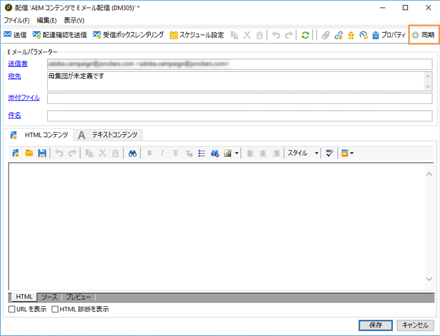

1. 以前に Adobe Experience Manager で作成した配信を選択し、「**[!UICONTROL OK]**」をクリックします。
1. AEM 配信に変更を加えたら、すぐに「**[!UICONTROL コンテンツを更新]**」ボタンをクリックします。

   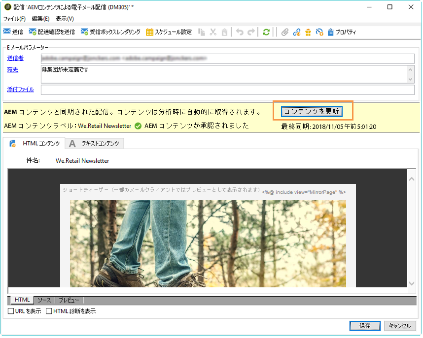

これで E メールをオーディエンスに送信する準備が整いました。
