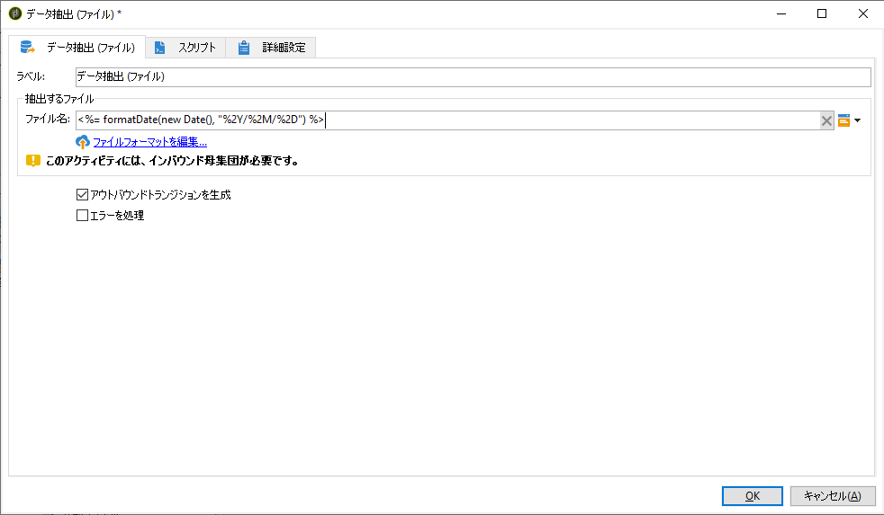
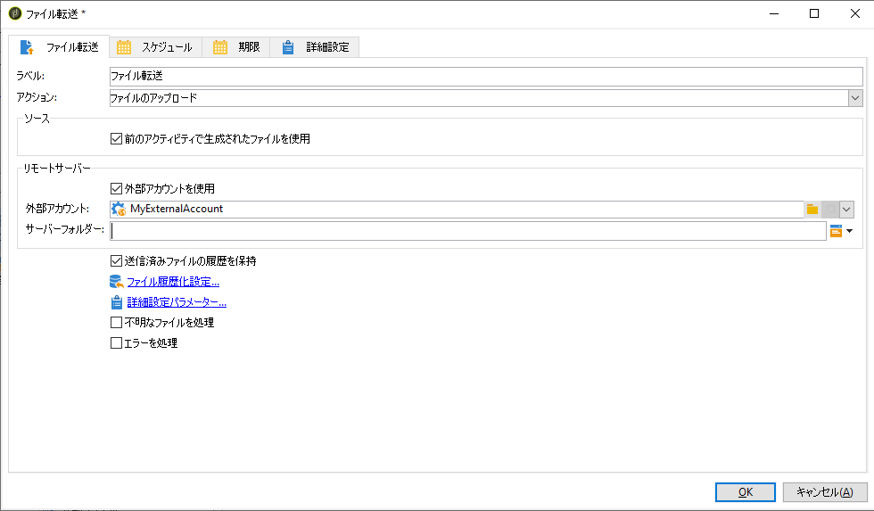
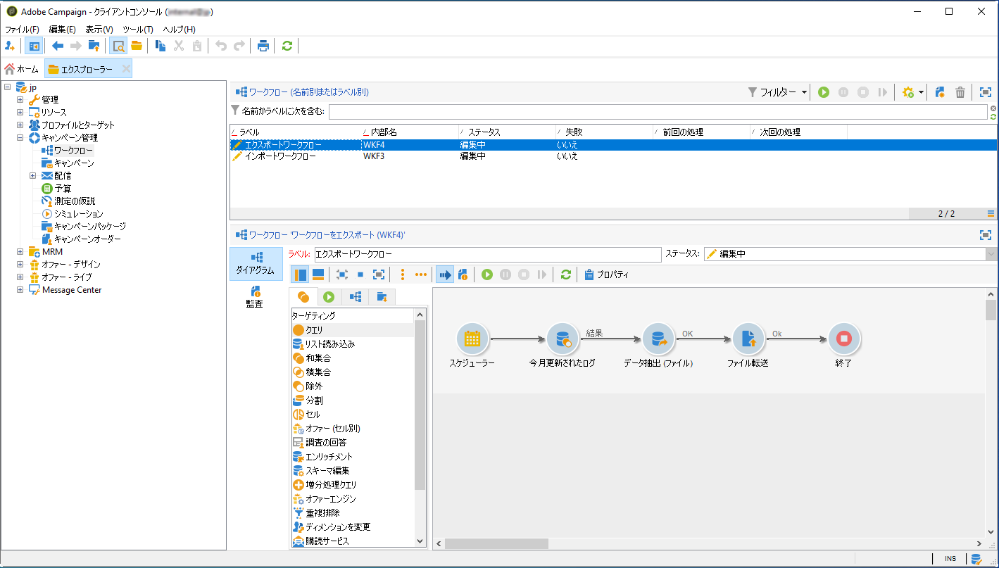
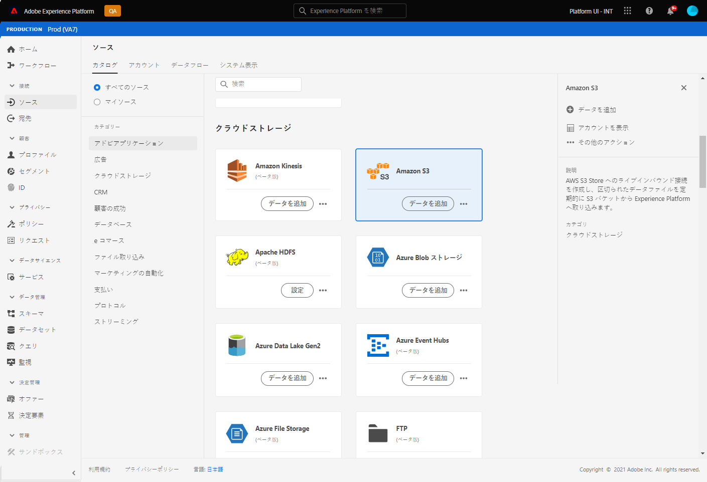
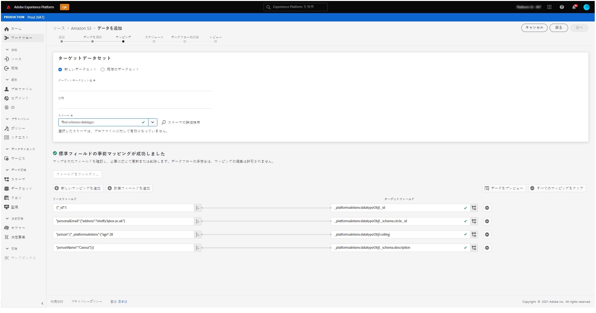

# Campaign から Adobe Experience Platform へのデータのエクスポート {#sources}

Campaign Classic データをアドビのリアルタイム顧客データプラットフォーム（RTCDP）にエクスポートするには、まず、Campaign Classic でワークフローを作成して、共有するデータを S3 または Azure Blob のストレージの場所にエクスポートする必要があります。

ワークフローを構成し、ストレージの場所にデータが送信されたら、S3 または Azure Blob のストレージの場所を Adobe Experience Platform の&#x200B;**ソース**&#x200B;として接続する必要があります。

>[!NOTE]
>
>Campaign で生成されたデータ（送信数、開封数、クリック数など）のみをAdobe Experience Platformに書き出すことをお勧めします。 サードパーティのソース（CRM など）から取り込まれたデータは、Adobe Experience Platform に直接読み込む必要があります。

## Campaign Classic でのエクスポートワークフローの作成

Campaign Classic から S3 または Azure Blob ストレージの場所にデータをエクスポートするには、エクスポート対象データにターゲットを絞って、そのデータをストレージの場所に送信するワークフローを構築する必要があります。

これをおこなうには、以下を追加して設定します。

* ターゲットデータを CSV ファイルに抽出する&#x200B;**[!UICONTROL データ抽出（ファイル）]**&#x200B;アクティビティ。 このアクティビティの設定方法について詳しくは、[Campaign v8 ドキュメント &#x200B;](https://experienceleague.adobe.com/docs/campaign/automation/workflows/wf-activities/action-activities/extraction-file.html?lang=ja){target="_blank"} を参照してください。

  

* CSV ファイルをストレージの場所に転送する&#x200B;**[!UICONTROL ファイル転送]**&#x200B;アクティビティ。 このアクティビティの設定方法について詳しくは、[Campaign v8 ドキュメント &#x200B;](https://experienceleague.adobe.com/docs/campaign/automation/workflows/wf-activities/event-activities/file-transfer.html?lang=ja){target="_blank"} を参照してください。

  

例えば、以下のワークフローでは、ログを定期的に CSV ファイルに抽出し、そのファイルをストレージの場所に転送します。

## ストレージの場所をソースとして接続する

S3 または Azure Blob ストレージの場所を Adobe Experience Platform の&#x200B;**ソース**&#x200B;として接続する主な手順を以下に示します。 これらの各手順について詳しくは、[ソースコネクタのドキュメント](https://experienceleague.adobe.com/docs/experience-platform/sources/home.html?lang=ja)を参照してください。

1. Adobe Experience Platform の「**[!UICONTROL ソース]**」メニューで、ストレージの場所への接続を作成します。

   * [Amazon S3 ソース接続の作成](https://experienceleague.adobe.com/docs/experience-platform/sources/ui-tutorials/create/cloud-storage/s3.html?lang=ja)
   * [Azure Blob コネクタ](https://experienceleague.adobe.com/docs/experience-platform/sources/connectors/cloud-storage/blob.html?lang=ja)

   >[!NOTE]
   >
   >ストレージの場所は、Amazon S3、パスワードを使用した SFTP、SSH キーを使用した SFTP、または Azure Blob 接続に設定できます。 Adobe Campaign にデータを送信する際には、Amazon S3 または Azure Blob を使用する方法を推奨します。

   

1. クラウドストレージのバッチ接続のデータフローを設定します。 データフローとは、ストレージの場所からデータを取得し、Adobe Experience Platform データセットに取り込むようスケジュール設定されたタスクです。 この手順では、データ選択や、CSV フィールドの XDM スキーマへのマッピングを含め、ストレージの場所からのデータ取り込みを設定できます。

   詳しくは、[このページ](https://experienceleague.adobe.com/docs/experience-platform/sources/ui-tutorials/dataflow/cloud-storage.html?lang=ja)を参照してください。

   

1. ソースの設定が完了すると、Adobe Experience Platform は指定したストレージの場所からファイルをインポートします。

   この操作は、必要に応じてスケジュールできます。 エクスポートの実行回数は、インスタンスに既に存在する負荷に応じて、1 日最大 6 回までとすることをお勧めします。
