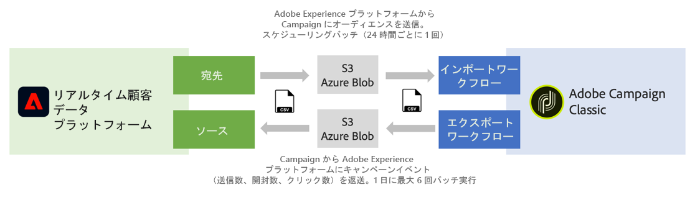

# ソースと宛先の操作 {#rtcdp}

## ソースと宛先について

Adobe Experience Platform を使用すると、Campaign Classic とアドビのリアルタイム顧客データプラットフォーム（RTCDP）の間でデータを共有できます。 これにより、Campaign ワークフローで Adobe Experience Platform オーディエンスをターゲットに設定し、オーディエンスに関連するデータ（送信数、開封数、クリック数など）をアドビのリアルタイム顧客データプラットフォームへと送信できます。

* **宛先**&#x200B;で、Adobe Experience Platform のオーディエンスを Campaign Classic に取り込みます。これにより、マーケティングキャンペーンで既知のデータや不明なデータを活用することができます。
* **ソース**&#x200B;で、Campaign Classic のデータ（送信数、開封数、クリック数など）を Adobe Experience Platform にエクスポートします。 これにより、異なるソースから収集したデータを 1 か所に集め、得られたインサイトを利用してより多くのことを実行できます。

>[!IMPORTANT]
>
>この統合を使用する際は、Adobe Campaign の契約条件が定める SFTP ストレージ、データベースストレージ、アクティブプロファイルの制限に注意してください。

アドビのリアルタイム顧客データプラットフォーム、宛先、ソースについて詳しくは、次のページを参照してください。

* [アドビのリアルタイム顧客データプラットフォーム](https://experienceleague.adobe.com/docs/experience-platform/rtcdp/overview.html?lang=ja)
* [宛先に関するドキュメント](https://experienceleague.adobe.com/docs/experience-platform/destinations/home.html?lang=ja)
* [ソースに関するドキュメント](https://experienceleague.adobe.com/docs/experience-platform/sources/home.html?lang=ja)

## Campaign Classic と Adobe Experience Platform の接続

Adobe Experience Platform と Campaign Classic の間でデータを共有するには、まず Adobe Campaign を&#x200B;**宛先**&#x200B;として接続し、AWS S3 または Azure Blob ストレージの場所を Adobe Experience Platform の&#x200B;**ソース**&#x200B;として接続する必要があります。

コネクタを設定したら、ワークフローを使用して、Campaign Classic へのデータのインポートまたはエクスポートを設定できます。

これらのインポートおよびエクスポートプロセスの設定方法について詳しくは、次の節を参照してください。

* [Adobe Experience Platform セグメントの Campaign への取り込み](../../integrations/using/ingest-aep-data.md)
* [Campaign から Adobe Experience Platform へのデータのエクスポート](../../integrations/using/export-campaign-data.md)
