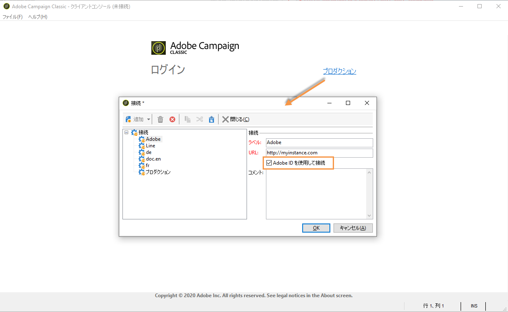
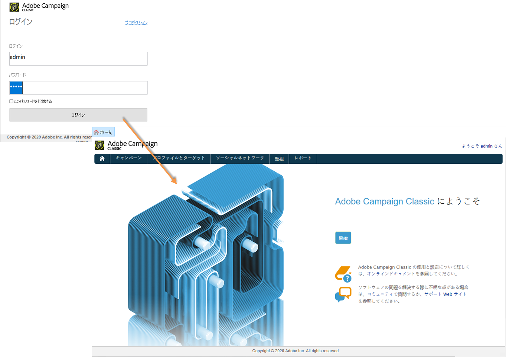
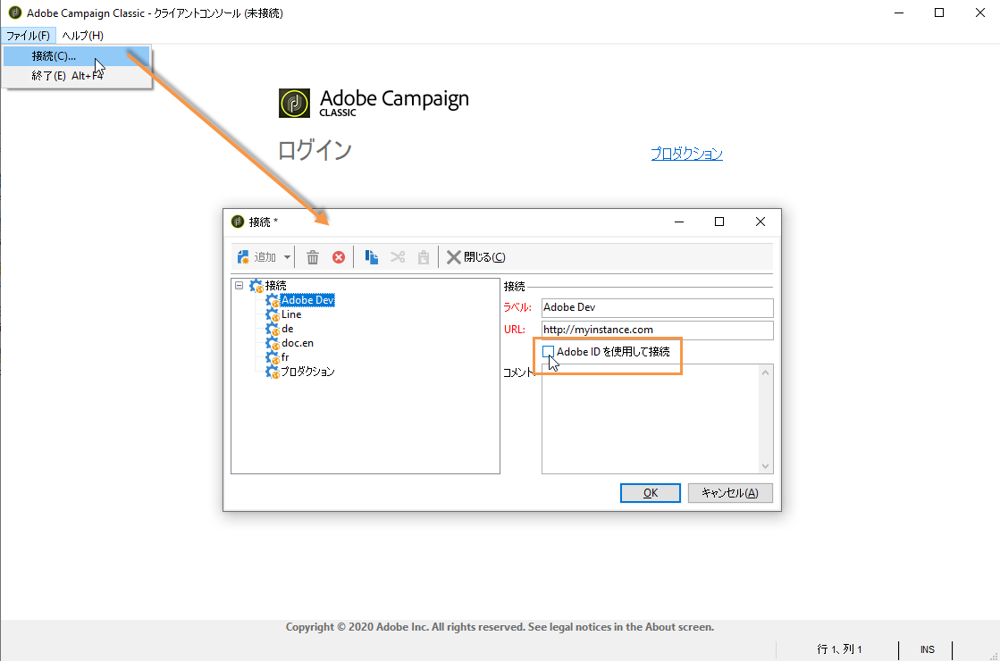

# IMS の実装{#implementing-ims}

## IMS 接続の有効化 {#enabling-the-ims-connection}

1. IMS を使用した接続を有効にするには、コンソールの接続ウィンドウで「**[!UICONTROL Adobe ID で接続]**」をオンにします。

   

1. Adobe ID とパスワードを入力します。Adobe Campaign のホーム画面が表示されます。

   

## IMS 接続の無効化 {#disabling-the-ims-connection}

Adobe ID を使用した接続を無効にするには、接続を切断し、「**[!UICONTROL ファイル／接続]**」をクリックして、「**[!UICONTROL Adobe ID で接続]**」のチェックを外します。

