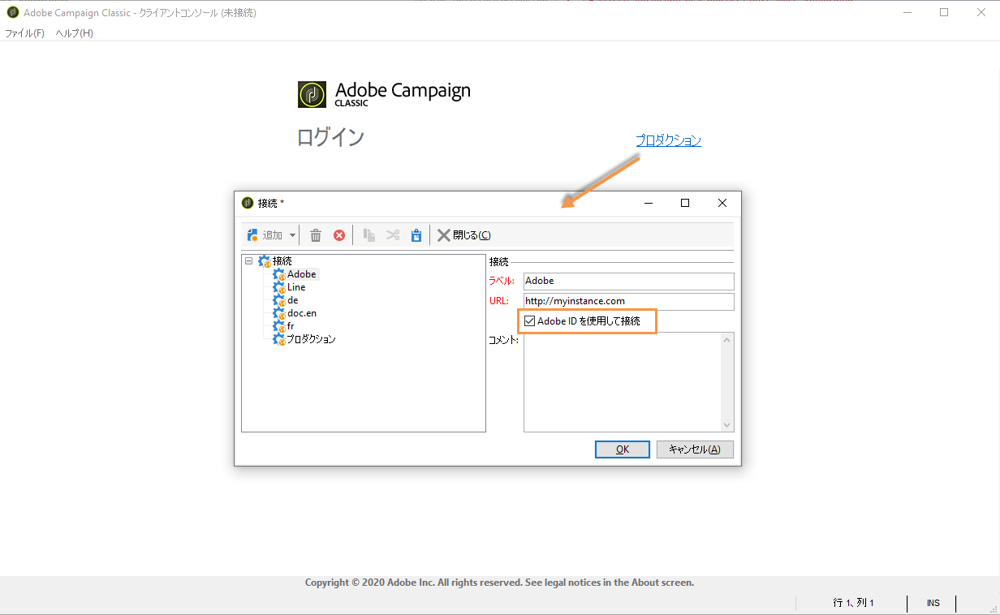

# IMS の実装{#implementing-ims}

[IMS 設定](configuring-ims.md)が完了したら、接続を有効にすることができます。

Adobe Campaign で IMS 認証モードを有効にするには、次の手順に従います。

1. クライアントコンソールの接続画面を開きます。
1. 接続を有効にする必要がある環境を選択します。
1. 「**[!UICONTROL Adobe ID で接続]**」オプションをオンにして、変更を保存します。

   

1. この環境に接続する際は、Adobe ID とパスワードを使用します。
