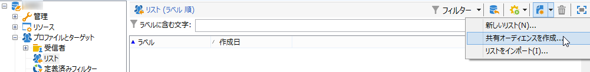
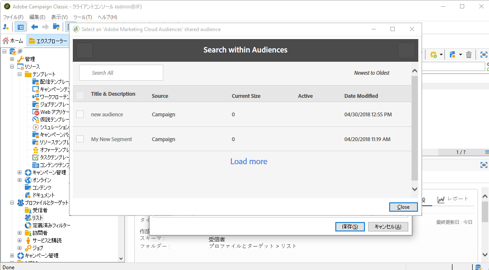
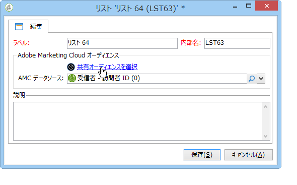
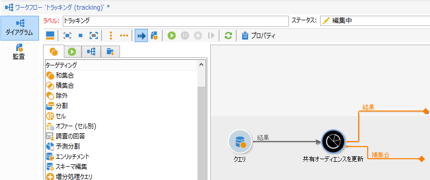
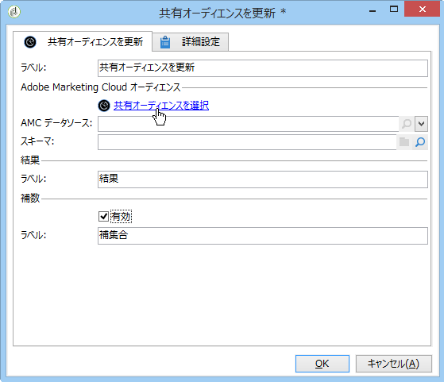

# オーディエンスのインポートおよびエクスポート{#importing-and-exporting-audiences}

## オーディエンスのインポート {#importing-an-audience}

受信者リストを使用して、Audience Manager または People コアサービスから Adobe Campaign にオーディエンスとセグメントをインポートできます。

1. Adobe Campaignエクスプロ **[!UICONTROL Profiles and Targets]** ーラーで **[!UICONTROL Lists]** 「>」ノードに移動します。
1. アクションバーで、/を選 **[!UICONTROL New]** 択しま **[!UICONTROL Create a shared audience...]**&#x200B;す。

   

1. In the window that opens, click **[!UICONTROL Select a shared audience]** to go to the list of shared audiences/segments available from the other Adobe Experience Cloud solutions.
1. オーディエンスを選択し、確定します。オーディエンスの情報は自動的に追加されます。

   Please note that to be able to import shared audience, you should be assigned the **[!UICONTROL Audience library]** product in the admin console and be an administrator in Audience Manager. 詳しくは、[Admin Console のドキュメント](https://helpx.adobe.com/enterprise/managing/user-guide.html)を参照してください。

   

1. Select the AMC Data source from the **[!UICONTROL AMC Data source]** field to define the type of data expected.

   

1. オーディエンスを保存します。

オーディエンスはテクニカルワークフローを使用してインポートされます。インポートされたリストには、AMC データソースを使用して紐付けできる要素が含まれています。Adobe Campaign が認識しない要素はインポートされません。

インポートプロセスで、People コアサービスまたは Audience Manager からセグメントを直接インポートする場合は、同期に 24～36 時間かかります。同期が終了すると、Adobe Campaign で新しいオーディエンスを検索したり、使用したりできます。

>[!NOTE]
>
>Adobe Analytics から Adobe Campaign にオーディエンスをインポートする場合は、最初に People コアサービスまたは Audience Manager でそれらのオーディエンスを共有する必要があります。このプロセスには 12～24 時間を要し、Campaign との同期にはさらに 24～36 時間が必要です。
>
>場合により、オーディエンスの共有プロセスは最大 60 時間に及ぶことがあります。People コアサービスと Audience Manager での Adobe Analytics オーディエンスの共有について詳しくは、この[ドキュメント](https://marketing.adobe.com/resources/help/en_US/mcloud/t_publish_audience_segment.html)を参照してください。

オーディエンスデータは、同期されるたびに完全に置き換えられます。インポートできるのはセグメントのみです。キーと値のペア、特徴、ルールなどの詳細データはサポートされません。

## オーディエンスのエクスポート {#exporting-an-audience}

ワークフローを使用して、Adobe Campaign から Audience Manager または People コアサービスにオーディエンスをエクスポートできます。ワークフローの作成と使用に関するプロセスについて詳しくは、[このドキュメント](../../workflow/using/building-a-workflow.md)を参照してください。エクスポートされたオーディエンスは、People コアサービスにセグメントとして保存されます。

1. 新しいターゲティングワークフローを作成します。
1. 使用可能な異なるアクティビティを使い、一連の受信者をターゲティングします。
1. After the targeting, drag and drop an **[!UICONTROL Update shared audience]** activity, then open it.

   

1. オプションを使用して書き出すオーディエンスを定義し **[!UICONTROL Select a shared audience]** ます。 表示されるウィンドウで、既存オーディエンスを選択したり、新規オーディエンスを作成したりできます。

   既存オーディエンスを選択した場合、新規レコードだけがオーディエンスに追加されます。

   To export your recipient list in a new audience, complete the **[!UICONTROL Segment name]** field then click **[!UICONTROL Create]** before selecting the newly created audience.

   ウィンドウの右上にあるチェックマークをクリックし、次に「**[!UICONTROL OK]**」ボタンをクリックして操作を終了します。

1. を選択して、 **[!UICONTROL AMC Data source]** 必要なデータタイプを指定します。 スキーマは自動的に決定されます。

   

1. オーディエンスを保存します。

オーディエンスがエクスポートされます。オーディエンス保存アクティビティには、アウトバンドトランジションが 2 種類あります。主なトランジションは、エクスポートに成功した受信者を含みます。追加トランジションは、訪問者 ID または宣言済み ID でマッピングできなかった受信者を含みます。

Adobe Campaign と People コアサービス間の同期には、24～36 時間かかります。同期が終了すると、People コアサービスで新しいオーディエンスを検索できるようになり、そのオーディエンスを他の Adobe Experience Cloud ソリューションで再利用することができます。Adobe People コアサービスで Adobe Campaign の共有オーディエンスを使用する方法について詳しくは、この[ドキュメント](https://marketing.adobe.com/resources/help/en_US/mcloud/t_audience_create.html)を参照してください。

>[!NOTE]
>
>紐付けするには、レコードに Adobe Experience Cloud ID（「訪問者 ID」または「宣言済み ID」）が必要です。Adobe Experience Cloud ID がないレコードは、オーディエンスのエクスポートおよびインポート中に無視されます。

