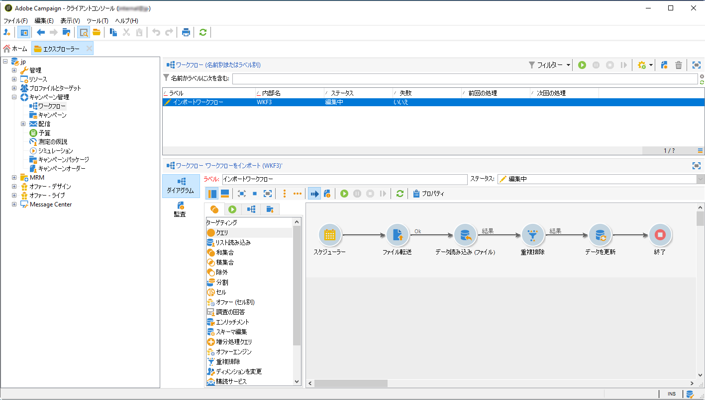

# Adobe Experience Platform セグメントの Campaign への取り込み {#destinations}

Adobe Experience Platform をキャンペーンに取り込んでワークフローで使用するには、まず Adobe Campaign を Adobe Experience Platform の&#x200B;**宛先**&#x200B;として接続し、エクスポート対象セグメントを使用して設定する必要があります。

宛先が設定されると、データはストレージの場所にエクスポートされます。これを取り込むには、Campaign Classic に専用のワークフローを作成する必要があります。

## Adobe Campaign を宛先として接続する

Adobe Experience Platform で、Adobe Campaign との接続を設定するには、エクスポートしたセグメントに対してストレージの場所を選択します。 また、この手順では、エクスポートするセグメントを選択し、そこに含める追加の XDM フィールドを指定することもできます。

詳しくは、[SMPP のドキュメント](https://experienceleague.adobe.com/docs/experience-platform/destinations/catalog/email-marketing/adobe-campaign.html?lang=ja)を参照してください。

宛先の設定が完了すると、Adobe Experience Platform は指定したストレージの場所にタブ区切りの .txt または .csv ファイルを作成します。 この操作は、24 時間に 1 回実行されるようスケジュールされています。

セグメントを Campaign に取り込むための Campaign Classic ワークフローを設定できるようになりました。

## Campaign Classic でのインポートワークフローの作成

Campaign Classic を宛先として設定したら、Adobe Experience Platform がエクスポートしたファイルを読み込むための専用のワークフローを作成する必要があります。

これをおこなうには、**[!UICONTROL ファイル転送]**&#x200B;アクティビティを追加して設定する必要があります。 このアクティビティの設定方法について詳しくは、 [こちらの節](../../workflow/using/file-transfer.md)を参照してください。

その後、必要に応じてワークフローを構築できます（セグメントデータを使用してデータベースを更新する、チャネル間の配信をセグメントに送信するなど）。

例えば、以下のワークフローでは、ストレージの場所から毎日ファイルをダウンロードし、その後、セグメントデータを使用して Campaign データベースを更新します。

