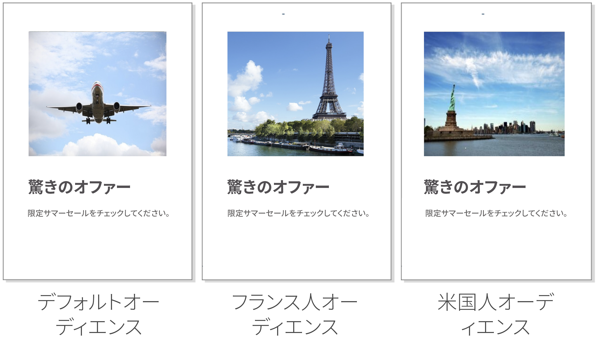
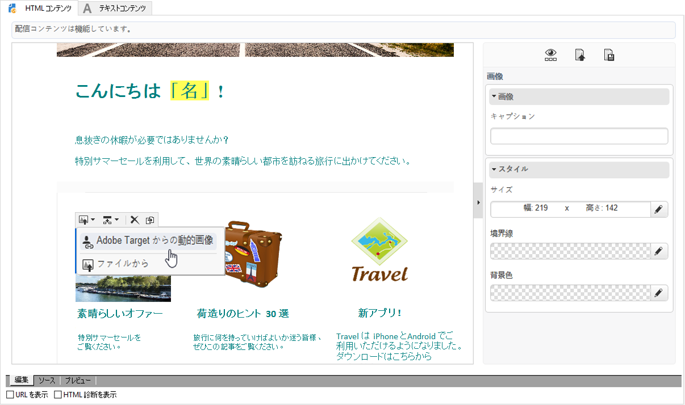
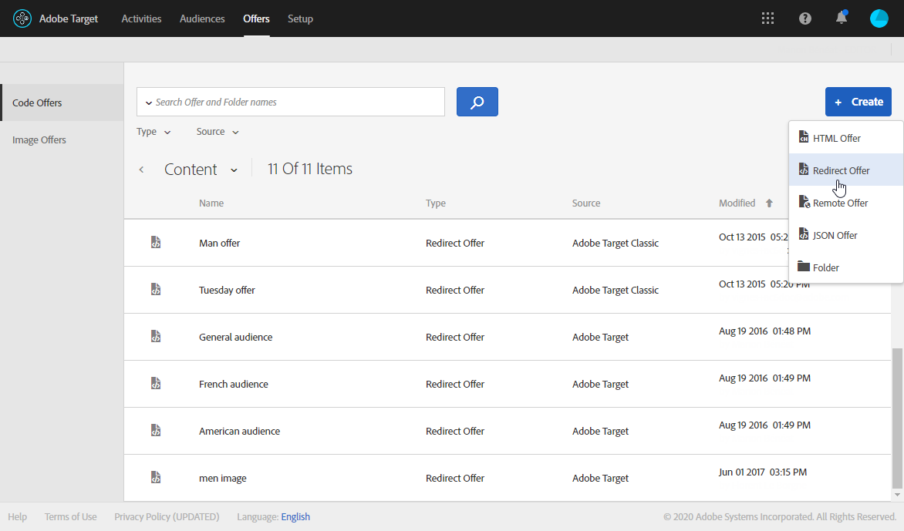
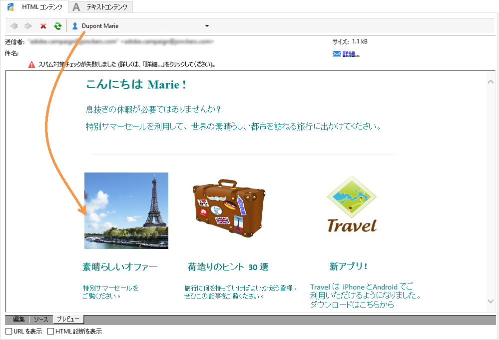

# Target動的コンテンツの挿入 {#inserting-a-dynamic-image}

このガイドでは、Target のダイナミックオファーを Adobe Campaign で E メールに統合する方法を説明します。

受信者の国に応じて動的に変化する画像ブロックを含む配信を作成します。データは、各 mbox リクエストごとに、訪問者の IP アドレスに基づいて送信されます。

この E メールでは、画像の 1 つが次のユーザーエクスペリエンスに従って動的に変化します。

* E メールがフランスで開かれている。
* E メールが米国で開かれている。
* どちらの条件にも該当しない場合、デフォルトの画像が表示される。

これを機能させるには、Adobe CampaignとTargetの両方で次の手順を実行する必要があります。

1. [ダイナミックオファーの E メールへの挿入](../../integrations/using/inserting-a-dynamic-image.md#inserting-dynamic-offer)
1. [リダイレクトオファーの作成](../../integrations/using/inserting-a-dynamic-image.md#create-redirect-offers)
1. [オーディエンスの作成](../../integrations/using/inserting-a-dynamic-image.md#audiences-target)
1. [エクスペリエンスターゲット設定アクティビティの作成](../../integrations/using/inserting-a-dynamic-image.md#creating-targeting-activity)
1. [E メールのプレビューと送信](../../integrations/using/inserting-a-dynamic-image.md#preview-send-email)

## ダイナミックオファーの E メールへの挿入 {#inserting-dynamic-offer}

Adobe Campaign で E メールのターゲットとコンテンツを定義したら、Target から動的イメージを挿入することができます。

この操作をおこなうには、デフォルトの画像の URL、場所名、Target に転送するフィールドを指定します。

Adobe Campaign では、2 通りの方法で Target から E メールに動的イメージを挿入できます。

* デジタルコンテンツエディターを使用している場合は、既存の画像を選択し、ツールバー **[!UICONTROL Insert]** から/ **[!UICONTROL Dynamic image served by Adobe Target]** を選択します。

   

* If you are using the standard editor, place the cursor where you want to insert the image and select **[!UICONTROL Include]** > **[!UICONTROL Dynamic image served by Adobe Target...]** from the personalization drop-down menu.

   

### 画像パラメーターの定義 {#defining-image-parameters}

* The **[!UICONTROL Default image]**&#39;s URL: The image that will be displayed when none of the conditions are fulfilled. アセットライブラリから画像を選択することもできます。
* The **[!UICONTROL Target location]**: Enter a name for your dynamic offer&#39;s location. この場所は、ターゲットアクティビティで選択する必要があります。
* 次の操作を行い **[!UICONTROL Landing Page]**&#x200B;ます。デフォルトの画像をデフォルトのランディングページにリダイレクトする場合。 この URL は、デフォルト画像が最終的な E メールに表示される場合にのみ使用され、オプションです。
* The **[!UICONTROL Additional decision parameters]**: Specify the mapping between the fields defined in the Adobe Target segments and the Adobe Campaign fields. 使用される Adobe Campaign フィールドは、ローボックスで指定されている必要があります。この例では、「国」フィールドを追加しています。

Adobe Target の設定で Enterprise 権限を使用している場合は、対応するプロパティをこのフィールドに追加します。Target の Enterprise 権限について詳しくは、[このページ](https://marketing.adobe.com/resources/help/en_US/target/target/properties-overview.html)を参照してください。

## リダイレクトオファーの作成 {#create-redirect-offers}

Targetでは、様々なバージョンのオファーを作成できます。 各ユーザーエクスペリエンスに応じて、リダイレクトオファーを作成し、表示される画像を指定できます。

ここでは、2 つのリダイレクトオファーが必要です。3 番目（デフォルト）のものは、Adobe Campaign で定義します。

1. Target Standardで新しいリダイレクトオファーを作成するには、タブからを **[!UICONTROL Content]** クリックしま **[!UICONTROL Code offers]**&#x200B;す。

1. 「次へ」をク **[!UICONTROL Create]** リックしま **[!UICONTROL Redirect Offer]**&#x200B;す。

   

1. オファーの名前と画像の URL を入力します。

   

1. 残りのリダイレクトオファーについても同じ手順を繰り返します。詳しくは、この[ページ](https://docs.adobe.com/help/en/target/using/experiences/offers/offer-redirect.html)を参照してください。

## オーディエンスの作成 {#audiences-target}

Targetでは、オファーを訪問した人が異なるコンテンツの配信先となる2つのオーディエンスを作成する必要があります。 オーディエンスごとに、オファーを表示できる人を定義するルールを追加します。

1. Targetで新しいオーディエンスを作成するには、タブでを **[!UICONTROL Audiences]** クリックしま **[!UICONTROL Create Audience]**&#x200B;す。

   

1. オーディエンスに名前を追加します。

   

1. をクリック **[!UICONTROL Add a rule]** し、カテゴリを選択します。 このルールでは、特定の条件を使用して訪問者をターゲティングしています。条件を追加してルールを調整したり、他のカテゴリに新しいルールを作成したりできます。

1. 残りのオーディエンスについても同じ手順を繰り返します。

## エクスペリエンスターゲット設定アクティビティの作成 {#creating-targeting-activity}

Targetでは、エクスペリエンスのターゲット設定アクティビティを作成し、異なるエクスペリエンスを定義し、それらを対応するオファーに関連付ける必要があります。

### オーディエンスの定義 {#defining-the-audience}

1. エクスペリエンスのターゲット設定アクティビティを作成するに **[!UICONTROL Activities]** は、タブで、をクリッ **[!UICONTROL Create Activity]** クし、次に **[!UICONTROL Experience Targeting]**&#x200B;進みます。

   

1. を選 **[!UICONTROL Form]** 択しま **[!UICONTROL Experience Composer]**&#x200B;す。

1. ボタンをクリックして、オーディエンスを選 **[!UICONTROL Change audience]** 択します。

   

1. 前の手順で作成したオーディエンスを選択します。

   

1. をクリックして、別のエクスペリエンスを作成しま **[!UICONTROL Add Experience Targeting]**&#x200B;す。

### 場所とコンテンツの定義 {#defining-location-content}

オーディエンスごとにコンテンツを追加します。

1. Adobe Campaignで動的なオファーを挿入する際に選択した場所の名前を選択します。

   

1. ドロップダウンボタンをクリックし、を選択しま **[!UICONTROL Change Redirect Offer]**&#x200B;す。

   

1. 作成済みのリダイレクトオファーを選択します。

   

1. 2つ目のエクスペリエンスに対しても同じ手順を実行します。

### アクティビティの定義 {#defining-activity}

The **[!UICONTROL Target]** window summarizes your activity. 必要に応じて、他のエクスペリエンスを追加できます。

The **[!UICONTROL Goal & Settings]** window allows you to personalize your activity by setting a priority, an objective, or a duration.

The **[!UICONTROL Reporting Settings]** section lets you select an action and edit the parameters that will determine when your goal is achieved.

## Campaign Classicでの電子メールのプレビューと送信 {#preview-send-email}

Adobe Campaign では、E メールをプレビューして、様々な受信者に対するレンダリングをテストできます。作成されたエクスペリエンスごとに画像が変化することがわかります。To learn more on email creation, refer to this [page](../../delivery/using/defining-the-email-content.md).

これで、Target からのダイナミックオファーを含む E メールを送信する準備ができました。

