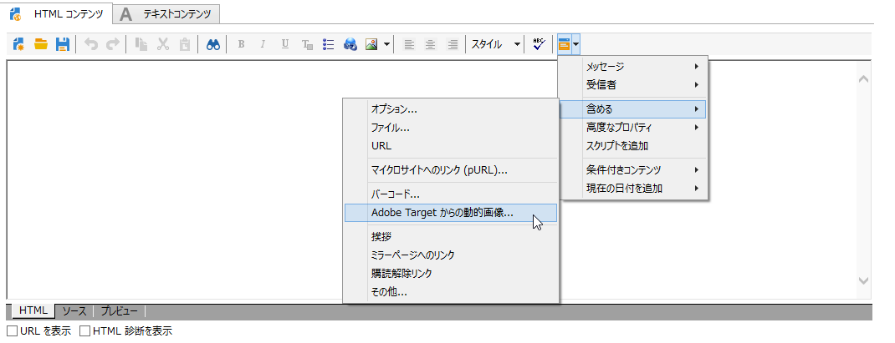
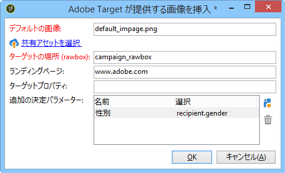

# 動的画像の挿入{#inserting-a-dynamic-image}

この節では、Adobe Target からの画像を E メールに統合するために Adobe Campaign で実行する手順を説明します。

事前に Adobe Target で次のアクションを実行する必要があります。

* 1 つ以上の[リダイレクションオファー](https://marketing.adobe.com/resources/help/en_US/tnt/help/t_Creating_a_Redirect_Offer.html)を作成します。使用する画像の URL をそこで指定します。
* 1 つ以上の[オーディエンス](https://marketing.adobe.com/resources/help/en_US/target/target/t_create-audience.html)を作成します。アクティビティのターゲットをそこで定義します。
* [フォームベースのエクスペリエンス作成ツール](https://marketing.adobe.com/resources/help/en_US/tnt/help/t_Creating_an_A_B_Test.html)を作成します。そこで、エクスペリエンス作成ツールでローボックスを 1 つ選択し、作成したリダイレクションオファーの数に応じて、複数のエクスペリエンスを指定します。エクスペリエンスごとに、作成したリダイレクションオファーの 1 つを選択する必要があります。

   これらのエクスペリエンスを指定するには、Adobe Campaign からの情報を使用して、セグメントを作成することができます。オファーの選択ルールで Adobe Campaign からのデータを使用するには、Adobe Target のローボックスでデータを指定する必要があります。

Adobe Target の画像を Adobe Campaign 配信に挿入するには：

1. E メール配信を作成します。
1. 利用可能なパーソナライゼーションフィールドで、を選択しま **[!UICONTROL Include > Dynamic image served by Adobe Target]**&#x200B;す。

   

1. 表示されるウィンドウで、E メールにデフォルトで表示される画像を選択します。画像 URL を指定するか、または[共有画像](../../integrations/using/sharing-assets-with-adobe-experience-cloud.md)を使用できます。
1. Adobe Target で指定したローボックス名を入力します。
1. Enter a URL in the **[!UICONTROL Landing Page]** field if you want the default image to redirect to a default landing page. この URL は、デフォルト画像が最終的な E メールに表示される場合にのみ使用され、オプションです。
1. Adobe Target の設定で Enterprise 権限を使用している場合は、対応するプロパティをこのフィールドに追加します。Target の Enterprise 権限について詳しくは、[このページ](https://marketing.adobe.com/resources/help/en_US/target/target/properties-overview.html)を参照してください。このフィールドはオプションであり、Target で Enterprise 権限を使用しない場合は必要ありません。
1. In **[!UICONTROL Additional decision parameters]**, specify the mapping between the fields defined in the Adobe Target segments and the Adobe Campaign fields. 使用される Adobe Campaign フィールドは、ローボックスで指定されている必要があります。

   

   Adobe Target でのパラメーターは、Adobe Campaign で Target の画像を統合したときに作成したローボックスの「**絞り込み条件**」オプションで定義されます。

   

   この例では、男性と女性で異なるエクスペリエンスを定義する方法を示しています。

ユーザーの E メールドメインや E メールアドレスに基づいて複数のケースを定義することもできます。E メールが開封されると、データはユーザーのブラウザーから自動的に取得されます。

E メールをプレビューする場合、異なるプロファイルを選択すると、Adobe Target アクティビティと Adobe Campaign で指定したパラメーターに応じて、挿入される画像が変わります。

送信結果は Adobe Target で計測することができます。

