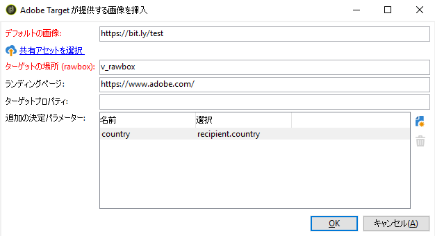

# Target の動的コンテンツの挿入 {#inserting-a-dynamic-image}

このガイドでは、Target のダイナミックオファーを Adobe Campaign で E メールに統合する方法を説明します。

受信者の国に応じて動的に変化する画像ブロックを含む配信を作成します。データは、各 mbox リクエストごとに、訪問者の IP アドレスに基づいて送信されます。

この E メールでは、画像の 1 つが次のユーザーエクスペリエンスに従って動的に変化します。

* E メールがフランスで開かれている。
* E メールが米国で開かれている。
* どちらの条件にも該当しない場合、デフォルトの画像が表示される。

これを実現するには、Adobe Campaign と Target の両方で、次の手順を実行する必要があります。

1. [ダイナミックオファーの E メールへの挿入](../../integrations/using/inserting-a-dynamic-image.md#inserting-dynamic-offer)
1. [リダイレクトオファーの作成](../../integrations/using/inserting-a-dynamic-image.md#create-redirect-offers)
1. [オーディエンスの作成](../../integrations/using/inserting-a-dynamic-image.md#audiences-target)
1. [エクスペリエンスターゲット設定アクティビティの作成](../../integrations/using/inserting-a-dynamic-image.md#creating-targeting-activity)
1. [E メールのプレビューと送信](../../integrations/using/inserting-a-dynamic-image.md#preview-send-email)

## ダイナミックオファーの E メールへの挿入 {#inserting-dynamic-offer}

Adobe Campaign で E メールのターゲットとコンテンツを定義したら、Target から動的イメージを挿入することができます。

この操作をおこなうには、デフォルトの画像の URL、場所名、Target に転送するフィールドを指定します。

Adobe Campaign では、2 通りの方法で Target から E メールに動的イメージを挿入できます。

* デジタルコンテンツエディターを使用している場合は、既存の画像を選択して、ツールバーで&#x200B;**[!UICONTROL 挿入]**／**[!UICONTROL Adobe Target からの動的画像]**&#x200B;を選択します。

   

* 標準のエディターを使用している場合は、画像を挿入する場所にカーソルを移動し、パーソナライゼーションドロップダウンメニューから&#x200B;**[!UICONTROL 含める]**／**[!UICONTROL Adobe Target からの動的画像]**&#x200B;を選択します。

   

### 画像パラメーターの定義 {#defining-image-parameters}

* **[!UICONTROL デフォルトの画像]**&#x200B;の URL：どの条件も満たされない場合に表示される画像です。アセットライブラリから画像を選択することもできます。
* **[!UICONTROL ターゲットの場所]**：ダイナミックオファーの対象となる場所の名前を入力します。この場所は、ターゲットアクティビティで選択する必要があります。
* **[!UICONTROL ランディングページ]**：デフォルト画像をデフォルトのランディングページにリダイレクトする場合。この URL は、デフォルト画像が最終的な E メールに表示される場合にのみ使用され、オプションです。
* **[!UICONTROL 追加の決定パラメーター]**：Adobe Target セグメントで定義されたフィールドと Adobe Campaign フィールド間のマッピングを指定します。使用する Adobe Campaign フィールドは、rawbox で指定されている必要があります。この例では、「国」フィールドを追加しています。

Adobe Target の設定で Enterprise 権限を使用している場合は、対応するプロパティをこのフィールドに追加します。Target の Enterprise 権限について詳しくは、[このページ](https://docs.adobe.com/content/help/en/target/using/administer/manage-users/enterprise/properties-overview.html)を参照してください。

## リダイレクトオファーの作成 {#create-redirect-offers}

Target では、オファーのバージョンを複数作成できます。各ユーザーエクスペリエンスに応じて、リダイレクトオファーを作成し、表示される画像を指定できます。

ここでは、2 つのリダイレクトオファーが必要です。3 番目（デフォルト）のものは、Adobe Campaign で定義します。

1. Target Standard で新しいリダイレクトオファーを作成するには、「**[!UICONTROL コンテンツ]**」タブで「**[!UICONTROL コードオファー]**」をクリックします。

1. 「**[!UICONTROL 作成]**」、「**[!UICONTROL リダイレクトオファー]**」の順にクリックします。

   

1. オファーの名前と画像の URL を入力します。

   

1. 残りのリダイレクトオファーについても同じ手順を繰り返します。詳しくは、この[ページ](https://docs.adobe.com/help/ja-JP/target/using/experiences/offers/offer-redirect.html)を参照してください。

## オーディエンスの作成 {#audiences-target}

Target で、2 つのオーディエンスを作成し、オファーに訪問する人を分類する必要があります。この分類ごとに、異なるコンテンツが配信されます。オーディエンスごとに、オファーを表示できる人を定義するルールを追加します。

1. Target で新しいオーディエンスを作成するには、「**[!UICONTROL オーディエンス]**」タブで「**[!UICONTROL オーディエンスを作成]**」をクリックします。

   

1. オーディエンスに名前を追加します。

   

1. 「**[!UICONTROL ルールを追加]**」をクリックして、カテゴリを選択します。このルールでは、特定の条件を使用して訪問者をターゲティングしています。条件を追加したり、他のカテゴリに新しいルールを作成したりしてルールを調整できます。

1. 残りのオーディエンスについても同じ手順を繰り返します。

## エクスペリエンスターゲット設定アクティビティの作成 {#creating-targeting-activity}

Target で、エクスペリエンスターゲット設定アクティビティを作成し、異なるエクスペリエンスを定義して、対応するオファーに関連付けます。

### オーディエンスの定義 {#defining-the-audience}

1. エクスペリエンスターゲット設定アクティビティを作成するには、「**[!UICONTROL アクティビティ]**」タブで、「**[!UICONTROL アクティビティを作成]**」をクリックし、「**[!UICONTROL エクスペリエンスターゲット設定]**」をクリックします。

   

1. **[!UICONTROL Experience Composer]** として「**[!UICONTROL フォーム]**」を選択します。

1. 「**[!UICONTROL オーディエンスを変更]**」ボタンをクリックして、オーディエンスを選択します。

   

1. 前の手順で作成したオーディエンスを選択します。

   

1. 「**[!UICONTROL エクスペリエンスのターゲットを追加]**」をクリックして、別のエクスペリエンスを作成します。

### 場所とコンテンツの定義 {#defining-location-content}

オーディエンスごとにコンテンツを追加します。

1. Adobe Campaign でダイナミックオファーを挿入する際に選択した場所名を選択します。

   

1. ドロップダウンボタンをクリックして、「**[!UICONTROL リダイレクトオファーを変更]**」を選択します。

   

1. 前の手順で作成したリダイレクトオファーを選択します。

   

1. 2 番目のエクスペリエンスについても同じ手順を繰り返します。

### アクティビティの定義 {#defining-activity}

**[!UICONTROL ターゲット]**&#x200B;ウィンドウに、アクティビティの概要が表示されます。必要に応じて、他のエクスペリエンスを追加できます。

**[!UICONTROL 目標と設定]**&#x200B;ウィンドウでは、優先度、目標、期間を設定して、アクティビティをパーソナライズできます。

「**[!UICONTROL レポート設定]**」セクションでは、アクションを選択し、目標達成を判別するためのパラメーターを編集できます。

## Campaign Classic での E メールのプレビューと送信{#preview-send-email}

Adobe Campaign では、E メールをプレビューして、様々な受信者に対するレンダリングをテストできます。作成されたエクスペリエンスごとに画像が変化することがわかります。E メール作成について詳しくは、この[ページ](../../delivery/using/defining-the-email-content.md)を参照してください。

これで、Target からのダイナミックオファーを含む E メールを送信する準備ができました。

