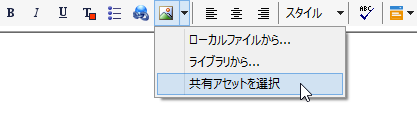
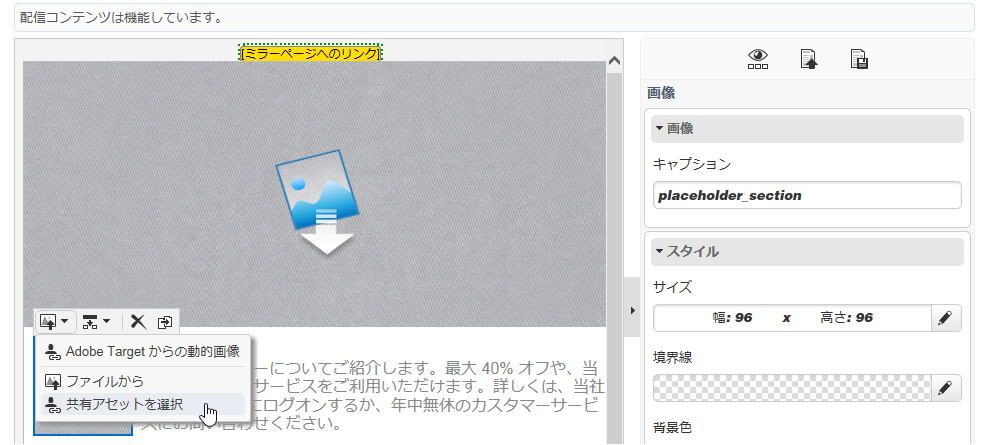

# 共有アセットを挿入{#inserting-a-shared-asset}

Adobe Experience Cloud から共有されるアセットは、E メールやランディングページで次のように使用できます。

1. 新しい E メールまたは新しいランディングページを作成します。

   Adobe Experience Manager Assets ライブラリのアセットを使用する場合は、[統合を設定](../../integrations/using/configuring-access-to-assets.md#integrating-with-aem-assets)したときに作成した配信テンプレートを使用します。

   この特定のテンプレートがない場合、配信の&#x200B;**プロパティ**&#x200B;で、「**[!UICONTROL コンテンツ編集モード]**」（「**[!UICONTROL 詳細]**」タブ）が「**DCE**」に設定され、AEM Assets リソースライブラリへのアクセスに使用する AEM 外部アカウントが入力されていることを確認してください。

1. 編集ウィンドウで、「画像を追加」オプションを選択します。

   * [標準編集モード](../../delivery/using/defining-the-email-content.md#adding-images)を使用している場合、**[!UICONTROL 画像]**／**[!UICONTROL 共有アセットを選択]**&#x200B;を選択します。

      

   * [詳細編集モード](../../web/using/about-campaign-html-editor.md)（DCE）を使用している場合、画像ブロックに移動し、コンテキストメニューから「**[!UICONTROL 共有アセットを選択]**」を選択します。

      

      >[!NOTE]
      >
      >DCE を使用している場合、[Web にアクセス](../../platform/using/adobe-campaign-workspace.md#console-and-web-access)している Adobe Campaign から共有画像を挿入することはできません。

1. 表示される選択ウィンドウで画像を選択し、確定します。

   Adobe Campaign インスタンスの設定により、Adobe Experience Cloud ライブラリまたは AEM Assets ライブラリからの画像を使用できます。[Assets へのアクセスの設定](../../integrations/using/configuring-access-to-assets.md)の節を参照してください。

   

>[!NOTE]
>
>Adobe Target との統合を使用している場合、共有画像をデフォルト画像として使用できます。[このページ](../../integrations/using/integrating-with-adobe-target.md)を参照してください。

