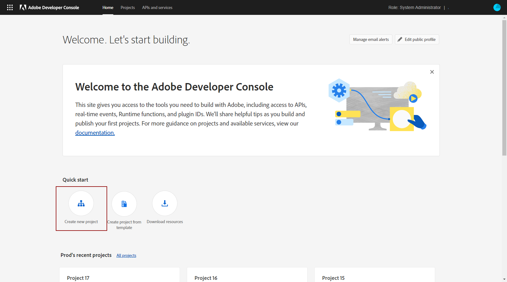

# Adobe テクニカルアカウントの作成 {#create-service-account}

サーバー間認証資格情報を使用すると、アプリケーション自体に代わって、アプリケーションのサーバーでアクセストークンを生成し、API 呼び出しを行うことができます。[詳細情報](https://developer.adobe.com/developer-console/docs/guides/authentication/ServerToServerAuthentication/)

## 既存の統合の移行 {#migrate-jwt}

サービスアカウント（JWT）資格情報は、アドビによって非推奨（廃止予定）になります。アドビのソリューションおよびアプリとの Campaign 統合では、OAuth サーバー間資格情報に依存する必要があります。

2024年6月より前に Campaign とのインバウンドまたはアウトバウンド統合を実装している場合は、[このドキュメント](https://developer.adobe.com/developer-console/docs/guides/authentication/ServerToServerAuthentication/migration){target="_blank"}の説明に従って、Campaign 環境を v7.4.1 にアップグレードし、テクニカルアカウントを OAuth に移行する必要があります。既存のサービスアカウント（JWT）資格情報は、**2025年1月27日（PT）**&#x200B;まで引き続き機能します。

移行が完了したら、[この節](#add-credentials)の説明に従って、新しい資格情報を Campaign に関連付ける必要があります。

## 新しい統合に対する新しい OAuth テクニカルアカウントの作成 {#oauth-service}

新しい統合に対する OAuth テクニカルアカウントを作成するには、次の手順に従います。

1. Adobe Developer Console にアクセスし、組織の&#x200B;**システム管理者**&#x200B;としてログインします。

   管理者ロールについて詳しくは、[このページ](https://helpx.adobe.com/jp/enterprise/using/admin-roles.html)を参照してください。

1. 「**[!UICONTROL 新規プロジェクトを作成]**」をクリックします。

   

1. 「**[!UICONTROL プロジェクトに追加]**」をクリックし、「**[!UICONTROL API]**」を選択します。

   

1. Campaign と統合する製品を選択し、「**[!UICONTROL 次へ]**」をクリックします。

1. 認証タイプとして「**[!UICONTROL OAuth サーバー間]**」を選択し、「**[!UICONTROL 次へ]**」をクリックします。

   

1. プロジェクトへの&#x200B;**[!UICONTROL 製品プロファイル]**&#x200B;リンクを選択します。

   必要に応じて、新しいアカウントを作成できます。[詳細情報](https://helpx.adobe.com/jp/enterprise/using/manage-product-profiles.html)

1. 次に、「**[!UICONTROL 設定済み API を保存]**」をクリックします。

   

1. プロジェクトの資格情報で [!DNL OAuth Server-to-Server] を選択し、次の情報をコピーします。

   * **[!UICONTROL クライアント ID]**
   * **[!UICONTROL クライアント秘密鍵]**
   * **[!UICONTROL テクニカルアカウント ID]**
   * **[!UICONTROL 組織 ID]**

## Adobe Campaign への OAuth プロジェクト資格情報の追加 {#add-credentials}

Adobe Campaign に OAuth プロジェクト資格情報を追加するには、次の手順に従います。

1. Adobe Campaign インスタンスがインストールされている各コンテナに SSH 経由でログインします。

1. `neolane` ユーザーとして次のコマンドを実行して、Adobe Campaign に OAuth プロジェクト資格情報を追加します。これにより、**[!UICONTROL テクニカルアカウント]**&#x200B;資格情報がインスタンス設定ファイルに挿入されます。

   ```
   nlserver config -instance:<instance_name> -setimsoauth:ims-org-id/client-id/technical-account-id/client-secret
   ```
