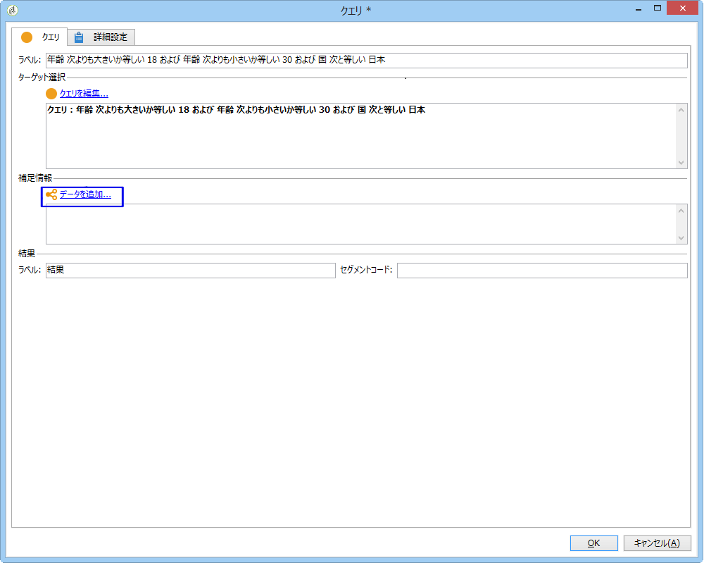

# オーディエンスの同期{#synchronizing-audiences}

Campaign v7 の高度な機能を使用して、高度なリストを作成できます。このリストは（追加データを含め）、オーディエンスとして Campaign Standard とシームレスにリアルタイムで直接共有できます。Campaign Standard ユーザーはそのオーディエンスを Adobe Campaign Standard で使用できます。

Campaign Standard でレプリケートされない追加データを必要とする複雑なターゲティングは Campaign v7 を使用することでのみ実現できます。

また、単純に、Microsoft Dynamics などのコネクタを介して読み込まれた受信者のリストやデータを Campaign Standard と共有することもできます。

この使用例では、Campaign v7 での配信のターゲットの準備方法と、そのターゲットと追加データを Adobe Campaign Standard で作成および送信する配信で再利用する方法を示します。

>[!NOTE]
>
>必要なすべてのデータが既にレプリケートされている場合は、Adobe Campaign Standard での集計とコレクションをデータのエンリッチメントに使用することもできます。

## 前提条件 {#prerequisites}

これをおこなうには、以下が必要です。

* Campaign v7 データベースに格納され、Campaign Standard と同期された受信者。「[プロファイルの同期](../../integrations/using/synchronizing-profiles.md) 」を参照。
* Campaign v7 データベースの nms:recipients に関連するテーブルに格納された購読またはトランザクションなどの追加データ。これらのデータは、Campaign v7 OOB スキーマまたはカスタムテーブルから取得されます。これらは同期されないので、デフォルトでは Campaign Standard では使用できません。
* Campaign v7 と Campaign Standard の両方でワークフローを実行するための権限。
* Campaign Standard で配信を作成および実行するための権限。

## Campaign v7 での追加データを含むターゲティングワークフローの作成 {#create-a-targeting-workflow-with-additional-data-in-campaign-v7}

Campaign Standard でレプリケートされない追加データを必要とする複雑なターゲティングは Campaign v7 を使用することでのみ実現できます。

ターゲットおよびその追加データが定義されると、Campaign Standard と共有できるリストとして保存できます。

>[!NOTE]
>
>これは一例です。要件によっては、単純に受信者のリストに対してクエリを実行したり、そのリストを ACS と共有したりするだけでそれ以上の処理は不要な場合もあります。また、他のデータ管理アクティビティを使用して最終ターゲットを準備することもできます。

最終オーディエンスおよびその追加データを取得するには

1. **[!UICONTROL Profiles and Targets]** > **[!UICONTROL Jobs]** > **[!UICONTROL Targeting workflows]**&#x200B;から新しいワークフローを作成します。
1. Add a **[!UICONTROL Query]** activity and select the recipients that you want to send final email to. （例：18 ～ 30 歳のフランス在住のすべての受信者）。

   

1. クエリ内で追加データを追加します。詳しくは、[データの追加](../../workflow/using/query.md#adding-data)の節を参照してください。

   この例では、受信者が 1 年間に受け取った配信数の集計を追加する方法を示します。

   **[!UICONTROL Query]**&#x200B;で、 **[!UICONTROL Add data...]** を選 択します。

   

1. **[!UICONTROL Data linked to the filtering dimension]** を選択し、 **[!UICONTROL Next]**&#x200B;をクリックします。

   

1. **[!UICONTROL Data linked to the filtering dimension]** を選択し、**[!UICONTROL Recipient delivery logs]** ノードを選択して **[!UICONTROL Next]**&#x200B;をクリックします。

   

1. フィールド **[!UICONTROL Data collected]** 内で **[!UICONTROL Aggregates]** を選択し、 **[!UICONTROL Next]**&#x200B;をクリックします。

   

1. Add a filtering condition to only take into account logs that were created during the last 365 days and click **[!UICONTROL Next]**.

   

1. 出力列を定義します。ここで必要な列は、配信数を集計する列のみです。方法は次のとおりです。

   * Select **[!UICONTROL Add]** on the right of the window.
   * ウィンドウで **[!UICONTROL Select field]** 、 **[!UICONTROL Advanced selection]**&#x200B;をクリックします。
   * を選択 **[!UICONTROL Aggregate]**&#x200B;し、次に **[!UICONTROL Count]** オプションを **[!UICONTROL Distinct]** 選択し、をクリックしま **[!UICONTROL Next]**&#x200B;す。
   * フィールドのリストで、**Count** 関数で使用したフィールドを選択します。Choose a field that will always be populated, for example the **[!UICONTROL Primary key]** field, and click **[!UICONTROL Finish]**.
   * Change the expression in the **[!UICONTROL Alias]** column. このエイリアスを使用すると、最終配信で追加された列を簡単に取得できます（例：**NBdeliveries**）。
   * をクリック **[!UICONTROL Finish]** し、アクティビティ設定 **[!UICONTROL Query]** を保存します。
   
   

1. ワークフローを保存します。次の節では母集団を ACS と共有する方法について説明します。

## Campaign Standard とのターゲットの共有 {#share-the-target-with-campaign-standard}

Once the target population is defined, you can share it with ACS through a **[!UICONTROL List update]** activity.

1. In the workflow created previously, add a **[!UICONTROL List update]** activity and specify the list you want to update or create.

   Campaign v7 でリストを保存するフォルダーを指定します。リストは実装時に定義されたフォルダーマッピングに依存します。Campaign Standard で共有すると、表示に影響する可能性があります。「[権利変換](../../integrations/using/acs-connector-principles-and-data-cycle.md#rights-conversion)」の節を参照 。

1. このオプションがオンにな **[!UICONTROL Share with ACS]** っていることを確認します。 デフォルトでオンになっています。

   

1. 保存して、ワークフローを実行します。

   ターゲットおよびその追加データは Campaign v7 のリストに保存され、即座に Campaign Standard でリストオーディエンスとして共有されます。ACS と共有されるのは既にレプリケートされているプロファイルのみです。

If an error occurs on the **[!UICONTROL List update]** activity, it means that the synchronization with Campaign Standard may have failed. 問題の詳細を確認するには、に移動 **[!UICONTROL Administration]** / **[!UICONTROL ACS Connector]** / **[!UICONTROL Process]** / **[!UICONTROL Diagnosis]** します。 This folder contains synchronization workflows triggered by the **[!UICONTROL List update]** activity execution. 「[ACSコネクタのトラブ ルシューティング](../../integrations/using/troubleshooting-the-acs-connector.md)」の項を参照してください。

## Campaign Standard でのデータの取得と配信での使用 {#retrieve-the-data-in-campaign-standard-and-use-it-in-a-delivery}

Once the targeting workflow is executed in Campaign v7, you are able to find the list audience in read-only mode from the **[!UICONTROL Audiences]** menu of Campaign Standard.

Campaign Standard で配信ワークフローを作成することで、このオーディエンスおよび配信に含まれる追加データを使用できるようになります。

1. Create a new workflow from the **[!UICONTROL Marketing activities]** menu.
1. Add a **[!UICONTROL Read audience]** activity and select the audience you previously shared from Campaign v7.

   このアクティビティは、選択したオーディエンスのデータを取得するために使用されます。You can also apply an additional **[!UICONTROL Source Filtering]** if needed by using the according tab of this activity.

1. Add an **[!UICONTROL Email delivery]** activity and configure it as any other [email delivery activity](https://docs.adobe.com/content/help/en/campaign-standard/using/managing-processes-and-data/channel-activities/email-delivery.html).
1. 配信コンテンツを開きます。
1. パーソナライゼーションフィールドの追加ポップアップからノードを探し **[!UICONTROL Additional data (targetData)]** ます。 このノードには、最初のターゲティングワークフローで計算されたオーディエンスの追加データが含まれます。これらは他のパーソナライゼーションフィールドとして使用できます。

   この例では、元のターゲティングワークフローから取得される追加データは、過去 365 日で各受信者に送信された配信数です。ターゲティングワークフローで指定された NBdeliveries エイリアスは、ここに表示されます。

   

1. 配信およびワークフローを保存します。

   これでワークフローを実行する準備が整いました。この後、配信の分析がおこなわれ、配信を送信する準備が整います。

   

## 配信の送信および監視 {#send-and-monitor-your-delivery}

配信およびそのコンテンツの準備が整った後は、[この節](https://docs.adobe.com/content/help/en/campaign-standard/using/managing-processes-and-data/channel-activities/email-delivery.html)で詳しく説明されている手順に従って配信を送信します。

1. 配信ワークフローを実行します。この手順では、送信する E メールを準備します。
1. 配信ダッシュボードから、配信を送信できることを手動で確認します。
1. 配信のレポートとログを監視します。

   * **Campaign Standard**:配信に関 連する[レポート](https://docs.adobe.com/content/help/en/campaign-standard/using/reporting/about-reporting/about-dynamic-reports.html)、および配信に関連する[ログ](https://docs.adobe.com/content/help/en/campaign-standard/using/testing-and-sending/monitoring-messages/monitoring-a-delivery.html)にアクセスします。
   * **campaign v7 and Campaign Standard**:配信ID、電子メールの部分一致ログ、電子メールの追跡ログが、Campaign v7と同期されます。 Campaign v7 からマーケティングキャンペーンの包括的なビューを得ることができます。

      強制隔離は、Campaign v7 に自動的に同期されます。これにより、Campaign v7 で実行される次のターゲティングで、配信不能情報を考慮できます。

      Campaign Standard での強制隔離管理について詳しくは、[この節](https://docs.adobe.com/content/help/en/campaign-standard/using/testing-and-sending/monitoring-messages/understanding-quarantine-management.html)を参照してください。

