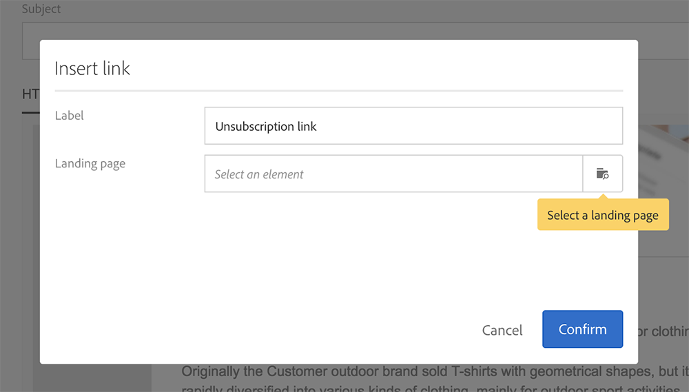
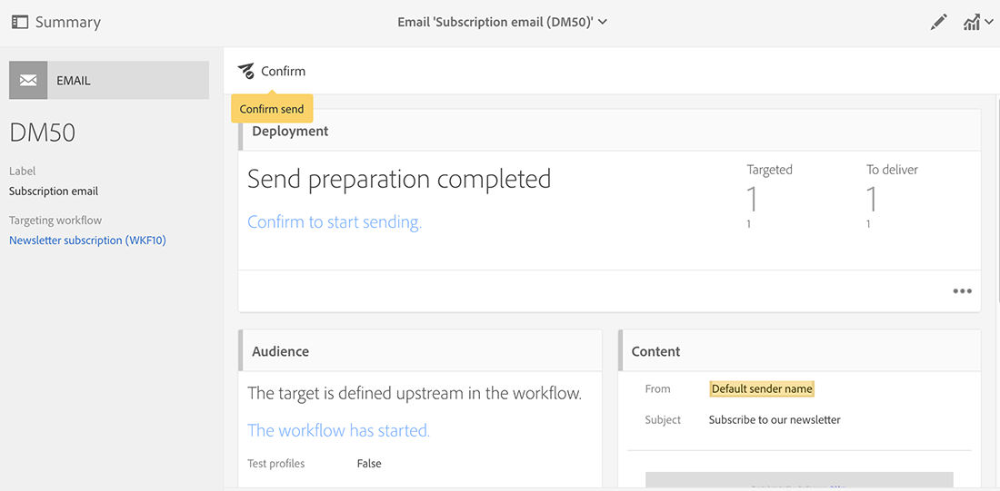

# プロファイルの同期{#synchronizing-profiles}

ACS コネクタは、Campaign v7 から Campaign Standard にデータをレプリケートします。Campaign v7 から受け取ったデータは、Campaign Standard で配信を作成するのに使用できます。以下の操作を実行することで、プロファイルの同期方法を把握できます。

* **新しい受信者の追加**：Campaign v7 で新しい受信者を作成して、対応するプロファイルが Campaign Standard にレプリケートされていることを確認します。[新しい受信者の作成](#creating-a-new-recipient)を参照してください。
* **受信者を更新**：Campaign v7 で新しい受信者を編集して、Campaign Standard で対応するプロファイルを表示し、更新がレプリケートされていることを確認します。[受信者の編集](#editing-a-recipient)を参照してください。
* **Campaign Standard でのワークフローの構築**：Campaign v7 からレプリケートされたオーディエンスまたはプロファイルのクエリを含む Campaign Standard でワークフローを作成します。[ワークフローの作成](#creating-a-workflow)を参照してください。
* **Campaign Standard での配信の作成**：ワークフローに従って、配信の送信を完了します。[配信の作成](#creating-a-delivery)を参照してください。
* **購読解除リンクの検証**：Campaign v7 Web アプリケーションを使用して、サービスに対する受信者の購読解除の選択が Campaign v7 データベースに送信されることを確認します。サービスの受信を停止するオプションが、Campaign Standard にレプリケートされます。[購読解除リンクの変更](#changing-the-unsubscription-link)を参照してください。

## 前提条件 {#prerequisites}

以下の節では、ACS コネクタを利用して、Campaign v7 で受信者を追加および編集し、Campaign Standard 配信で使用する方法について説明します。ACS コネクタには、以下が必要です。

* Campaign Standard にレプリケートされた Campaign v7 の受信者。
* Campaign v7 と Campaign Standard の両方でワークフローを実行するためのユーザー権限。
* Campaign Standard で配信を作成および実行するためのユーザー権限。

## 購読解除リンクの変更 {#changing-the-unsubscription-link}

受信者が Campaign Standard で送信した E メールの購読解除リンクをクリックすると、Campaign Standard の対応するプロファイルが更新されます。レプリケートされたプロファイルに、サービスに対するユーザーの購読解除の選択が含まれていることを確認するには、その情報が Campaign Standard ではなく Campaign v7 に送信されている必要があります。この変更を実行するには、購読解除サービスを Campaign Standard ではなく Campaign v7 Web アプリケーションにリンクします。

>[!NOTE]
>
>購読解除サービスについて Web アプリケーションを設定するには、以下の手順を実行する前に、コンサルタントにお問い合わせください。

## 新しい受信者の作成 {#creating-a-new-recipient}

1. Campaign Standard へのレプリケーション用の新しい受信者を Campaign v7 で作成します。受信者の姓、名、E メールアドレス、郵送先住所など、可能な限りの情報を入力します。ただし、敬称は次の[受信者の編集](#editing-a-recipient)の節で追加するので、**[!UICONTROL 敬称]**&#x200B;は選択しないでください。詳しくは、[受信者の追加](../../platform/using/adding-profiles.md)を参照してください。

   

1. 新しい受信者が Campaign Standard に追加されたことを確認します。プロファイルを確認する際に、Campaign v7 に入力したデータが Campaign Standard でも利用可能であることを確認します。Campaign Standard でのプロファイルの場所について詳しくは、[ナビゲーションの基本](https://docs.adobe.com/content/help/ja-JP/campaign-standard/using/getting-started/discovering-the-interface/interface-description.html)を参照してください。

   

   デフォルトでは、ACS コネクタの定期的なレプリケーションは、15 分ごとに 1 回です。詳しくは、[データレプリケーション](../../integrations/using/acs-connector-principles-and-data-cycle.md#data-replication)を参照してください。

## 受信者の編集 {#editing-a-recipient}

ある 1 つのデータの変更に関する以下の手順で、データレプリケーションを使用する際に、どのようにして Campaign v7 が Campaign Standard のマスターデータベースになるかに関するシンプルな例を示します。Campaign v7 でレプリケートされたデータを変更または削除すると、Campaign Standard の対応するデータも同様に変更されます。

1. [新しい受信者の作成](#creating-a-new-recipient)で新しく作成した受信者を選択して、受信者の名前を編集します。例えば、受信者の&#x200B;**[!UICONTROL 敬称]**（Mr. や Mrs. など）を選択します。詳しくは、[プロファイルの編集](../../platform/using/editing-a-profile.md)を参照してください。

   

1. 受信者の名前が Campaign Standard で更新されていることを確認します。Campaign Standard でのプロファイルの場所について詳しくは、[ナビゲーションの基本](https://docs.adobe.com/content/help/ja-JP/campaign-standard/using/getting-started/discovering-the-interface/interface-description.html)を参照してください。

   

   デフォルトでは、ACS コネクタの定期的なレプリケーションは、15 分ごとに 1 回です。詳しくは、[データレプリケーション](../../integrations/using/acs-connector-principles-and-data-cycle.md#data-replication)を参照してください。

## ワークフローの作成 {#creating-a-workflow}

Campaign v7 からレプリケートされたプロファイルとサービスを利用して Campaign Standard のリッチデータを活用できます。以下の手順では、クエリを Campaign Standard ワークフローに追加し、レプリケートされたデータベースで使用する方法について説明します。

詳細および Campaign Standard ワークフローに関する完全な手順については、[ワークフロー](https://docs.adobe.com/content/help/ja-JP/campaign-standard/using/managing-processes-and-data/about-workflows-and-data-management/workflow-data-and-processes.html)を参照してください。

1. Campaign Standard に移動して、**[!UICONTROL マーケティングアクティビティ]**&#x200B;をクリックします。
1. 右上の「**[!UICONTROL 作成]**」をクリックします。
1. 「**[!UICONTROL ワークフロー]**」をクリックします。
1. 「**[!UICONTROL 新規ワークフロー]**」、「**[!UICONTROL 次へ]**」をクリックします。
1. 「**[!UICONTROL ラベル]**」フィールドにワークフローの名前を入力し、必要に応じて追加情報を入力します。「**[!UICONTROL 次へ]**」をクリックします。
1. **[!UICONTROL クエリ]**&#x200B;ターゲットを左側の「**[!UICONTROL ターゲティング]**」からワークスペースにドラッグします。

   

1. 「**[!UICONTROL クエリ]**」アクティビティをダブルクリックして、レプリケートされたデータベースで使用できるパラメーターを選択します。例えば、以下のことができます。

   * **[!UICONTROL プロファイル]**&#x200B;をワークスペースにドラッグします。フィールドのプルダウンメニューを使用して、「**[!UICONTROL 外部リソース]**」を選択し、Campaign v7 からレプリケートされたプロファイルを検索します。
   * 別のクエリパラメーターをドラッグして、レプリケートされたプロファイルをさらにターゲティングします。

## 配信の作成 {#creating-a-delivery}

>[!NOTE]
>
>配信の作成手順は、[ワークフローの作成](#creating-a-workflow)で開始したワークフローから続きます。

Campaign v7 Web アプリケーションを使用して、受信者によるサービスの購読解除の選択が確実に Campaign v7 データベースに送信されるようにすることができます。受信者が購読解除リンクをクリックすると、サービスの受信を停止するオプションが Campaign v7 から Campaign Standard にレプリケートされます。詳しくは [購読解除リンクの変更](#changing-the-unsubscription-link)を参照してください。

以下の手順に従い、Campaign v7 で作成した購読解除サービスを使用して既存のワークフローに E メール配信を追加します。Campaign Standard ワークフローの詳細および完全な手順については、この[ドキュメント](https://docs.adobe.com/content/help/ja-JP/campaign-standard/using/managing-processes-and-data/about-workflows-and-data-management/workflow-data-and-processes.html)を参照してください。

>[!NOTE]
>
>購読解除サービスについて Web アプリケーションを設定するには、以下の手順を実行する前に、コンサルタントにお問い合わせください。

1. 左側の「**[!UICONTROL チャネル]**」をクリックします。
1. **[!UICONTROL E メール配信]**&#x200B;をワークスペースの既存のワークフローにドラッグします。

   

1. 「**[!UICONTROL E メール配信]**」アクティビティをダブルクリックして、**[!UICONTROL 単一送信 E メール]**&#x200B;または&#x200B;**[!UICONTROL 繰り返し E メール]**&#x200B;を選択します。オプションを選択して、「**[!UICONTROL 次へ]**」をクリックします。
1. 「**[!UICONTROL E メールで送信]**」をクリックして、「**[!UICONTROL 次へ]**」をクリックします。

   

1. 「**[!UICONTROL ラベル]**」フィールドに配信の名前を入力して、必要に応じて、追加情報を入力します。「**[!UICONTROL 次へ]**」をクリックします。

   

1. 「**[!UICONTROL 件名]**」フィールドで、受信者の E メールの受信ボックスに表示される件名を入力します。
1. 「**[!UICONTROL コンテンツを変更]**」をクリックして、HTML テンプレートを追加します。

   

1. サービスの購読解除へのリンクを含むコンテンツを選択します。「**[!UICONTROL 確認]**」をクリックします。

   

1. 現在の購読解除リンクは、コンサルタントによって作成された Web アプリケーションを使用する新しいリンクに置き換える必要があります。E メールコンテンツの最後にある購読解除リンクを探して、1 回クリックします。ごみ箱アイコンをクリックして、リンクを削除します。

   

1. 同じコンテンツ領域内をクリックして、「**購読解除リンク**」と入力します。

   

1. カーソルでテキストをハイライト表示して、鎖アイコンをクリックします。
1. 「**[!UICONTROL このランディングページにリンク]**」をクリックします。

   

1. フォルダーアイコンをクリックして、ランディングページを選択します。

   

1. コンサルタントによって作成された Web アプリケーションを選択して、「**[!UICONTROL 確認]**」をクリックします。

   

1. 「**[!UICONTROL 作成]**」をクリックします。
1. 配信名をクリックして、ワークフローに戻ります。

   

1. 「**[!UICONTROL 開始]**」をクリックして、配信を送信します。E メール配信アイコンが点滅して、配信が準備中であることが示されます。

   

1. **[!UICONTROL E メール配信]**&#x200B;チャネルをダブルクリックして、「**[!UICONTROL 確認]**」を選択し、E メールを送信します。「**[!UICONTROL OK]**」をクリックして、メッセージを送信します。

   

## 購読解除サービスの検証 {#verifying-the-unsubscription-service}

以下の手順に進む前に、[ワークフローの作成](#creating-a-workflow)および[配信の作成](#creating-a-delivery)の手順に従ってください。

1. 受信者は、E メール配信にある購読解除リンクをクリックします。

   

1. 受信者は、購読解除を確認します。

   

1. Campaign v7 の受信者データが更新されて、ユーザーによる購読解除が反映されます。受信者の「**[!UICONTROL 今後の連絡は不要 (すべてのチャネル)]**」ボックスがオンになっていることを確認します。Campaign v7 で受信者を表示する方法については、[プロファイルの編集](../../platform/using/editing-a-profile.md)を参照してください。

   

1. Campaign Standard に移動して、受信者のプロファイルの詳細を開きます。「**[!UICONTROL 今後の連絡は不要 (すべてのチャネル)]**」の隣にチェックボックスが表示されていることを確認します。Campaign Standard でのプロファイルの場所について詳しくは、[ナビゲーションの基本](https://docs.adobe.com/content/help/ja-JP/campaign-standard/using/getting-started/discovering-the-interface/interface-description.html)を参照してください。

   

