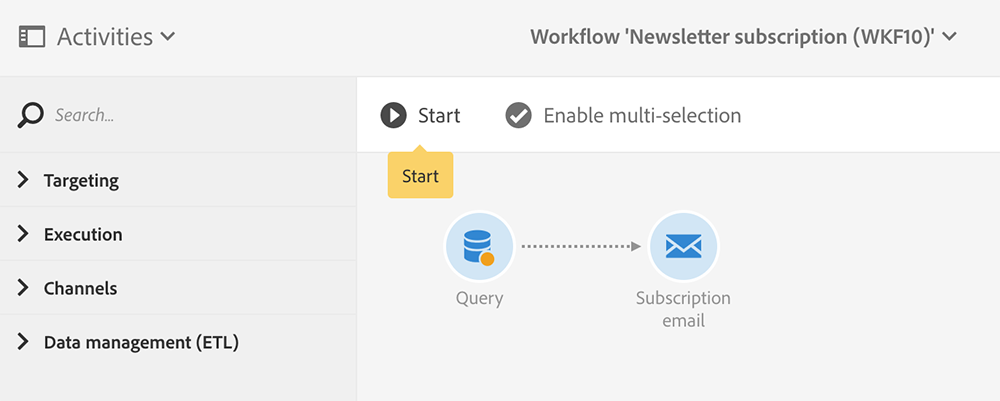
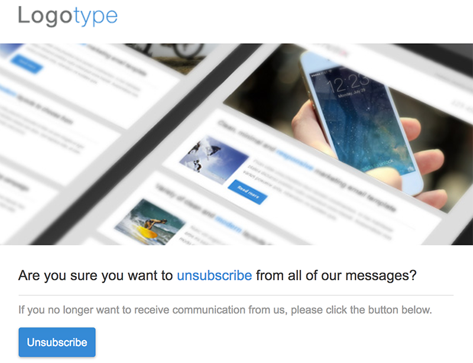

# プロファイルの同期{#synchronizing-profiles}

ACS コネクタは、Campaign v7 から Campaign Standard にデータをレプリケートします。Campaign v7 から受け取ったデータは、Campaign Standard で配信を作成するのに使用できます。以下の操作を実行することで、プロファイルの同期方法を把握できます。

* **新しい受信者の追加**:Campaign v7で新しい受信者を作成し、対応するプロファイルがCampaign Standardに複製されていることを確認します。 See [Creating a new recipient](#creating-a-new-recipient).
* **受信者の更新**:Campaign v7で新しい受信者を編集し、Campaign Standardで対応するプロファイルを表示して、更新が複製されたことを確認します。 「受信者 [の編集」を参照してください](#editing-a-recipient)。
* **Campaign Standardでのワークフローの構築**:Campaign Standardで、Campaign v7から複製されたオーディエンスまたはプロファイルを含むクエリを含むワークフローを作成します。 詳しくは、 [ワークフローの作成を参照してください](#creating-a-workflow)。
* **Campaign Standardでの配信の作成**:ワークフローに従って、配信を完了します。 「配信 [の作成」を参照](#creating-a-delivery)。
* **購読解除リンクの確認**:Campaign v7 webアプリケーションを使用して、受信者がサービスの購読を解除する選択をCampaign v7データベースに送信するようにします。 サービスの受信を停止するオプションが、Campaign Standard にレプリケートされます。See [Changing the unsubscription link](#changing-the-unsubscription-link).

## 前提条件 {#prerequisites}

以下の節では、ACS コネクタを利用して、Campaign v7 で受信者を追加および編集し、Campaign Standard 配信で使用する方法について説明します。ACS コネクタには、以下が必要です。

* Campaign Standard にレプリケートされた Campaign v7 の受信者。
* Campaign v7 と Campaign Standard の両方でワークフローを実行するためのユーザー権限。
* Campaign Standard で配信を作成および実行するためのユーザー権限。

## 購読解除リンクの変更 {#changing-the-unsubscription-link}

受信者が Campaign Standard で送信した E メールの購読解除リンクをクリックすると、Campaign Standard の対応するプロファイルが更新されます。レプリケートされたプロファイルに、サービスに対するユーザーの購読解除の選択が含まれていることを確認するには、その情報が Campaign Standard ではなく Campaign v7 に送信されている必要があります。この変更を実行するには、購読解除サービスを Campaign Standard ではなく Campaign v7 Web アプリケーションにリンクします。

>[!NOTE]
>
>購読解除サービスについて Web アプリケーションを設定するには、以下の手順を実行する前に、コンサルタントにお問い合わせください。

## 新しい受信者の作成 {#creating-a-new-recipient}

1. Campaign Standard へのレプリケーション用の新しい受信者を Campaign v7 で作成します。受信者の姓、名、E メールアドレス、郵送先住所など、可能な限りの情報を入力します。However, do not choose a **[!UICONTROL Salutation]** since it will be added in the next section, [Editing a recipient](#editing-a-recipient). 詳しくは、[受信者の追加](../../platform/using/adding-profiles.md)を参照してください。

   

1. 新しい受信者が Campaign Standard に追加されたことを確認します。プロファイルを確認する際に、Campaign v7 に入力したデータが Campaign Standard でも利用可能であることを確認します。Campaign Standard でのプロファイルの場所について詳しくは、[ナビゲーションの基本](https://docs.adobe.com/content/help/en/campaign-standard/using/getting-started/discovering-the-interface/interface-description.html)を参照してください。

   

   デフォルトでは、ACS コネクタの定期的なレプリケーションは、15 分ごとに 1 回です。詳しくは、「データ複製」を参 [照してください](../../integrations/using/acs-connector-principles-and-data-cycle.md#data-replication)。

## 受信者の編集 {#editing-a-recipient}

ある 1 つのデータの変更に関する以下の手順で、データレプリケーションを使用する際に、どのようにして Campaign v7 が Campaign Standard のマスターデータベースになるかに関するシンプルな例を示します。Campaign v7 でレプリケートされたデータを変更または削除すると、Campaign Standard の対応するデータも同様に変更されます。

1. 「新しい受信者の作成」から新 [しく作成した受信者を選択し](#creating-a-new-recipient) 、受信者の名前を編集します。 For example, choose a **[!UICONTROL Salutation]** for the recipient (e.g. Mr. or Mrs.). 詳しくは、[プロファイルの編集](../../platform/using/editing-a-profile.md)を参照してください。

   

1. 受信者の名前が Campaign Standard で更新されていることを確認します。Campaign Standard でのプロファイルの場所について詳しくは、[ナビゲーションの基本](https://docs.adobe.com/content/help/en/campaign-standard/using/getting-started/discovering-the-interface/interface-description.html)を参照してください。

   

   デフォルトでは、ACS コネクタの定期的なレプリケーションは、15 分ごとに 1 回です。詳しくは、「データ複製」を参 [照してください](../../integrations/using/acs-connector-principles-and-data-cycle.md#data-replication)。

## ワークフローの作成 {#creating-a-workflow}

Campaign v7 からレプリケートされたプロファイルとサービスを利用して Campaign Standard のリッチデータを活用できます。以下の手順では、クエリを Campaign Standard ワークフローに追加し、レプリケートされたデータベースで使用する方法について説明します。

詳細および Campaign Standard ワークフローに関する完全な手順については、[ワークフロー](https://docs.adobe.com/content/help/en/campaign-standard/using/managing-processes-and-data/about-workflows-and-data-management/workflow-data-and-processes.html)を参照してください。

1. Go to Campaign Standard and click **[!UICONTROL Marketing Activities]**.
1. Click **[!UICONTROL Create]** on the upper right.
1. クリック **[!UICONTROL Workflow]**.
1. とをクリ **[!UICONTROL New workflow]** ックしま **[!UICONTROL Next]**&#x200B;す。
1. Enter a name for the workflow in the **[!UICONTROL Label]** field and additional information if needed. クリック **[!UICONTROL Next]**.
1. From **[!UICONTROL Targeting]** on the left, drag a **[!UICONTROL Query]** target to the workspace.

   

1. Double click the **[!UICONTROL Query]** activity and choose a parameter that can be used with the replicated database. 例えば、以下のことができます。

   * Drag **[!UICONTROL Profiles]** to the workspace. Use the field pull-down menu to choose **[!UICONTROL Is external resource]** to find profiles that were replicated from Campaign v7.
   * 別のクエリパラメーターをドラッグして、レプリケートされたプロファイルをさらにターゲティングします。

## 配信の作成 {#creating-a-delivery}

>[!NOTE]
>
>The instructions for creating the delivery continue the workflow started with [Creating a workflow](#creating-a-workflow).

Campaign v7 Web アプリケーションを使用して、受信者によるサービスの購読解除の選択が確実に Campaign v7 データベースに送信されるようにすることができます。受信者が購読解除リンクをクリックすると、サービスの受信を停止するオプションが Campaign v7 から Campaign Standard にレプリケートされます。詳しくは、「購読解除リンク [の変更」を参照してください](#changing-the-unsubscription-link)。

以下の手順に従い、Campaign v7 で作成した購読解除サービスを使用して既存のワークフローに E メール配信を追加します。Campaign Standard ワークフローの詳細および完全な手順については、この[ドキュメント](https://docs.adobe.com/content/help/en/campaign-standard/using/managing-processes-and-data/about-workflows-and-data-management/workflow-data-and-processes.html)を参照してください。

>[!NOTE]
>
>購読解除サービスについて Web アプリケーションを設定するには、以下の手順を実行する前に、コンサルタントにお問い合わせください。

1. Click **[!UICONTROL Channels]** on the left.
1. Drag **[!UICONTROL Email delivery]** to the existing workflow in the workspace.

   

1. アクティビティをダブ **[!UICONTROL Email delivery]** ルクリックし、またはを **[!UICONTROL Single send email]** 選択しま **[!UICONTROL Recurring email]**&#x200B;す。 Select your options and click **[!UICONTROL Next]**.
1. をクリック **[!UICONTROL Send via email]** し、をクリックしま **[!UICONTROL Next]**&#x200B;す。

   

1. Enter a name for the delivery in the **[!UICONTROL Label]** field and additional information if needed. クリック **[!UICONTROL Next]**.

   

1. In the **[!UICONTROL Subject]** field, enter the subject that will appear in the recipient&#39;s email inbox.
1. をクリック **[!UICONTROL Change content]** して、HTMLテンプレートを追加します。

   

1. サービスの購読解除へのリンクを含むコンテンツを選択します。クリック **[!UICONTROL Confirm]**.

   

1. 現在の購読解除リンクは、コンサルタントによって作成された Web アプリケーションを使用する新しいリンクに置き換える必要があります。E メールコンテンツの最後にある購読解除リンクを探して、1 回クリックします。ごみ箱アイコンをクリックして、リンクを削除します。

   

1. 同じコンテンツ領域内をクリックして、「**購読解除リンク**」と入力します。

   

1. カーソルでテキストをハイライト表示して、鎖アイコンをクリックします。
1. クリック **[!UICONTROL Link to a landing page]**.

   

1. フォルダーアイコンをクリックして、ランディングページを選択します。

   

1. Choose the web application created by the consultant and click **[!UICONTROL Confirm]**.

   

1. クリック **[!UICONTROL Create]**.
1. 配信名をクリックして、ワークフローに戻ります。

   

1. Click **[!UICONTROL Start]** to send the delivery. E メール配信アイコンが点滅して、配信が準備中であることが示されます。

   

1. Double click the **[!UICONTROL Email delivery]** channel and choose **[!UICONTROL Confirm]** to send the email. 「**[!UICONTROL OK]**」をクリックして、メッセージを送信します。

   

## 購読解除サービスの検証 {#verifying-the-unsubscription-service}

次の手順に進む前に、「ワ [ークフローの作成](#creating-a-workflow) 」および [「配信の作成](#creating-a-delivery) 」の手順に従ってください。

1. 受信者は、E メール配信にある購読解除リンクをクリックします。

   

1. 受信者は、購読解除を確認します。

   

1. Campaign v7 の受信者データが更新されて、ユーザーによる購読解除が反映されます。受信者に対してボックスがチ **[!UICONTROL No longer contact (by any channel)]** ェックされていることを確認します。 Campaign v7 で受信者を表示する方法については、[プロファイルの編集](../../platform/using/editing-a-profile.md)を参照してください。

   

1. Campaign Standard に移動して、受信者のプロファイルの詳細を開きます。の横にチェックボックスが表示されることを確認しま **[!UICONTROL No longer contact (by any channel)]**&#x200B;す。 Campaign Standard でのプロファイルの場所について詳しくは、[ナビゲーションの基本](https://docs.adobe.com/content/help/en/campaign-standard/using/getting-started/discovering-the-interface/interface-description.html)を参照してください。

   

