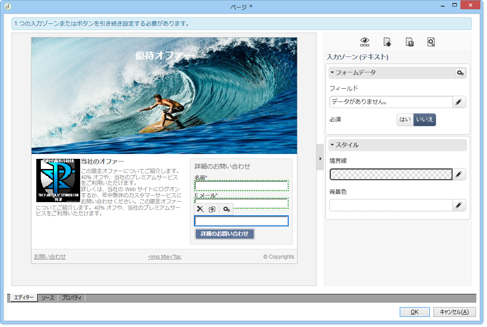

# Web アプリケーションの同期{#synchronizing-web-applications}

この使用例では、Campaign Standard を使用して、Campaign v7 Web アプリケーションへのリンクを含む通信を送信します。受信者が E メールのリンクをクリックすると、受信者のデータおよびニュースレターへの購読リンクがプリロードされた、いくつかのフィールドを含むフォームが Web アプリケーションに表示されます。受信者は、自分のデータを更新したり、サービスを購読したりできます。受信者のプロファイルは Campaign v7 で更新され、その情報が Campaign Standard にレプリケートされます。

Campaign v7 に多くのサービスおよび Web アプリケーションがある場合、それらすべてを Campaign Standard で再作成したくない場合があります。ACS コネクタを使用すると、既存のすべての Campaign v7 Web アプリケーションおよびサービスを使用して、Campaign Standard で送信した配信にリンクすることができます。

## 前提条件 {#prerequisites}

これをおこなうには、以下が必要です。

* Campaign v7 データベースに格納され、Campaign Standard と同期された受信者。「プロファイルの同 [期](../../integrations/using/synchronizing-profiles.md) 」を参照。
* Campaign v7 で作成され、パブリッシュされたサービスおよび Web アプリケーション。
* 識別方法を使用して、Webアプリケーションにア **[!UICONTROL Pre-loading]** クティビティが含まれてい **[!UICONTROL Adobe Campaign encryption]** る必要があります。

## Web およびサービスの作成 {#creating-the-web-application-and-service}

Campaign v7 では、受信者がサービスを購読できる Web アプリケーションを作成できます。Web アプリケーションおよびサービスは、Campaign v7 で設計および格納され、Campaign Standard 通信を使用してこのサービスを更新できます。Campaign v7 の Web アプリケーションについて詳しくは、[この節](../../web/using/adding-fields-to-a-web-form.md#subscription-checkboxes)を参照してください。

Campaign v7 では、以下のオブジェクトが作成されています。

* ニュースレターサービス
* 、、およびアクティビティを含 **[!UICONTROL Pre-loading]**&#x200B;むWebアプ **[!UICONTROL Page]** リケーシ **[!UICONTROL Storage]** ョン。

1. に移動し、既 **[!UICONTROL Resources > Online > Web applications]** 存のWebアプリケーションを選択します。

   

1. アクティビティを編 **[!UICONTROL Preloading]** 集します。 このボ **[!UICONTROL Auto-load data referenced in the form]** ックスがチェックされ、識別 **[!UICONTROL Adobe Campaign encryption]** 方法が選択されます。 これにより、Web アプリケーションは、Adobe Campaign データベースに格納されたデータでフォームのフィールドをプリロードします。[このドキュメント](../../web/using/publishing-a-web-form.md#pre-loading-the-form-data)を参照してください。

   

1. を編集しま **[!UICONTROL Page]**&#x200B;す。 Three fields (Name, Email and Phone) have been included, as well as a check box to invite the recipient to subscribe to a newsletter (**[!UICONTROL Newsletter]** service).

   

1. に移動し、サ **[!UICONTROL Profiles and Target > Services and subscriptions]** ービスを開 **[!UICONTROL Newsletter]** きます。 これは、Campaign Standard 通信から更新されるサービスです。このサービスを購読している受信者はまだいません。

   

1. に移動し、受 **[!UICONTROL Profiles and Targets > Recipient]** 信者を選択します。 その受信者がまだサービスを購読していないことがわかります。

   

## データのレプリケート {#replicating-the-data}

Campaign v7 と Campaign Standard との間で必要なデータをレプリケートするために、いくつかのレプリケーションワークフローテンプレートを使用できます。The **[!UICONTROL Profiles replication]** workflow automatically replicates all the Campaign v7 recipients to Campaign Standard. See [Technical and replication workflows](../../integrations/using/acs-connector-principles-and-data-cycle.md#technical-and-replication-workflows). The **[!UICONTROL Landing pages replication]** workflow enables the replication of the web applications we want to use in Campaign Standard.

データが正しくレプリケートされたことを確認するには、Campaign Standard で以下の手順に従います。

1. From the home screen, click on **[!UICONTROL Customer profiles]**.

   

1. Campaign v7 受信者を検索して、Campaign Standard に表示されることを確認します。

   

1. From the top bar, click on **[!UICONTROL Marketing activities]**, and search for the Campaign v7 web application. Campaign Standard でランディングページとして表示されます。

   

1. 左上隅の **[!UICONTROL Adobe Campaign]** ロゴをクリックし、**Profiles &amp; Audiences／サービス**&#x200B;を選択して、ニュースレターサービスもあることを確認します。

   

## E メールの設計と送信 {#designing-and-sending-the-email}

ここでは、Campaign Standard E メールで、Campaign v7 Web アプリケーションからレプリケートされたランディングページへのリンクを含める方法を確認します。

E メールを作成、設計、送信する手順は、従来の E メールと同じです。[Adobe Campaign Standard](https://helpx.adobe.com/support/campaign/standard.html) のドキュメントを参照してください。

1. 新しい E メールを作成して、1 つまたは複数のレプリケートされたプロファイルをオーディエンスとして選択します。
1. コンテンツを編集し、を挿入しま **[!UICONTROL Link to a landing page]**&#x200B;す。

   

1. Campaign v7 Web アプリケーションからレプリケートされたランディングページを選択します。

   

1. E メールを準備し、配達確認を送信して、最終的な E メールを送信します。
1. 受信者の 1 人が E メールを開いて、ニュースレター購読へのリンクをクリックします。

   

1. 受信者は電話番号を追加して、ニュースレター購読ボックスを確認します。

   

## 更新情報の取得 {#retrieving-the-updated-information}

受信者が Web アプリケーションを使用して自分のデータを更新すると、Adobe Campaign v7 は更新された情報を同期的に取得します。次に、Campaign v7 から Campaign Standard にレプリケートされます。

1. Campaign v7で、に移動してサー **[!UICONTROL Profiles and Target > Services and subscriptions]** ビスを開き **[!UICONTROL Newsletter]** ます。 受信者が購読者リストに表示されていることがわかります。

   

1. に移動し、受 **[!UICONTROL Profiles and Targets > Recipient]** 信者を選択します。 電話番号が格納されていることがわかります。

   

1. In the **[!UICONTROL Subscriptions]** tab, we can also see that he has subscribed to the newsletter service.

   

1. プロファイルレプリケーションワークフローが実行されるまで数分待ちます。
1. Campaign Standard で、受信者プロファイルにアクセスして、更新されたデータが Campaign v7 から正しくレプリケートされていることを確認します。

   

1. プロファイルを編集します。電話番号が更新されていることがわかります。

   

1. Click on the **[!UICONTROL Subscriptions]** tab. ニュースレターサービスが表示されます。

   

