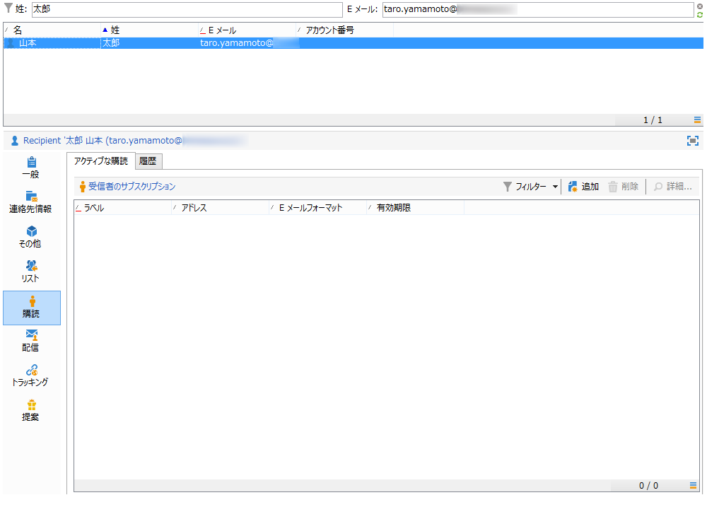

# Web アプリケーションの同期{#synchronizing-web-applications}

この使用例では、Campaign Standard を使用して、Campaign v7 Web アプリケーションへのリンクを含む通信を送信します。受信者が E メールのリンクをクリックすると、受信者のデータおよびニュースレターへの購読リンクがプリロードされた、いくつかのフィールドを含むフォームが Web アプリケーションに表示されます。受信者は、自分のデータを更新したり、サービスを購読したりできます。受信者のプロファイルは Campaign v7 で更新され、その情報が Campaign Standard にレプリケートされます。

Campaign v7 に多くのサービスおよび Web アプリケーションがある場合、それらすべてを Campaign Standard で再作成したくない場合があります。ACS コネクタを使用すると、既存のすべての Campaign v7 Web アプリケーションおよびサービスを使用して、Campaign Standard で送信した配信にリンクすることができます。

## 前提条件 {#prerequisites}

これをおこなうには、以下が必要です。

* Campaign v7 データベースに格納され、Campaign Standard と同期された受信者。[プロファイルの同期](../../integrations/using/synchronizing-profiles.md)の節を参照してください。
* Campaign v7 で作成され、パブリッシュされたサービスおよび Web アプリケーション。
* Web アプリケーションには、**[!UICONTROL Adobe Campaign の暗号化]**&#x200B;の識別方法を使用する&#x200B;**[!UICONTROL プリロード]**&#x200B;アクティビティが含まれている必要があります。

## Web およびサービスの作成 {#creating-the-web-application-and-service}

Campaign v7 では、受信者がサービスを購読できる Web アプリケーションを作成できます。Web アプリケーションおよびサービスは、Campaign v7 で設計および格納され、Campaign Standard 通信を使用してこのサービスを更新できます。Campaign v7 の Web アプリケーションについて詳しくは、[この節](../../web/using/adding-fields-to-a-web-form.md#subscription-checkboxes)を参照してください。

Campaign v7 では、以下のオブジェクトが作成されています。

* ニュースレターサービス
* 「**[!UICONTROL プリロード]**」、「**[!UICONTROL ページ]**」および「**[!UICONTROL ストレージ]**」アクティビティを含む Web アプリケーション。

1. **[!UICONTROL リソース／オンライン／Web アプリケーション]**&#x200B;に移動して、既存の Web アプリケーションを選択します。

   

1. 「**[!UICONTROL プリロード]**」アクティビティを編集します。「**[!UICONTROL フォームで参照されるデータを自動読み込み]**」ボックスがオンで、「**[!UICONTROL Adobe Campaign の暗号化]**」識別方法が選択されています。これにより、Web アプリケーションは、Adobe Campaign データベースに格納されたデータでフォームのフィールドをプリロードします。[このドキュメント](../../web/using/publishing-a-web-form.md#pre-loading-the-form-data)を参照してください。

   

1. **[!UICONTROL ページ]**&#x200B;を編集します。3 つのフィールド（名前、E メールおよび電話）と、受信者にニュースレターの購読（**[!UICONTROL ニュースレター]**&#x200B;サービス）を勧めるチェックボックスが含まれています。

   

1. **[!UICONTROL プロファイルとターゲット／サービスと購読]**&#x200B;に移動し、**[!UICONTROL ニュースレター]**&#x200B;サービスを開きます。これは、Campaign Standard 通信から更新されるサービスです。このサービスを購読している受信者はまだいません。

   

1. **[!UICONTROL プロファイルとターゲット／受信者]**&#x200B;に移動し、受信者を選択します。その受信者がまだサービスを購読していないことがわかります。

   

## データのレプリケート {#replicating-the-data}

Campaign v7 と Campaign Standard との間で必要なデータをレプリケートするために、いくつかのレプリケーションワークフローテンプレートを使用できます。**[!UICONTROL プロファイルのレプリケーション]**&#x200B;ワークフローは、すべての Campaign v7 受信者を Campaign Standard に自動的にレプリケートします。[テクニカルワークフローおよびレプリケーションワークフロー](../../integrations/using/acs-connector-principles-and-data-cycle.md#technical-and-replication-workflows)を参照してください。**[!UICONTROL ランディングページのレプリケーション]**&#x200B;ワークフローを使用すると、Campaign Standard で使用したい Web アプリケーションのレプリケーションが可能です。

データが正しくレプリケートされたことを確認するには、Campaign Standard で以下の手順に従います。

1. ホーム画面から、**[!UICONTROL 顧客プロファイル]**&#x200B;をクリックします。

   

1. Campaign v7 受信者を検索して、Campaign Standard に表示されることを確認します。

   

1. 上部のバーで&#x200B;**[!UICONTROL マーケティングアクティビティ]**&#x200B;をクリックし、Campaign v7 Web アプリケーションを検索します。Campaign Standard でランディングページとして表示されます。

   

1. 左上隅の **[!UICONTROL Adobe Campaign]** ロゴをクリックし、**Profiles &amp; Audiences／サービス**&#x200B;を選択して、ニュースレターサービスもあることを確認します。

   

## E メールの設計と送信 {#designing-and-sending-the-email}

ここでは、Campaign Standard E メールで、Campaign v7 Web アプリケーションからレプリケートされたランディングページへのリンクを含める方法を確認します。

E メールを作成、設計、送信する手順は、従来の E メールと同じです。[Adobe Campaign Standard](https://helpx.adobe.com/jp/support/campaign/standard.html) のドキュメントを参照してください。

1. 新しい E メールを作成して、1 つまたは複数のレプリケートされたプロファイルをオーディエンスとして選択します。
1. コンテンツを編集して、**[!UICONTROL ランディングページへのリンク]**&#x200B;を挿入します。

   

1. Campaign v7 Web アプリケーションからレプリケートされたランディングページを選択します。

   

1. E メールを準備し、配達確認を送信して、最終的な E メールを送信します。
1. 受信者の 1 人が E メールを開いて、ニュースレター購読へのリンクをクリックします。

   

1. 受信者は電話番号を追加して、ニュースレター購読ボックスを確認します。

   

## 更新情報の取得 {#retrieving-the-updated-information}

受信者が Web アプリケーションを使用して自分のデータを更新すると、Adobe Campaign v7 は更新された情報を同期的に取得します。次に、Campaign v7 から Campaign Standard にレプリケートされます。

1. Campaign v7 で&#x200B;**[!UICONTROL プロファイルとターゲット／サービスと購読]**&#x200B;に移動し、**[!UICONTROL ニュースレター]**&#x200B;サービスを開きます。受信者が購読者リストに表示されていることがわかります。

   

1. **[!UICONTROL プロファイルとターゲット／受信者]**&#x200B;に移動し、その受信者を選択します。電話番号が格納されていることがわかります。

   

1. 「**[!UICONTROL 購読]**」タブで、その購読者がニュースレターサービスを購読したこともわかります。

   

1. プロファイルレプリケーションワークフローが実行されるまで数分待ちます。
1. Campaign Standard で、受信者プロファイルにアクセスして、更新されたデータが Campaign v7 から正しくレプリケートされていることを確認します。

   

1. プロファイルを編集します。電話番号が更新されていることがわかります。

   

1. 「**[!UICONTROL 購読]**」タブをクリックします。ニュースレターサービスが表示されます。

   

