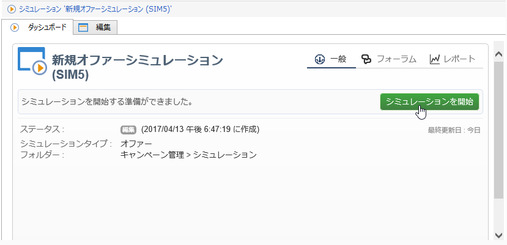

# オファーのシミュレーションについて{#about-offers-simulation}

**シミュレーション**&#x200B;モジュールを使用すると、提案を受信者に送信する前に、1 つのカテゴリまたは環境に属するオファーの配分をテストできます。

Simulation takes into account the contexts and eligibility rules previously applied to offers (refer to [Offer catalog overview](../../interaction/using/offer-catalog-overview.md)), as well as their presentation rules (refer to [Managing offer presentation](../../interaction/using/managing-offer-presentation.md)). ターゲットの受信者はシミュレーションの影響を受けないので、これにより、実際にオファーを使用したり、ターゲットを拡大または縮小したりしなくても、オファーの提案の様々なバージョンをテストして調整できます。

オファーをシミュレートする方法については、以下の手順を参照してください。 You can also watch this [video](https://helpx.adobe.com/campaign/classic/how-to/simulate-offer-in-acv6.html?playlist=/ccx/v1/collection/product/campaign/classic/segment/digital-marketers/explevel/intermediate/applaunch/introduction/collection.ccx.js&ref=helpx.adobe.com).

## シミュレーション作成の主な手順 {#main-steps-for-creating-a-simulation}

オファーのシミュレーションを実行するには、次の手順に従います。

1. 宇宙で、 **[!UICONTROL Profiles and Targets]** リンクをクリック **[!UICONTROL Simulations]** し、ボタンをクリックし **[!UICONTROL Create]** ます。

   

1. 作成したシミュレーションを保存し、編集します。
1. Go to the **[!UICONTROL Edit]** tab and specify the execution settings.

   For more on this, refer to [Execution settings](../../interaction/using/execution-settings.md).

   

   >[!NOTE]
   >
   >実行設定は、Campaign でインタラクションを使用する場合にのみ使用できます。

1. シミュレーションのスコープを指定します。

   詳細については、「スコープの定 [義」を参照してください](../../interaction/using/simulation-scope.md#definition-of-the-scope)。

   

1. レポートの軸を追加してレポートを強 **[!UICONTROL Offer distribution by rank]** 化します（オプション）。

   詳しくは、「レポート軸の追加」を参 [照してください](../../interaction/using/simulation-scope.md#adding-reporting-axes)。

   

1. Click **[!UICONTROL Save]** to record the simulation settings.
1. ダッシュボードからシミュレーションを開始します。

   

1. シミュレーション結果をチェックし、分析レポートを表示します。

   For more on this, refer to [Simulation tracking](../../interaction/using/simulation-tracking.md).

   
