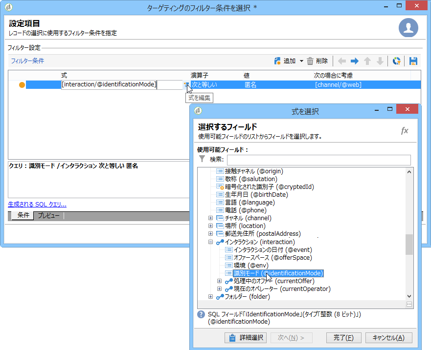
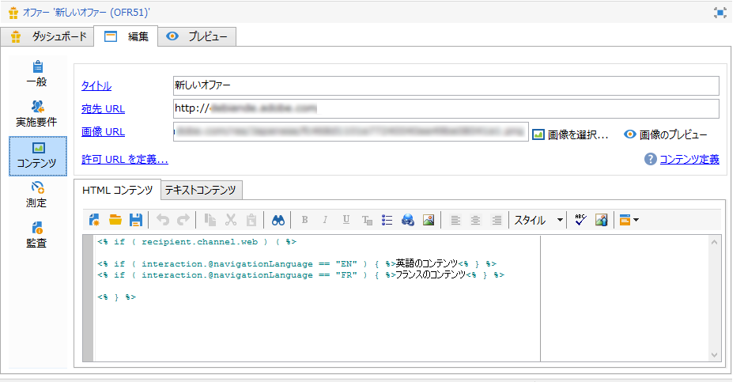
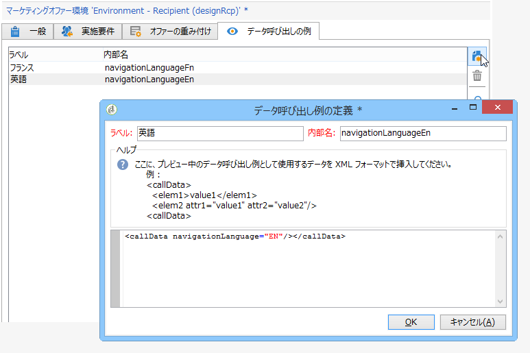
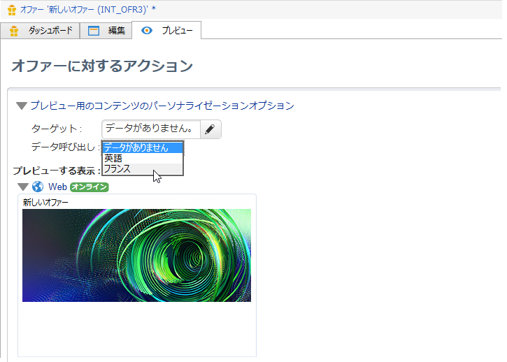
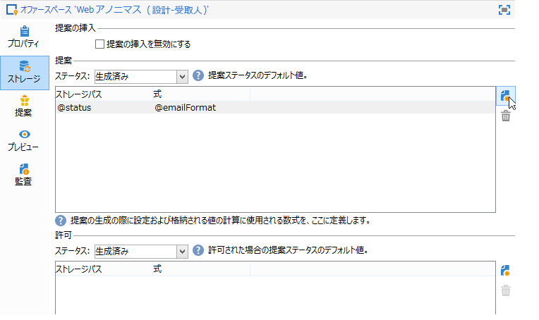

# 追加データ{#additional-data}

インタラクションエンジンの呼び出し時には、コンテキストに関する追加情報を転送できます。このデータは、ワークフローの作業用テーブルに格納されたターゲットデータ（アウトバウンドチャネル）や、呼び出し時に Web サイトから送信された呼び出しデータ（インバウンドチャネル）などから取得できます。この追加データは、実施要件ルール、オファーのパーソナライゼーションなどに利用したり、提案テーブルに格納したりできます。

インバウンドチャネルの場合、例えば、オファーを検討している人々のブラウザー言語設定、コールセンター担当者の名前などの情報を復元するのに役立つことがあります。実施要件ルールにこの呼び出しデータを使用して、Web ページをフランス語や英語で閲覧している人々のみにオファーを提示できます。

ターゲティングワークフロー（アウトバウンドチャネル）では、エンジンの呼び出し中にターゲットデータを使用できます。例えば、FDA を使用して、受信者にリンクされたトランザクションや外部データベースのデータでターゲットをエンリッチメントできます。

## 追加データの設定 {#additional-data-configuration}

環境にリンクされた **nms:interaction** スキーマを拡張し、インタラクションエンジンの呼び出し中に使用される追加フィールドのリストを宣言する必要があります。When creating the eligibility rule or personalizing an offer, these fields will become accessible from the **Interaction** node (refer to [Using additional data](#using-additional-data)).

インバウンドチャネルの場合、呼び出しデータのフィールドを&#x200B;**インタラクション**&#x200B;ノードに追加する必要があります。

```
<element label="Interactions" labelSingular="Interaction" name="interaction">
  <attribute label="Navigation language" name="navigationLanguage" type="string"/>
</element>
```

>[!NOTE]
>
>インバウンドチャネルでは、XML コレクションがサポートされていますが、他のスキーマへのリンクはサポートされていません。

アウトバウンドチャネルの場合、追加フィールドを含む **targetData** 要素を&#x200B;**インタラクション**&#x200B;ノードに追加する必要があります。

```
<element label="Interactions" labelSingular="Interaction" name="interaction">
  <element name="targetData">
    <attribute label="Date of last transaction" name="lastTransactionDate" type="datetime"/>
  </element>
</element>
```

>[!NOTE]
>
>アウトバウンドチャネルでは、コレクションはサポートされません。ただし、他のスキーマへのリンクを作成することはできます。

このデータを提案テーブルに格納するには、**nms:propositionRcp** スキーマも拡張し、これらのフィールドを宣言する必要があります。

```
<element label="Recipient offer propositions" labelSingular="Recipient offer proposition" name="propositionRcp">
  <attribute label="Last transaction date" name="lastTransactionDate" type="datetime"/>
  <attribute label="Navigation language" name="navigationLanguage" type="string"/>
</element>
```

## 追加データの実装 {#additional-data-implementation}

### Input channel (Web page) {#input-channel--web-page-}

エンジンの呼び出し時に追加データを転送するには、Web ページの JavaScript コードに **interactionGlobalCtx** 変数を追加する必要があります。この変数に、呼び出しデータを含む&#x200B;**インタラクション**&#x200B;ノードを挿入します。その際、**nms:interaction** スキーマと同じ XML 構造に従う必要があります。参照先：追 [加データ設定](#additional-data-configuration)。

```
interactionGlobalCtx = "<interaction navigationLanguage='"+myLanguage+"'/>";
```

### 出力チャネル {#output-channel}

**nms:interaction** スキーマと同じ XML 構造および内部名に従って、作業用テーブルの追加データを読み込むターゲティングワークフローを作成する必要があります。参照先：追 [加データ設定](#additional-data-configuration)。

## 追加データの使用 {#using-additional-data}

### 実施要件ルール {#eligibility-rules}

オファー、カテゴリ、重み付けに関する実施要件ルールに、追加データを使用できます。

例えば、Web ページを英語で閲覧している人々のみに対してオファーを提示できます。



>[!NOTE]
>
>ルールは、データが定義されているチャネルのみに制限する必要があります。In our example, we are limiting the rule on the inbound web channel (**[!UICONTROL Taken into account if]** field).

### パーソナライゼーション {#personalization}

この追加データは、オファーをパーソナライズする際にも使用できます。例えば、ナビゲーション言語用の条件を追加できます。



>[!NOTE]
>
>パーソナライゼーションは、データが定義されているチャネルのみに制限する必要があります。この例では、インバウンド Web チャネルのみにルールを制限しています。

追加データを使用してオファーをパーソナライズしている場合、そのデータは、データベースで利用できないので、デフォルトではプレビューに表示されません。In the environment&#39;s **[!UICONTROL Example of call data]** tab, you must add value samples to use in the preview. **nms:interaction** スキーマ拡張と同じ XML 構造に従ってください。詳しくは、「追加のデータ設定」を参 [照してください](#additional-data-configuration)。



プレビュー時に、を **[!UICONTROL Content personalization options for the preview]** クリックし、フィールド内の値を選択 **[!UICONTROL Call data]** します。



### ストレージ {#storage}

エンジンの呼び出し中は、追加データを提案テーブルに格納して、データベースをエンリッチメントできます。このデータは、例えば、レポート、ROI 計算、後のプロセスなどで使用できる可能性があります。

>[!NOTE]
>
>追加データを格納するには、**nms:propositionRcp** スキーマを拡張し、格納するデータを含めるフィールドを宣言する必要があります。詳しくは、以下を参照してください。追 [加データ設定](#additional-data-configuration)。

In the offer space, go to the **[!UICONTROL Storage]** tab and click the **[!UICONTROL Add]** button.

In the **[!UICONTROL Storage path]** column, select the storage field in the proposition table. In the **[!UICONTROL Expression]** column, select the additional field in the **[!UICONTROL Interaction]** node.

呼び出しデータは、提案が生成される、または許可される（ユーザーがオファーをクリックする）際に取得できます。



