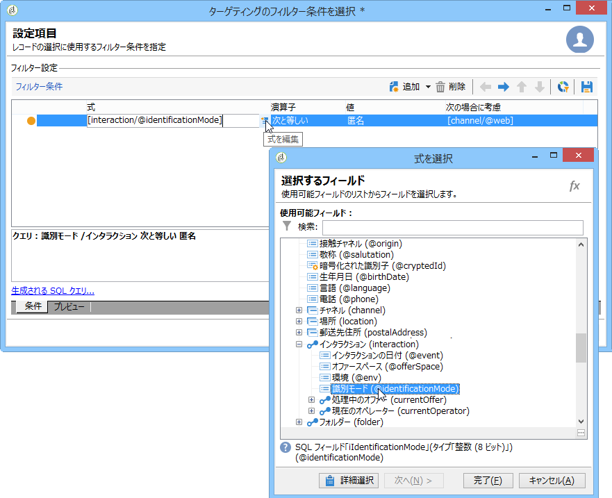
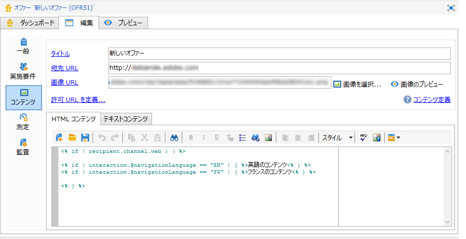
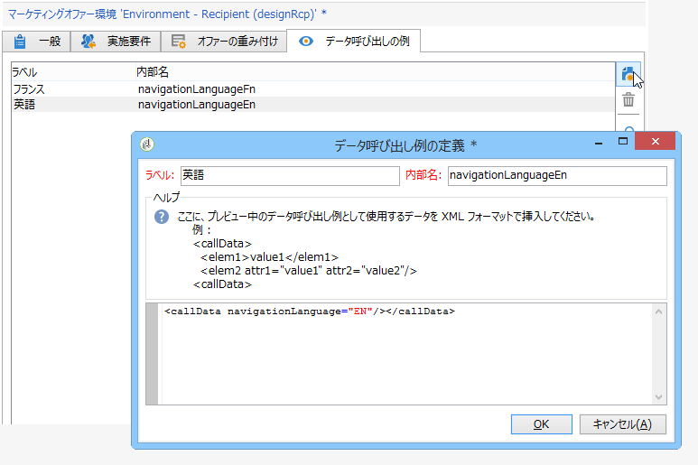
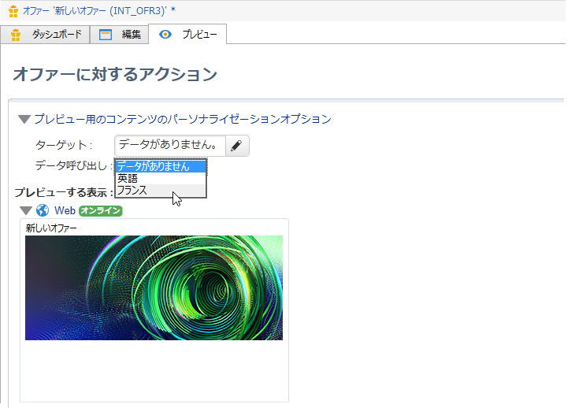
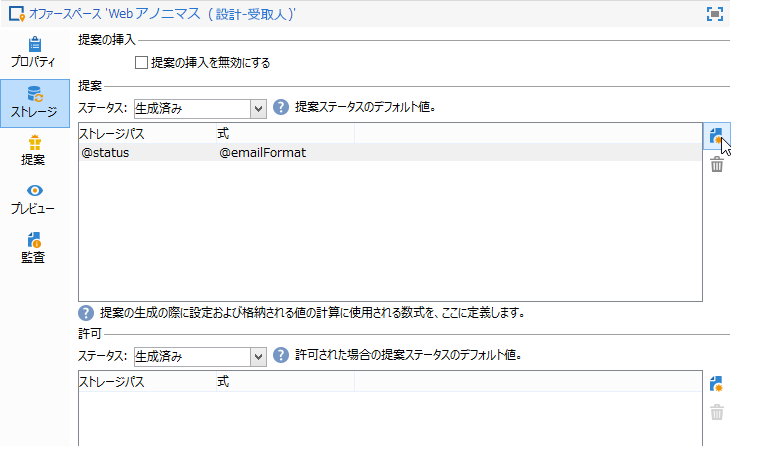

# 追加データ{#additional-data}


インタラクションエンジンの呼び出し時には、コンテキストに関する追加情報を転送できます。 このデータは、ワークフローのワークテーブルに格納されたターゲットデータ（アウトバウンドチャネル）や、呼び出し時に Web サイトから送信された呼び出しデータ（インバウンドチャネル）などから取得できます。 この追加データは、実施要件ルール、オファーのパーソナライゼーションなどに利用したり、提案テーブルに格納したりできます。

インバウンドチャネルの場合、例えば、オファーを検討している人々のブラウザー言語設定、コールセンター担当者の名前などの情報を復元するのに役立つことがあります。 実施要件ルールにこの呼び出しデータを使用して、Web ページをフランス語や英語で閲覧している人々のみにオファーを提示できます。

ターゲティングワークフロー（アウトバウンドチャネル）では、エンジンの呼び出し中にターゲットデータを使用できます。 例えば、FDA を使用して、受信者にリンクされたトランザクションや外部データベースのデータでターゲットをエンリッチメントできます。

## 追加データの設定 {#additional-data-configuration}

環境にリンクされている&#x200B;**nms:interaction** スキーマを拡張し、インタラクションエンジンの呼び出し中に使用される追加フィールドのリストを宣言する必要があります。 実施要件ルールを作成したり、オファーをパーソナライズする場合、それらのフィールドには、**インタラクション**&#x200B;ノードからアクセスできるようになります（[追加データの使用](#using-additional-data)を参照）。

インバウンドチャネルの場合、呼び出しデータのフィールドを&#x200B;**インタラクション**&#x200B;ノードに追加する必要があります。

```
<element label="Interactions" labelSingular="Interaction" name="interaction">
  <attribute label="Navigation language" name="navigationLanguage" type="string"/>
</element>
```

>[!NOTE]
>
>インバウンドチャネルでは、XML コレクションがサポートされていますが、他のスキーマへのリンクはサポートされていません。

アウトバウンドチャネルの場合、追加フィールドを含む **targetData** 要素を&#x200B;**インタラクション**&#x200B;ノードに追加する必要があります。

```
<element label="Interactions" labelSingular="Interaction" name="interaction">
  <element name="targetData">
    <attribute label="Date of last transaction" name="lastTransactionDate" type="datetime"/>
  </element>
</element>
```

>[!NOTE]
>
>アウトバウンドチャネルでは、コレクションはサポートされません。 ただし、他のスキーマへのリンクを作成することはできます。

このデータを提案テーブルに保存する場合は、**nms:propositionRcp** スキーマを拡張して、これらのフィールドを宣言する必要があります。

```
<element label="Recipient offer propositions" labelSingular="Recipient offer proposition" name="propositionRcp">
  <attribute label="Last transaction date" name="lastTransactionDate" type="datetime"/>
  <attribute label="Navigation language" name="navigationLanguage" type="string"/>
</element>
```

## 追加データの実装 {#additional-data-implementation}

### 入力チャネル（web ページ） {#input-channel--web-page-}

エンジンの呼び出し時に追加データを転送するには、Web ページの JavaScript コードに **interactionGlobalCtx** 変数を追加する必要があります。 この変数に、呼び出しデータを含む&#x200B;**インタラクション**&#x200B;ノードを挿入します。 **nms:interaction** スキーマにある同じxml構造を尊重する必要があります。 [追加データの設定](#additional-data-configuration)を参照してください。

```
interactionGlobalCtx = "<interaction navigationLanguage='"+myLanguage+"'/>";
```

### 出力チャネル {#output-channel}

作業テーブルに追加データを読み込むターゲティングワークフローを作成するには、**nms:interaction** スキーマと同じxml構造と同じ内部名を尊重する必要があります。 [追加データの設定](#additional-data-configuration)を参照してください。

## 追加データの使用 {#using-additional-data}

### 実施要件ルール {#eligibility-rules}

オファー、カテゴリ、重み付けに関する実施要件ルールに、追加データを使用できます。

例えば、Web ページを英語で閲覧している人々のみに対してオファーを提示できます。



>[!NOTE]
>
>ルールは、データが定義されているチャネルのみに制限する必要があります。 この例では、インバウンド Web チャネルのみにルールを制限しています（「**[!UICONTROL 次の場合に考慮]**」フィールド）。

### パーソナライズ機能 {#personalization}

この追加データは、オファーをパーソナライズする際にも使用できます。 例えば、ナビゲーション言語用の条件を追加できます。



>[!NOTE]
>
>パーソナライゼーションは、データが定義されているチャネルのみに制限する必要があります。 この例では、インバウンド Web チャネルのみにルールを制限しています。

追加データを使用してオファーをパーソナライズしている場合、そのデータは、データベースで利用できないので、デフォルトではプレビューに表示されません。 環境の「**[!UICONTROL データ呼び出しの例]**」タブで、プレビューで使用するサンプルの値を追加する必要があります。 **nms:interaction** スキーマ拡張機能と同じxml構造を尊重してください。 詳しくは、[追加データの設定](#additional-data-configuration)を参照してください。



プレビュー時に、「**[!UICONTROL プレビュー用のコンテンツのパーソナライゼーションオプション]**」をクリックし、「**[!UICONTROL データ呼び出し]**」フィールドで値を選択します。



### ストレージ {#storage}

エンジンの呼び出し中は、追加データを提案テーブルに格納して、データベースをエンリッチメントできます。 このデータは、例えば、レポート、ROI 計算、後のプロセスなどで使用できる可能性があります。

>[!NOTE]
>
>**nms:propositionRcp** スキーマを拡張し、保存するデータを含むフィールドを宣言している必要があります。 詳しくは、[追加データの設定](#additional-data-configuration)を参照してください。

オファースペースで、「**[!UICONTROL ストレージ]**」タブに移動し、「**[!UICONTROL 追加]**」ボタンをクリックします。

「**[!UICONTROL ストレージパス]**」列で、提案テーブルのストレージフィールドを選択します。 「**[!UICONTROL 式]**」列で、**[!UICONTROL インタラクション]**&#x200B;ノードの追加フィールドを選択します。

呼び出しデータは、提案が生成される、または許可される（ユーザーがオファーをクリックする）際に取得できます。


