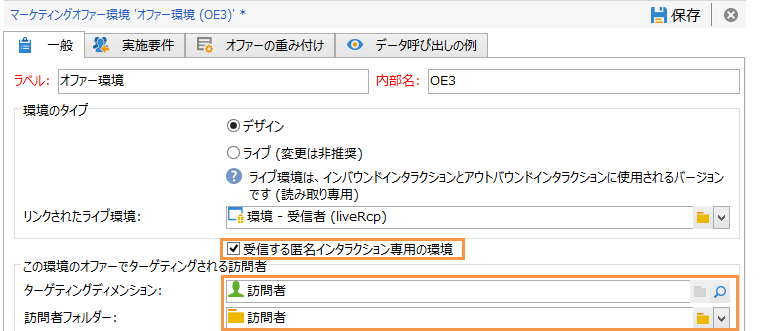
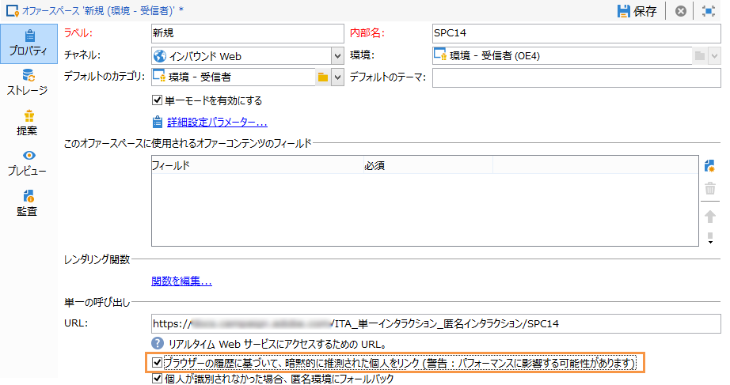
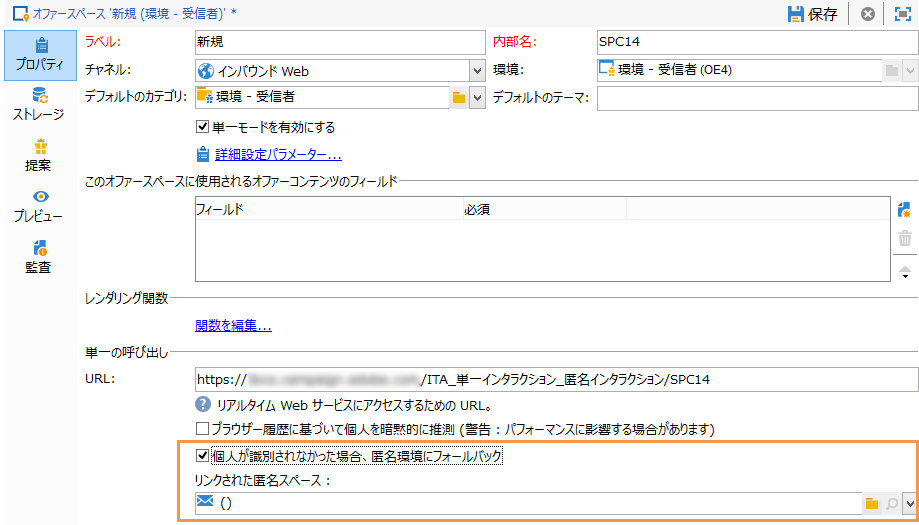

# 匿名インタラクション{#anonymous-interactions}

このビデオで [は](https://helpx.adobe.com/campaign/classic/how-to/indetified-and-anonymous-interaction-in-acv6.html?playlist=/ccx/v1/collection/product/campaign/classic/segment/digital-marketers/explevel/intermediate/applaunch/get-started/collection.ccx.js&ref=helpx.adobe.com) 、特定された匿名ターゲットにオファーが配信される方法の概要を説明します。

## 匿名インタラクション向け環境のターゲティングと格納 {#targeting-and-storing-an-environment-for-anonymous-interactions}

デフォルトでは、インタラクションには、受信者テーブルをターゲットとするように事前設定された環境（識別されたオファー）が 1 つ用意されています。別のテーブル（匿名オファー用の訪問者テーブルや特定の受信者テーブル）をターゲットにする場合、ターゲットマッピングウィザードを使用して環境を作成する必要があります。詳しくは、「オファー環境の [作成」を参照してください](../../interaction/using/live-design-environments.md#creating-an-offer-environment)。

マッピング作成ウィザードを使用して匿名環境を作成すると、環境のタ **[!UICONTROL Environment dedicated to incoming anonymous interactions]** ブでこのボックスが自動的にチェックさ **[!UICONTROL General]** れます。

が自 **[!UICONTROL Targeting dimension]** 動的に完了します。 デフォルトでは、このフィールドは訪問者テーブルにリンクされます。

フィールド **[!UICONTROL Visitor folder]** が表示されます。 It is automatically completed to link to the **[!UICONTROL Visitors]** folder. このフィールドでは、訪問者プロファイルを格納する場所を選択できます。

>[!NOTE]
>
>If you want to filter several types of visitors, for instance in the case of anonymous offers presented for one or more brands, you need to create an environment for each brand, and a **[!UICONTROL Visitors]** type folder for each environment.

## 匿名インタラクション用のオファーカタログ {#offer-catalog-for-anonymous-interactions}

アウトバウンドインタラクションの場合と同様、インバウンドインタラクションも、カテゴリやオファーで構成されたオファーカタログで管理されます。

カテゴリとスペースを作成するには、特定した訪問者に対して同じプロセスを適用します(「オファー [カテゴリの作成](../../interaction/using/creating-offer-categories.md) 」および「オ [ファー環境の作成](../../interaction/using/live-design-environments.md#creating-an-offer-environment)」を参照)。

## 匿名の訪問者 {#anonymous-visitors}

匿名の訪問者が接続する際に、それらの訪問者が Cookie 識別プロセスに送信されることがあります。この暗黙の認識は、訪問者のブラウザーの履歴に基づいています。

この手順では、Cookie から復元されたデータとデータベースのデータの比較がおこなわれます。その結果、訪問者が認識される（暗黙的に推測される）場合もあれば、認識されない（その結果、匿名のままの）場合もあります。

この分析を実行するには、オファースペースに対して、オプションをオンに **[!UICONTROL Implicitly identify the individual based on their browser history]** します。

## 識別されない匿名の訪問者の処理 {#processing-unidentified-anonymous-visitors}

分析の結果、匿名の訪問者が識別されなかった場合、そのデータを所定のスペースに格納できます。これにより、指定したタイポロジルールに合致する、特にこのタイプの訪問者向けのオファーを提案できます。

コンタクト先を識別できる要素がない場合や、暗黙的な推測が可能なコンタクト先に識別済みオファーを提案する意思がない場合は、匿名環境のフォールバックを実行できます。

これを行うには、をチェック **[!UICONTROL Fall back on an anonymous environment if no individuals were identified]**&#x200B;し、オファースペースを指定する際に、これらの未識別訪問者専用の **[!UICONTROL Linked anonymous space]** 環境を指定します。

