# オファーの承認と有効化{#approving-and-activating-an-offer}

オファーコンテンツが完成したら、オファーを承認して、ライブ環境への複製と配信が実行されるようにする必要があります。承認は、オファーのコンテンツおよび実施要件に関しておこなわれます。

オファーダッシュボード上のバナーには、そのオファーについて承認サイクルを実行する必要があるかどうかが示されます。

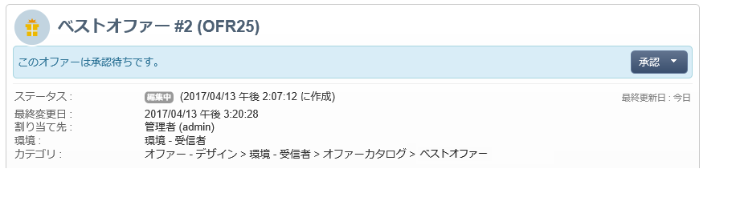

## オファーコンテンツの承認 {#approving-offer-content}

オファーコンテンツを承認することは、ライブ環境で利用可能にする表示域を選択することを意味します。

オファーのコンテンツは、スペースごとに表示域を 1 つ持っています。各オファースペースには、独自の構造とレンダリング関数があるので、オファー表示域にも違いがあります。

利用可能な特定のスペースに対してオファーコンテンツを承認し、他のスペースに対しては却下することもできます。

>[!CAUTION]
>
>オファーのコンテンツおよび実施要件が承認されると、パブリッシュワークフロー（オファー通知）が自動的に実行されてオファーがライブ環境に移行し、すべての有効化されたスペース上で利用できるようになります。

オファーコンテンツを承認するには、次の手順に従います。

1. 「**[!UICONTROL 承認]**」ボタンをクリックし、ポップアップから&#x200B;**[!UICONTROL コンテンツを承認]**&#x200B;を選択します。

   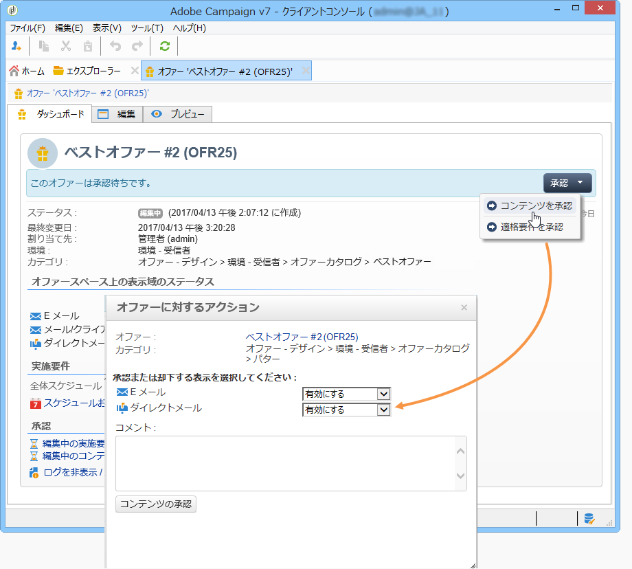

1. ドロップダウンリストを使用して、編集を続行する表示域を選択するか、ライブ環境にパブリッシュする表示域を選択して「**[!UICONTROL コンテンツの承認]**」をクリックします。

   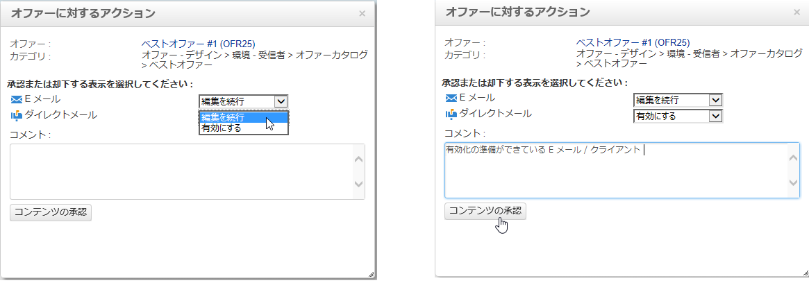

   オファーコンテンツが承認されると、オファーダッシュボードの表の情報が更新されます。

   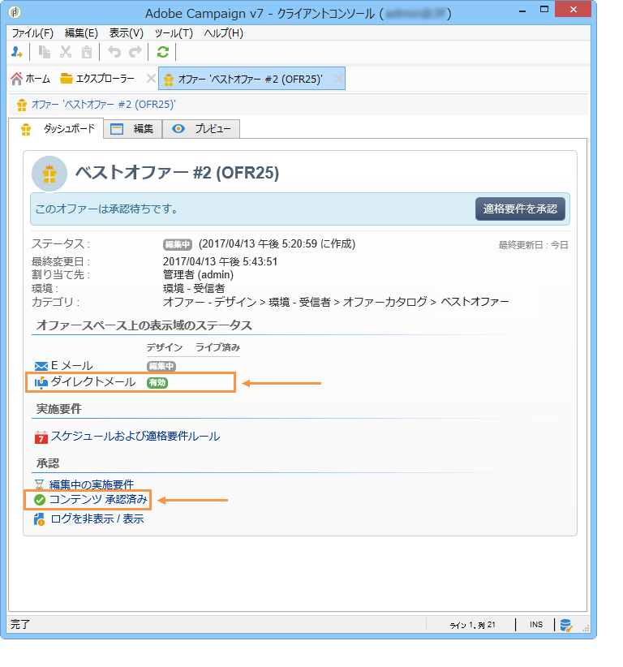

   >[!NOTE]
   >
   >**[!UICONTROL 承認コンテンツ]**&#x200B;という表示は、すべてのオファー表示域が有効で承認済みであることを意味しません。すべてのオファーが有効になり承認されているかどうかに関わらず、コンテンツの承認プロセスが達成されたことを示しています。

## オファーの実施要件の承認 {#approving-offer-eligibility}

オファーの実施要件を承認することは、オファーに設定された、または親カテゴリに作成されたルールから継承された、オファーの重み付けと実施要件ルールを承認または却下することを意味します。

>[!CAUTION]
>
>オファーのコンテンツおよび実施要件が承認されると、パブリッシュワークフロー（オファー通知）が自動的に実行されてオファーがライブ環境に移行し、すべての有効化されたスペース上で利用できるようになります。

* 「**[!UICONTROL スケジュールおよび実施要件ルール]**」をクリックすると、すべてのルールを記載したリストが表示されます。

   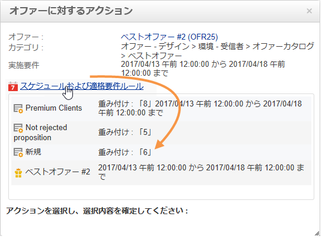

* 実施要件ルールを変更するには、「**[!UICONTROL 却下]**」をクリックし、「**[!UICONTROL 実施要件の承認]**」をクリックします。

   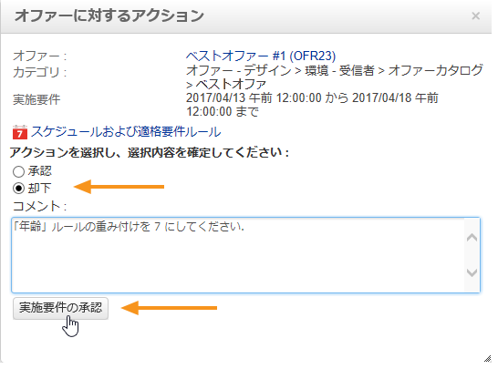

   オファーダッシュボード上の様々なステータスが更新されます。

   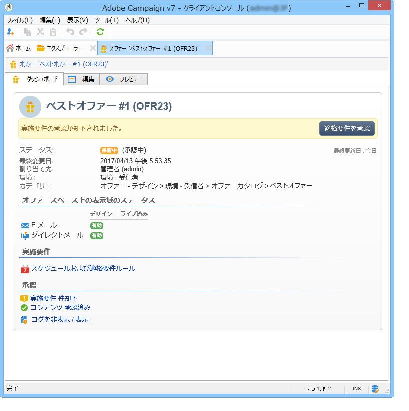

* オファーの実施要件を承認するには、「**[!UICONTROL 実施要件を承認]**」をクリックします。

   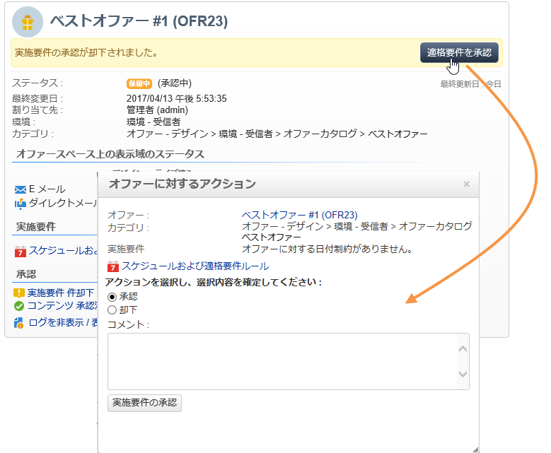

   実施要件を承認し、必要に応じてコメントを追加してから、「**[!UICONTROL 実施要件の承認]**」をクリックします。

   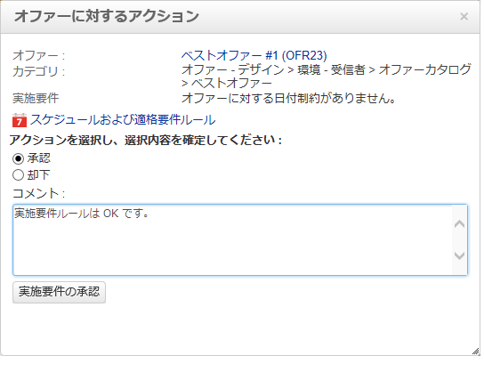

   オファーダッシュボード上の様々なステータスが更新されます。

   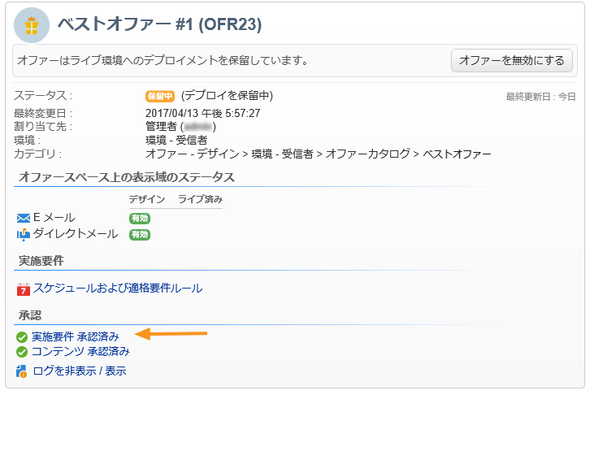

## 承認トラッキング {#approval-tracking}

オファーダッシュボードでは、承認をトラッキングできます。この機能にアクセスするには、「**[!UICONTROL ログを非表示 / 表示]**」をクリックします。

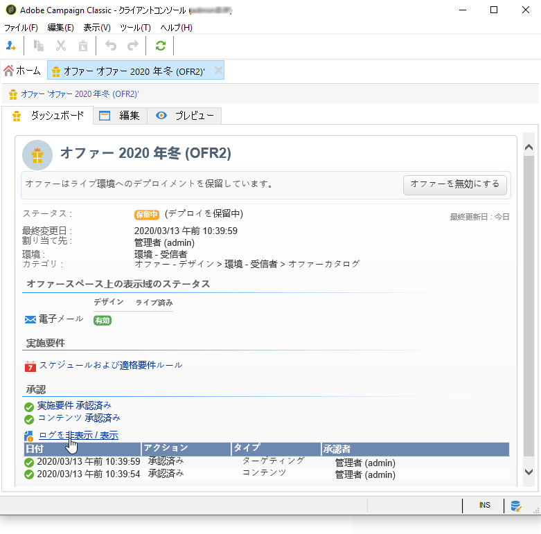

>[!NOTE]
>
>トラッキングは、オファーの「**[!UICONTROL 監査]**」タブでも、レビュー担当者の詳細なコメント付きで利用できます。

## 承認の再開 {#restart-the-approval}

承認が開始された後で、承認を再開できます。それには、次の手順に従います。

1. オファーダッシュボードの「**[!UICONTROL 承認コンテンツ]**」をクリックします。
1. **[!UICONTROL 編集]**&#x200B;ウィンドウが表示されます。再開する承認処理を選択し、「**[!UICONTROL 承認を再初期化して再送信]**」をクリックします。
1. 「**[!UICONTROL OK]**」をクリックして確定します。

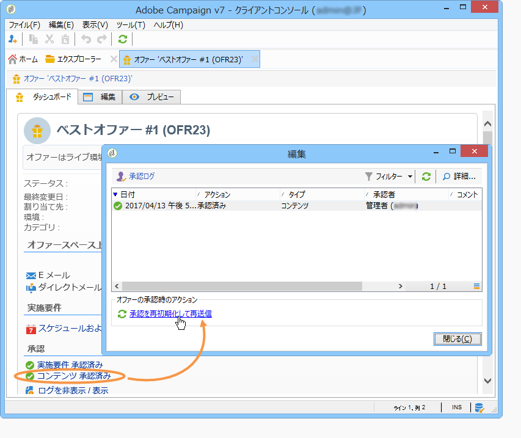

## オファーのパブリッシュ {#publishing-the-offer}

コンテンツと実施要件が両方とも承認されると、承認サイクルが完了した各オファーに対して自動実行されるワークフローによって、オファーがパブリッシュされます。また、オファーカタログに含まれるスペースやカテゴリをデザイン環境からライブ環境に（必要に応じて）同期するために、**[!UICONTROL オファー通知]**&#x200B;ワークフローが 1 時間ごとに実行されます。

デザイン環境で利用可能なオファーのダッシュボードには、ライブ環境の対応するオファーの名前など、パブリッシュに関する情報が含まれます。

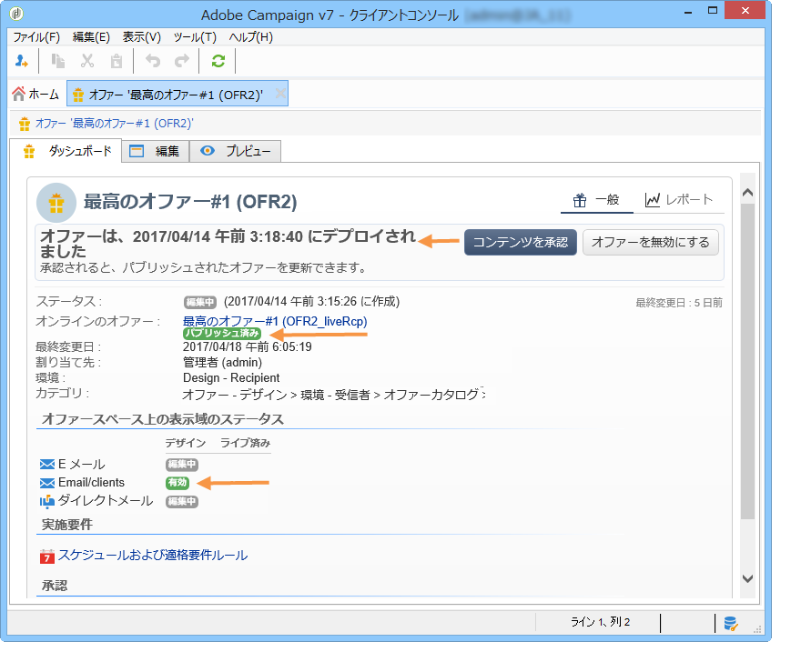

ライブ環境で利用可能なオファーを表示するには、オファーのラベルをクリックします。ライブオファーには、すべての関連情報を含むダッシュボードがあります。

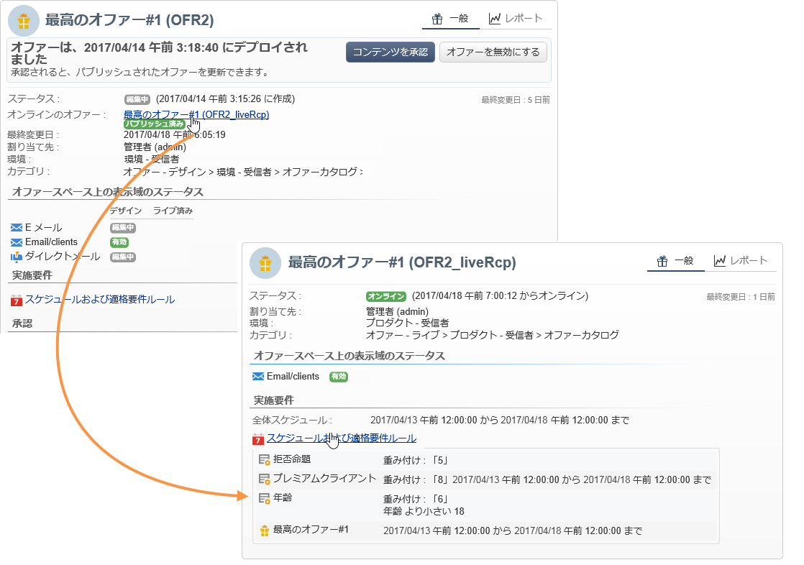

## オファーの無効化 {#disabling-an-offer}

承認済みのオファーは無効化できます。

それには、オンラインになっているオファーまたはオンライン待ちオファーのダッシュボードに移動し、「**[!UICONTROL オファーを無効にする]**」をクリックします。

また、カテゴリの「**[!UICONTROL 実施要件]**」タブで「**[!UICONTROL 有効]**」ボックスをクリックして、直接カテゴリを無効にすることもできます。

>[!NOTE]
>
>デザイン環境でオファーを削除すると、そのオファーは、リンクされたオンライン環境で自動的に無効化されます。提案の保持期間が過ぎると、無効化されているオファーはオンライン環境から削除されます。

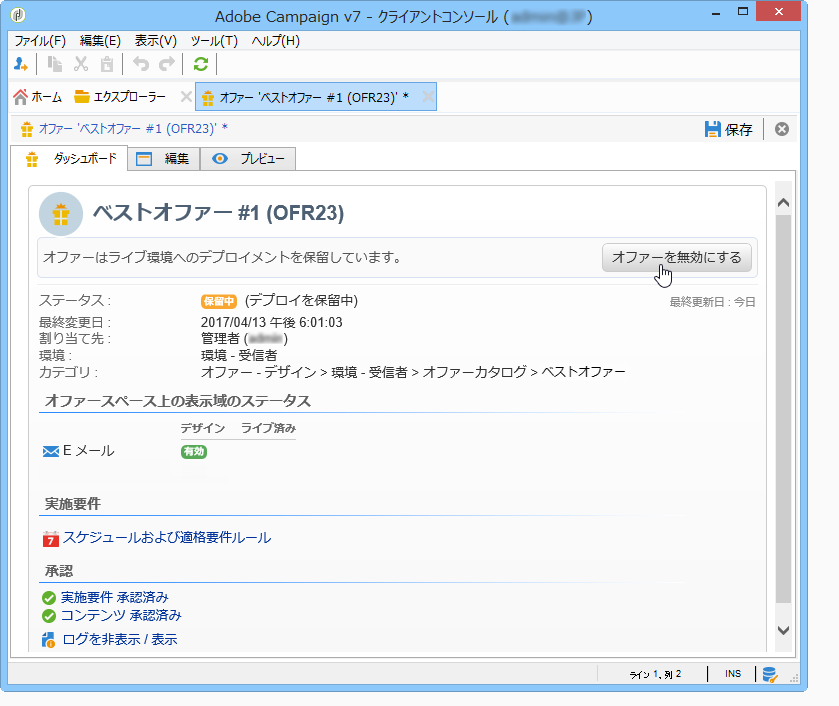

