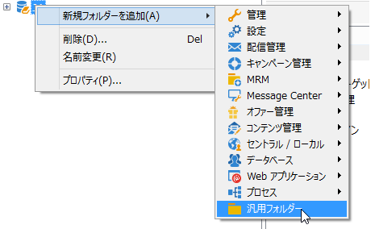
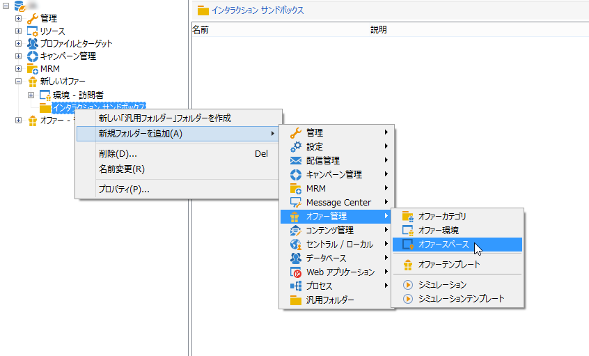
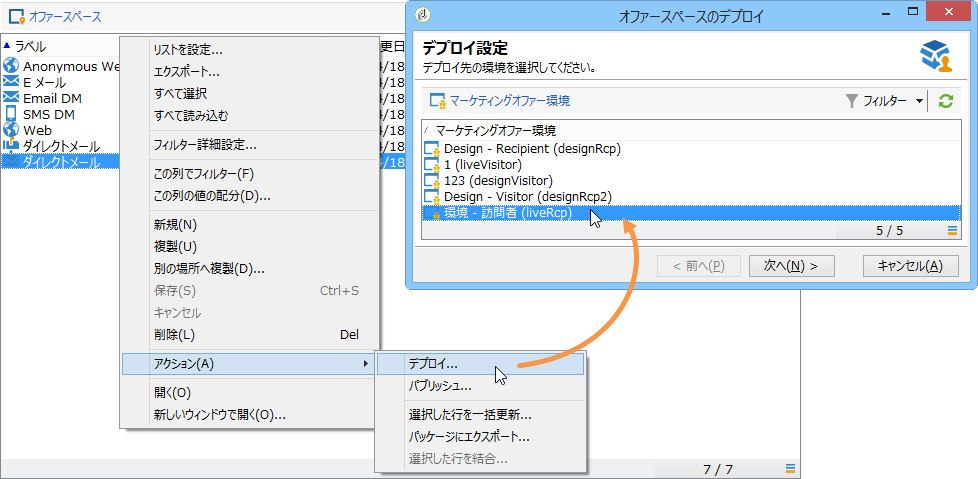

# テスト環境の作成{#creating-a-test-environment}

テスト環境（サンドボックスモード）を作成するには、次の手順に従います。

>[!CAUTION]
>
>この環境作成方法は、テスト環境にのみ使用できます。その他の場合は、ターゲットマッピングウィザードを使用します。For more on this, refer to [Creating an offer environment](../../interaction/using/live-design-environments.md#creating-an-offer-environment).

1. Adobe Campaign エクスプローラーを起動し、インスタンスのルートに移動します。
1. Right-click and add a **[!UICONTROL Generic folder]** using the drop-down menus.

   

1. Next, go to the folder you just created and add an **[!UICONTROL Offer environment]** using the right-click menus.

   

1. 同じ手順で、環境のサブフォルダーおよび要素を作成します。
1. テストが完了して、その環境を本番用として使用する場合は、デザイン環境でオファーおよびスペースを複製します(右クリック/ **[!UICONTROL Actions]** / **[!UICONTROL Deploy]** )。

   

