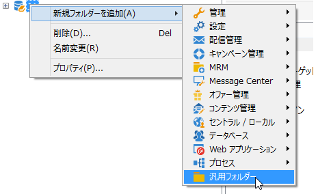
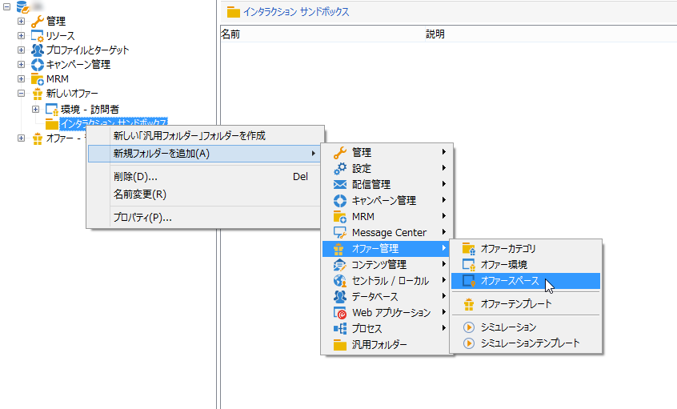
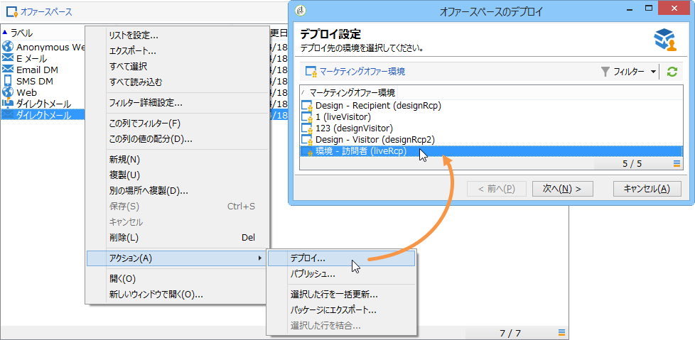

# テスト環境の作成{#creating-a-test-environment}

テスト環境（サンドボックスモード）を作成するには、次の手順に従います。

>[!IMPORTANT]
>
>この環境作成方法は、テスト環境にのみ使用できます。 その他の場合は、ターゲットマッピングアシスタントを使用します。 詳しくは、[オファー環境の作成](../../interaction/using/live-design-environments.md#creating-an-offer-environment)を参照してください。

1. Adobe Campaign エクスプローラーを起動し、インスタンスのルートに移動します。
1. 右クリックし、ドロップダウンメニューを使用して「**[!UICONTROL 汎用フォルダー]**」を追加します。

   

1. 作成したフォルダーに移動し、右クリックメニューを使用して「**[!UICONTROL オファー環境]**」を追加します。

   

1. 同じ手順で、環境のサブフォルダーおよび要素を作成します。
1. テストが完了して、その環境を本番用として使用する場合は、デザイン環境でオファーおよびスペースを複製します （右クリックして、**[!UICONTROL アクション]**／**[!UICONTROL デプロイ]**）。

   
