# オファーの作成{#creating-an-offer}

## オファーの作成 {#creating-the-offer}

オファーを作成するには、次の手順に従います。

1. Go to the **[!UICONTROL Campaigns]** universe and click the **[!UICONTROL Offers]** link.

   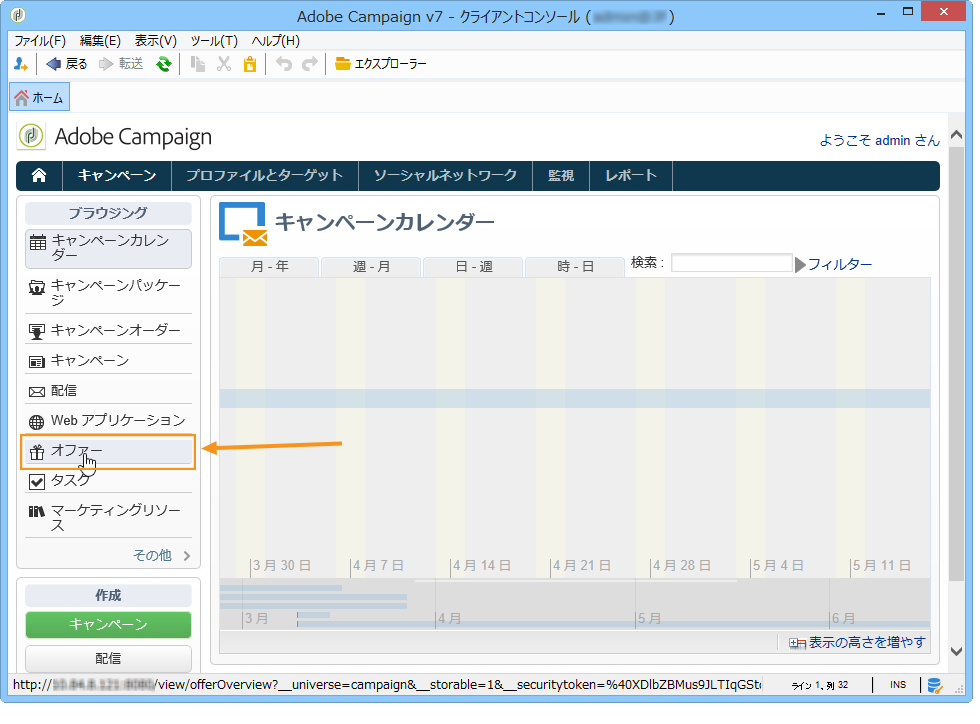

1. ボタンをクリッ **[!UICONTROL Create]** クします。

   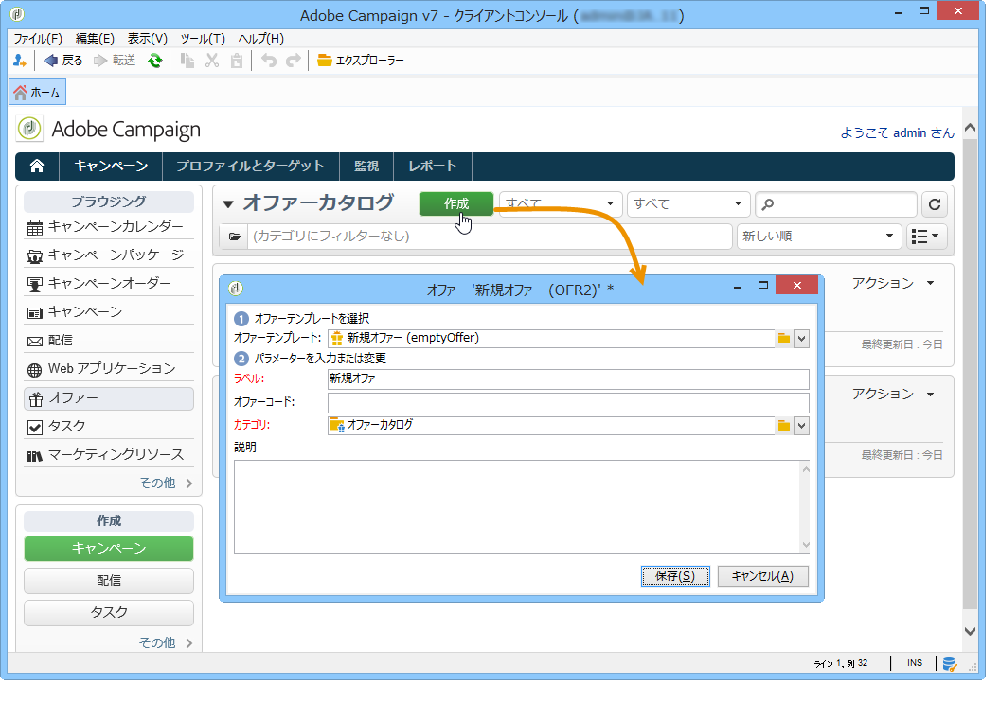

1. ラベルを変更し、オファーが属するカテゴリを選択します。

   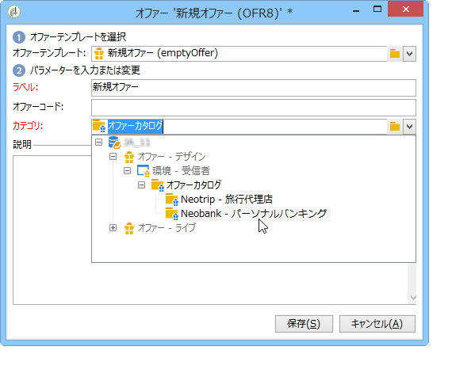

1. Click **[!UICONTROL Save]** to create the offer.

   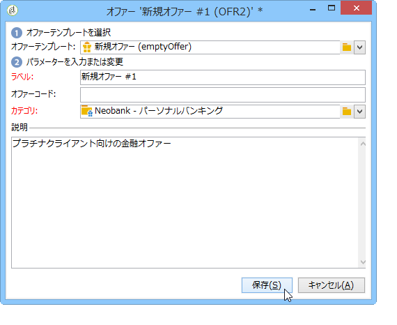

   オファーが、プラットフォームで利用できるようになり、コンテンツを設定できるようになります。

   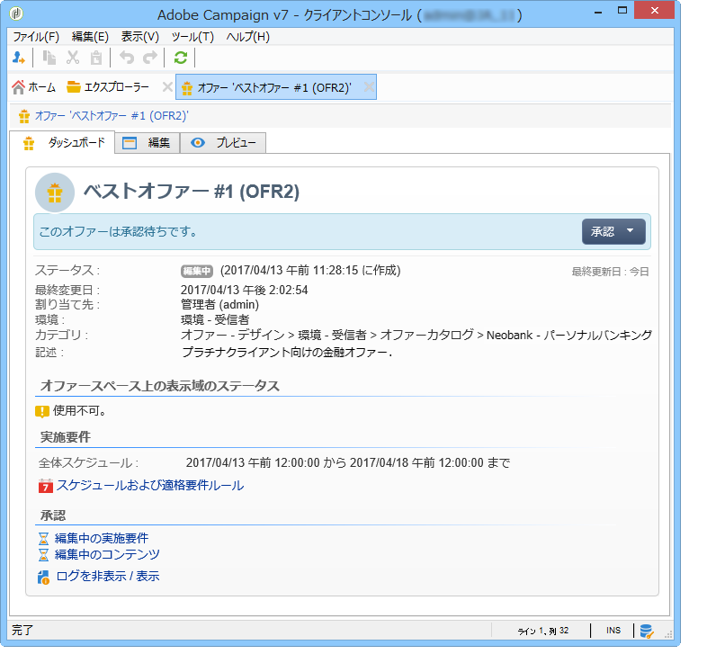

## オファーの実施要件の設定 {#configuring-offer-eligibility}

In the **[!UICONTROL Eligibility]** tab, define the period the offer will be valid for and can be presented, the filters to apply to the target and the offer weight.

### 実施期間の定義 {#defining-the-eligibility-period-of-an-offer}

オファーの実施期間を定義するには、ドロップダウンリストを使用して、開始日と終了日をカレンダーから選択します。

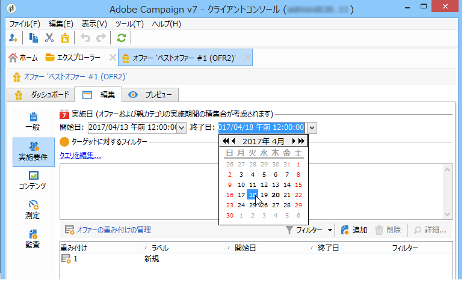

オファーがインタラクションエンジンによって選択される期間は、この範囲に含まれる日のみです。また、オファーカテゴリの実施日も設定されている場合は、最も厳しい制限期間が適用されます。

### ターゲットに対するフィルター {#filters-on-the-target}

オファーターゲットにはフィルターを適用できます。

To do this, click the **[!UICONTROL Edit query]** link and select the filter you want to apply. （[この節](../../platform/using/steps-to-create-a-query.md#step-4---filter-data)を参照）。

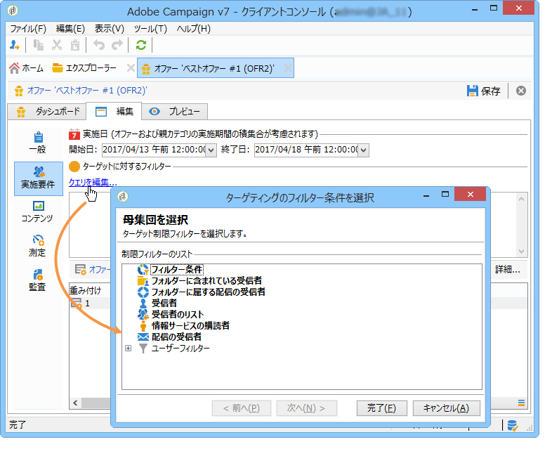

定義済みフィルターが既にある場合は、ユーザーフィルターのリストから選択できます。For more on this, refer to [Creating predefined filters](../../interaction/using/creating-predefined-filters.md).

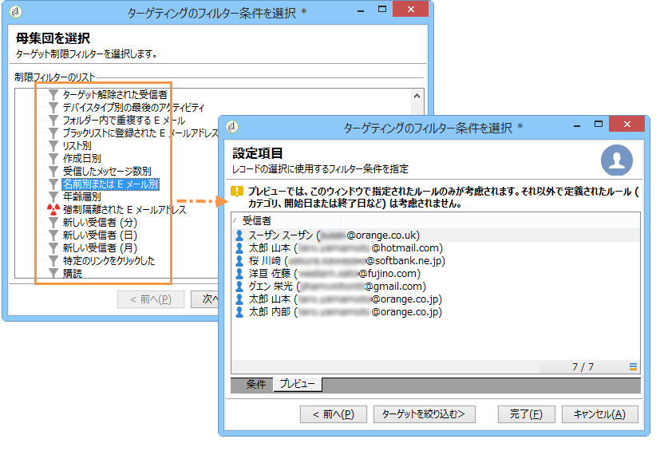

### オファーの重み付け {#offer-weight}

ターゲットが複数のオファーの実施要件を満たす場合のために、エンジンにどのオファーを選択させるかの条件を設定するには、オファーに重み付けを 1 つまたは複数割り当てます。また、必要に応じてターゲットにフィルターを適用したり、重み付けを適用するオファースペースを制限したりすることもできます。エンジンは、重み付けの小さいオファーよりも大きいオファーを優先して選択します。

例えば、期間、特定のターゲット、さらにはオファースペースを区別するために、同じオファーに複数の重み付けを設定できます。

例えば、コンタクト先の年齢が 18 歳から 25 歳までの場合は重み付け A を適用し、25 歳を超える場合は重み付け B を適用できます。または、夏の間ずっと有効なオファーについて、7 月には重み付け A を適用し、8 月には重み付け B を適用できます。

>[!NOTE]
>
>オファーに割り当てた重み付けの値を、そのオファーが属するカテゴリのパラメーターに従って一時的に修正させることもできます。For more on this, refer to [Creating offer categories](../../interaction/using/creating-offer-categories.md).

オファーの重み付けを作成するには、次の手順に従います。

1. クリック **[!UICONTROL Add]**.

   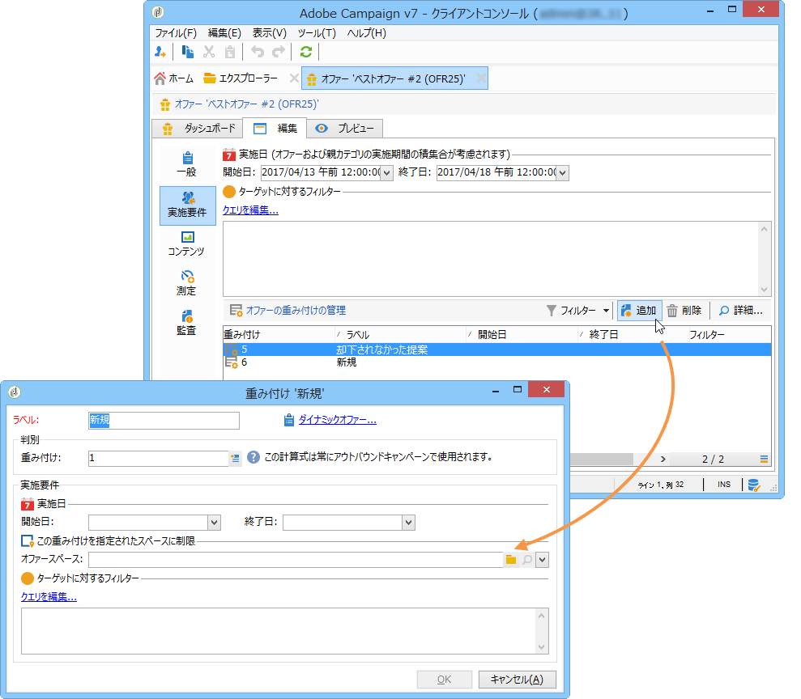

1. ラベルを変更し、重み付けを割り当てます。デフォルトの重み付けは 1 です。

   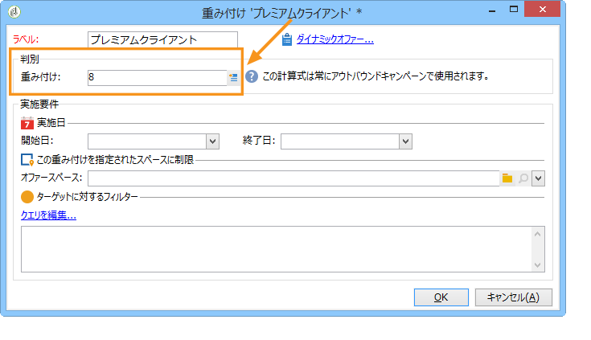

   >[!CAUTION]
   >
   >値を入力しない場合、重み付けは 0 になり、ターゲットがそのオファーの実施要件を満たすとは判断されなくなります。

1. 特定の期間を対象にして重み付けを適用するには、実施日を定義します。

   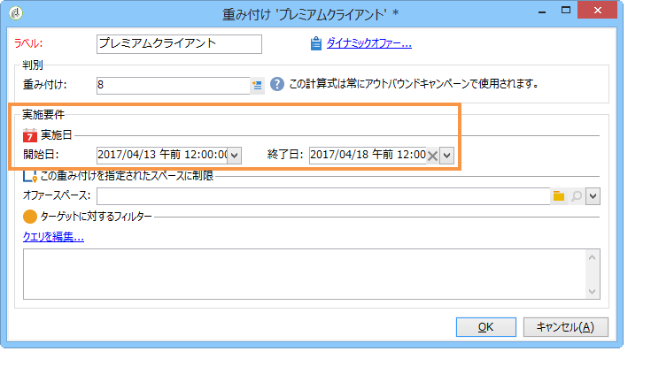

1. 必要に応じて、重み付けを特定のオファースペースに制限します。

   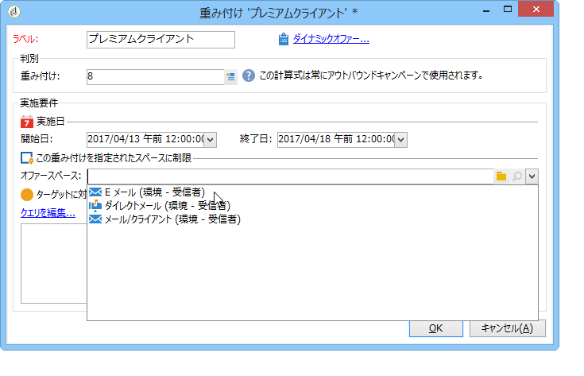

1. ターゲットにフィルターを適用します。

   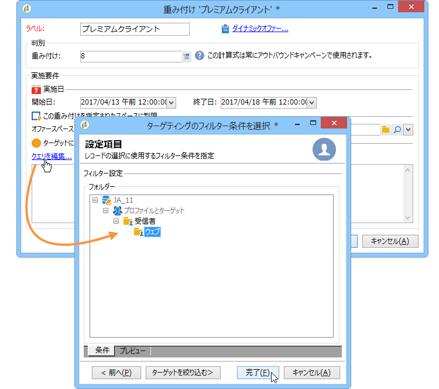

1. 「**[!UICONTROL OK]**」をクリックして重み付けを保存します。

   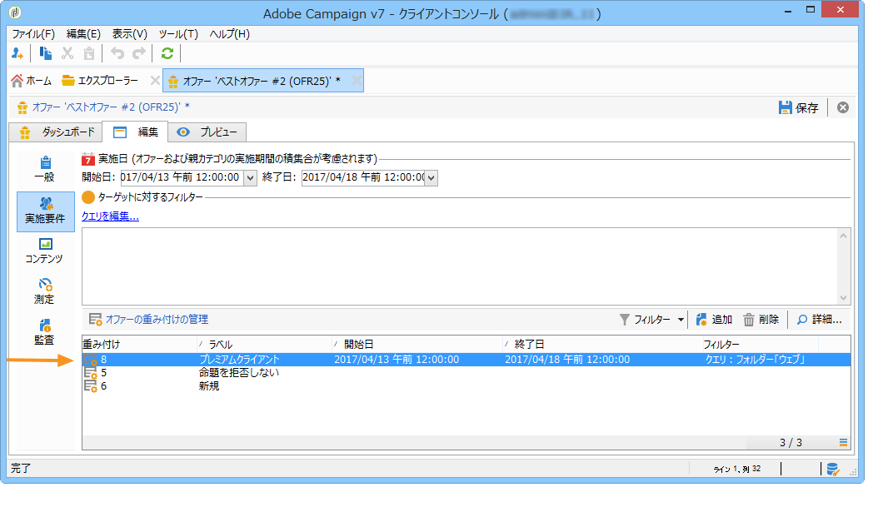

   >[!NOTE]
   >
   >選択されたオファーに関して、複数の重み付けの実施要件を満たすターゲットには、それらのうち最大の重み付けが適用されます。オファーエンジンの呼び出し時、1 つのオファーが選択される回数は、1 つのコンタクト先あたり最大 1 回です。

### オファー実施要件ルールの概要 {#a-summary-of-offer-eligibility-rules}

設定が完了すると、実施要件ルールの概要をオファーダッシュボードで利用できるようになります。

表示するには、リンクをクリック **[!UICONTROL Schedule and eligibility rules]** します。

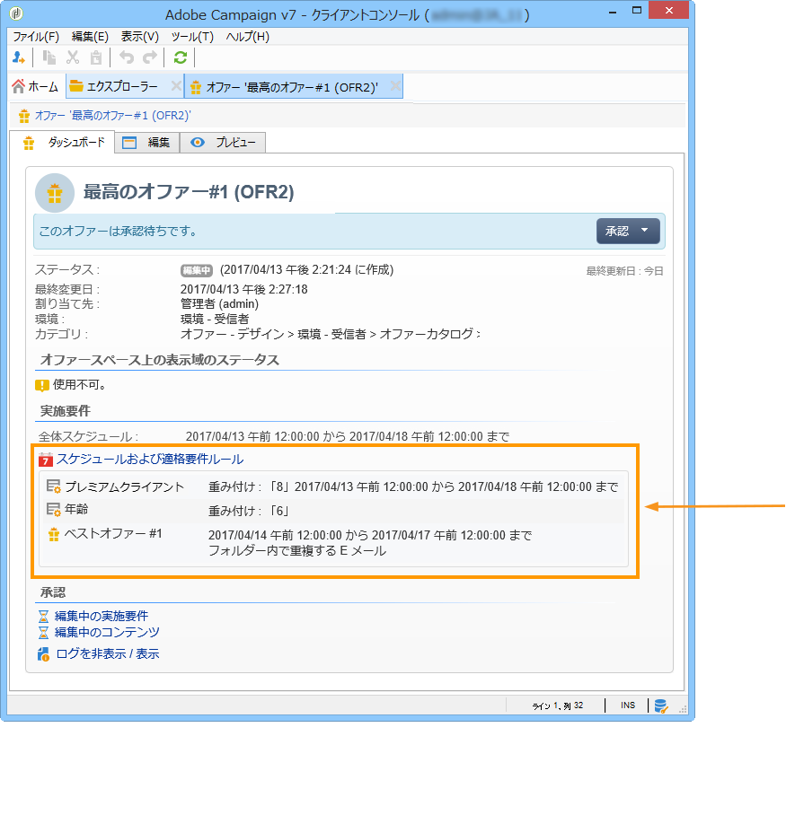

## オファーコンテンツの作成 {#creating-the-offer-content}

1. Click the **[!UICONTROL Edit]** tab, then click the **[!UICONTROL Content]** tab.

   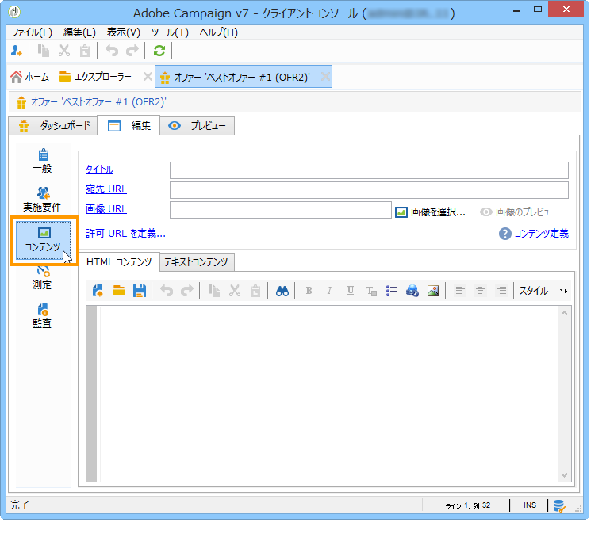

1. オファーコンテンツの各種フィールドに値を入力します。

   * **[!UICONTROL Title]** :オファーに表示するタイトルを指定します。 Warning: this is not referring to the offer&#39;s label, which is defined in the **[!UICONTROL General]** tab.
   * **[!UICONTROL Destination URL]** :オファーのURLを指定します。 正しく処理されるようにするには、「http://」または「https://」で始める必要があります。
   * **[!UICONTROL Image URL]** :オファーの画像へのURLまたはアクセスパスを指定します。
   * **[!UICONTROL HTML content]** / **[!UICONTROL Text content]** :希望するタブにオファーの本文を入力します。 To generate tracking, the **[!UICONTROL HTML content]** must be composed of HTML elements that can be enclosed in a `<div>` type element. For example, the result of a `<table>` element in the HTML page will be as followed:

   ```
      <div> 
       <table>
        <tr>
         <th>Month</th>
         <th>Savings</th>   
        </tr>   
        <tr>    
         <td>January</td>
         <td>$100</td>   
        </tr> 
       </table> 
      </div>
   ```

   承認URLの定義は、「提案が受け入れられたと [きのステータスの設定」の節に記載されています](../../interaction/using/creating-offer-spaces.md#configuring-the-status-when-the-proposition-is-accepted) 。

   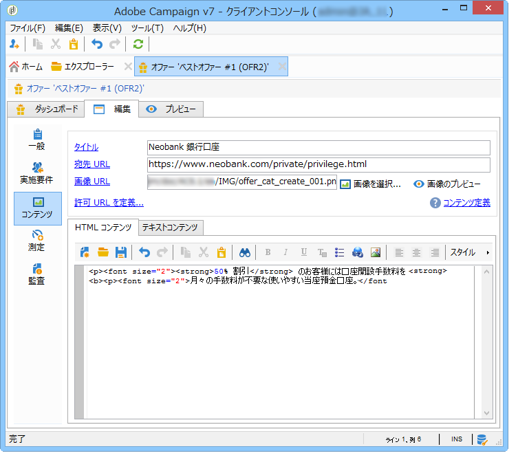

   To find the required fields as they were defined during offer space configuration, click the **[!UICONTROL Content definitions]** link to display the list. For more on this, refer to [Creating offer spaces](../../interaction/using/creating-offer-spaces.md).

   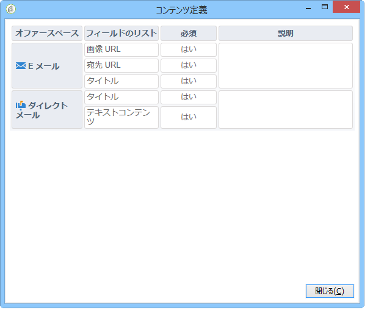

   この例では、オファーには、タイトル、画像、HTML コンテンツ、宛先 URL を含める必要があります。

## オファーのプレビュー {#previewing-the-offer}

コンテンツの設定が完了すると、そのオファーが受信者にどのように表示されるかをプレビューできるようになります。手順は次のとおりです。

1. タブをクリック **[!UICONTROL Preview]** します。

   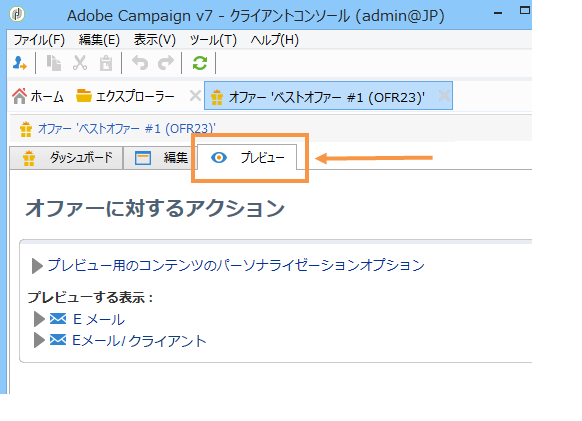

1. 表示したいオファーの表示域を選択します。

   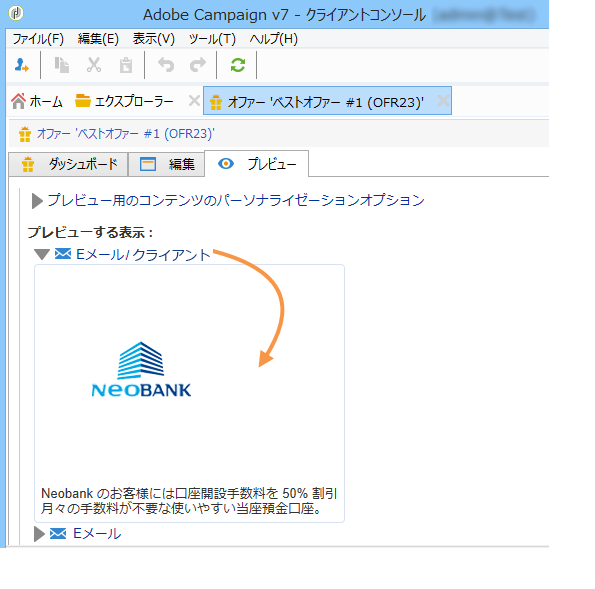

1. オファーコンテンツがパーソナライズされている場合、パーソナライゼーションを表示するオファーターゲットを選択します。

   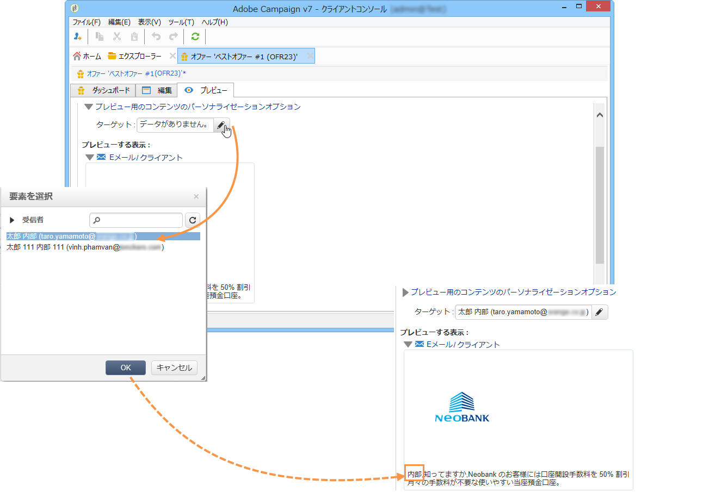

## オファーの仮説の作成 {#creating-a-hypothesis-on-an-offer}

オファーの提案に関する仮説を作成すると、該当製品の購入に対するオファーの影響を判別できます。

>[!NOTE]
>
>仮説は Response Manager を使用して実行されます。使用許諾契約書を確認してください。

Hypotheses carried out on an offer proposition are referenced in their **[!UICONTROL Measure]** tab.

仮説の作成について詳しくは、[このページ](../../campaign/using/about-response-manager.md)を参照してください。

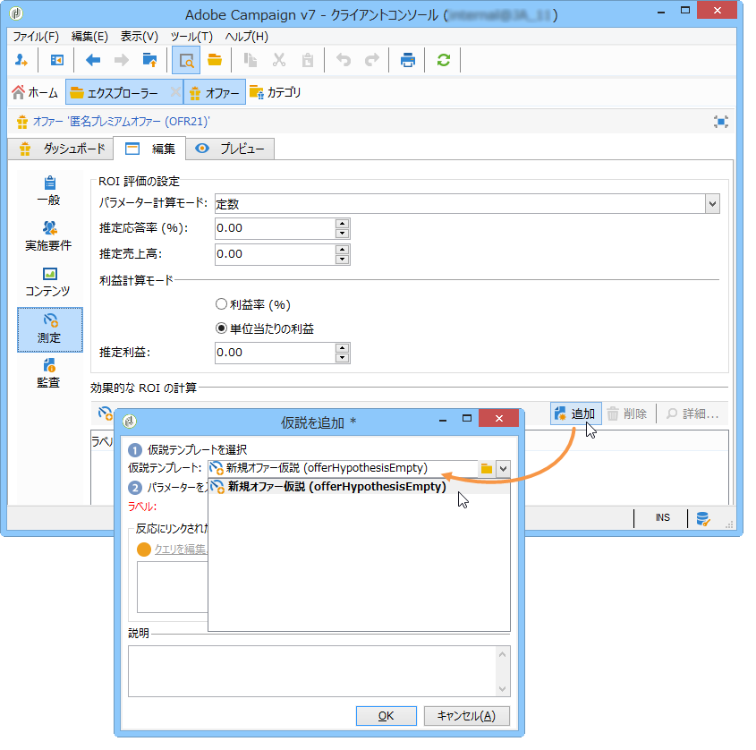

