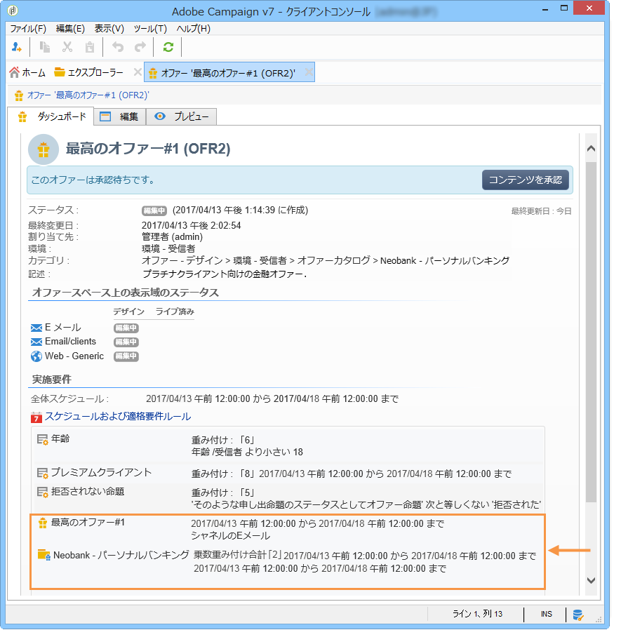

# オファーカテゴリの作成{#creating-offer-categories}

The creation of offer categories can only take place in the **[!UICONTROL Design]** environment. They are deployed automatically in the **[!UICONTROL Live]** environment (i.e. made available) when the created/modified offer(s) they contain are approved. By default, the **[!UICONTROL Design]** environment contains a category to receive all offers. サブカテゴリを作成すると、カタログオファーに階層を追加できます。

各カテゴリには実施日を定義できます（この日付を過ぎると、カテゴリに含まれるオファーはターゲットに提示されなくなります）。特定のカテゴリのオファーがオファーエンジンによって優先的に選択されるようにする（例えば、商品の露出度を高める）には、一定期間、カテゴリに乗数の重み付けを追加して重み付けを増加できます。

追加のカテゴリを作成するには、次の手順に従います。

1. フォルダに移動 **[!UICONTROL Offer catalog]** します。

   

1. 右クリックし、ドロッ **[!UICONTROL Create a new "Offer category" folder]** プダウンリストから選択します。

   

1. カテゴリの名前を変更します。You can edit the label later using the **[!UICONTROL General]** tab.

   

   >[!NOTE]
   >
   >これらの手順を、作成するカテゴリの数だけ繰り返します。

   その後、必要に応じて次の操作を実行します。

   * assign eligibility dates from the **[!UICONTROL Eligibility]** tab.

      

   * enter key words that may be used to select offers from within this category, using the **[!UICONTROL Themes]** field.

      

      >[!NOTE]
      >
      >オファーエンジンの呼び出し時には、テーマやカテゴリがパラメーターに合致したカタログの一部分のみが選択されます。

   * You can temporarily &quot;boost&quot; the offer weight of a category for a given period via the **[!UICONTROL Multiplier weight]** field.

      

カテゴリに含まれるオファーのダッシュボードでは、実施要件ルールの概要を確認できます。リンクをクリックすると、リンクが表示さ **[!UICONTROL Schedule and eligibility rules of the offer]** れます。

