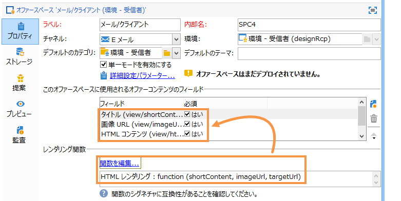
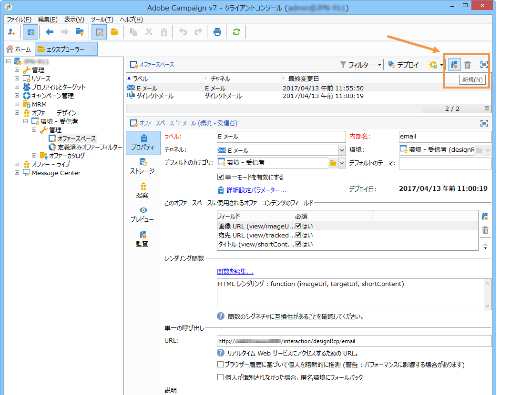
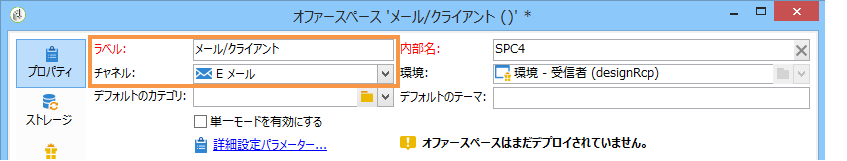
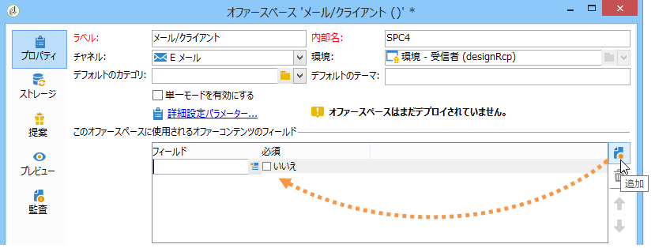
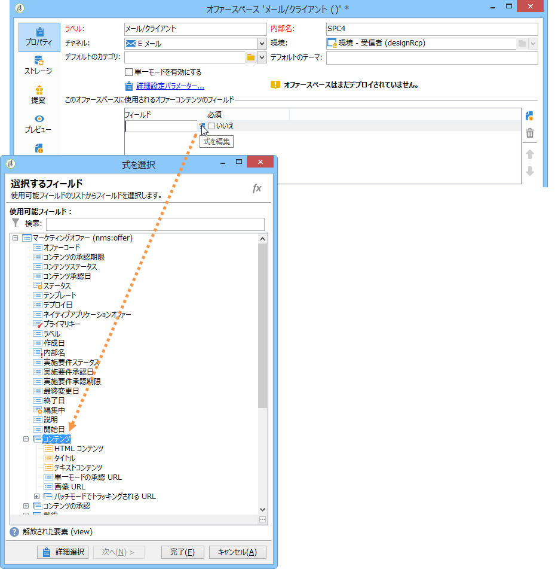
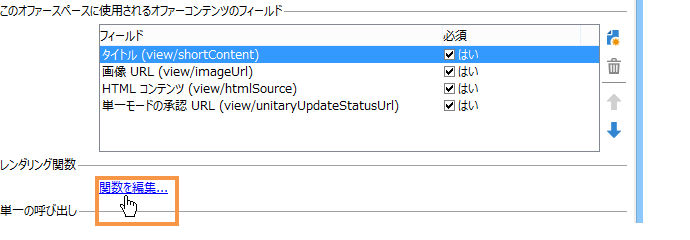
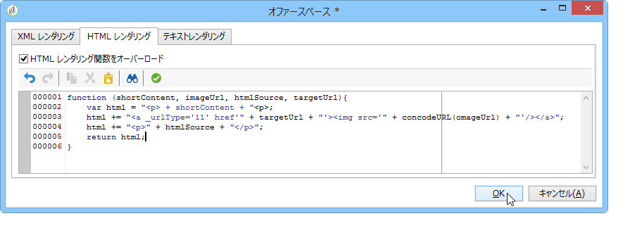
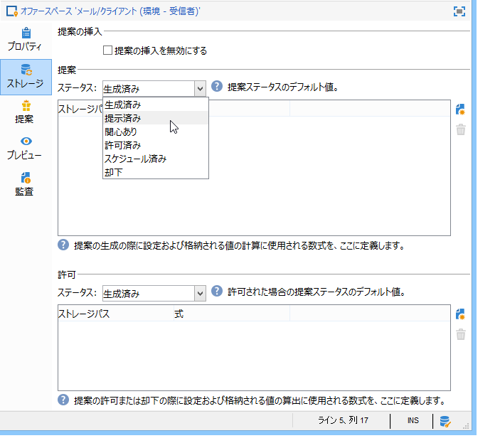
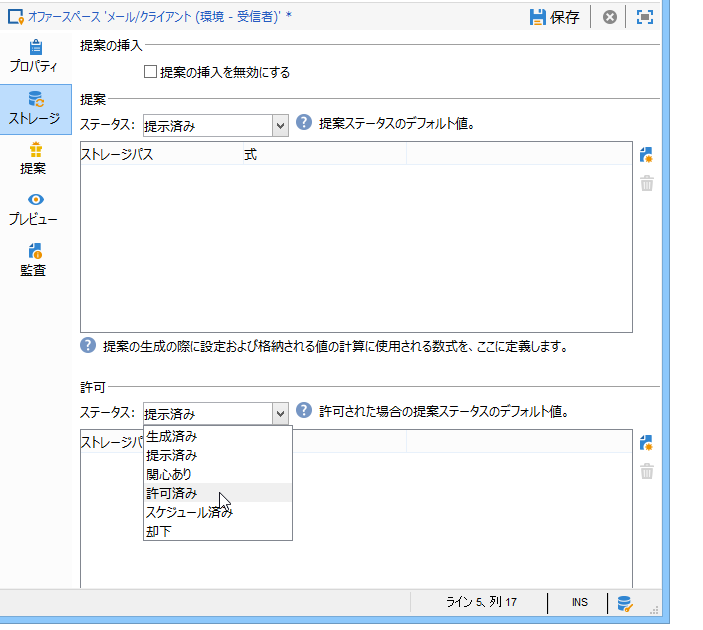
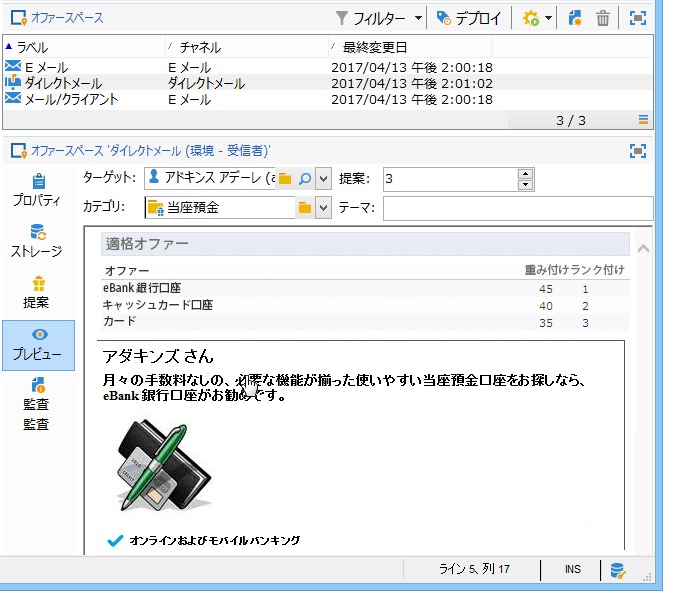

# オファースペースの作成{#creating-offer-spaces}

オファースペースの作成を実行できるのは、オファースペースのサブフォルダーへのアクセス権を持つ&#x200B;**技術管理者**&#x200B;のみです。オファースペースは、デザイン環境にのみ作成でき、オファーの承認時にライブ環境に自動的に複製されます。

カタログオファーのコンテンツは、オファースペースで設定します。By default, the content can include the following fields: **[!UICONTROL Title]**, **[!UICONTROL Destination URL]**, **[!UICONTROL Image URL]**, **[!UICONTROL HTML content]** and **[!UICONTROL Text content]**. フィールドの順序は、オファースペースで設定します。

詳細設定パラメーターでは、コンタクト先の識別キーを指定できます（識別キーは、名前や E メールフィールドなど、様々な要素を同時に使用して作成できます）。詳しくは、「特定されたオファーの提示」の節 [を参照してください](../../interaction/using/integration-via-javascript--client-side-.md#presenting-an-identified-offer) 。

レンダリング関数を使用して、HTML レンダリングまたは XML レンダリングが作成されます。レンダリング関数で定義するフィールドの順序は、コンテンツに設定した順序と同じである必要があります。



新しいオファースペースを作成するには、次の手順に従います。

1. Go to the list of offer spaces and click **[!UICONTROL New]**.

   

1. 使用するチャネルを選択して、オファースペースのラベルを変更します。

   

1. Check the **[!UICONTROL Enable unitary mode]** box if one of the following cases applies to you:

   * インタラクションを Message Center と組み合わせて使用する場合
   * インタラクションの単一モードを使用する場合（インバウンドインタラクション）

1. ウィンドウに移動し、 **[!UICONTROL Content field]** をクリックしま **[!UICONTROL Add]**&#x200B;す。

   

1. ノードに移動 **[!UICONTROL Content]** し、次の順序でフィールドを選択します。そ **[!UICONTROL Title]**&#x200B;れ **[!UICONTROL Image URL]**&#x200B;から **[!UICONTROL HTML content]**、それ **[!UICONTROL Destination URL]**&#x200B;で

   

1. Check the **[!UICONTROL Required]** box to make each field mandatory.

   >[!NOTE]
   >
   >この設定はプレビューで使用されます。パブリッシュの際、関係するオファーの必須要素に不足がある場合は、オファースペースが無効になります。ただし、既にオファースペース上でオファーがライブになっている場合は、これらの条件は考慮されません。

   

1. をクリック **[!UICONTROL Edit functions]** して、レンダリング関数を作成します。

   これは、オファースペース上にオファー表示域を生成するために使用される関数です。使用可能な形式はいくつかあります。アウトバウンドインタラクションのHTMLまたはテキスト、インバウンドインタラクションのXML。

   

1. タブに移動し、 **[!UICONTROL HTML rendering]** を選択します **[!UICONTROL Overload the HTML rendering function]**。
1. レンダリング関数を挿入します。

   

必要に応じて、インバウンドインタラクション用の XML レンダリング関数をオーバーロードできます。また、アウトバウンドインタラクション用の HTML およびテキストレンダリング関数をオーバーロードすることもできます。For more on this, refer to [About inbound channels](../../interaction/using/about-inbound-channels.md).

## オファーの提案ステータス {#offer-proposition-statuses}

オファーの提案は、ターゲット母集団とのインタラクションに応じて、様々なステータスになります。インタラクションには、ライフサイクル全体でオファーの提案に適用できる値のセットが用意されています。ただし、オファーの提案が作成される際や承認される際にステータスが変更できるように、プラットフォームを設定する必要があります。

>[!NOTE]
>
>オファーの提案のステータスは、即座には更新されません。更新処理は、1 時間ごとにトリガーされるトラッキングワークフローによって実行されます。

### ステータスリスト {#status-list}

インタラクションには、オファーの提案のステータスを検証するために使用できる、次のような値が用意されています。

* **[!UICONTROL Accepted]**&#x200B;を参照してください。
* **[!UICONTROL Scheduled]**&#x200B;を参照してください。
* **[!UICONTROL Generated]**&#x200B;を参照してください。
* **[!UICONTROL Interested]**&#x200B;を参照してください。
* **[!UICONTROL Presented]**&#x200B;を参照してください。
* **[!UICONTROL Rejected]**&#x200B;を参照してください。

これらの値はデフォルトでは適用されず、設定する必要があります。

>[!NOTE]
>
>「送信済み」ステータスの配信にオファーがリンクされると、そのオファーの提案のステータスは自動的に「提示済み」に変更されます。

### 提案作成時のステータス設定 {#configuring-the-status-when-the-proposition-is-created}

インタラクションエンジンによってオファーの提案が作成されると、ステータスは、インタラクションがインバウンドかアウトバウンドかによって変更されます。The choice between these two values depends on the way the offer spaces were configured in the **[!UICONTROL Design]** environment

各スペースでは、オファーレポートに表示する情報に応じて、提案が作成される際に適用するステータスを設定できます。

それには、次の手順に従います。

1. Go to the **[!UICONTROL Storage]** tab of the desired space.
1. 提案の作成時に適用するステータスを選択します。

   

### 提案承認時のステータス設定 {#configuring-the-status-when-the-proposition-is-accepted}

オファーの提案が承認されると、デフォルトで提供される値のいずれかを使用して、提案の新しいステータスを設定できます。受信者がオファー内のリンクをクリックし、インタラクションエンジンが呼び出されると、更新が有効になります。

それには、次の手順に従います。

1. Go to the **[!UICONTROL Storage]** tab of the desired space.
1. 提案が承認されたときに提案に適用するステータスを選択します。

   

**インバウンドインタラクション**

The **[!UICONTROL Storage]** tab lets you define statuses for **proposed** and **accepted** offer propositions only. インバウンドインタラクションでは、オファーの提案のステータスが、インターフェイスによってではなく、オファーエンジンを呼び出すための URL で直接指定されている必要があります。こうすることで、オファーの提案が却下された場合など、その他の場合に適用されるステータスを指定できるようになります。

```
<BASE_URL>?a=UpdateStatus&p=<PRIMARY_KEY_OF_THE_PROPOSITION>&st=<NEW_STATUS_OF_THE_PROPOSITION>&r=<REDIRECT_URL>
```

例えば、**Neobank** サイトに表示される **Home insurance** オファーに合致する提案（識別子 **40004**）には、次の URL が含まれます。

```
<BASE_URL>?a=UpdateStatus&p=<40004>&st=<3>&r=<"http://www.neobank.com/insurance/subscribe.html">
```

As soon as a visitor clicks the offer, and therefore the URL, the **[!UICONTROL Accepted]** status (value **3**) is applied to the proposition and the visitor is redirected to a new page of the **Neobank** site to take out the insurance contract.

>[!NOTE]
>
>URL で別のステータスを指定する場合（オファーの提案が却下された場合など）は、望ましいステータスに対応する値を使用します。例： **[!UICONTROL Rejected]** = &quot;5&quot;、 **[!UICONTROL Presented]** = &quot;1&quot;など。
>
>Statuses and their values can be retrieved in the **[!UICONTROL Offer propositions (nms)]** data schema. 詳しくは、[このページ](../../configuration/using/data-schemas.md)を参照してください。

**アウトバウンドインタラクション**

In case of an outbound interaction, you can automatically apply the **[!UICONTROL Interested]** status to an offer proposition when the delivery contains a link. 単に **_urlType=&quot;11&quot;** という値をリンクに付加します。

```
<a _urlType="11" href="<DEST_URL>">Link inserted into the delivery</a>
```

## スペースごとのオファーのプレビュー {#offer-preview-per-space}

このタブでは、選択した方法で受信者が受ける資格があるオファーを表示できます。次の例では、受信者は、郵便経由のオファー提案 3 件の実施要件を満たしています。



受信者が実施要件を満たしているオファーがない場合、プレビュー画面は次のように表示されます。


1 つのスペースのみに限定されている場合、プレビューではコンテキストを無視できます。This is the case when the interaction schema has been extended to add fields referenced in a space using an inbound channel (for more on this, refer to [Extension example](../../interaction/using/extension-example.md)).
