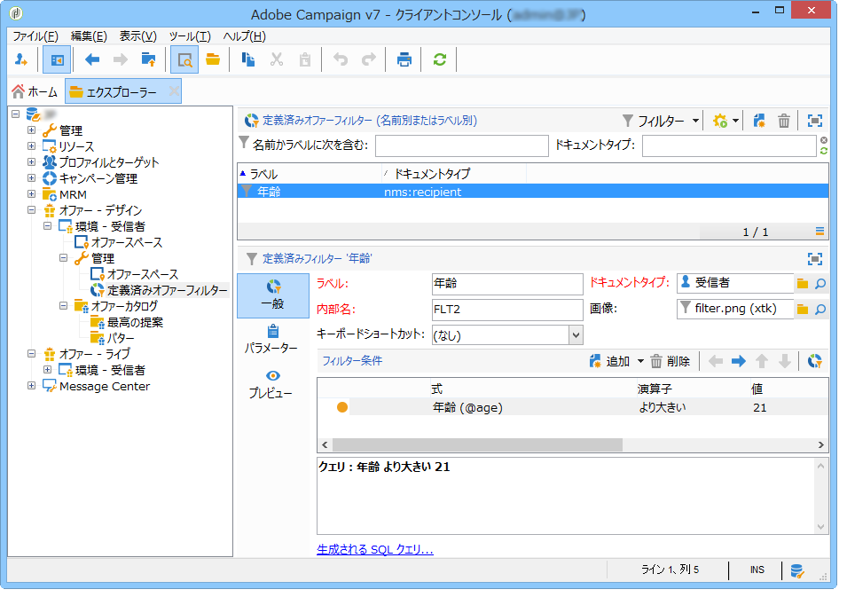
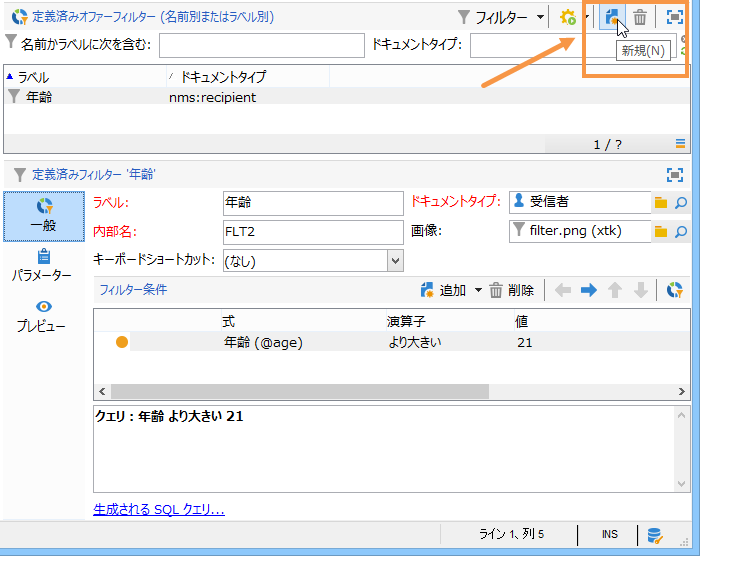
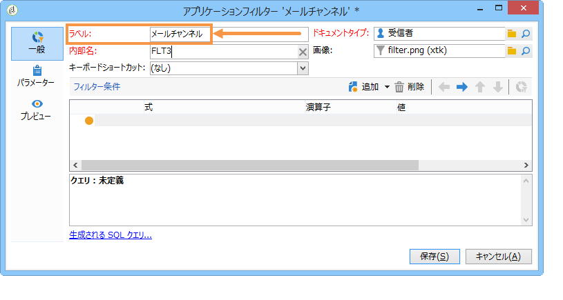
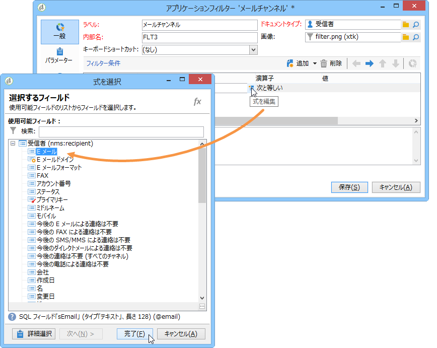
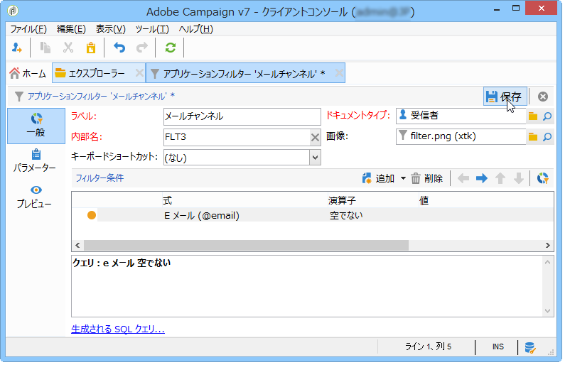
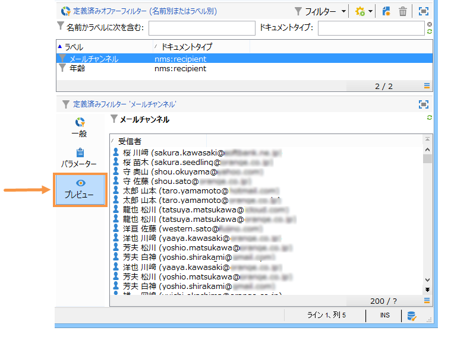

# 定義済みフィルターの作成{#creating-predefined-filters}

定義済みフィルターを使用すると、オファー作成時に再利用しやすい、ターゲット母集団用の実施要件ルールを作成できます。定義済みフィルターは、各環境に特化し、オファーのパラメーターが考慮されます。

フィルターを作成するには、次の手順に従います。

1. フォルダに移動し **[!UICONTROL Administration]** 、を選択しま **[!UICONTROL Pre-defined offer filters]**&#x200B;す。

   

1. クリック **[!UICONTROL New]**.

   

1. 後でフィルターを識別できるように、ラベルを変更します。

   

1. フィルター条件が関係するフィールドを選択します。

   

1. 必要に応じて演算子と値を選択して、クエリを保存します。

   

1. Click **[!UICONTROL Preview]** to view the result of the filter.

   

**関連トピック**

* [頻繁に使用するクエリを編集可能な定義済みフィルターとして保存](https://helpx.adobe.com/campaign/kb/simplifying-campaign-management-acc.html#Savefrequentlyusedqueriesaseditablepredefinedfilters)