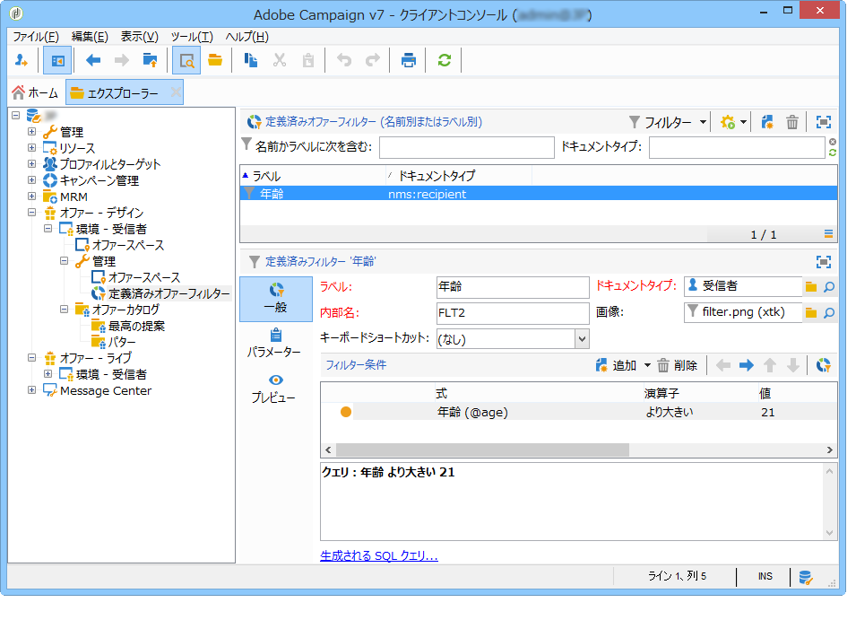
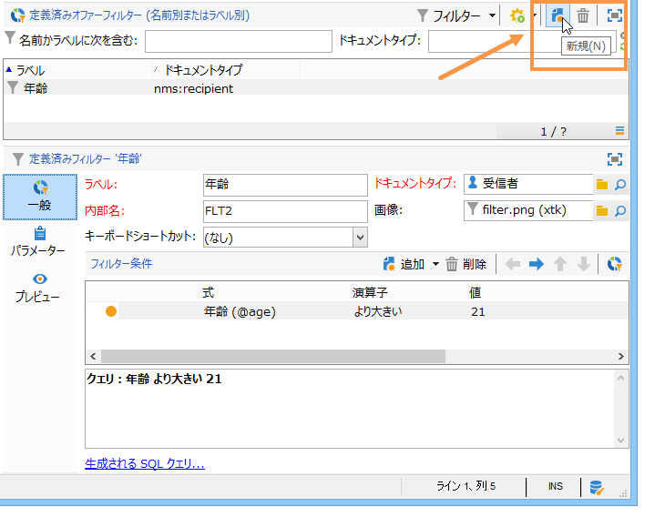
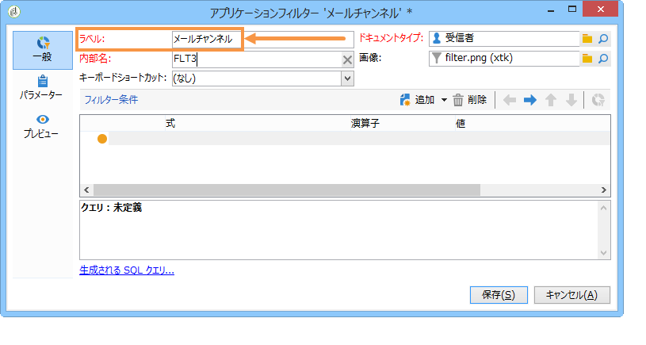
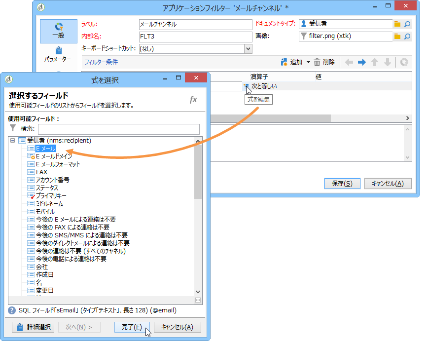
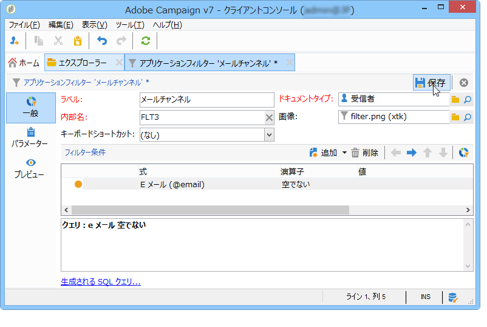
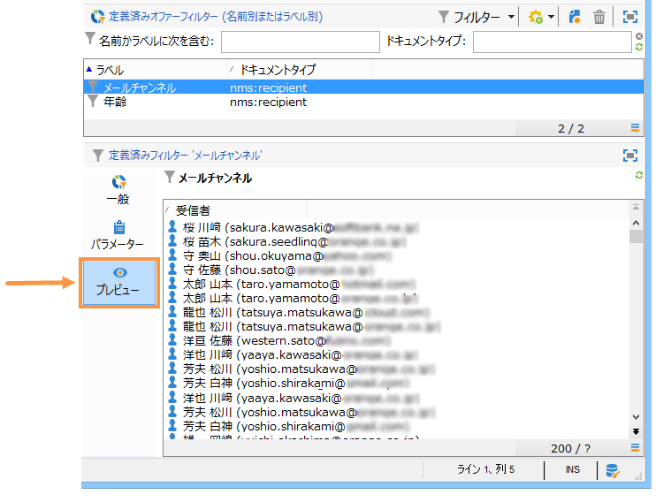

# 定義済みフィルターの作成{#creating-predefined-filters}

定義済みフィルターを使用すると、オファー作成時に再利用しやすい、ターゲット母集団用の実施要件ルールを作成できます。 定義済みフィルターは、各環境に特化し、オファーのパラメーターが考慮されます。

フィルターを作成するには、次の手順に従います。

1. **[!UICONTROL 管理]**&#x200B;フォルダーに移動して、「**[!UICONTROL 定義済みオファーフィルター]**」を選択します。

   

1. 「**[!UICONTROL 新規]**」をクリックします。

   

1. 後でフィルターを識別できるように、ラベルを変更します。

   

1. フィルター条件が関係するフィールドを選択します。

   

1. 必要に応じて演算子と値を選択して、クエリを保存します。

   

1. 「**[!UICONTROL プレビュー]**」をクリックし、フィルターの適用結果を表示します。

   
