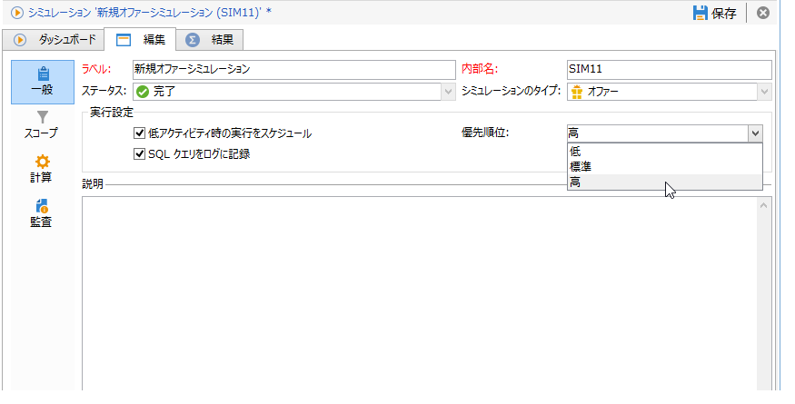

# 実行設定{#execution-settings}

シミュレーションを作成する際には、必要に応じて実行設定を指定できます。これらの設定を使用すると、優先順位に応じて負荷が小さい時間帯にシミュレーションを実行したり、SQL クエリをログに記録したりできます。このステージはオプションです。

These settings can be changed later in the **[!UICONTROL General]** tab of the simulation window.

* **[!UICONTROL Schedule execution for a time of low activity]** :では、選択した優先順位（低、平均または高）に基づいてシミュレーションをスケジュールし、Adobe Campaignのパフォーマンスを最適化できます。
* **[!UICONTROL Priority]** :これは、シミュレーションに適用されるレベルで、スケジュールを設定します。 このオプション **[!UICONTROL Schedule execution for a time of low activity]** をオンにすると、キャンペーン処理ワークフローはキャンペーンを開始するための活動が少ない時間を選択します。
* **[!UICONTROL Log SQL queries in the journal]** :この機能は、エキスパートユーザーのみを対象としています。 この機能を使用すると、SQL クエリのログを表示するタブが追加され、シミュレーションがエラーで終了した場合に不具合を探すことができます。

