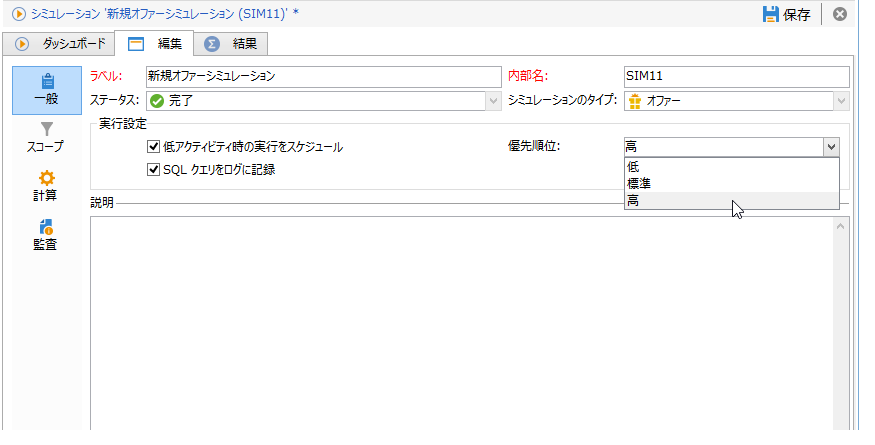

# 実行設定{#execution-settings}

シミュレーションを作成する際には、必要に応じて実行設定を指定できます。 これらの設定を使用すると、優先度に応じて負荷が小さい時間帯にシミュレーションを実行したり、SQL クエリをログに記録したりできます。 このステージはオプションです。

実行設定は、後でシミュレーションウィンドウの「**[!UICONTROL 一般]**」タブで変更できます。

* **[!UICONTROL 実行スケジュールを低アクティビティの時間に設定]**：Adobe Campaign のパフォーマンスを最適化するために、選択した優先順位（低、平均、高）に基づいてシミュレーションをスケジュールできます。
* **[!UICONTROL 優先順位]**：これは、スケジュールするシミュレーションに適用するレベルです。 「**[!UICONTROL 実行スケジュールを低アクティビティの時間に設定]**」オプションがオンになっている場合、アクティビティの少ない時間帯がキャンペーン開始時間として選択されます。
* **[!UICONTROL SQL クエリをログに記録]**：この機能は、エキスパートユーザー専用です。 この機能を使用すると、SQL クエリのログを表示するタブが追加され、シミュレーションがエラーで終了した場合に不具合を探すことができます。
