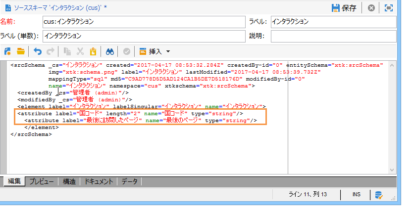
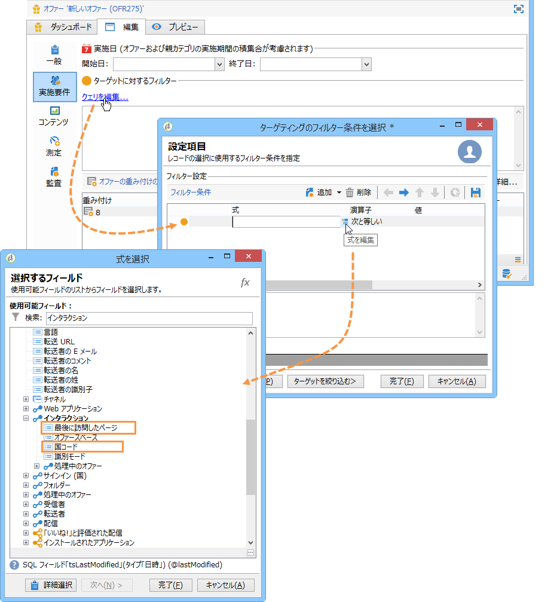

# 拡張の例{#extension-example}

インバウンドコンタクト先（コールセンターや Web サイト）の場合、一連の実施要件ルールを使用して、コンタクト先に対して最も関連度の高いオファーが提案されます。オファーの実施要件の基準をエンリッチメントさせるには、**nms:interaction** スキーマを拡張します。

* 新しいインタラクションコンテキストを追加するには、**nms:interaction** スキーマを拡張し、必要な数の **attribute** 要素をスキーマに作成します。

   次の例では、国コードと直近に閲覧したページの基準を追加しています。

   

* これで、実施要件の基準を定義する際に、以前作成した属性を利用できます。

   次の例では、ユーザーの居住国や最後に閲覧した Web ページに基づいてオファーを表示するための実施要件基準を作成しています。

   

* SOAP 呼び出しを設定する際に、**context** XML 要素を挿入し、インタラクションスキーマに追加されたコンテキスト情報を参照します。詳しくは、「SOAP（サーバー側） [を使用した統合」を参照してください](../../interaction/using/integration-via-soap--server-side-.md)。

