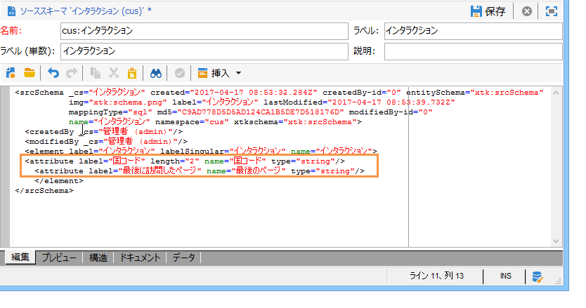
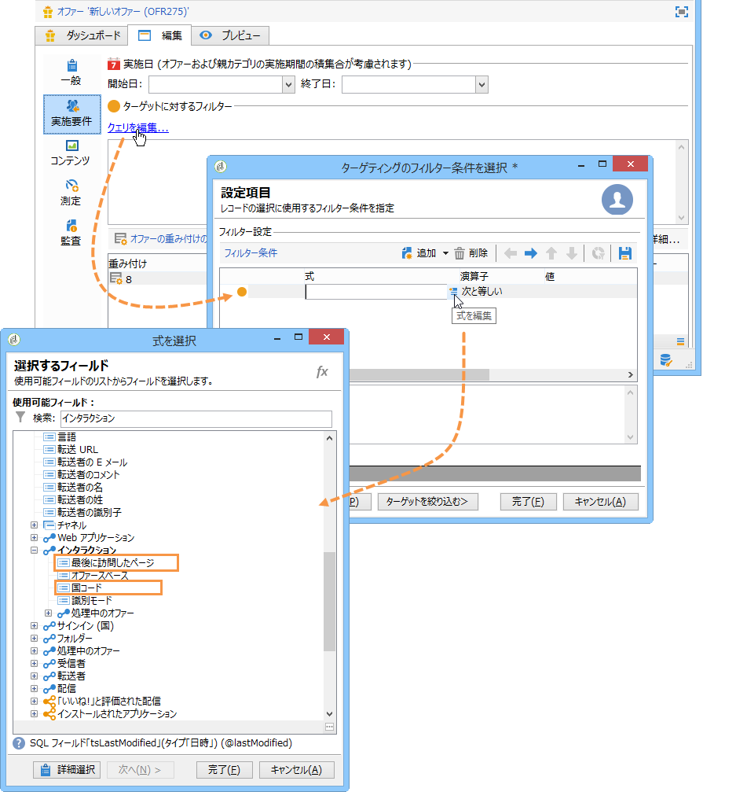

# 拡張の例{#extension-example}

インバウンドコンタクト先（コールセンターや Web サイト）の場合、一連の実施要件ルールを使用して、コンタクト先に対して最も関連度の高いオファーが提案されます。 オファーの適格性基準を強化するには、**nms:interaction** スキーマを拡張します。

* 新しいインタラクションコンテキストを追加するには、**nms:interaction** スキーマを拡張し、スキーマに必要な数の&#x200B;**属性**&#x200B;要素を作成します。

  次の例では、国コードと直近に閲覧したページの基準を追加しています。

  

* これで、実施要件の基準を定義する際に、以前作成した属性を利用できます。

  次の例では、ユーザーの居住国や最後に閲覧した Web ページに基づいてオファーを表示するための実施要件基準を作成しています。

  

* SOAP 呼び出しを設定する際に、**context** XML 要素を挿入し、インタラクションスキーマに追加されたコンテキスト情報を参照します。 詳しくは、[SOAP による統合（サーバーサイド）](../../interaction/using/integration-via-soap-server-side.md)を参照してください。
