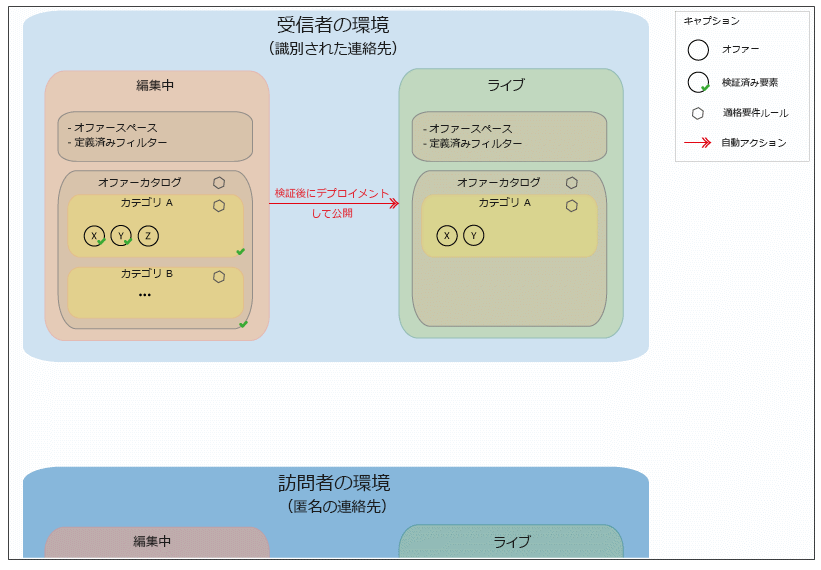
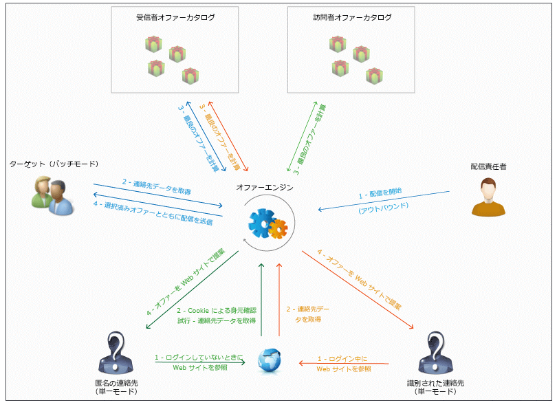

# 基本原則{#fundamental-principles}

## 環境のデプロイメント {#deploying-environments}

オファーを管理する際に使用する各ターゲティングディメンション用に、次の2つの環境があります。

* デザイン環境：オファーマネージャーは、この環境で、オファーの作成、分類、編集、承認プロセスの開始を処理して、オファーを使用できるようにします。また、各カテゴリのルール、オファーを提示できるオファースペース、オファーの実施要件の定義に使用される定義済みフィルターも、この環境で定義されます。

   カテゴリは、オンライン環境に手動でパブリッシュすることもできます。

   オファーの承認プロセスについて詳しくは、[オファーの承認と有効化](../../interaction/using/approving-and-activating-an-offer.md)の節を参照してください。

* ライブ環境：デザイン環境からの承認済みオファーに加えて、デザイン環境で設定された様々なオファースペース、フィルター、カテゴリおよびルールは、すべてこの環境にあります。オファーエンジンの呼び出し時、エンジンは常にライブ環境からのオファーを使用します。

オファーは、承認プロセスで選択されたオファースペースにのみデプロイされます。そのため、ライブ状態のオファースペースで、オファーがライブ状態であっても利用できないことがあります。

## インタラクションタイプとコンタクト方法 {#interaction-types-and-contact-methods}

インタラクションには、（コンタクト先によって開始される）インバウンドインタラクションと、（オファー作成者によって開始される）アウトバウンドインタラクションの 2 つのタイプがあります。

これら 2 つのインタラクションタイプは、（オファーが 1 つのコンタクト向けに算出される）単一モードと（オファーが複数のコンタクト向けに算出される）バッチモードのどちらでも実行できます。通常、インバウンドインタラクションは単一モードで、また、アウトバウンドインタラクションはバッチモードで実行されますが、そうでない場合もあります。例えば、トランザクションメッセージでは、アウトバウンドインタラクションが単一モードで実行されます（詳しくは、[この節](../../message-center/using/about-transactional-messaging.md)を参照）。

（実行された設定に従って）あるオファーが提示できる、または提示する必要があると、すぐにオファーエンジンが仲介者の役割を果たします。つまり、コンタクト先に関して受け取ったデータとアプリケーションで指定したとおりに適用できる様々なルールを組み合わせて、コンタクト先ごとに最適なオファーを自動的に算出します。

