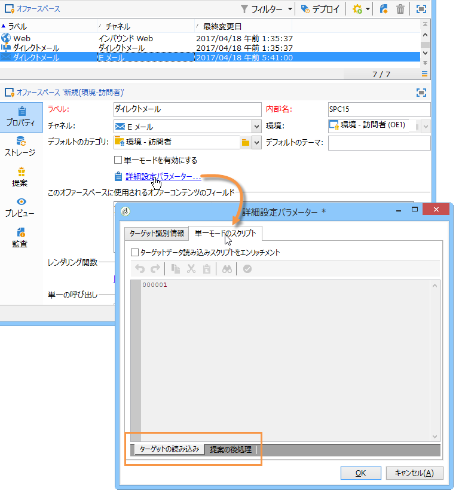

# フック{#hooks}

インタラクションのフックを使用すると、**エンジンの標準的な動作**&#x200B;を修正できます。

フッ **[!UICONTROL Target loading]** クと **[!UICONTROL Proposition post-processing]** フックは、Adobe Campaignのオファースペースで設定します。



The **[!UICONTROL Dynamic offer]** hook is configured with the offer weight in Adobe Campaign:


## ターゲットの読み込み {#target-loading}

このフックを使用すると、（標準クエリで読み込まれる）コンタクト先のプロファイルを外部システムからの追加データでエンリッチメントできます。

収集したデータは、データ呼び出しノード（インタラクションノード）に挿入します。インテグレーターは、事前に呼び出しデータスキーマを拡張し、収集データの構造を定義しておく必要があります。ユーザーは、標準の呼び出しデータと同じ方法でこのデータにアクセスできます（実施要件ルールおよびパーソナライゼーションのレベルで）。

**入力パラメーター:**

* xmlInteraction（xml型）:インタラクションノード
* aTargetId（table タイプ）：ターゲット識別子
* sUuid230（string タイプ）：uuid230 永続 Cookie の値
* sNlid（string タイプ）：nlid セッション Cookie の値

**戻りパラメーター：**

* エンリッチメントされたインタラクションノード（このフックの第 1 パラメーター）

>[!NOTE]
>
>**xmlInteraction** パラメーターには、呼び出しデータと、標準クエリで読み込まれるコンタクト先のプロファイルの両方が含まれます。

**例：**

```
// Call an external system to get additional data for the target
  var additionalData  = getUrl("https://EXTERNAL_SYSTEM?target=" + encodeURIComponent(aTargetId.join("|")));
  // Enrich the context with this data
  interaction.@additionalData = additionalData;
```

## 提案の後処理 {#proposition-post-processing-}

このフックを使用すると、所定のインタラクションで、実施条件を満たす提案の一貫性や互換性をチェックできます。また、新しいスコア付け機能や確率計算機能を定義することもできます。

一貫性ルールの使用例：

* 同じ呼び出しの、同じ製品やカテゴリにリンクされた提案の数を制限する。
* 同じインタラクションでは、1 つの製品に関連したオファーのみを提示する。

後処理は、タイポロジルールの適用と実施要件による提案の並べ替えの後、優先順位付けステップの前に実行されます。

**入力パラメーター:**

* aProposition：実施要件を満たす提案のテーブル。次に、このテーブルに含まれる要素の構造の例を示します。

   ```
   { offer_id:1234,
     weight:2}
   ```

* dicOffer（xml タイプ）：実施要件を満たすオファーのすべての属性（オファーコード、カテゴリ ID、カテゴリの完全な名前、開始日、終了日、ラベル、内部名、オファー ID、追加のオファーフィールド）を含んだ辞書。次に例を示します。

   ```
   { "1242": <offer category-id="61242" categoryFullName="/FULL/PATH/TO/CATEGORY/" code="CODE" endDate="" id="62473" label="LABEL" name="OFR38_OE4" product-id="43" startDate=""/>,
     "1243": ...}
   ```

* xmlTarget（xml タイプ）：プロファイルデータノード
* xmlInteraction（xml タイプ）：呼び出しデータノード
* iPropNumber（integer タイプ）：期待されるオファーの数

**戻りパラメーター：**

* 修正された提案のリスト（このフックの第 1 パラメーター）
* 修正されたインタラクションノード

**例：**

```
var aReturnedProps = [];

if( aProposition.length > 0 )
{
  var iReturnedProps = 0;
  for( var iPropIdx = 0; iPropIdx < aProposition.length && iReturnedProps < iPropNumber; iPropIdx ++ )
  {
    // Check a consistency rule for instance
    if( true )
    {
      aReturnedProps.push(aProposition[iPropIdx]);
      iReturnedProps++;
    }
  }
}

return aReturnedProps;
```

## ダイナミックオファー {#dynamic-offer}

このフックを使用すると、外部のエンジンを呼び出して、オファーにリンクされた製品のリストを選択できます。オファーの実施要件ルールの後、タイポロジルールの適用の前に設定されます。

インテグレーターは、事前に提案の **PropositionRcp** スキーマを製品に関する追加情報で拡張しておく必要があります。To specify where this data will be stored, a **[!UICONTROL Proposition being processed]** link is available in the **[!UICONTROL Storage]** tab of the space


**入力パラメーター:**

* xmlOffer（xml タイプ）：オファー（オファーコード、カテゴリ ID、カテゴリの完全な名前、開始日、終了日、ラベル、内部名、オファー ID、追加のオファーフィールド）
* dWeight：コンテキストの重み付け（double タイプ）
* xmlTarget（xml タイプ）：プロファイルデータノード
* xmlInteraction（xml タイプ）：呼び出しデータノード

**戻りパラメーター：**

生成する提案のテーブルが返されます。このテーブルの各要素は、次の情報で構成されます。

* オファー識別子
* 追加の製品データ（例：製品コード）
* 重み付け

>[!NOTE]
>
>入力パラメーターと戻りパラメーターのオファー ID が同じであるかどうかが、システムによってチェックされます。

**例：**

```
var product = getUrl("https://EXTERNAL_SYSTEM?offerCode=" + encodeURIComponent(xmlOffer.@code));
if( product )
  return [{offer_id: parseInt(String(xmlOffer.@id)), weight: dWeight, productId: product}];
```

