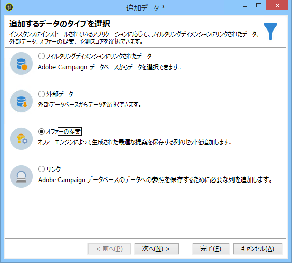
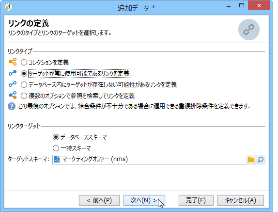
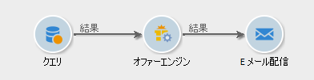

# ワークフローモード{#integrating-an-offer-via-a-workflow}

配信アクティビティ自体を除く、いくつかのワークフローアクティビティを使用すると、オファーの提示方法を定義できます。

* 配信の概要
* エンリッチメント
* オファーエンジン
* オファー（セル別）

## 配信の概要 {#delivery-outline}

キャンペーンワークフローで使用可能な配信の概要アクティビティでは、現在進行中のキャンペーンの配信の概要で参照されているオファーを提示できます。

1. ワークフローで、配信アクティビティを追加する前に、配信の概要アクティビティを追加します。
1. 配信の概要アクティビティで、使用する概要を指定します。

   配信の概要の指定方法について詳しくは、[キャンペーン - MRM](../../campaign/using/marketing-campaign-deliveries.md#associating-and-structuring-resources-linked-via-a-delivery-outline)ガイドを参照してください。

1. 配信に従って、使用可能なフィールドに入力します。
1. 次の 2 つの場合が考えられます。

   * オファーエンジンを呼び出す場合は、ボックスをオンにし **[!UICONTROL Restrict the number of propositions selected]** ます。 オファースペースを指定し、配信で提示される提案の数を設定します。

      オファーエンジンによって、オファーの重み付けと実施要件ルールが考慮されます。

   * このボックスをオフにすると、オファーエンジンを呼び出すことなく、配信の概要のすべてのオファーが提示されます。
   >[!NOTE]
   >
   >プレビューでは、配信で指定されたオファーの数が考慮されます。ワークフローを実行する際に考慮されるのは、配信の概要で指定されたオファーの数です。

   

## エンリッチメント {#enrichment}

エンリッチメントアクティビティを使用すると、配信の受信者へのオファーに、オファーやリンクを追加できます。

>[!NOTE]
>
>エンリッチメントアクティビティについて詳しくは、[ワークフローガイド](../../workflow/using/enrichment.md)の専用のドキュメントを参照してください。

例えば、配信の前に受信者クエリ用のデータをエンリッチメントできます。

オファー提案を指定するには、2 つの方法があります。

* オファーまたはオファーエンジンの呼び出しを指定する。
* オファーへのリンクを参照する。

### オファーまたはオファーエンジン呼び出しの指定 {#specifying-an-offer-or-a-call-to-the-offer-engine}

After configuring your query (refer to the [Workflows guide](../../workflow/using/query.md)):

1. エンリッチメントアクティビティを追加し、開きます。
1. タブで、を **[!UICONTROL Enrichment]** 選択します **[!UICONTROL Add data]**。
1. 追加す **[!UICONTROL An offer proposition]** るデータのタイプを選択します。

   

1. 追加される提案の識別子とラベルを指定します。
1. オファーの選択を指定します。これには、次の 2 つのオプションを使用できます。

   * **[!UICONTROL Search for the best offer in a category]** :このオプションを選択し、オファーエンジン呼び出しパラメーター（オファースペース、カテゴリまたはテーマ、連絡日、保持するオファー数）を指定します。 エンジンは、これらのパラメーターに基づいて、追加するオファーを自動的に計算します。We recommend completing either the **[!UICONTROL Category]** or the **[!UICONTROL Theme]** field, rather than both at the same time.

      

   * **[!UICONTROL A predefined offer]** :このオプションを選択し、オファースペース、特定のオファーおよび連絡日を指定して、オファーエンジンを呼び出さずに、追加するオファーを直接設定します。

      

1. 次に、選択したチャネルに対応する配信アクティビティを設定します。詳しくは、「オファー提案の配信へ [の挿入」の節を参照してください](../../interaction/using/integrating-an-offer-via-the-wizard.md#inserting-an-offer-proposition-into-a-delivery) 。

   >[!NOTE]
   >
   >プレビュー可能な提案の数は、配信で直接実行された設定ではなく、エンリッチメントアクティビティで実行された設定によって決まります。

### オファーへのリンクの参照 {#referencing-a-link-to-an-offer}

エンリッチメントアクティビティでは、オファーへのリンクを参照することもできます。

それには、次の手順に従います。

1. アクテ **[!UICONTROL Add data]** ィビティのタブでを選択 **[!UICONTROL Enrichment]** します。
1. In the window where you choose the type of data to add, select **[!UICONTROL A link]**.
1. 設定するリンクのタイプとターゲットを選択します。この場合、ターゲットはオファースキーマです。

   

1. エンリッチメントアクティビティのインバウンドテーブルデータ（ここでは受信者テーブル）とオファーテーブルとの結合を指定します。例えば、オファーコードを受信者にリンクできます。

   

1. 次に、選択したチャネルに対応する配信アクティビティを設定します。詳しくは、「オファー提案の配信へ [の挿入」の節を参照してください](../../interaction/using/integrating-an-offer-via-the-wizard.md#inserting-an-offer-proposition-into-a-delivery) 。

   >[!NOTE]
   >
   >プレビュー可能な提案の数は、配信で実行された設定によって決まります。

### オファーのランク付けと重み付けの格納 {#storing-offer-rankings-and-weights}

デフォルトでは、オファーの配信に「**エンリッチメント**」アクティビティを使用すると、オファーのランク付けと重み付けが提案テーブルに格納されません。

>[!NOTE]
>
>注意：アクティビティ **[!UICONTROL Offer engine]** では、デフォルトでこの情報が保存されます。

次の方法でこの情報を保存することができます。

1. エンリッチメントアクティビティ内で、クエリの後、配信アクティビティの前に、オファーエンジンの呼び出しを作成します。「オファーの指 [定」または「オファーエンジンの呼び出し](../../interaction/using/integrating-an-offer-via-a-workflow.md#specifying-an-offer-or-a-call-to-the-offer-engine) 」を参照してください。
1. アクティビティのメインウィンドウで、を選択しま **[!UICONTROL Edit additional data...]**&#x200B;す。

   

1. Add the **[!UICONTROL @rank]** columns for the ranking and **[!UICONTROL @weight]** for the offer weight.

   

1. 追加を確認し、ワークフローを保存します。

これで、オファーのランキングと重み付けが自動的に格納されるようになります。This information is visible in the delivery&#39;s **[!UICONTROL Offers]** tab.

## オファーエンジン {#offer-engine}

The **[!UICONTROL Offer engine]** activity also lets you specify a call to the offer engine prior to the delivery.

このアクティビティは、エンリッチメントアクティビティと同じ原則でエンジン呼び出しによって作動します。つまり、配信の前に、インバウンド母集団のデータを、エンジンによって自動生成されたオファーでエンリッチメントします。

After configuring your query (refer to the [Workflows guide](../../workflow/using/query.md)):

1. Add and open an **[!UICONTROL Offer engine]** activity.
1. 使用可能な各種フィールドに入力して、オファーエンジンパラメーター（オファースペース、カテゴリまたはテーマ、コンタクト日、保持するオファー数）への呼び出しを指定します。エンジンは、これらのパラメーターに基づいて、追加するオファーを自動的に計算します。

   >[!NOTE]
   >
   >警告：このアクティビティを使用する場合、配信に使用されたオファーの提案のみが格納されます。

   

1. 次に、選択したチャネルに対応する配信アクティビティを設定します。詳しくは、「オファー提案の配信へ [の挿入」の節を参照してください](../../interaction/using/integrating-an-offer-via-the-wizard.md#inserting-an-offer-proposition-into-a-delivery) 。

## オファー（セル別） {#offers-by-cell}

The **[!UICONTROL Offers by cell]** activity lets you distribute the inbound population (from a query for example) into several segments and to specify an offer to present for each of these segments.

それには、次の手順に従います。

1. Add the **[!UICONTROL Offers by cell]** activity once you have specified the target population, then open it.
1. In the **[!UICONTROL General]** tab, select the offer space on which you want to present the offers.
1. In the **[!UICONTROL Cells]** tab, specify the different sub-sets using the **[!UICONTROL Add]** button:

   * 適用可能なフィルタリングおよび制限ルールを使用して、サブセットの母集団を指定します。
   * サブセットに提示するオファーを選択します。利用できるオファーは、前の手順で選択したオファー環境で実施要件を満たすオファーです。

      

1. 次に、選択したチャネルに対応する配信アクティビティを設定します。詳しくは、「オファー提案の配信へ [の挿入」の節を参照してください](../../interaction/using/integrating-an-offer-via-the-wizard.md#inserting-an-offer-proposition-into-a-delivery) 。

