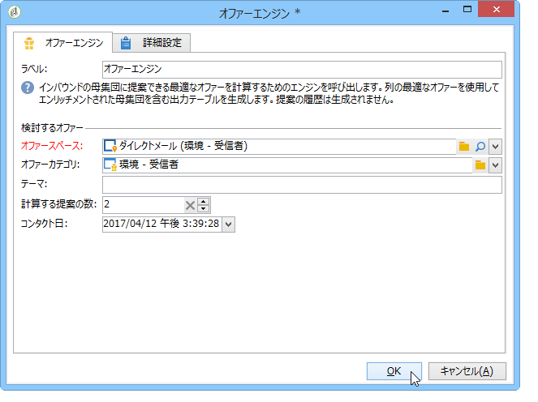
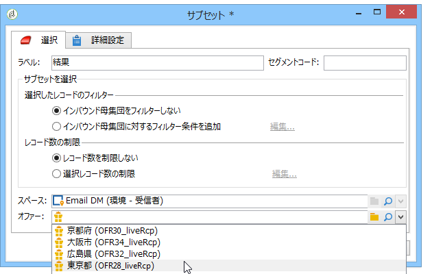

# ワークフローモード{#integrating-an-offer-via-a-workflow}

配信アクティビティ自体を除く、いくつかのワークフローアクティビティを使用すると、オファーの提示方法を定義できます。

* 配信の概要
* エンリッチメント
* オファーエンジン
* オファー（セル別）

## 配信の概要 {#delivery-outline}

キャンペーンワークフローで使用可能な配信の概要アクティビティでは、現在進行中のキャンペーンの配信の概要で参照されているオファーを提示できます。

1. ワークフローで、配信アクティビティを追加する前に、配信の概要アクティビティを追加します。
1. 配信の概要アクティビティで、使用する概要を指定します。

   配信の概要の指定方法について詳しくは、[キャンペーン - MRM](../../campaign/using/marketing-campaign-deliveries.md#associating-and-structuring-resources-linked-via-a-delivery-outline)ガイドを参照してください。

1. 配信に従って、使用可能なフィールドに入力します。
1. 次の 2 つの場合が考えられます。

   * オファーエンジンを呼び出す場合は、「**[!UICONTROL 選択する提案数を制限]**」ボックスをオンにします。オファースペースを指定し、配信で提示される提案の数を設定します。

      オファーエンジンによって、オファーの重み付けと実施要件ルールが考慮されます。

   * このボックスをオフにすると、オファーエンジンを呼び出すことなく、配信の概要のすべてのオファーが提示されます。
   >[!NOTE]
   >
   >プレビューでは、配信で指定されたオファーの数が考慮されます。ワークフローを実行する際に考慮されるのは、配信の概要で指定されたオファーの数です。

   

## エンリッチメント {#enrichment}

エンリッチメントアクティビティを使用すると、配信の受信者へのオファーに、オファーやリンクを追加できます。

>[!NOTE]
>
>エンリッチメントアクティビティについて詳しくは、[ワークフローガイド](../../workflow/using/enrichment.md)の専用のドキュメントを参照してください。

例えば、配信の前に受信者クエリ用のデータをエンリッチメントできます。

オファー提案を指定するには、2 つの方法があります。

* オファーまたはオファーエンジンの呼び出しを指定する。
* オファーへのリンクを参照する。

### オファーまたはオファーエンジン呼び出しの指定 {#specifying-an-offer-or-a-call-to-the-offer-engine}

クエリを設定（[ワークフローガイド](../../workflow/using/query.md)を参照）してから、次の手順に従います。

1. エンリッチメントアクティビティを追加し、開きます。
1. 「**[!UICONTROL エンリッチメント]**」タブで、「**[!UICONTROL データを追加]**」を選択します。
1. 追加するデータタイプで「**[!UICONTROL オファーの提案]**」を選択します。

   

1. 追加される提案の識別子とラベルを指定します。
1. オファーの選択を指定します。これには、次の 2 つのオプションを使用できます。

   * **[!UICONTROL カテゴリ内で最適なオファーを検索]**：このオプションをオンにして、オファーエンジン呼び出しパラメーター（オファースペース、カテゴリまたはテーマ、コンタクト日、保持するオファーの数）を指定します。エンジンは、これらのパラメーターに基づいて、追加するオファーを自動的に計算します。「**[!UICONTROL カテゴリ]**」フィールドと「**[!UICONTROL テーマ]**」フィールドは、両方同時には使用せず、どちらか一方のみ入力することをお勧めします。

      

   * **[!UICONTROL 事前定義済みオファー]**：このオプションをオンにして、オファースペース、特定のオファーおよびコンタクト日を指定し、オファーエンジンを呼び出すことなく、追加するオファーを直接設定します。

      

1. 次に、選択したチャネルに対応する配信アクティビティを設定します。詳しくは、[配信へのオファー提案の挿入](../../interaction/using/integrating-an-offer-via-the-wizard.md#inserting-an-offer-proposition-into-a-delivery)の節を参照してください。

   >[!NOTE]
   >
   >プレビュー可能な提案の数は、配信で直接実行された設定ではなく、エンリッチメントアクティビティで実行された設定によって決まります。

### オファーへのリンクの参照 {#referencing-a-link-to-an-offer}

エンリッチメントアクティビティでは、オファーへのリンクを参照することもできます。

それには、次の手順に従います。

1. アクティビティの「**[!UICONTROL エンリッチメント]**」タブで「**[!UICONTROL データを追加]**」を選択します。
1. 追加するデータのタイプを選択するウィンドウで、「**[!UICONTROL リンク]**」を選択します。
1. 設定するリンクのタイプとターゲットを選択します。この場合、ターゲットはオファースキーマです。

   

1. エンリッチメントアクティビティのインバウンドテーブルデータ（ここでは受信者テーブル）とオファーテーブルとの結合を指定します。例えば、オファーコードを受信者にリンクできます。

   

1. 次に、選択したチャネルに対応する配信アクティビティを設定します。詳しくは、[配信へのオファー提案の挿入](../../interaction/using/integrating-an-offer-via-the-wizard.md#inserting-an-offer-proposition-into-a-delivery)の節を参照してください。

   >[!NOTE]
   >
   >プレビュー可能な提案の数は、配信で実行された設定によって決まります。

### オファーのランク付けと重み付けの格納 {#storing-offer-rankings-and-weights}

デフォルトでは、オファーの配信に「**エンリッチメント**」アクティビティを使用すると、オファーのランク付けと重み付けが提案テーブルに格納されません。

>[!NOTE]
>
>注意：「**[!UICONTROL オファーエンジン]**」アクティビティは、デフォルトではこの情報を格納しませんが、

次の方法でこの情報を保存することができます。

1. エンリッチメントアクティビティ内で、クエリの後、配信アクティビティの前に、オファーエンジンの呼び出しを作成します。[オファーまたはオファーエンジン呼び出しの指定](../../interaction/using/integrating-an-offer-via-a-workflow.md#specifying-an-offer-or-a-call-to-the-offer-engine)の節を参照してください。
1. アクティビティのメインウィンドウで「**[!UICONTROL 追加データを編集...]**」を選択します。

   

1. ランキング用に「**[!UICONTROL @rank]**」列を追加し、オファーの重み付け用に「**[!UICONTROL @weight]**」列を追加します。

   

1. 追加を確認し、ワークフローを保存します。

これで、オファーのランキングと重み付けが自動的に格納されるようになります。この情報は、配信の「**[!UICONTROL オファー]**」タブに表示されます。

## オファーエンジン {#offer-engine}

「**[!UICONTROL オファーエンジン]**」アクティビティも、配信の前にオファーエンジンの呼び出しを指定できます。

このアクティビティは、エンリッチメントアクティビティと同じ原則でエンジン呼び出しによって作動します。つまり、配信の前に、インバウンド母集団のデータを、エンジンによって自動生成されたオファーでエンリッチメントします。

クエリを設定（[ワークフローガイド](../../workflow/using/query.md)を参照）してから、次の手順に従います。

1. 「**[!UICONTROL オファーエンジン]**」アクティビティを追加し、開きます。
1. 使用可能な各種フィールドに入力して、オファーエンジンパラメーター（オファースペース、カテゴリまたはテーマ、コンタクト日、保持するオファー数）への呼び出しを指定します。エンジンは、これらのパラメーターに基づいて、追加するオファーを自動的に計算します。

   >[!NOTE]
   >
   >警告：このアクティビティを使用する場合、配信に使用されたオファーの提案のみが格納されます。

   

1. 次に、選択したチャネルに対応する配信アクティビティを設定します。詳しくは、[配信へのオファー提案の挿入](../../interaction/using/integrating-an-offer-via-the-wizard.md#inserting-an-offer-proposition-into-a-delivery)の節を参照してください。

## オファー（セル別） {#offers-by-cell}

「**[!UICONTROL オファー（セル別）]**」アクティビティでは、インバウンド母集団（例：クエリから）を複数のセグメントに分散させ、それらの各セグメントに提示するオファーを指定できます。

それには、次の手順に従います。

1. ターゲットの母集団を指定したら、「**[!UICONTROL オファー（セル別）]**」アクティビティを追加して、それを開きます。
1. 「**[!UICONTROL 一般]**」タブで、オファーを提示するオファースペースを選択します。
1. 「**[!UICONTROL セル]**」タブで「**[!UICONTROL 追加]**」ボタンをクリックして、別のサブセットを指定します。

   * 適用可能なフィルタリングおよび制限ルールを使用して、サブセットの母集団を指定します。
   * サブセットに提示するオファーを選択します。利用できるオファーは、前の手順で選択したオファー環境で実施要件を満たすオファーです。

      

1. 次に、選択したチャネルに対応する配信アクティビティを設定します。詳しくは、[配信へのオファー提案の挿入](../../interaction/using/integrating-an-offer-via-the-wizard.md#inserting-an-offer-proposition-into-a-delivery)の節を参照してください。

