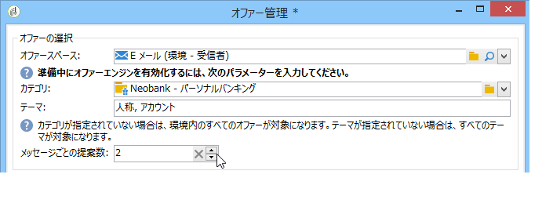

# ウィザードモード{#integrating-an-offer-via-the-wizard}

配信を作成する際に、次の 2 つの方法でオファーを統合できます。

* 最新の本文からオファーエンジンを呼び出す。
* キャンペーンの配信の概要を使用してオファーを参照する。この方法は、印刷物ベースのキャンペーンでよく使用されます。

## オファーエンジンの呼び出しによる配信 {#delivering-with-a-call-to-the-offer-engine}

マーケティングキャンペーン中にオファーを提示するには、選択したチャネルに基づいて、単に従来型の配信アクションを作成します。配信コンテンツを定義する際に、ツールバーにある&#x200B;**[!UICONTROL オファー]**&#x200B;アイコンをクリックすると、オファーエンジンが呼び出されます。

配信およびマーケティングキャンペーンについて詳しくは、[配信](../../delivery/using/about-direct-mail-channel.md)および[キャンペーン](../../campaign/using/setting-up-marketing-campaigns.md)を参照してください。

### オファーを配信に挿入する主な手順 {#main-steps-for-inserting-an-offer-into-a-delivery}

オファーの提案を配信に挿入するには、次の手順に従います。

1. 配信ウィンドウで、オファーアイコンをクリックします。

   

1. オファー環境に合致するスペースを選択します。

   

1. エンジンによるオファー選択を調整するには、提示するオファーが含まれるカテゴリを選択するか、1 つまたは複数のテーマを選択します。制限のオーバーロードを避けるために、これらのフィールドは一度に 1 つのみ使用することをお勧めします。

   

   

1. 配信の本文に挿入するオファーの数を指定します。

   

1. 必要に応じて、「**[!UICONTROL 不適格な受信者を除外]**」オプションを選択します。詳しくは、[オファーエンジン呼び出しのパラメーター](#parameters-for-calling-offer-engine)を参照してください。

   

1. 必要に応じて、「**[!UICONTROL オファーが選択されていない場合は表示しない]**」オプションを選択します。詳しくは、[オファーエンジン呼び出しのパラメーター](#parameters-for-calling-offer-engine)を参照してください。

   

1. 結合フィールドを使用して、プロパティを配信コンテンツに挿入します。使用可能な提案の数は、エンジンの呼び出しがどのように設定されているかによって異なります。また、提案の順序は、オファーの優先順位によって異なります。

   

1. コンテンツを完成させて、通常どおりに配信を送信します。

   

### オファーエンジン呼び出しのパラメーター {#parameters-for-calling-offer-engine}

* **[!UICONTROL スペース]**：オファーエンジンを有効化するために選択する必要がある、オファー環境のスペース。
* **[!UICONTROL カテゴリ]**：オファーが分類される特定のフォルダー。カテゴリが指定されてない場合、テーマが選択されていない限り、その環境に含まれるすべてのオファーがオファーエンジンによって考慮されます。
* **[!UICONTROL テーマ]**：カテゴリの上流で定義されたキーワード。これらはフィルターとして機能し、カテゴリのセットで選択することで、提示されるオファーの数を調整できます。
* **[!UICONTROL 提案数]**：エンジンによって返される、配信の本文に挿入可能なオファーの数。メッセージに挿入されなくても、オファーは生成されますが、提示はされません。
* **[!UICONTROL 不適格な受信者を除外]**：このオプションを使用すると、オファーの実施要件を満たさない受信者の除外を有効または無効にすることができます。実施要件を満たす提案の数は、リクエストされた提案数よりも少ないことがあります。このボックスをオンにすると、十分な提案が揃わない受信者が配信から除外されます。オフにすると、そのような受信者は、除外はされませんが、リクエストされた数の提案を受け取ることはできません。
* **[!UICONTROL オファーが選択されていない場合は表示しない]**：このオプションを使用すると、提案の 1 つが存在しない場合に、どのようにメッセージを処理するかを選択できます。このボックスをオンにすると、見つからない提案の表示域が表示されず、その提案に関するコンテンツは、メッセージに表示されません。このボックスをオフにすると、送信中にメッセージ自体がキャンセルされ、受信者は、すべてのメッセージを受信しなくなります。

### 配信へのオファー提案の挿入 {#inserting-an-offer-proposition-into-a-delivery}

提示するオファーの表示域は、結合フィールドを使用して配信の本文に挿入されます。提案の数は、オファーエンジン呼び出しのパラメーターで定義されます。

配信は、オファーのフィールドまたは（E メールの場合は）レンダリング関数を使用してパーソナライズできます。

## 配信の概要を使用した配信 {#delivering-with-delivery-outlines}

配信の概要を使用して配信にオファーを提示することもできます。

配信の概要について詳しくは、[キャンペーン - MRM](../../campaign/using/marketing-campaign-deliveries.md#associating-and-structuring-resources-linked-via-a-delivery-outline) ガイドを参照してください。

1. 新規キャンペーンを作成するか、既存のキャンペーンにアクセスします。
1. キャンペーンの&#x200B;**[!UICONTROL 編集]**／「**[!UICONTROL ドキュメント]**」タブから、配信の概要にアクセスします。
1. 概要を追加してから、その概要を右クリックして、**[!UICONTROL 新規]**／**[!UICONTROL オファー]**&#x200B;を選択して、目的の数のオファーを挿入します。次に、キャンペーンを保存します。

   

1. 配信の概要へのアクセス権がある配信を作成します（例：ダイレクトメール配信）。
1. 配信の編集時に、「**[!UICONTROL 配信の概要を選択]**」をクリックします。

   >[!NOTE]
   >
   >（E メール配信の場合など）配信のタイプによっては、このオプションは、**[!UICONTROL プロパティ]**／**[!UICONTROL 詳細設定]**&#x200B;メニューにあります。

   

1. **[!UICONTROL オファー]**&#x200B;ボタンを使用すると、オファースペースに加えて、配信で提示するオファーの数を設定できます。

   

1. パーソナライゼーションフィールドを使用する（詳しくは、[配信へのオファー提案の挿入](#inserting-an-offer-proposition-into-a-delivery)の節を参照）か、（ダイレクトメール配信の場合は）抽出ファイルフォーマットを編集して、配信の本文に提案を追加します。

   提案は、配信の概要で参照しているオファーから選択されます。

   >[!NOTE]
   >
   >オファーが配信で直接生成される場合、オファーランキングと重み付けに関する情報は、提案テーブルにのみ保存されます。

