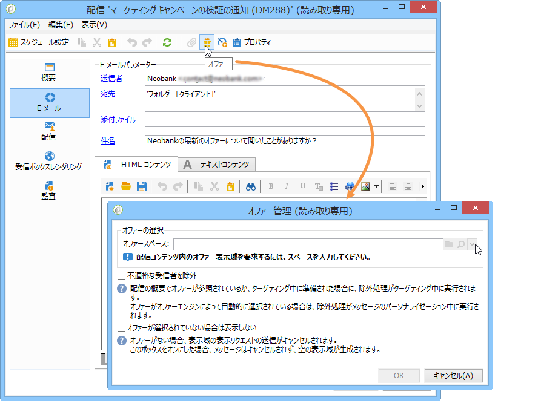
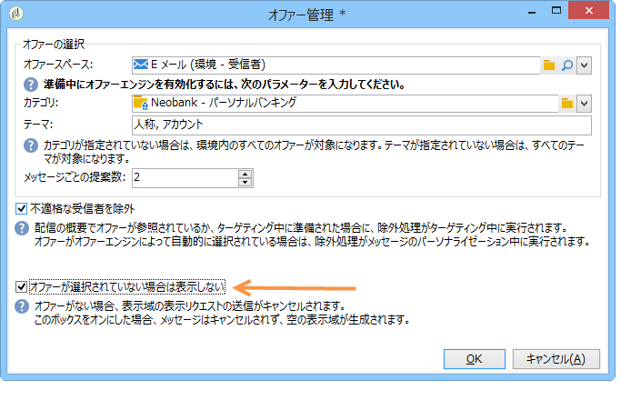

# ウィザードモード{#integrating-an-offer-via-the-wizard}

配信を作成する際に、次の 2 つの方法でオファーを統合できます。

* 最新の本文からオファーエンジンを呼び出す。
* キャンペーンの配信の概要を使用してオファーを参照する。この方法は、印刷物ベースのキャンペーンでよく使用されます。

## オファーエンジンの呼び出しによる配信 {#delivering-with-a-call-to-the-offer-engine}

マーケティングキャンペーン中にオファーを提示するには、選択したチャネルに基づいて、単に従来型の配信アクションを作成します。The offer engine is called up when the delivery content is defined, by clicking the **[!UICONTROL Offers]** icon available in the toolbar.

配信およびマーケティングキャンペーンについて詳しくは、[配信](../../delivery/using/about-direct-mail-channel.md)および[キャンペーン](../../campaign/using/setting-up-marketing-campaigns.md)を参照してください。

### オファーを配信に挿入する主な手順 {#main-steps-for-inserting-an-offer-into-a-delivery}

オファーの提案を配信に挿入するには、次の手順に従います。

1. 配信ウィンドウで、オファーアイコンをクリックします。

   

1. オファー環境に合致するスペースを選択します。

   

1. エンジンによるオファー選択を調整するには、提示するオファーが含まれるカテゴリを選択するか、1 つまたは複数のテーマを選択します。制限のオーバーロードを避けるために、これらのフィールドは一度に 1 つのみ使用することをお勧めします。

   

   

1. 配信の本文に挿入するオファーの数を指定します。

   

1. 必要に応じて、こ **[!UICONTROL Exclude non-eligible recipients]** のオプションを選択します。 詳しくは、「オファーエンジンを呼び出すた [めのパラメーター」を参照してくださ](#parameters-for-calling-offer-engine)い。

   

1. 必要に応じて、このオプションを選 **[!UICONTROL Do not display anything if no offers are selected]** 択します。 詳しくは、「オファーエンジンを呼び出すた [めのパラメーター」を参照してくださ](#parameters-for-calling-offer-engine)い。

   

1. 結合フィールドを使用して、プロパティを配信コンテンツに挿入します。使用可能な提案の数は、エンジンの呼び出しがどのように設定されているかによって異なります。また、提案の順序は、オファーの優先順位によって異なります。

   

1. コンテンツを完成させて、通常どおりに配信を送信します。

   

### オファーエンジン呼び出しのパラメーター {#parameters-for-calling-offer-engine}

* **[!UICONTROL Space]** :オファーエンジンをアクティブ化するために選択する必要があるオファー環境のスペース。
* **[!UICONTROL Category]** :オファーを並べ替える特定のフォルダー。 カテゴリが指定されてない場合、テーマが選択されていない限り、その環境に含まれるすべてのオファーがオファーエンジンによって考慮されます。
* **[!UICONTROL Themes]** :カテゴリの上流で定義されたキーワード。 これらはフィルターとして機能し、カテゴリのセットで選択することで、提示されるオファーの数を調整できます。
* **[!UICONTROL Number of propositions]** :エンジンから返され、配信本体に挿入できるオファーの数。 メッセージに挿入されなくても、オファーは生成されますが、提示はされません。
* **[!UICONTROL Exclude non-eligible recipients]** :このオプションを使用すると、十分な資格のない受信者の除外をアクティブ化または非アクティブ化できます。 実施要件を満たす提案の数は、リクエストされた提案数よりも少ないことがあります。このボックスをオンにすると、十分な提案が揃わない受信者が配信から除外されます。オフにすると、そのような受信者は、除外はされませんが、リクエストされた数の提案を受け取ることはできません。
* **[!UICONTROL Do not display anything if no offer is selected]** :このオプションを使用すると、提案の1つが存在しない場合にメッセージを処理する方法を選択できます。 このボックスをオンにすると、見つからない提案の表示域が表示されず、その提案に関するコンテンツは、メッセージに表示されません。このボックスをオフにすると、送信中にメッセージ自体がキャンセルされ、受信者は、すべてのメッセージを受信しなくなります。

### 配信へのオファー提案の挿入 {#inserting-an-offer-proposition-into-a-delivery}

提示するオファーの表示域は、結合フィールドを使用して配信の本文に挿入されます。提案の数は、オファーエンジン呼び出しのパラメーターで定義されます。

配信は、オファーのフィールドまたは（E メールの場合は）レンダリング関数を使用してパーソナライズできます。

## 配信の概要を使用した配信 {#delivering-with-delivery-outlines}

配信の概要を使用して配信にオファーを提示することもできます。

配信の概要について詳しくは、[キャンペーン - MRM](../../campaign/using/marketing-campaign-deliveries.md#associating-and-structuring-resources-linked-via-a-delivery-outline) ガイドを参照してください。

1. 新規キャンペーンを作成するか、既存のキャンペーンにアクセスします。
1. Access the delivery outlines via the campaign&#39;s **[!UICONTROL Edit]** > **[!UICONTROL Documents]** tab.
1. Add an outline then insert as many offers as you like into it by right-clicking on the outline and selecting **[!UICONTROL New]** > **[!UICONTROL Offer]**, then save the campaign.

   

1. 配信の概要へのアクセス権がある配信を作成します（例：ダイレクトメール配信）。
1. 配信を編集する際に、をクリックしま **[!UICONTROL Select a delivery outline]**&#x200B;す。

   >[!NOTE]
   >
   >Depending on the type of delivery, this option can be found in the **[!UICONTROL Properties]** > **[!UICONTROL Advanced]** menu (for email deliveries for example).

   

1. Using the **[!UICONTROL Offers]** button, you can then configure the offer space as well as the number of offers to present in the delivery.

   

1. Add the propositions into the delivery body using the personalization fields (for more on this, refer to the [Inserting an offer proposition into a delivery](#inserting-an-offer-proposition-into-a-delivery) section), or in the case of a direct mail delivery, by editing the extraction file format.

   提案は、配信の概要で参照しているオファーから選択されます。

   >[!NOTE]
   >
   >オファーが配信で直接生成される場合、オファーランキングと重み付けに関する情報は、提案テーブルにのみ保存されます。

