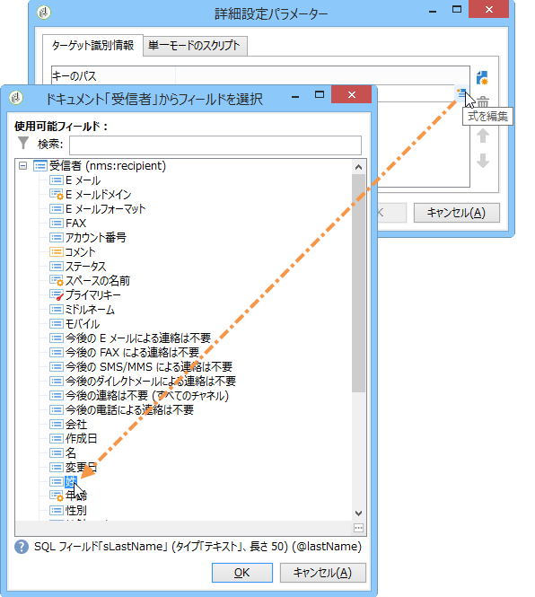
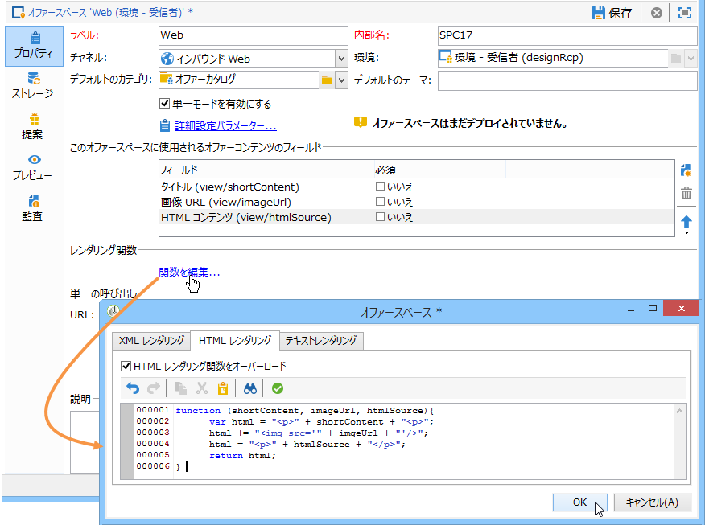
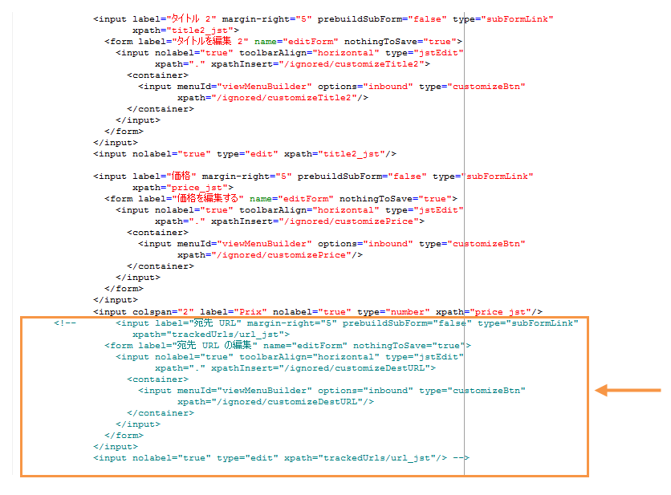
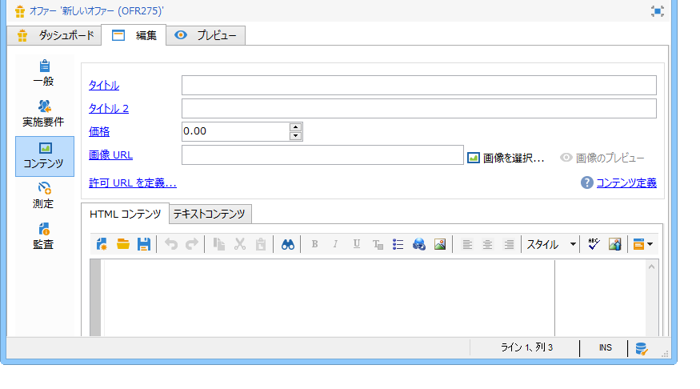
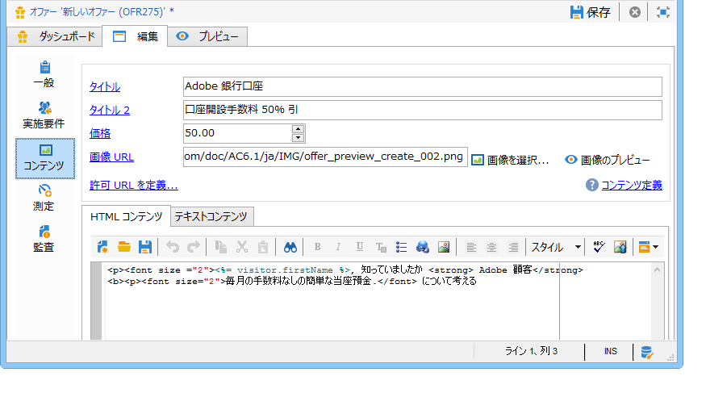
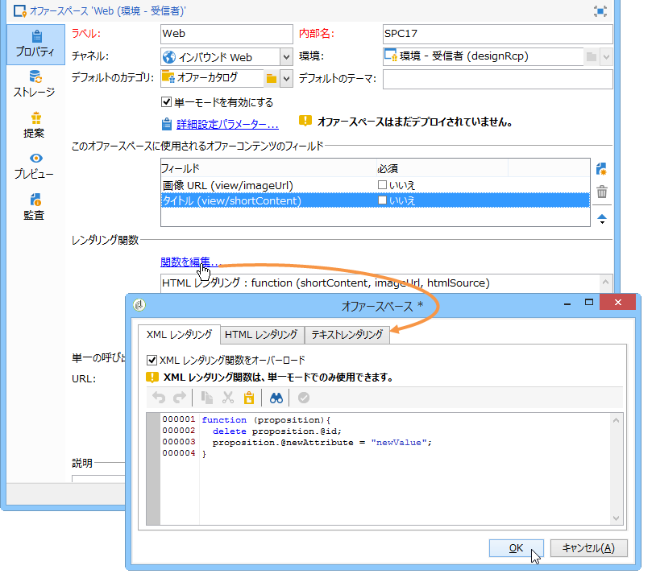

# JavaScript による統合（クライアント側）{#integration-via-javascript-client-side}

Web ページでインタラクションエンジンを呼び出すには、ページに JavaScript コードを直接挿入します。この呼び出しは、ターゲット設定された

エレメント。

アドビでは、JavaScript 統合方法の使用をお勧めします。

URL を呼び出すスクリプトは、次のようになります。

```
<script id="interactionProposalScript" src="https://<SERVER_URL>/nl/interactionProposal.js?env=" type="text/javascript"></script>
```

「**env**」パラメーターは、匿名インタラクション専用のライブ環境の内部名を受け取ります。

オファーを提示するには、Adobe Campaign で環境とオファースペースを作成してから、HTML ページを設定する必要があります。

次の使用例で、JavaScript を使用したオファーの統合について考えられるオプションを説明します。

## HTML モード {#html-mode}

### 匿名オファーの提示 {#presenting-an-anonymous-offer}

1. **インタラクションエンジンの準備**

   Adobe Campaign インターフェイスを開き、匿名環境を用意します。

   この匿名環境にリンクしたオファースペースを作成します。

   このオファースペースにリンクしたオファーとその表示域を作成します。

1. **HTML ページのコンテンツ**

   HTMLページには、

   要素に@id属性を割り当て、作成したオファースペースの内部名の値(「i_internal name space」)を含める。 オファーは、インタラクションによってこの要素に挿入されます。

   この例では、@id 属性は、値 &quot;i_SPC12&quot; を受け取ります（「SPC12」が先ほど作成したオファースペースの内部名）。

   ```
   <div id="i_SPC12"></div>
   ```

   この例では、スクリプトを呼び出す URL は、次のようになります（「OE3」はライブ環境の内部名）。

   ```
   <script id="interactionProposalScript" src="https://instance.adobe.org:8080/nl/interactionProposal.js?env=OE3" type="text/javascript"></script>
   ```

   >[!CAUTION]
   >
   >The `<script>` tag must not be self-closing.

   この静的呼び出しは、インタラクションエンジンに必要なすべてのパラメーターを含む動的呼び出しを自動的に生成します。

   この動作によって、同じページに複数のオファースペースを使用して、1 回のエンジン呼び出しで管理できます。

1. **HTML ページでの結果**

   オファー表示域のコンテンツは、インタラクションエンジンによって HTML ページに返されます。

   ```
   <div id="banner_header">
     <div id="i_SPC12">
       <table>
         <tbody>
           <tr>
             <td><h3>Fly to Japan!</h3></td>
           </tr>
           <tr>
             <td></td>
             <td>
               <p>Discover Japan for 2 weeks at an unbelievable price!!</p>
               <p><b>2345 Dollars - All inclusive</b></p>
             </td>
           </tr>
         </tbody>
       </table>
     </div>
     <script src="https://instance.adobe.org:8080/nl/interactionProposal.js?env=OE3" id="interactionProposalScript" type="text/javascript"></script>
   </div>
   ```

### 識別されたオファーの提示 {#presenting-an-identified-offer}

To present an offer to an identified contact, the process is similar as the one detailed here: [Presenting an anonymous offer](#presenting-an-anonymous-offer). で説明する手順とほぼ同じです。エンジン呼び出し中に連絡先を識別する次のスクリプトを Web ページのコンテンツに追加する必要があります。

```
<script type="text/javascript">
  interactionTarget = <contact_identifier>;
</script>
```

1. Go to the offer space that will be called up by the web page, click **[!UICONTROL Advanced parameters]** and add one or more identification keys.

   

   この例では、識別キーは、E メールと受信者名の両方を基にした複合キーです。

1. Web ページが表示される間、スクリプト評価を使用して、受信者 ID をオファーエンジンに渡すことができます。ID が複合キーの場合は、詳細設定で使用されたのと同じ順番に並んだキーが | で区切られて表示されます。

   次の例では、コンタクト先は、Web サイトにログインし、インタラクションエンジンの呼び出し中に E メールと名前によって識別されます。

   ```
   <script type="text/javascript">
     interactionTarget = myEmail|myName;
   </script>
   ```

### HTML レンダリング関数の使用 {#using-an-html-rendering-function}

HTML のオファー表示域を自動的に生成するには、レンダリング関数を使用できます。

1. Go to the offer space and click the **[!UICONTROL Edit functions]** link.
1. 選択 **[!UICONTROL Overload the HTML rendering function]**.
1. Go to the **[!UICONTROL HTML rendering]** tab and insert the variables that match the fields defined for the offer content in the offer space.

   

   この例では、オファーは、バナーの形式で Web ページに表示され、オファーコンテンツで定義されたフィールドに合致する、クリック可能な画像とタイトルで構成されます。

## XML モード {#xml-mode}

### オファーの提示 {#presenting-an-offer}

インタラクションでは、オファーエンジンを呼び出した HTML ページに XML ノードを返すことができます。この XML ノードは、顧客側で開発した関数で処理できます。

インタラクションエンジンの呼び出しは、次のようになります。

```
<script type="text/javascript" id="interactionProposalScript" src="https://<SERVER_URL>/nl/interactionProposal.js?env=&cb="></script>
```

「**env**」パラメーターは、ライブ環境の内部名を受け取ります。

「**cb**」パラメーターは、（コールバック）提案を含むエンジンから返される XML ノードを読み込む関数の名前を受け取ります。このパラメーターはオプションです。

「**t**」パラメーターは、識別されたインタラクションの場合にのみ、ターゲットの値を受け取ります。このパラメーターは **interactionTarget** 変数を使用して渡すこともできます。このパラメーターはオプションです。

「**c**」パラメーターは、カテゴリの内部名のリストを受け取ります。このパラメーターはオプションです。

「**th**」パラメーターは、テーマのリストを受け取ります。このパラメーターはオプションです。

「**gctx**」パラメーターは、ページ全体にグローバル（コンテキスト）な呼び出しデータを受け取ります。このパラメーターはオプションです。

返される XML ノードは、次のようになります。

```
<propositions>
 <proposition id="" offer-id="" weight="" rank="" space="" div=""> //proposition identifiers
   ...XML content defined in Adobe Campaign...
 </proposition>
 ...
</propositions>
```

次の使用例は、XML モードを有効化し、エンジンの呼び出しの結果を HTML ページで表示するために Adobe Campaign で実行する設定について説明します。

1. **環境とオファースペースの作成**

   環境の作成について詳しくは、 [Live/Design環境を参照してください](../../interaction/using/live-design-environments.md)。

   For more on creating an offer space, refer to [Creating offer spaces](../../interaction/using/creating-offer-spaces.md).

1. **オファースキーマの拡張による新しいフィールドの追加**

   このスキーマは、次のフィールドを定義します。タイトル番号2と価格。

   この例のスキーマの名前は **cus:offer** です。

   ```
   <srcSchema _cs="Marketing offers (cus)" created="2013-01-18 17:14:20.762Z" createdBy-id="0"
              desc="" entitySchema="xtk:srcSchema" extendedSchema="nms:offer" img="nms:offer.png"
              label="Marketing offers" labelSingular="Marketing offers" lastModified="2013-01-18 15:20:18.373Z"
              mappingType="sql" md5="F14A7AA009AE1FCE31B0611E72866AC3" modifiedBy-id="0"
              name="offer" namespace="cus" xtkschema="xtk:srcSchema">
     <createdBy _cs="Administrator (admin)"/>
     <modifiedBy _cs="Administrator (admin)"/>
     <element img="nms:offer.png" label="Marketing offers" labelSingular="Marketing offer"
              name="offer">
       <element label="Content" name="view">
         <element label="Price" name="price" type="long" xml="true"/>
         <element label="Title 2" name="title2" type="string" xml="true"/>
   
         <element advanced="true" desc="Price calculation script." label="Script price"
                  name="price_jst" type="CDATA" xml="true"/>
         <element advanced="true" desc="Title calculation script." label="Script title"
                  name="title2_jst" type="CDATA" xml="true"/>
       </element>
     </element>
   </srcSchema>
   ```

   >[!CAUTION]
   >
   >各要素は、2 回ずつ定義する必要があります。CDATA（&quot;_jst&quot;）タイプの要素には、パーソナライゼーションフィールドを含めることができます。
   >
   >忘れずにデータベース構造を更新してください。詳しくは、[この節](../../configuration/using/updating-the-database-structure.md)を参照してください。

   >[!NOTE]
   >
   >オファースキーマを拡張し、バッチモードまたは単一モードの両方で、あらゆる形式（テキスト、HTML、および XML）の新しいフィールドを追加できます。

1. **新しいフィールドを編集し、既存のフィールドを修正するためのオファー数式の拡張**

   **オファー（nsm）**&#x200B;入力フォームを編集します。

   「Views」セクションに、次の内容を含んだ 2 つの新しいフィールドを挿入します。

   ```
   <input label="Title 2" margin-right="5" prebuildSubForm="false" type="subFormLink"
                        xpath="title2_jst">
                   <form label="Edit title 2" name="editForm" nothingToSave="true">
                     <input nolabel="true" toolbarAlign="horizontal" type="jstEdit"
                            xpath="." xpathInsert="/ignored/customizeTitle2">
                       <container>
                         <input menuId="viewMenuBuilder" options="inbound" type="customizeBtn"
                                xpath="/ignored/customizeTitle2"/>
                       </container>
                     </input>
                   </form>
                 </input>
                 <input nolabel="true" type="edit" xpath="title2_jst"/>
   
                 <input label="Price" margin-right="5" prebuildSubForm="false" type="subFormLink"
                        xpath="price_jst">
                   <form label="Edit price" name="editForm" nothingToSave="true">
                     <input nolabel="true" toolbarAlign="horizontal" type="jstEdit"
                            xpath="." xpathInsert="/ignored/customizePrice">
                       <container>
                         <input menuId="viewMenuBuilder" options="inbound" type="customizeBtn"
                                xpath="/ignored/customizePrice"/>
                       </container>
                     </input>
                   </form>
                 </input>
                 <input colspan="2" label="Prix" nolabel="true" type="number" xpath="price_jst"/>
   ```

   宛先 URL フィールドをコメントアウトします。

   

   >[!CAUTION]
   >
   >The fields of the ( `<input>`) form must point to the CDATA type elements defined in the created schema.

   オファー表示域フォームのレンダリングは、次のようになります。

   

   The **[!UICONTROL Title 2]** and **[!UICONTROL Price]** fields have been added and the **[!UICONTROL Destination URL]** field is no longer displayed.

1. **オファーの作成**

   オファーの作成について詳しくは、「オファーの作成」 [を参照してくださ](../../interaction/using/creating-an-offer.md)い。

   この例では、オファーは次のように入力されます。

   

1. オファーを承認するか、誰かにオファーの承認を得てから、前の手順で作成したオファースペースで有効化します。これにより、リンクされたライブ環境でオファーが利用可能になります。
1. **エンジン呼び出しと、HTML ページでの結果**

   HTML ページでのインタラクションエンジンの呼び出しは、次のようになります。

   ```
   <script id="interactionProposalScript" src="https://<SERVER_URL>/nl/interactionProposal.js?env=OE7&cb=alert" type="text/javascript">
   ```

   「**env**」パラメーターの値は、ライブ環境の内部名です。

   「**cb**」パラメーターの値は、エンジンから返された XML ノードを解釈する必要のある関数の名前です。この例では、呼び出される関数がモーダルウィンドウを開きます（alert() 関数）。

   インタラクションエンジンから返される XML ノードは、次のようになります。

   ```
   <propositions>
    <proposition id="a28002" offer-id="10322005" weight="1" rank="1" space="SPC14" div="i_SPC14">
     <xmlOfferView>
      <title>Travel to Russia</title>
      <price>3456</price>
      <description>Discover this vacation package!INCLUDES 10 nights. FEATURES buffet breakfast daily. BONUS 5th night free.</description>
      <image>
       <path>https://myinstance.com/res/Track/ae1d2113ed732d58a3beb441084e5960.jpg</path>
       <alt>Travel to Russia</alt>
      </image>
     </xmlOfferView>
    </proposition>
   </propositions>
   ```

### レンダリング関数の使用 {#using-a-rendering-function-}

XML レンダリング関数を使用して、オファーのプレゼンテーションを作成できます。この関数は、エンジンの呼び出し中に HTML ページに返された XML ノードを修正します。

1. Go to the offer space and click the **[!UICONTROL Edit functions]** link.
1. 選択 **[!UICONTROL Overload the XML rendering function]**.
1. Go to the **[!UICONTROL XML rendering]** tab and insert the desired function.

   関数は、次のようになります。

   ```
   function (proposition) {
     delete proposition.@id;
     proposition.@newAttribute = "newValue";
   } 
   ```



