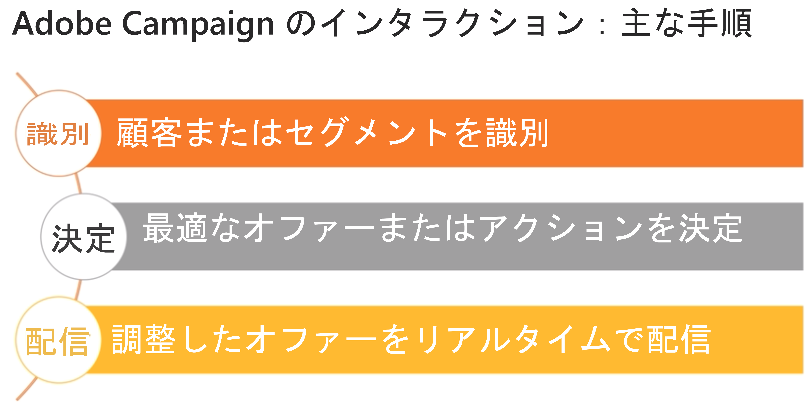

# インタラクションとオファー管理{#interaction-and-offer-management}

インタラクションを使用すると、特定の連絡先（顧客またはターゲット）とのインタラクション中に 1 つまたは複数の調整したオファーを提供して、リアルタイムで応答することができます。 オファーの例としては、簡単な連絡メッセージや、1 つまたは複数の製品やサービスに関する特別オファーなどがあります。

オファーはインバウンド（Web サイトまたはコールセンター）またはアウトバウンド（メール配信、ダイレクトメールまたはマーケティングキャンペーン内の SMS）で連絡先に送信されます。

インバウンドチャネルおよびアウトバウンドチャネルと連動するオファーカタログを作成すると、特定のコンテキストに最適なオファーを選択して連絡先に送信できます。 各受信者向けのオファーの関連度は実施要件ルールに基づいて定義されます。 関連するオファーの中からどのオファーを選択するかは優先度ルールに基づいて決定されます。 オファーのプレゼンテーションルールでは連絡先とのやり取りの履歴が考慮されるので、同じ連絡先に同じオファーが繰り返し送信されることはありません。

インタラクションではオファーのカタログを作成して管理することができ、カタログにリンクされた実施要件ルールとアプリケーションテーマを設定することもできます。 様々なレンダリング関数を活用することで、選択したチャネルに応じてオファーコンテンツをパーソナライズできます。 最後に、シミュレーションモジュールを使用してオファー表示域の影響を計算できます。

>[!NOTE]
>
>Campaign v7 から v8 への移行の一環として、Campaign Classic のドキュメントセットを効率化および再編成しました。 共通機能は、Campaign v8 ドキュメントセットでのみ使用できるようになりました。 インタラクションについて詳しくは、[Campaign v8 ドキュメント](https://experienceleague.adobe.com/ja/docs/campaign/campaign-v8/offers/interaction){target=_blank}を参照してください。
>
>{target="_blank"}

この節では、Campaign v8 ドキュメントに記載されていないインタラクション機能のみを取り上げます：[ オファーシミュレーション ](https://experienceleague.adobe.com/en/docs/campaign/campaign-v8/offers/simulating-offers/about-offers-simulation){target="_blank"} （Campaign v8 ドキュメント）、[ オファープレゼンテーション ](https://experienceleague.adobe.com/en/docs/campaign/campaign-v8/offers/managing-an-offer-catalog/managing-offer-presentation){target="_blank"} （Campaign v8 ドキュメント）、[ オファーの承認](https://experienceleague.adobe.com/en/docs/campaign/campaign-v8/offers/managing-an-offer-catalog/approving-and-activating-an-offer){target="_blank"} （Campaign v8 ドキュメント）、[ オファーテンプレート ](https://experienceleague.adobe.com/en/docs/campaign/campaign-v8/offers/managing-an-offer-catalog/managing-offer-templates){target="_blank"} （Campaign v8 ドキュメント）および[詳細設定](using-advanced-parameters.md)。

 Campaign のインタラクションの機能と用語について詳しくは、[こちらのビデオ](https://helpx.adobe.com/jp/campaign/classic/how-to/acs-overview.html?playlist=/ccx/v1/collection/product/campaign/classic/segment/digital-marketers/explevel/intermediate/applaunch/get-started/collection.ccx.js&ref=helpx.adobe.com)をご覧ください。

## 関連トピック

| 便利なページ | その他のリソース |
|---|---|
| [インタラクションの実装手順](https://experienceleague.adobe.com/ja/docs/campaign/campaign-v8/offers/interaction){target="_blank"}（Campaign v8 ドキュメント） | [ オファー配布のテスト ](https://experienceleague.adobe.com/en/docs/campaign/campaign-v8/offers/simulating-offers/about-offers-simulation){target="_blank"} （Campaign v8 ドキュメント） |
| [ライブ／デザイン環境](https://experienceleague.adobe.com/ja/docs/campaign/campaign-v8/offers/interaction-settings/interaction-env){target="_blank"}（Campaign v8 ドキュメント） | [メールへのオファーの追加](https://experienceleague.adobe.com/ja/docs/campaign/campaign-v8/offers/interaction-send-offers){target="_blank"}（Campaign v8 ドキュメント） |
| [オファースペースの作成](https://experienceleague.adobe.com/ja/docs/campaign/campaign-v8/offers/interaction-settings/interaction-offer-spaces){target="_blank"}（Campaign v8 ドキュメント） | [ ユースケース：web サイトにオファーを追加する](https://experienceleague.adobe.com/en/docs/campaign/campaign-v8/offers/case-study/offers-on-an-inbound-channel){target="_blank"} （Campaign v8 ドキュメント） |
