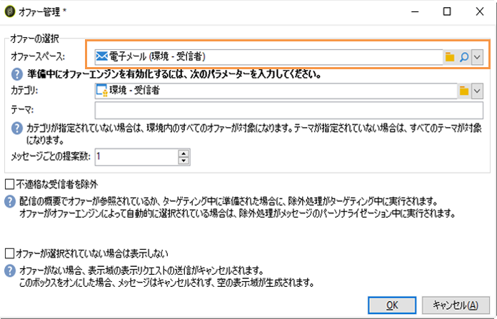
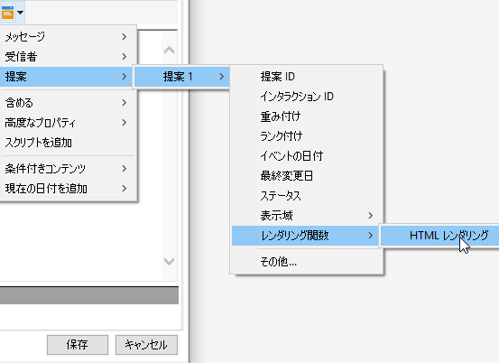
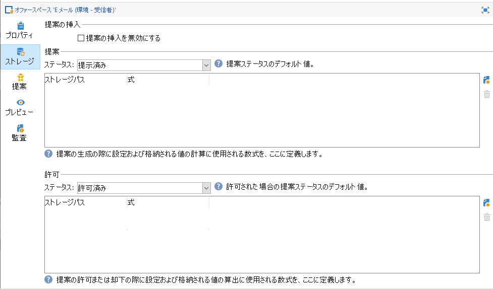
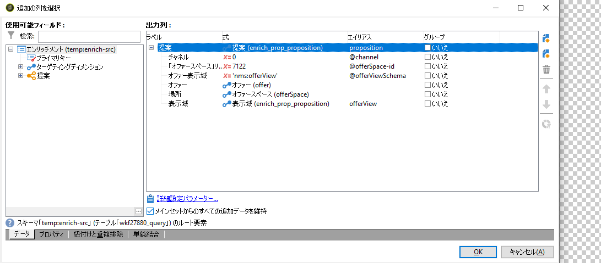
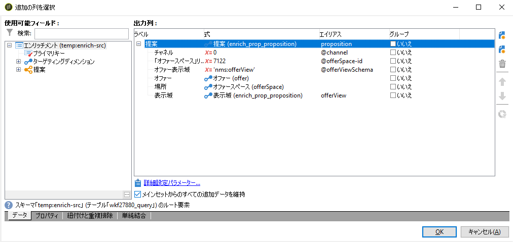
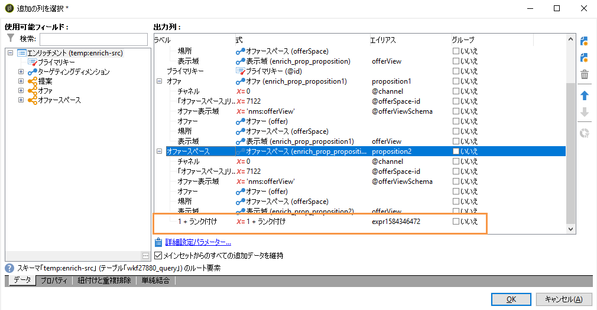

# インタラクションのベストプラクティス{#interaction-best-practices}

## 一般的な推奨事項 {#general-recommendations}

ここでは、適格性ルール、事前定義済みフィルター、ワークフローアクティビティ、データベースオプションなど、Adobe Campaign Classicのインタラクションモジュールを管理するためのベストプラクティスについて説明します。

Adobe Campaign のインタラクションを効率的に運用するには、慎重に管理する必要があります。連絡先の数と、オファーカテゴリやオファーの数のバランスを取る必要があります。慎重に対応しなければ、Adobe Campaign インスタンスで問題が生じる可能性があります。

### 実装 {#implementation}

以下は、インタラクションを実装および設定する際に念頭においておくべき重要事項です。

* バッチエンジン（一般的に E メールなどのアウトバウンド通信で使用）の場合、複数の連絡先を同時に処理できるので、主な懸念事項はスループットです。一般的なボトルネックはデータベースのパフォーマンスです。
* 単一エンジン（一般的に Web サイトのバナーなどのインバウンド通信で使用）の場合、回答を待っているユーザーがいるので、主な制限事項は遅延です。一般的なボトルネックは CPU のパフォーマンスです。
* オファーカタログのデザインは、Adobe Campaign Classicのパフォーマンスに大きな影響を与えます。
* 多数のオファーがある場合は、複数のオファーカタログに分割します。

### 実施要件ルール {#eligibility-rules}

実施要件ルールに関するベストプラクティスを以下に示します。

* ルールはシンプルにします。ルールが複雑になれば、参照に時間がかかってしまい、パフォーマンスに影響します。複雑なルールとは、条件が 5 つ以上のルールです。
* パフォーマンスを向上させるため、ルールを複数のオファーで共有される、個別の定義済みフィルターに分割できます。
* 最も厳しいオファーカテゴリルールを、できるだけツリーの最上位に配置します。これにより、最初にほとんどの連絡先にフィルターをかけてターゲットとする数を減らし、それらに追加ルールを処理しなくて済むようにします。
* 処理や時間が最も多く必要なルールをツリーの一番下に配置します。こうすることで、これらのルールは残りのターゲットオーディエンスでのみ実行します。
* ツリー全体をスキャンしなくて済むよう、特定のカテゴリから開始します。
* 処理時間を短縮するため、結合を使用した複雑なルールを作成する代わりに、事前に集計します。これを実行するには、実施要件ルール内で参照可能な参照テーブルに顧客データを保存するようにしてください。
* 重み付けの数を最小限にして、クエリの数を制限します。
* オファースペースあたりのオファー数を制限することをお勧めします。これにより、指定されたスペースでオファーを素早く取得できるようにします。
* 特に頻繁に使用する参照列では、インデックスを使用します。

### 提案テーブル {#proposition-table}

提案テーブルに関するいくつかのベストプラクティスを以下に示します。

* 可能な限り早く処理できるよう、使用するルールの数を最小限にします。
* 提案テーブルのレコードの数を減らす：ステータスを最新に保つ必要があるレコードと、ルールで必要なレコードのみを残してから、別のシステムへアーカイブします。
* 提案テーブルで集中的にデータベースのメンテナンスを実施します（インデックスの再構築やテーブルの再作成など）。
* ターゲットごとに要求される提案数を制限します。実際に使用する数以上の提案を設定しないでください。
* ルール条件では、できるだけ結合の使用を避けます。

## オファー管理のヒントとテクニック {#tips-managing-offers}

この節では、オファーの管理とAdobe Campaign Classicのインタラクションモジュールの使用に関する、より詳細なアドバイスを提供します。

### 電子メール配信での複数のオファースペースの使用 {#multiple-offer-spaces}

配信にオファーを含める場合、一般に、そのオファーはエンリッチメントアクティビティ（または他の類似アクティビティ）を介してキャンペーンワークフローの上流に選択されます。

エンリッチメントアクティビティのオファーを選択する場合、使用するオファースペースを選択できます。 ただし、選択したオファースペースに関係なく、配信のカスタマイズメニューは、配信で設定したオファースペースに依存します。

以下の例では、配信で選択されたオファースペースは次のようになりま **[!UICONTROL Email (Environment - Recipient)]**&#x200B;す。



配信で選択したオファースペースにHTMLレンダリング機能が設定されていない場合、配信メニューに表示されず、選択できません。 この操作は、「エンリッチメント」アクティビティで選択したオファースペースとは独立しています。

以下の例では、配信で選択したオファースペースにレンダリング機能があるので、HTMLレンダリング機能をドロップダウンリストで使用できます。



この関数は、次のようなコードを挿入します。 `<%@ include proposition="targetData.proposition" view="rendering/html" %>`.

提案を選択すると、属性の値は次のよ **[!UICONTROL view]** うになります。
* &quot;rendering/html&quot;:htmlレンダリング。 HTMLレンダリング関数を使用します。
* &quot;offer/view/html&quot;:htmlコンテンツ。 HTMLレンダリング関数は使用しません。 HTMLフィールドのみが含まれます。

1回の電子メール配信に複数のオファースペースを含め、一部にレンダリング機能があり、一部にレンダリング機能がない場合は、どのオファーがどのオファースペースを使用し、どのオファースペースにレンダリング機能があるかを覚えておく必要があります。

その結果、問題を回避するために、オファースペースに必要なHTMLコンテンツのみが含まれる場合でも、すべてのオファースペースにHTMLレンダリング関数を定義することをお勧めします。

### 提案ログテーブルでのランクの設定 {#rank-proposition-log-table}

オファースペースには、提案が生成または受け入れられたときに、提案テーブルにデータを保存する機能があります。



ただし、これはインバウンドインタラクションにのみ適用されます。

アウトバウンドインタラクションを使用する場合、およびインタラクションモジュールを使用せずにアウトバウンドオファーを使用する場合は、提案テーブルに追加のデータを保存することもできます。

ワークフローの一時テーブルのフィールドのうち、提案テーブル内のフィールド名と名前が一致するフィールドは、提案テーブル内の同じフィールドにコピーされます。

例えば、エンリッチメントで手動（インタラクションなし）でオファーを選択する場合、標準フィールドは次のように定義されます。



追加のフィールド（@rankフィールドなど）を追加できます。



提案テーブルに@rankという名前のフィールドがあるので、ワークフローの一時テーブルの値がコピーされます。

提案テーブルに追加のフィールドを格納する方法について詳しくは、「ワークフローを介し [たオファーの統合」を参照してくださ](../../interaction/using/integrating-an-offer-via-a-workflow.md#storing-offer-rankings-and-weights)い。

インタラクションを使用したアウトバウンドオファーの場合、これは複数のオファーが選択され、電子メールに表示される順序を記録する場合に役立ちます。

また、現在の支出レベルなど、追加のメタデータを提案テーブルに直接保存して、オファーが生成された時点の支出に関する履歴記録を保持することもできます。

アウトバウンドインタラクションを使用する場合、上の例のように@rankフィールドを追加できますが、インタラクションから返される順序に基づいて値が自動的に設定されます。 例えば、インタラクションを使用して3つのオファーを選択する場合、@rankフィールドには1、2および3の値が返されます。

インタラクションを使用し、オファーを手動で選択する場合、ユーザーは両方の方法を組み合わせることができます。 例えば、ユーザーは手動で選択したオファーに対して@rankフィールドを1に設定し、インタラクションから返されるオファーに「1 + @rank」などの式を使用できます。 インタラクションが3つのオファーを選択すると、両方の方法で返されるオファーは1 ～ 4のランク付けされます。



### nms:offerスキーマの拡張 {#extending-nms-offer-schema}

nms:offerスキーマを拡張する場合は、既に設定済みの既製の構造に従っていることを確認します。
* コンテンツ保存用の新しいフィールドを定義しま `<element name="view">`す。
* 新しい各フィールドは2回定義する必要があります。 1回は通常のXMLフィールド、1回は名前に「_jst」が付いたCDATA XMLフィールドとして。 次に例を示します。

   ```
   <element label="Price" name="price" type="long" xml="true"/>
   <element advanced="true" label="Script price" name="price_jst" type="CDATA" xml="true"/>
   ```

* 追跡するURLを含むフィールドは、の下に配置する必 `<element name="trackedUrls">` 要があります `<element name="view" >`。