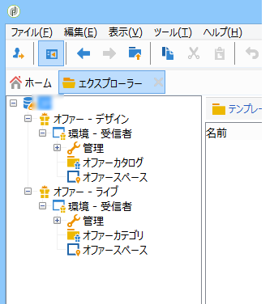
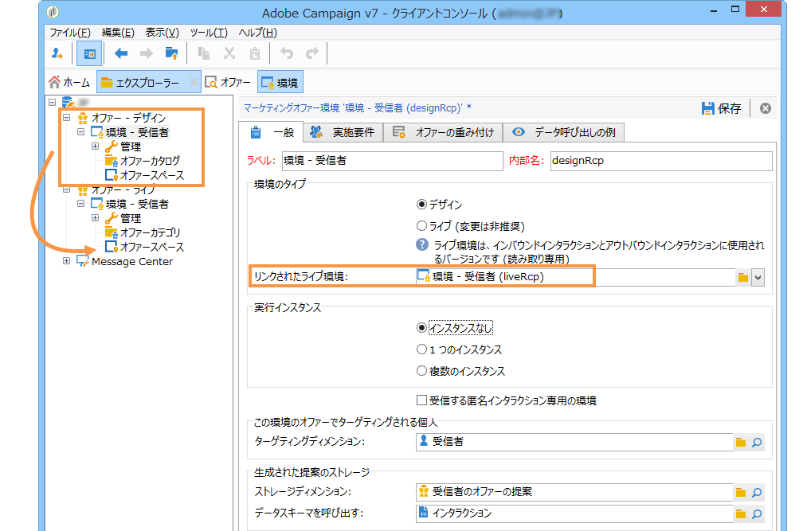
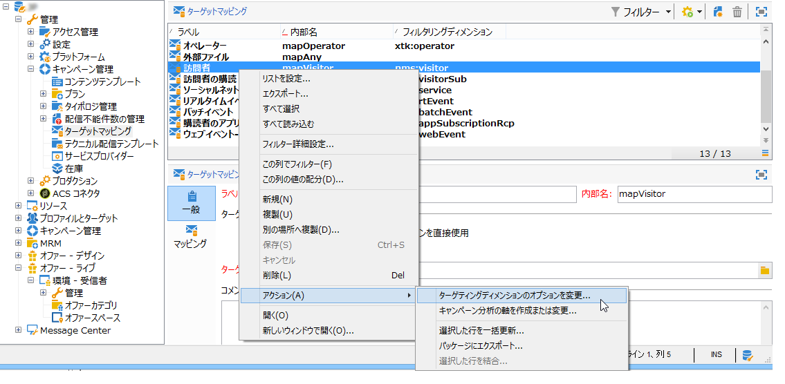
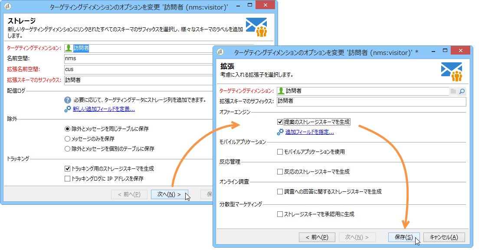
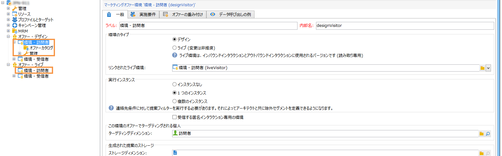

# ライブ／デザイン環境{#live-design-environments}

## 動作の仕組み {#operating-principle}

インタラクションは、次の 2 つのオファー環境を使用して運用されます。

* **[!UICONTROL Design]** 編集中で変更可能なオファーを含むオファー環境を提供します。 これらのオファーは、承認サイクルを経ておらず、コンタクト先には配信されません。
* **[!UICONTROL Live]** 承認されたオファーが連絡先に表示されるのと同じ方法で提供される環境を提供します。 この環境のオファーは、読み取り専用です。

Each **[!UICONTROL Design]** environment is linked to a **[!UICONTROL Live]** environment. オファーの作成が完了すると、そのコンテンツと実施要件ルールは、承認サイクルに進みます。Once this cycle is complete, the concerned offer is automatically deployed to the **[!UICONTROL Live]** environment. その瞬間から、配信できるようになります。

By default, Interaction comes with a **[!UICONTROL Design]** environment and a **[!UICONTROL Live]** environment linked to it. これらの環境は、標準の受信者テーブルをターゲットとするように事前に設定されています。

>[!NOTE]
>
>別のテーブル（匿名オファー用の訪問者テーブルや特定の受信者テーブル）をターゲットにするには、ターゲットマッピングウィザードを使用して環境を作成する必要があります。For more on this, refer to [Creating an offer environment](#creating-an-offer-environment).

オファーマネージャーと配信責任者では、アクセスできる環境の表示が異なります。Delivery managers can only view the **[!UICONTROL Live]** offer environment and use offers to deliver them. Offer managers can view and alter the **[!UICONTROL Design]** environment and view the **[!UICONTROL Live]** environment. For more on this, refer to [Operator profiles](../../interaction/using/operator-profiles.md).

## オファー環境の作成 {#creating-an-offer-environment}

デフォルトでは、インタラクションには、受信者テーブルをターゲットとするように事前設定された環境（識別されたオファー）が 1 つ用意されています。別のテーブル（匿名オファー用の訪問者テーブルや特定の受信者テーブル）をターゲットにするには、次の設定を適用する必要があります。

1. > >ノードにカーソルを **[!UICONTROL Administration]** 置き **[!UICONTROL Campaign management]** ま **[!UICONTROL Delivery mappings]** す。 使用する配信マッピングを右クリックし(匿名オファー&#x200B;**[!UICONTROL Visitors]** を使用する場合)、/を選択 **[!UICONTROL Actions]** します **[!UICONTROL Modify the options of the targeting dimension]**。

   

1. をクリ **[!UICONTROL Next]** ックして、ウィザードの次の画面に進み、ボックスをオンにし **[!UICONTROL Generate a storage schema for propositions]** てをクリックしま **[!UICONTROL Save]**&#x200B;す。

   

   >[!NOTE]
   >
   >このボックスが既にオンになっている場合は、一度オフにしてからもう一度オンにしてください。

1. Adobe Campaign creates two environments (**[!UICONTROL Design]** and **[!UICONTROL Live]** ) with targeting information from the previously enabled target mapping. この環境には、ターゲティング情報があらかじめ設定されています。

   マッピングをアクティブ **[!UICONTROL Visitor]** にした場合、 **[!UICONTROL Environment dedicated to incoming anonymous interactions]** 環境のタブでボックスが自動的にチェックされ **[!UICONTROL General]** ます。

   このオプションを設定すると、（特に環境のオファースペースを設定する際の）匿名インタラクションに特有の機能を有効にできます。また、「識別された」環境を「匿名」環境に切り替えることができるオプションを設定することもできます。

   例えば、受信者環境のオファースペース（識別されたコンタクト先）と訪問者環境に合ったオファースペース（識別されていないコンタクト先）をリンクすると、受信者が識別されている場合とそうでない場合とで異なるオファーを提供できます。For more on this, refer to [Creating offer spaces](../../interaction/using/creating-offer-spaces.md).

   

>[!NOTE]
>
>For more information on anonymous interactions on an inbound channel, refer to [Anonymous interactions](../../interaction/using/anonymous-interactions.md).

