# プレゼンテーションの管理{#managing-offer-presentation}

## プレゼンテーションルールの概要 {#presentation-rules-overview}

インタラクションでは、プレゼンテーションルールを使用してオファーの提案のフローを制御できます。インタラクションに特化したそれらのルールをタイポロジルールと呼びます。タイポロジルールを利用すると、既に受信者に送信された提案の履歴に基づいてオファーを除外できます。ルールは環境内で参照されます。

## オファープレゼンテーションルールの作成および参照 {#creating-and-referencing-an-offer-presentation-rule}

1. \> > **[!UICONTROL Administration]** > **[!UICONTROL Campaign management]** > **[!UICONTROL Typology management]** nodeに移動し **[!UICONTROL Typology rules]** ます。
1. Create a typology rule and choose the **[!UICONTROL Offer presentation]** type.

   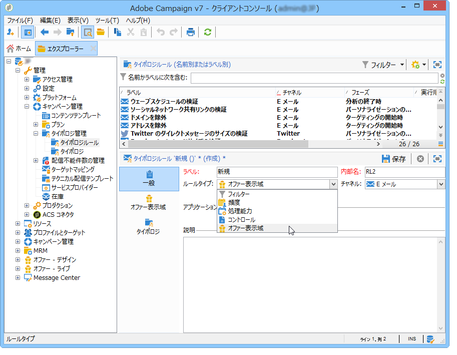

1. ルールを適用するチャネルを指定します。

   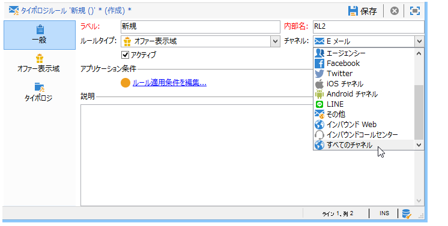

1. ルールの適用条件を設定します。詳しくは、「プレゼンテーションルールの設定」 [を参照してください](#presentation-rule-settings)。
1. **[!UICONTROL Administration]** > **[!UICONTROL Campaign execution]** nodeに移動し、すべてのタイ **[!UICONTROL Typology management]** プルールをグループ化するタイポロジを **[!UICONTROL Typologies]****[!UICONTROL Offer presentation]** 作成します。

   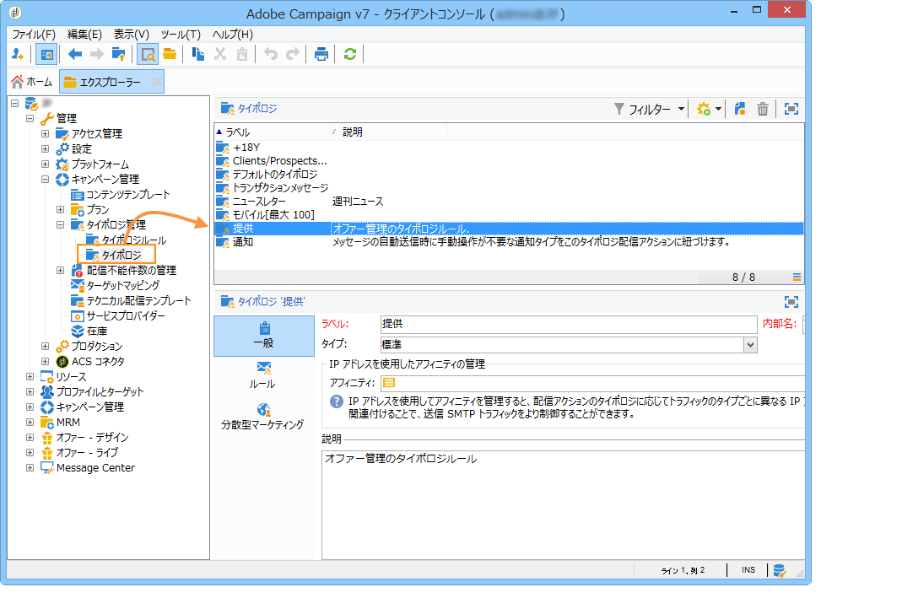

1. タイポロジを作成したら、タイポロジルールにマウスカーソルを置いて、いま作成したタイポロジにグループ化します。

   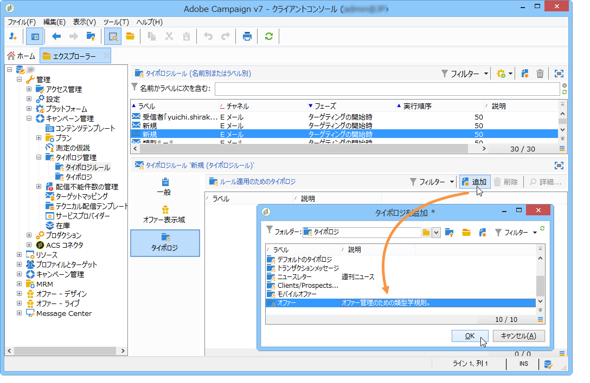

1. オファー環境で、ドロップダウンリストを使用してタイポロジを参照します。

   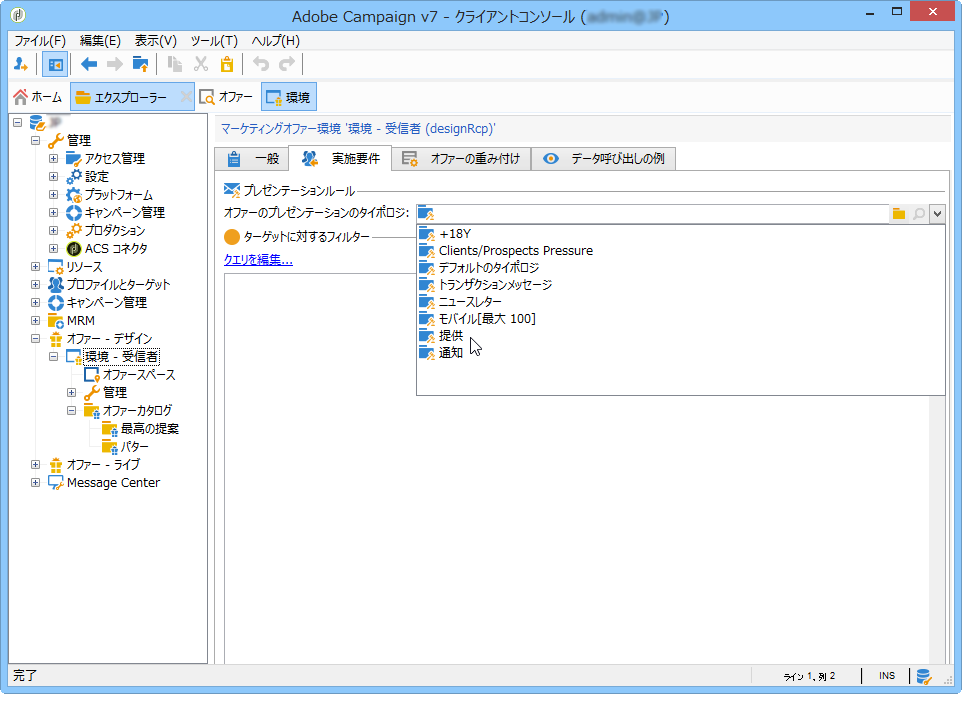

## プレゼンテーションルールの設定 {#presentation-rule-settings}

### 適用条件 {#application-criteria-}

The application criteria available in the **[!UICONTROL General]** tab lets you specify the offers which the presentation rule will apply to. それには、次に説明するように、クエリを作成して、該当するオファーを選択する必要があります。

1. タイポロジルールで、リンクをクリック **[!UICONTROL Edit the rule application conditions...]** してクエリを作成します。

   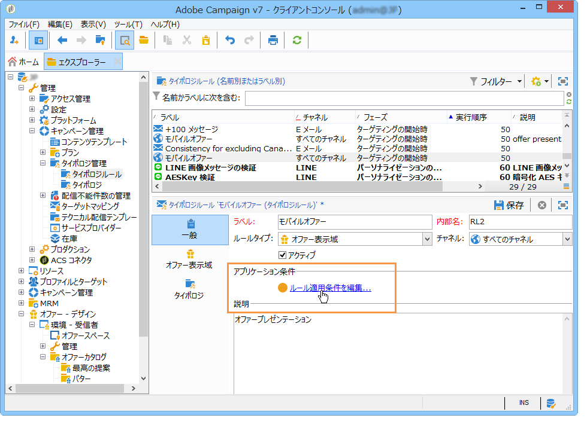

1. クエリウィンドウでは、タイポロジルールを適用するオファーに対してフィルターを適用できます。

   例えば、オファーカテゴリを選択できます。

   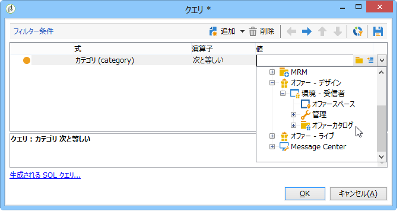

### オファーディメンション {#offer-dimensions}

In the **[!UICONTROL Offer presentation]** tab, you must specify the same dimensions for the presentation rule as those configured in the environment.

The **[!UICONTROL Targeting dimension]** coincides with the table of recipients (by default: nms:recipients) who will receive the offer propositions. The **[!UICONTROL Storage dimension]** coincides with the table which contains the proposition history linked to the targeting dimension (by default:nms:propositionRcp).

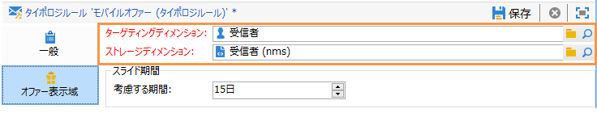

>[!NOTE]
>
>標準以外のテーブルを使用することもできます。特定のターゲティングディメンションを使用する場合、ターゲットマッピングを使用したテーブルおよび専用の環境を作成する必要があります。For more on this, refer to [Creating an offer environment](../../interaction/using/live-design-environments.md#creating-an-offer-environment).

### 期間 {#period}

これは、オファーのプレゼンテーション日から始まるスライドする期間です。これによって、オファーの提案が有効な期限が設定されます。この期間を過ぎると、ルールはオファーの提案に適用されなくなります。

The period starts **n** days before the proposition date and ends **n** days afterwards, where **n** corresponds to the number entered in the **[!UICONTROL Period considered]** field:

* インバウンドスペースの場合、提案日は、オファーのプレゼンテーション日です。
* アウトバウンドスペースの場合、提案日は、配信のコンタクト日（例えば、ターゲティングワークフローに入力された配信日）です。

矢印ボタンを使用して日数を変更するか、期間を直接入力します（例：&quot;2d 6h&quot; で 2 日と 6 時間）。

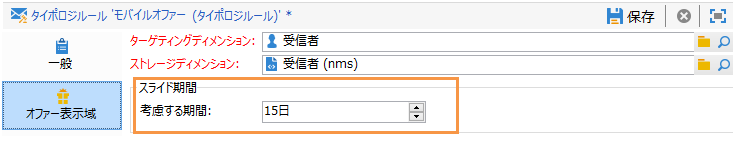

### 提案数 {#number-of-propositions}

オファーが除外されるまでに実行できる提案回数の上限を設定できます。

オファーの提案回数を変更するには、矢印ボタンを使用します。

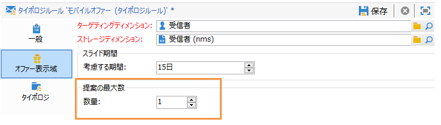

## 提案および受信者の定義 {#defining-propositions-and-recipients}

The **[!UICONTROL Propositions to count]** section lets you specify both the recipients and the propositions which will lead to the exclusion of the offers defined in the **[!UICONTROL General]** tab if they appear a certain number of times in the propositions history.

### 提案のフィルタリング {#filtering-propositions}

チャネル、該当するオファーの数、またはそれまでに割り当てられた提案のステータスに基づいて、提案を除外するためのフィルタリング条件を選択できます。

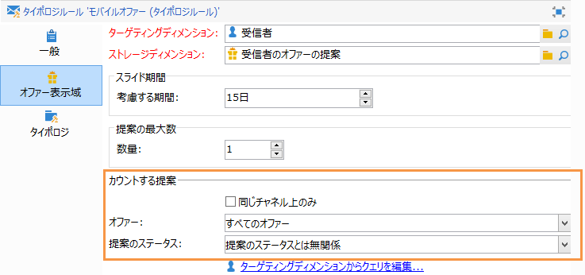

これらの条件には、プレゼンテーションルールのうち特に適用頻度が高いものが示されます。To use other criteria, you can create a query using the **[!UICONTROL Limit propositions...]** link. 詳しくは、「提案に対するクエリの作 [成」の節を参照してください](#creating-a-query-on-propositions) 。

* **チャネルに対するフィルター**

   **[!UICONTROL On the same channel only]** :タブで指定したチャネルのオファー提案を除外で **[!UICONTROL General]** きます。

   For instance, the channel specified for the rule in the **[!UICONTROL General]** tab is email. ルールを適用するオファーが、それまでに Web チャネルでしか提供されていない場合、インタラクションエンジンは、E メール配信でオファーを提示できます。ただし、一度 E メールで提示されると、インタラクションエンジンは別のチャネルを選択してそのオファーを提示します。

   >[!NOTE]
   >
   >この説明は、スペースではなく、チャネルに関することである点に注意してください。ルールによって Web チャネルのオファーを除外すると、Web サイト内の 2 つのスペース（例：ページのバナーと本文）で提示されることになっているオファーは、一度これらの場所に提示された後は表示されなくなります。
   >
   >For a workflow involving offer presentation, the rules are only correctly taken into account if they are configured on **[!UICONTROL All channels]**.

* **オファーに対するフィルター**

   このフィルターを使用すると、カウントされるオファーの提案を、特定のセットのオファーのみに制限できます。

   **[!UICONTROL All offers]** :デフォルト値。 オファーにフィルターは適用されません。

   **[!UICONTROL Offer being presented]** :タブで指定されたオファー **[!UICONTROL General]** が既に表示されている場合は、そのオファーが除外されます。

   **[!UICONTROL Offers from the same category]** :同じカテゴリのオファーが既に提示されている場合、オファーは除外されます。

   **[!UICONTROL The offers which the rule applies to]** :タブで複数のオファーが定義されている場合、このオファーのセットの各オファー提案が考慮され、提案のしきい値に達した場合に、すべてのオファーの除外が終了します。 **[!UICONTROL General]**

   For instance, offers 2, 3 and 5 are defined in the **[!UICONTROL General]** tab. 提案の最大回数が 2 に設定されているとします。オファー 2 とオファー 5 がそれぞれ 1 回ずつ提示されると、提案回数のカウントは 2 に達します。したがって、以後オファー 3 が提示されることはありません。

* **提案ステータスに対するフィルター**

   このフィルターを使用すると、提案履歴で考慮に入れる、オファーの提案で最も頻繁に使用されるステータスを選択できます。

   **[!UICONTROL Regardless of the proposition status]** :デフォルト値。 提案のステータスにフィルターは適用されません。

   **[!UICONTROL Accepted or rejected propositions]** :前に提示されたオファーのうち、受け入れられたオファーまたは拒否されたオファーを除外できます。

   **[!UICONTROL Accepted propositions]** :以前に提示されたオファーを除外して、受け入れられたオファーを除外できます。

   **[!UICONTROL Rejected propositions]** :以前に提示されたオファーを除外し、拒否されたオファーを除外できます。

### 受信者の定義 {#defining-recipients}

受信者を指定するには、リンクをクリ **[!UICONTROL Edit the query from the targeting dimension...]** ックし、ルールに関連する受信者を選択します。

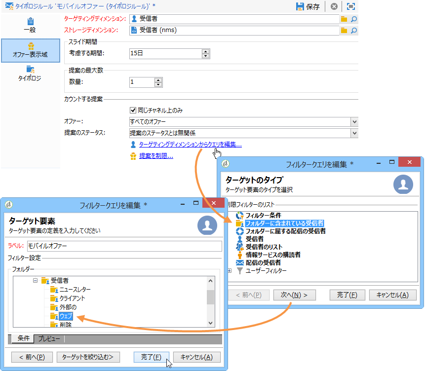

### 提案に関するクエリの作成 {#creating-a-query-on-propositions}

To specify the propositions to be counted via a query, click the **[!UICONTROL Limit propositions...]** link and specify the criteria to be taken into account.

次の例では、**Special offers** カテゴリと **Call center** スペースに属し、重み付けが **20** 未満である提案が、2 回のプレゼンテーションの後にカウント対象となります。

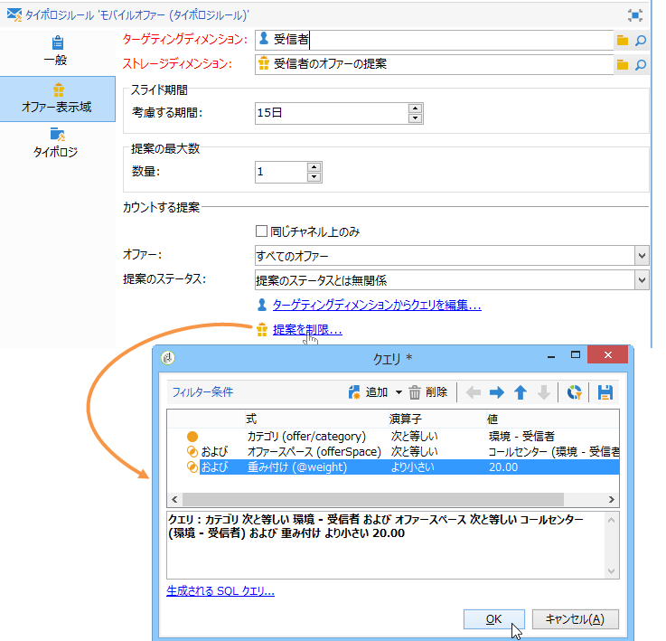

