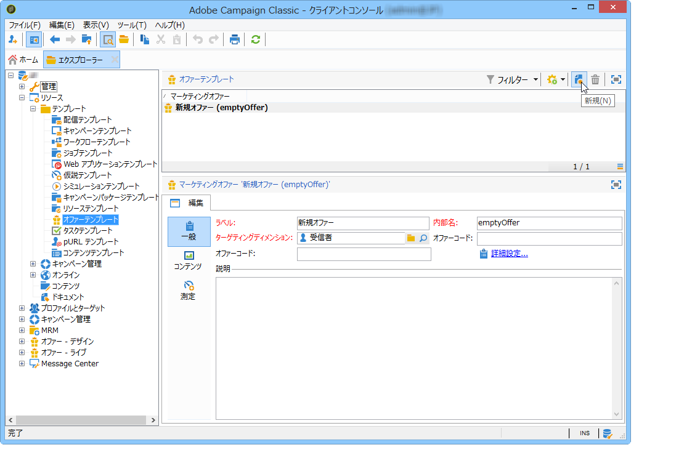
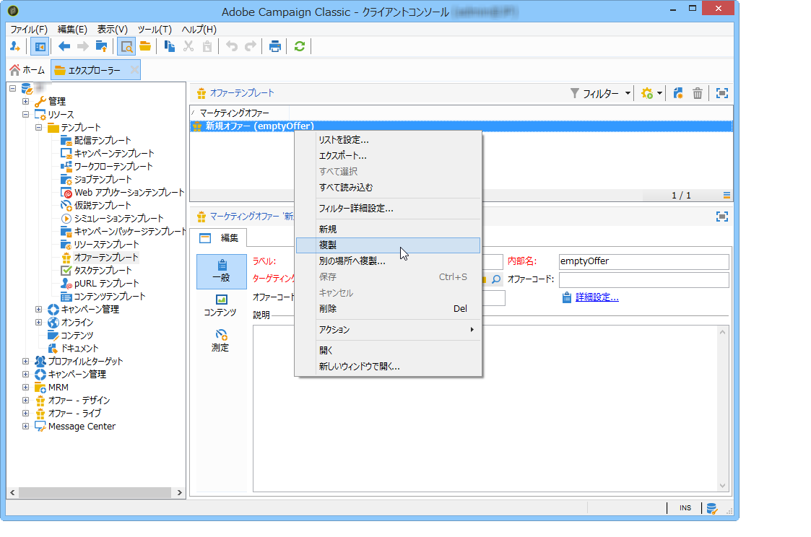
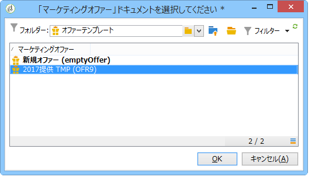

# オファーテンプレートの管理{#managing-offer-templates}

オファーテンプレートは、Adobe Campaign に標準で用意されています。テンプレートは、オファーを作成または複製した後や、ニーズに合わせて設定を変更した後にも使用できます。また、独自のテンプレートを作成することもできます。オファーテンプレートは、**リソース**／**テンプレート**／**オファーテンプレート**&#x200B;フォルダーに格納されています。

## オファーテンプレートの作成 {#creating-an-offer-template}

オファーテンプレートを作成するには、次の手順に従います。

1. **リソース**／**テンプレート**／**オファーテンプレート**&#x200B;に移動します。
1. **新規**&#x200B;アイコンをクリックします。

   

1. 通常のオファーと同じプロセスでテンプレートを設定し、「**保存**」をクリックして保存します。

## 既存のテンプレートの複製 {#duplicate-an-existing-template}

オファーテンプレート（標準かそれ以外かにかかわらず）を複製するには、次の手順に従います。

1. **リソース／テンプレート／オファーテンプレート**&#x200B;に移動します。
1. 複製するテンプレートをマウスで右クリックし、ドロップダウンメニューから「**複製**」を選択します。

   

1. 必要に応じて、テンプレートに表示させる内容を設定してから、「**保存**」をクリックしてテンプレートを保存します。

これで、オファーの作成時にこのテンプレートを利用できるようになります。

