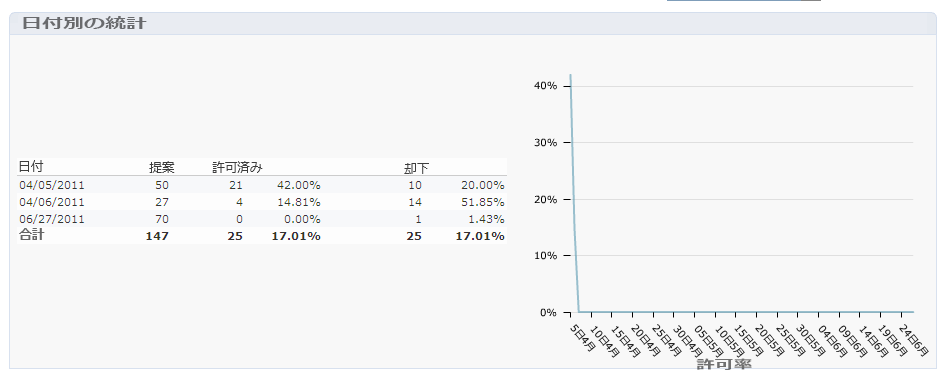
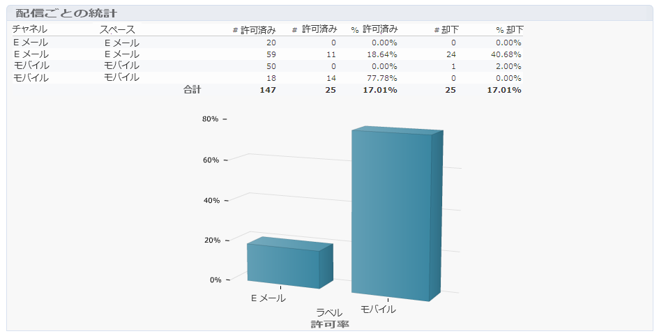
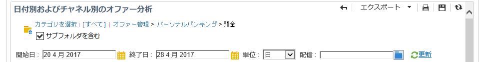

# オファー分析レポート{#offer-analysis-report}

The **[!UICONTROL Offer analysis]** report provides you with an overview of the number of accepted or rejected propositions.

>[!NOTE]
>
>この機能は、オンラインでのみ表示され、配信責任者のみが使用できます。

統計は、次の 3 つの基準に基づいて並べ替えられます。

* 日付別。

   

* スペース別。

   

* 配信別。

   

レポートの上部で使用できる様々な条件に基づいて、データをフィルタリングできます。Once you have selected the desired criteria, click the **[!UICONTROL Refresh]** link to apply them to the report.

