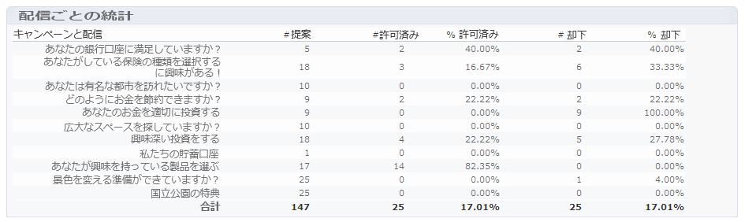

# オファー分析レポート{#offer-analysis-report}

**[!UICONTROL オファー分析]**&#x200B;レポートは、承認または却下された提案の件数の概要を示します。

>[!NOTE]
>
>この機能は、オンラインでのみ表示され、配信責任者のみが使用できます。

統計は、次の 3 つの条件に基づいて並べ替えられます。

* 日付別：

  

* スペース別：

  

* 配信別：

  

レポートの上部で使用できる様々な条件に基づいて、データをフィルタリングできます。目的の基準を選択して、「**[!UICONTROL 更新]**」リンクをクリックすると、レポートに適用されます。

