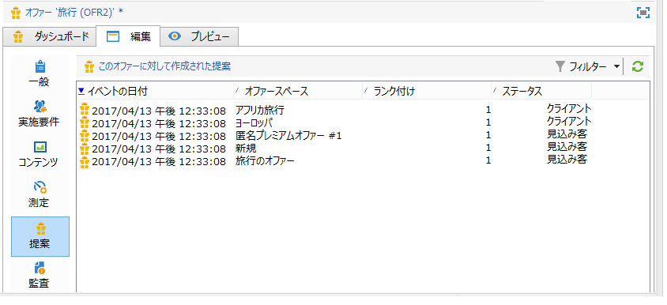
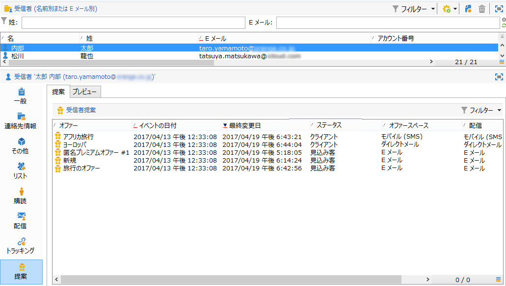
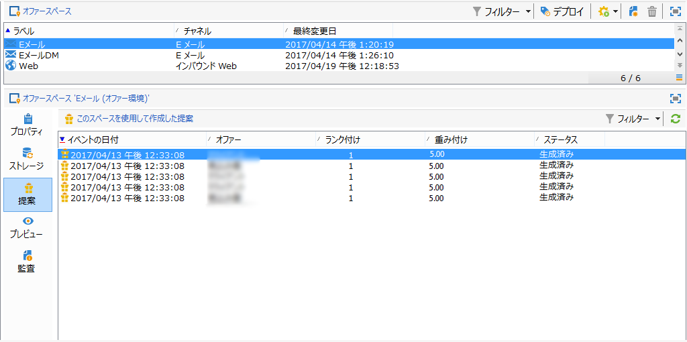

# オファーの提案履歴{#offer-proposition-history}

オファーの提案を実行したら、プレゼンテーション履歴を表示できます。

>[!NOTE]
>
>この機能は、オンラインでのみ表示され、配信責任者のみが使用できます。

* オファーのレベルで、「**[!UICONTROL 編集]**」タブの「**[!UICONTROL 提案]**」をクリックします。

   

* 受信者のプロファイルから、「**[!UICONTROL 提案]**」タブをクリックします。

   

* オファースペースのレベルで、「**[!UICONTROL 提案]**」タブをクリックします。

   

