# インバウンドチャネル{#offers-on-an-inbound-channel}

## 匿名訪問者に対するオファー提案 {#presenting-an-offer-to-an-anonymous-visitor}

Neobank という会社のサイトで、ページを閲覧した匿名訪問者に対するオファーを Web サイト上に表示するものとします。

このインタラクションを実現するには、次の手順を実行します。

1. [匿名環境の作成](#creating-an-anonymous-environment)
1. [匿名オファースペースの作成](#creating-anonymous-offer-spaces)
1. [オファーカテゴリとテーマの作成](#creating-an-offer-category-and-a-theme)
1. [匿名オファーの作成](#creating-anonymous-offers)
1. [Web サイト上の Web オファースペースの設定](#configure-the-web-offer-space-on-the-website)

### 匿名環境の作成 {#creating-an-anonymous-environment}

[オファー環境の作成](../../interaction/using/live-design-environments.md#creating-an-offer-environment)で説明されている手順に従って、**訪問者**&#x200B;のディメンションに基づく匿名環境を作成します。

新しい環境を格納したツリー構造ができます。


### 匿名オファースペースの作成 {#creating-anonymous-offer-spaces}

1. 匿名環境（**訪問者**）内で、**[!UICONTROL 管理]**／**[!UICONTROL スペース]**&#x200B;ノードに移動します。
1. 「**[!UICONTROL 新規]**」をクリックして呼び出しチャネルを作成します。

   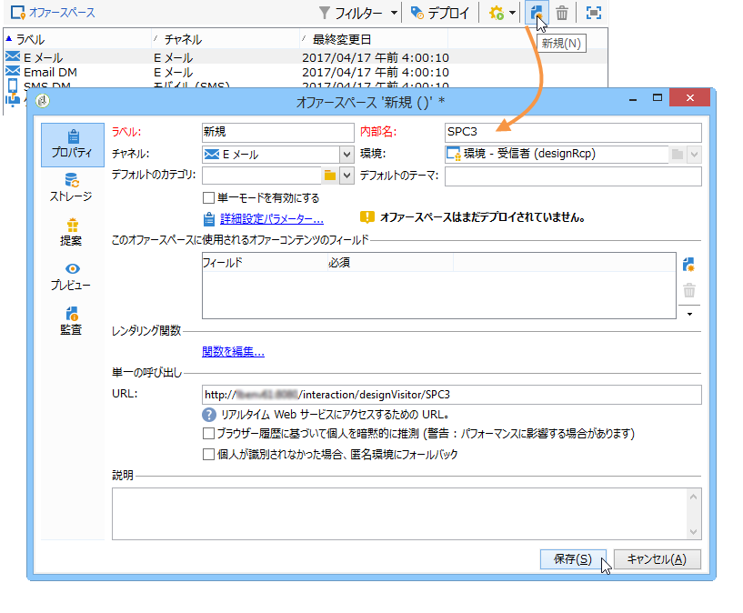

   >[!NOTE]
   >
   >スペースは、この匿名環境に自動的にリンクされます。

1. ラベルを変更し、「**[!UICONTROL インバウンド Web]**」チャネルを選択します。また、「**[!UICONTROL 単一モードを有効にする]**」ボックスをオンにします。

   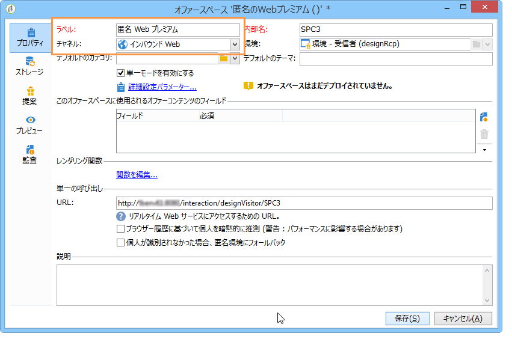

1. このスペースで使用するオファーコンテンツフィールドを選択し、必要に応じて関連するボックスをオンにして指定します。

   これにより、次の要素に不足があるオファーは、このスペースの実施要件を満たさないことになります。

   * タイトル
   * HTML コンテンツ
   * 画像 URL
   * 宛先 URL

   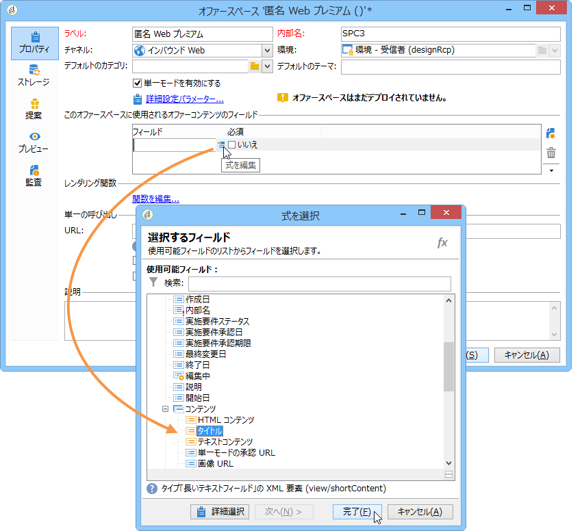

1. 次の例のように、HTML レンダリング関数を編集します。

   ```
   function (imageUrl, targetUrl, shortContent, htmlSource){
         var html = "<p><b>" + shortContent + "</b></p>";
         html += "<p>" + htmlSource + "</p>";
         html += "<a _urlType='11' href='" + targetUrl + "'></a>";
         return html;
       }   
   ```

   >[!IMPORTANT]
   >
   >オファーを正しく表示するために、レンダリング関数では、事前に選択された順序のとおりにスペース用のフィールドを列挙する必要があります。

   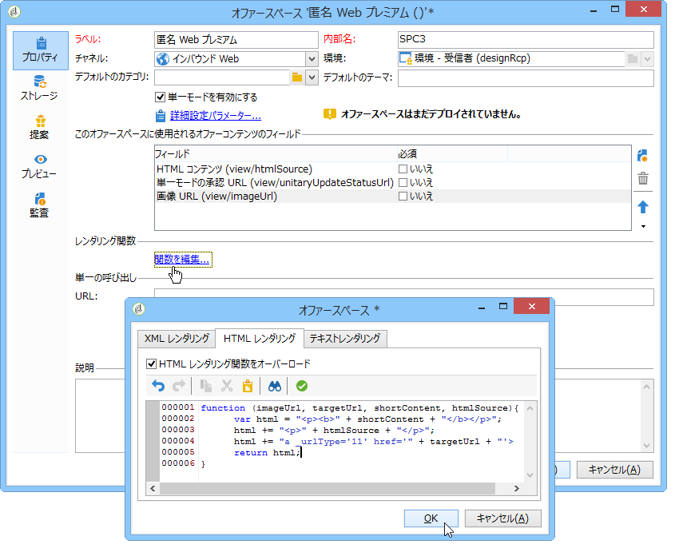

1. オファースペースを保存します。

### オファーカテゴリとテーマの作成 {#creating-an-offer-category-and-a-theme}

1. 先ほど作成した環境の「**[!UICONTROL オファーカタログ]**」ノードに移動します。
1. 「**[!UICONTROL オファーカタログ]**」ノードを右クリックし、「**[!UICONTROL 新しい「オファーカテゴリ」フォルダーを作成]**」を選択します。

   新規カテゴリに、例えば「**Financial products**」（金融商品）という名前を付けます。

1. このカテゴリの「**[!UICONTROL 実施要件]**」タブに移動して、テーマに「**financing**」と入力し、変更を保存します。

   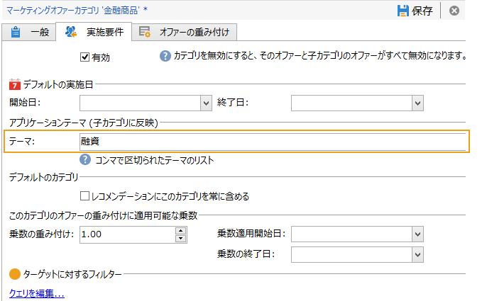

### 匿名オファーの作成 {#creating-anonymous-offers}

1. 作成したカテゴリに移動します。
1. 「**[!UICONTROL 新規]**」をクリックします。

   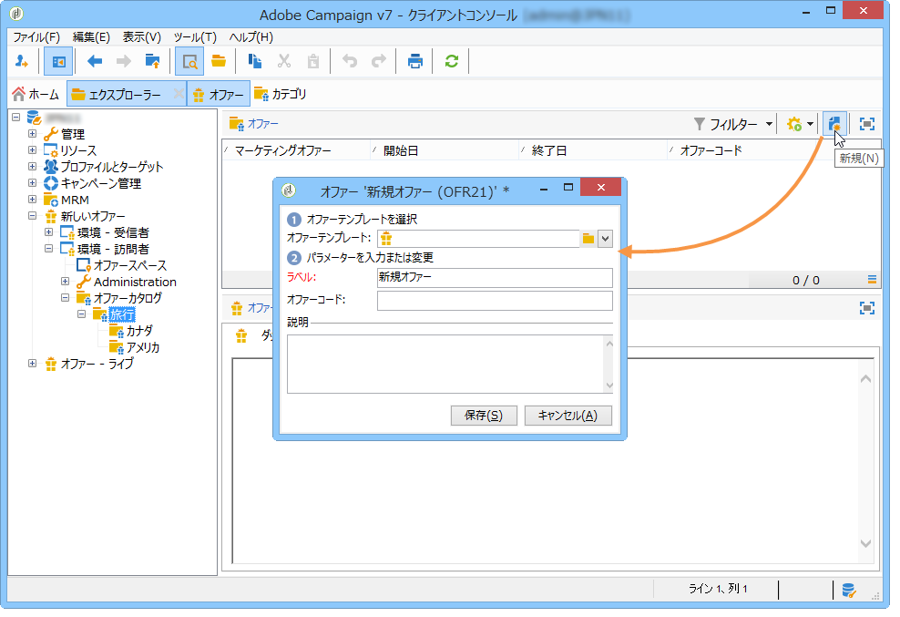

1. 標準で用意されている匿名オファーテンプレートか、別の作成済みテンプレートを選択します。

   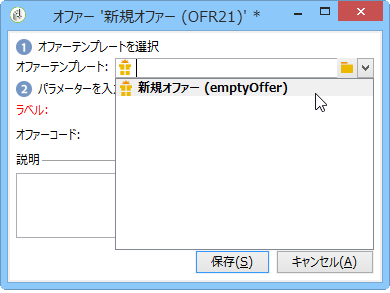

1. ラベルを変更し、オファーを保存します。

   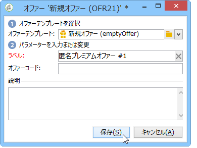

1. 「**[!UICONTROL 実施要件]**」タブに移動し、アプリケーションのコンテキストに応じてオファーの重み付けを指定します。

   この例では、オファーは、年末まで優先項目としてホームページに表示されるように設定されています。

   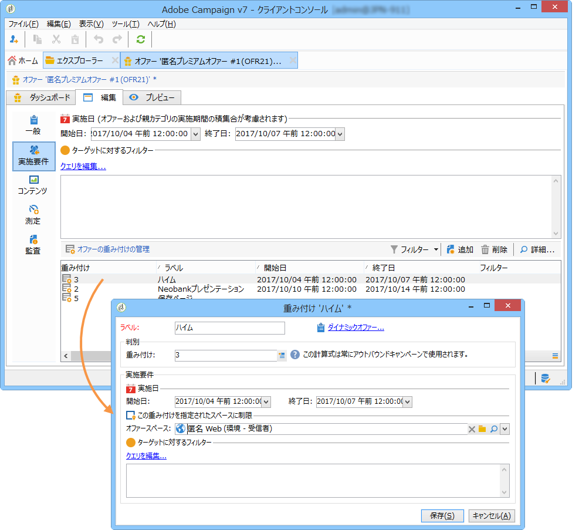

1. 「**[!UICONTROL コンテンツ]**」タブに移動し、オファーのコンテンツを定義します。

   >[!NOTE]
   >
   >「**[!UICONTROL コンテンツ定義]**」を選択すると、この Web スペースに必要な要素のリストが表示されます。

   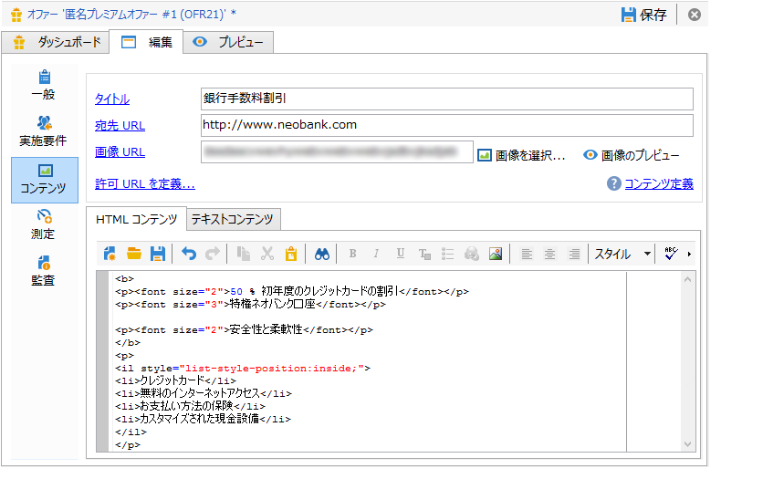

1. 2 つ目のオファーを作成します。

   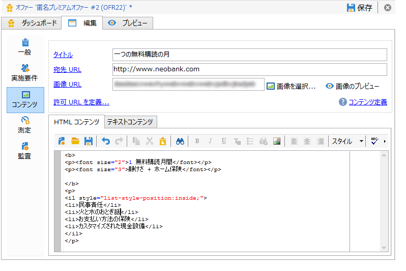

1. 「**[!UICONTROL 実施要件]**」タブに移動し、最初のオファーと同じ重み付けを指定します。
1. 各オファーに対して承認サイクルを実行し、オファーおよび承認されたオファースペースを、オンライン環境で利用可能な状態にします。

### Web サイト上の Web オファースペースの設定 {#configure-the-web-offer-space-on-the-website}

設定したオファーが Web サイトに表示されるようにするには、サイトの HTML ページに、インタラクションエンジンを呼び出す JavaScript コードを挿入します（詳しくは、[インバウンドチャネルについて](../../interaction/using/about-inbound-channels.md)を参照）。

1. HTML ページに移動して、@id 属性を挿入し、先ほど作成した匿名オファースペース（[匿名オファースペースの作成](#creating-anonymous-offer-spaces)を参照）の内部名にプレフィックス **i_** を付加した値を指定します。

   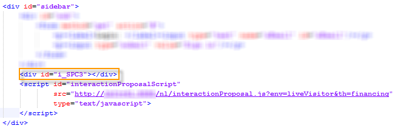

1. 呼び出し URL を挿入します。

   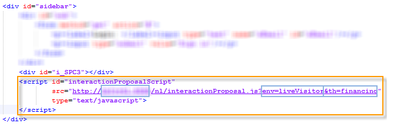

   上のコード中の URL について、青色の囲みで示した部分は、インスタンス名、環境の内部名（[匿名環境の作成](#creating-an-anonymous-environment)を参照）、カテゴリにリンクされたテーマ（[オファーカテゴリとテーマの作成](#creating-an-offer-category-and-a-theme)）を表しています。テーマの指定はオプションです。

この Web サイトの訪問者がホームページにアクセスすると、HTML ページに設定されたとおりに、「**financing**」のテーマに属するオファーが表示されます。


同じユーザーが何回もページにアクセスすると、カテゴリの各オファーに適用されている重み付けは等しいので、いずれかのオファーが表示されます。

## コンタクト先が識別されていない場合の匿名環境への切り替え {#switching-to-an-anonymous-environment-in-case-of-unidentified-contacts}

Neobank が、異なる 2 つのターゲットに向けたマーケティングオファーを作成するものとします。匿名の Web サイトブラウザーに対しては、汎用的なオファーを表示します。ユーザーが Neobank 発行の ID を持った顧客であると判明した場合は、ログイン後すぐに、パーソナライズされたオファーを表示するようにします。

このケーススタディで使用するシナリオは次のとおりです。

1. 訪問者が、ログインすることなく Neobank の Web サイトを閲覧します。

   

   3 つの匿名オファーがページに表示されます。そのうち 2 つは Neobank の商品に関するオファー「**Best Offer**」（ベストオファー）で、もう 1 つは Neobank のパートナー企業によるオファーです。

   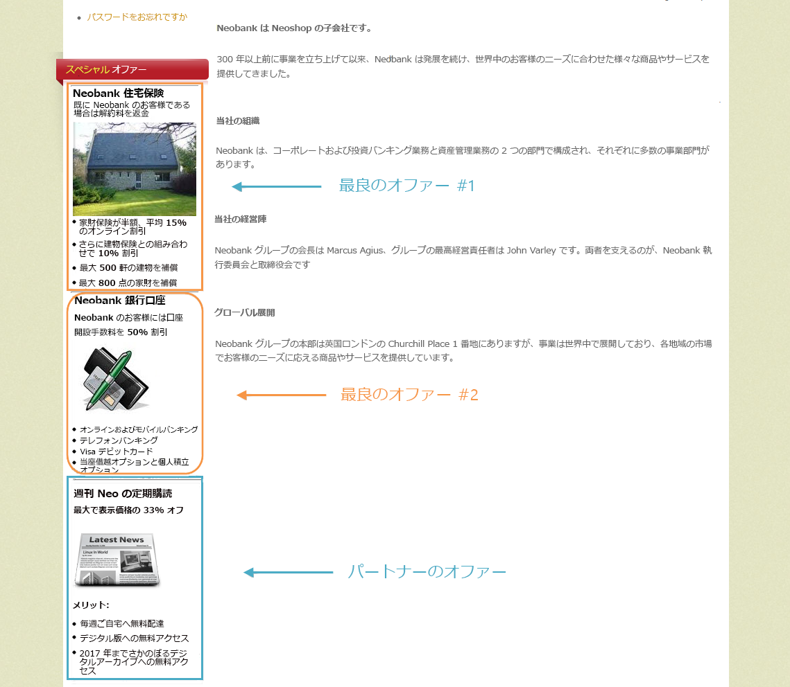

1. このユーザーが、Neobank の顧客として、自分の資格情報でログインします。

   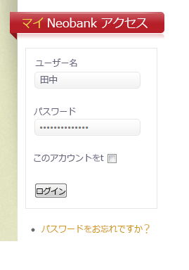

   パーソナライズされた 3 つのオファーが表示されます。

   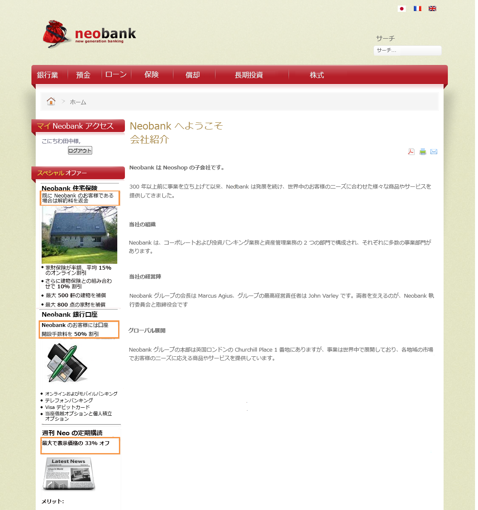

このケーススタディを実装するには、2 つのオファー環境が必要です。1 つは匿名インタラクション用の環境、もう 1 つは識別されたコンタクト向けに設定された特別なオファーを提示する環境です。識別されたオファー環境については、連絡先がログインせず識別されない場合、自動的に匿名オファー環境へと切り替わるように設定します。

次の手順に従います。

* 匿名のインバウンドインタラクションに特化したオファーカタログの作成手順：

   1. [匿名コンタクト向け環境の作成](#creating-an-environment-for-anonymous-contacts)
   1. [匿名環境向けオファースペースの設定](#configuring-offer-spaces-for-the-anonymous-environment)
   1. [匿名環境のオファーカテゴリの作成](#creating-offer-categories-in-an-anonymous-environment)
   1. [匿名訪問者向けオファーの作成](#creating-offers-for-anonymous-visitors)

* 識別されたインバウンドインタラクションに特化したオファーカタログの作成手順：

   1. [識別された環境のオファースペースの設定](#configure-the-offer-spaces-in-the-identified-environment)
   1. [識別された環境のオファーカテゴリの作成](#creating-offer-categories-in-an-identified-environment)
   1. [パーソナライズされたオファーの作成](#creating-personalized-offers)

* オファーエンジン呼び出しの設定：

   1. [Web ページのオファースペースの設定](#configuring-offer-spaces-on-the-web-page)
   1. [識別されたオファースペースの詳細設定](#specifying-the-advanced-settings-of-the-identified-offer-spaces)

### 匿名コンタクト向け環境の作成 {#creating-an-environment-for-anonymous-contacts}

1. 配信マッピングウィザードで、匿名インバウンドインタラクション向けのオファー環境を作成します（**訪問者**&#x200B;マッピング）。詳しくは、[オファー環境の作成](../../interaction/using/live-design-environments.md#creating-an-offer-environment)を参照してください。

   

### 匿名環境向けオファースペースの設定 {#configuring-offer-spaces-for-the-anonymous-environment}

この Web サイトに提示する必要があるオファーは、「**Best Offer**」（ベストオファー）と「**Partner**」（パートナー）の 2 つの異なるカテゴリに属します。この例では、各カテゴリに特定のオファースペースを 1 つずつ作成します。

「**Best Offer**」カテゴリに対応するオファースペースを作成するには、次の手順に従います。

1. Adobe Campaign ツリーで、先ほど作成した匿名環境に移動し、オファースペースを 1 つ追加します。

   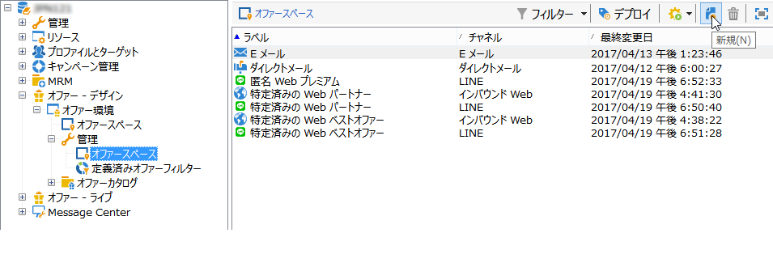

1. 「**[!UICONTROL インバウンド Web]**」タイプのスペースを新規作成します。

   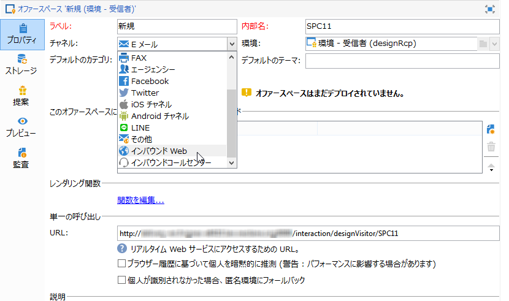

1. ラベルとして、例えば、&quot;**Web Best Anonymous Offer**&quot;（Web ベスト匿名オファー）と入力します。
1. このオファースペースに使用されるオファーコンテンツのフィールドを追加し、レンダリング関数を設定します。

   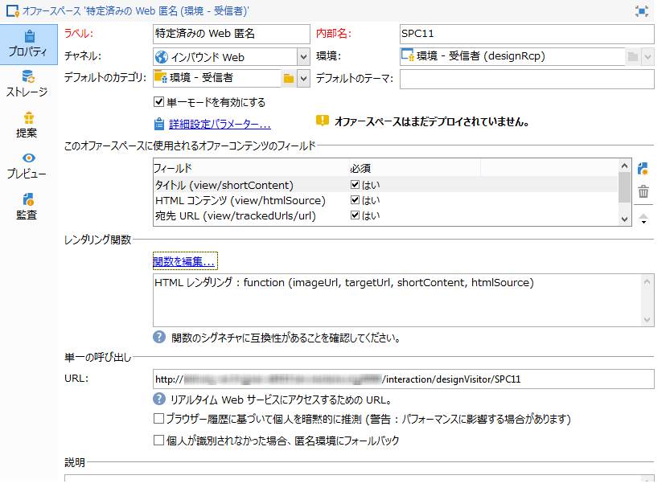

   >[!IMPORTANT]
   >
   >オファーを正しく表示するために、レンダリング関数では、事前に選択された順序のとおりにスペース用のフィールドを列挙する必要があります。

1. 同じ手順で、「**Partner**」カテゴリに対応するインバウンド Web チャネルのオファースペースを作成します。

   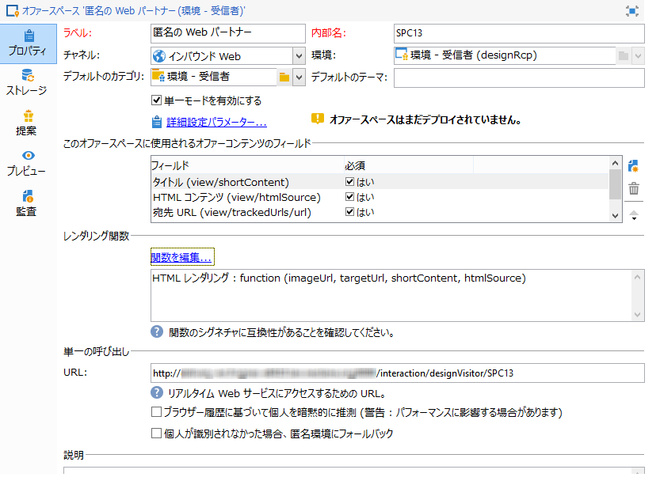

### 匿名環境のオファーカテゴリの作成 {#creating-offer-categories-in-an-anonymous-environment}

まず、「**Best Offer**」（ベストオファー）および「**Partner**」（パートナー）という 2 つのオファーカテゴリを作成します。各カテゴリには、匿名コンタクト向けのオファーを 2 件ずつ用意します。

1. 先ほど作成した匿名環境の「**[!UICONTROL オファーカタログ]**」に移動します。
1. **[!UICONTROL オファーカテゴリ]**&#x200B;フォルダーを追加し、&quot;**Best Offer**&quot; というラベルを付けます。

   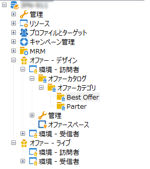

1. 2 つ目のカテゴリを作成し、&quot;**Partner**&quot; というラベルを付けます。

   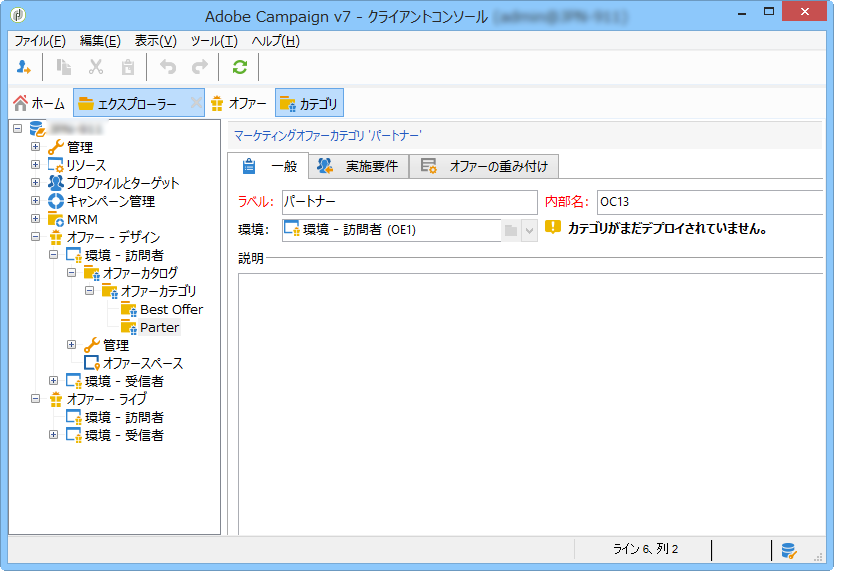

### 匿名訪問者向けオファーの作成 {#creating-offers-for-anonymous-visitors}

次は、上で作成した各カテゴリ内に 2 つずつオファーを作成します。

1. 「**Best Offer**」カテゴリに移動し、匿名オファーを作成します。

   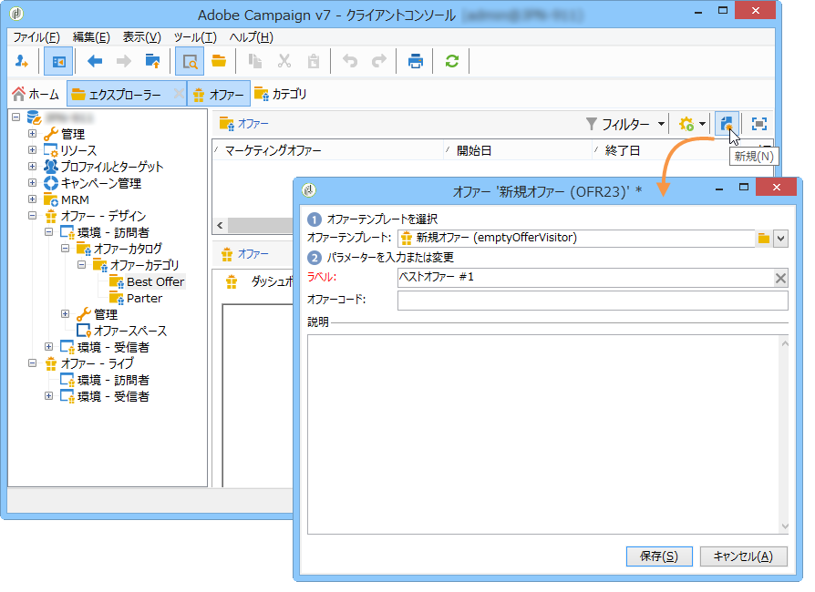

1. 「**[!UICONTROL 実施要件]**」タブに移動し、アプリケーションのコンテキストに応じてオファーの重み付けを指定します。

   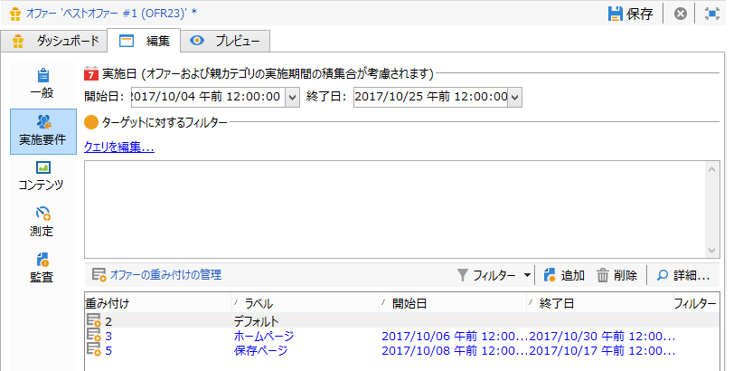

1. 「**[!UICONTROL コンテンツ]**」タブに移動し、オファーのコンテンツを定義します。

   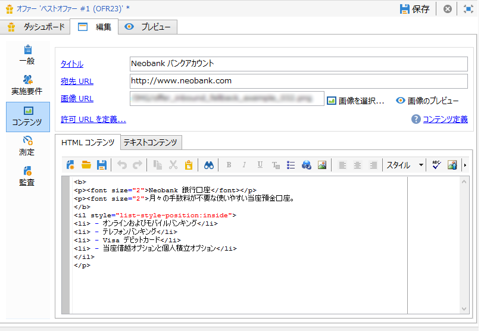

1. 「**Best Offer**」カテゴリに 2 つ目のオファーを作成します。

   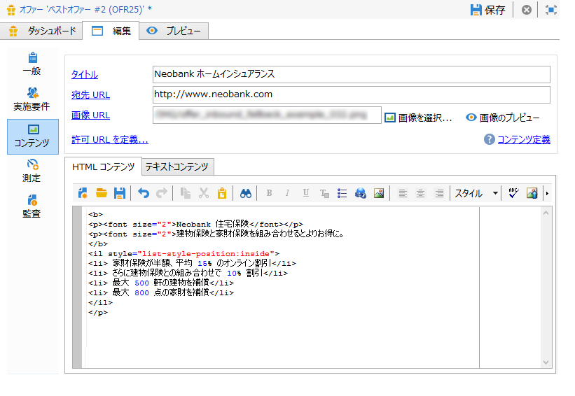

1. 「**Partner**」カテゴリに移動し、匿名オファーを作成します。
1. 「**[!UICONTROL コンテンツ]**」タブに移動し、オファーのコンテンツを定義します。

   

1. 「**[!UICONTROL 実施要件]**」タブに移動し、アプリケーションのコンテキストに応じてオファーの重み付けを指定します。

   

1. 「**Partner**」カテゴリに 2 つ目のオファーを作成します。

   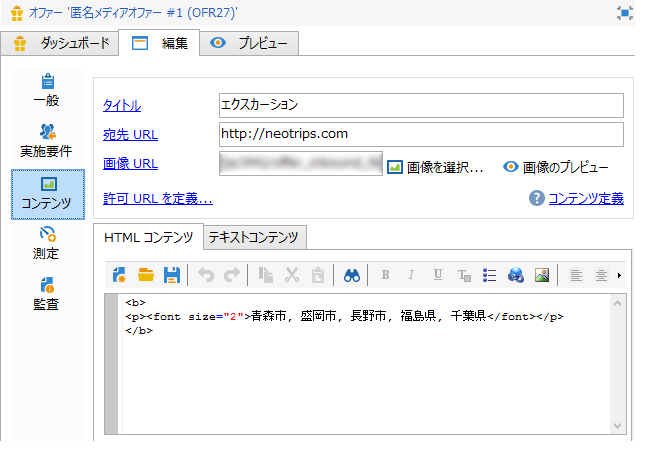

1. 「**[!UICONTROL 実施要件]**」タブに移動し、このカテゴリの最初のオファーと同じ値の重み付けを適用して、交互に Web サイトに表示されるようにします。

   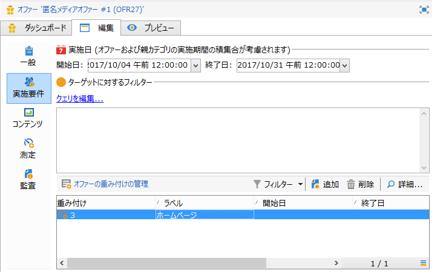

1. 各オファーに対して承認サイクルを実行し、ライブ環境への反映を開始します。コンテンツの承認時には、オファーに応じて「**Partner**」または「**Best Offer**」のいずれかのオファースペースを有効化します。

### 識別された環境のオファースペースの設定 {#configure-the-offer-spaces-in-the-identified-environment}

この Web サイトに提示するオファーは、「**Best Offer**」および「**Partner**」の 2 つの異なるカテゴリから取得されます。この例では、各カテゴリに特定のオファースペースを 1 つずつ作成します。

匿名オファースペースの場合と同じ手順で、2 つのオファースペースを作成します。[匿名環境向けオファースペースの設定](#configuring-offer-spaces-for-the-anonymous-environment)を参照してください。

1. Adobe Campaign ツリー内で、先ほど作成した環境に移動し、「**Best Offer**」および「**Partner**」オファースペースを追加します。
1. [匿名環境向けオファースペースの設定](#configuring-offer-spaces-for-the-anonymous-environment)で説明されているプロセスを実行します。

   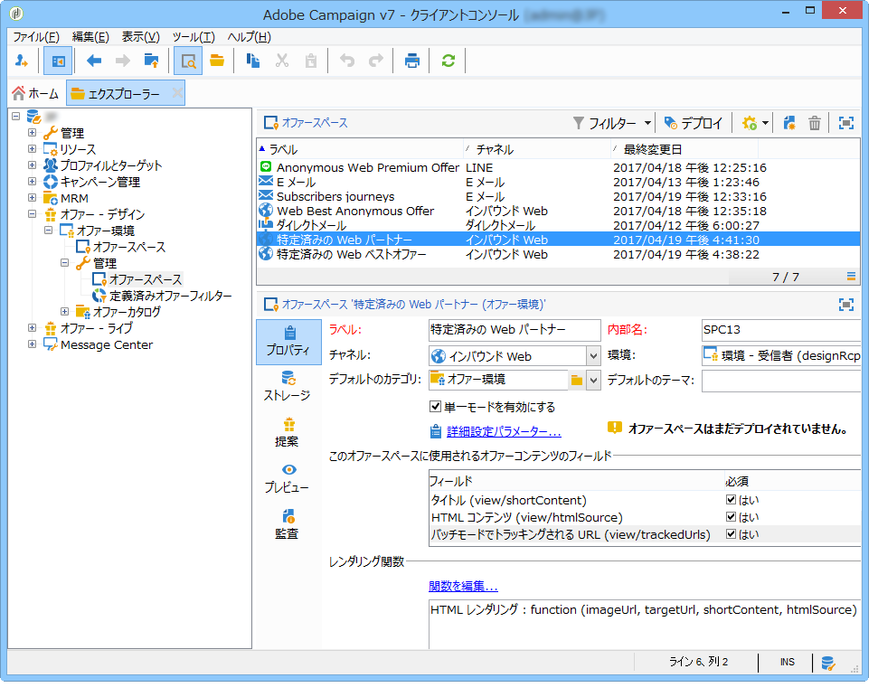

1. 「**[!UICONTROL 個人が識別されなかった場合、匿名環境にフォールバックします]**」オプションを選択します。

   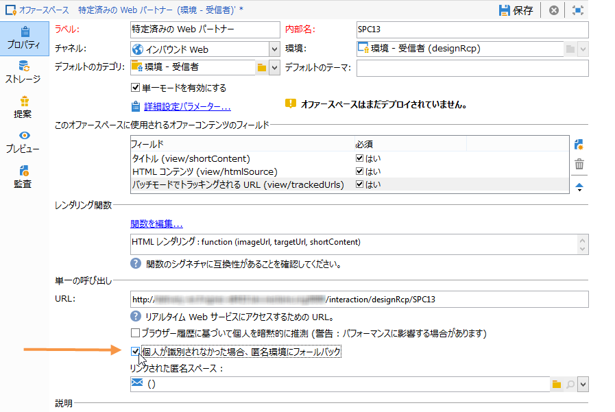

1. ドロップダウンリストを使用して、先ほど作成した匿名 Web オファースペースを選択します（[匿名環境向けオファースペースの設定](#configuring-offer-spaces-for-the-anonymous-environment)を参照）。

   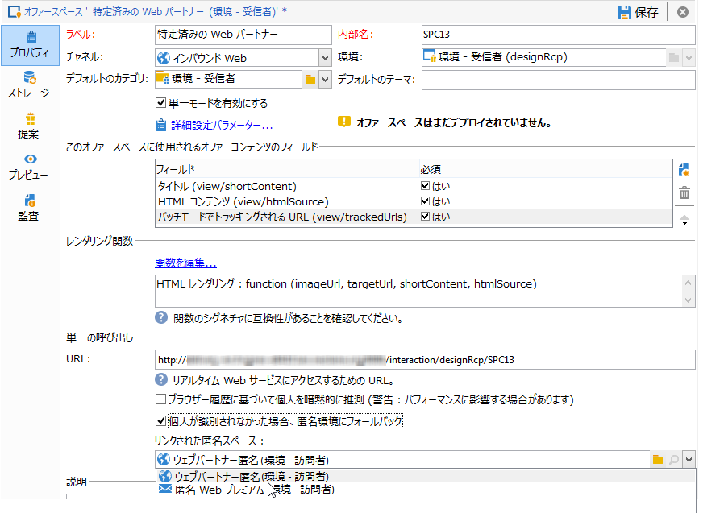

### 識別されたオファースペースの詳細設定 {#specifying-the-advanced-settings-of-the-identified-offer-spaces}

この例では、Adobe Campaign データベースの E メールアドレス情報を利用してコンタクト先を識別します。受信者の E メールをスペースに追加するには、次の手順に従います。

1. 識別された環境で、オファースペースフォルダーに移動します。
1. 「**Best Offer**」オファースペースを選択し、「**[!UICONTROL 詳細設定パラメーター]**」をクリックします。

   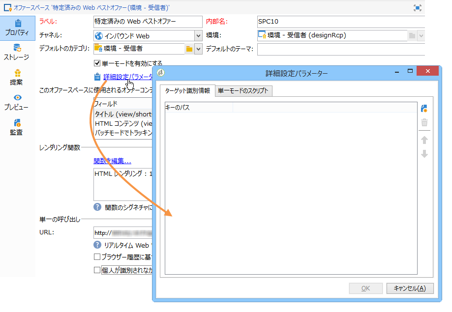

1. 「**[!UICONTROL ターゲット識別情報]**」タブで、「**[!UICONTROL 追加]**」をクリックします。

   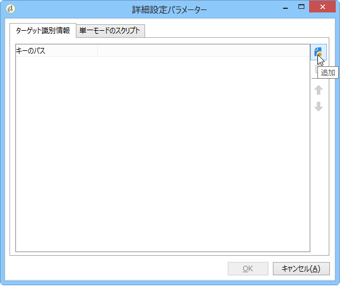

1. 「**[!UICONTROL 式を編集]**」をクリックし、受信者テーブルに移動して、「**[!UICONTROL E メール]**」フィールドを選択します。

   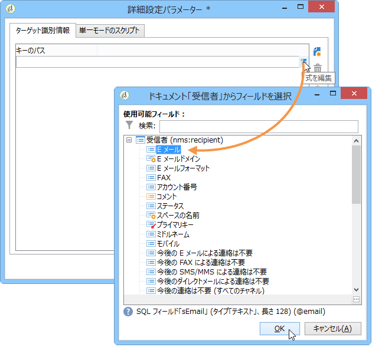

1. 「**[!UICONTROL OK]**」をクリックして&#x200B;**[!UICONTROL 詳細設定パラメーター]**&#x200B;ウィンドウを閉じ、「**Best Offer**」オファースペースの設定を完了します。
1. 「**Partner**」オファースペースについても同じ手順を実行します。

   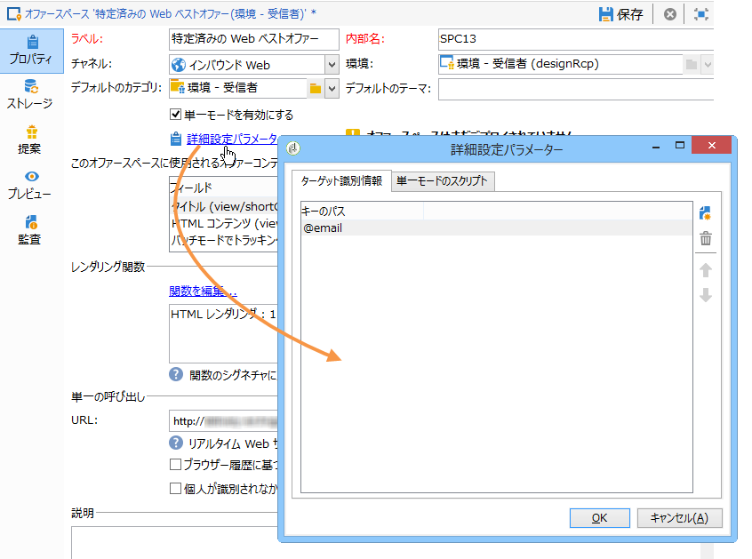

### 識別された環境のオファーカテゴリの作成 {#creating-offer-categories-in-an-identified-environment}

「**Best Offer**」および「**Partner**」という 2 つのカテゴリを作成し、パーソナライズされたオファーを各カテゴリに 2 つずつ用意します。

1. 識別された環境で、「**[!UICONTROL オファーカタログ]**」ノードに移動します。
1. 匿名環境の場合と同じく、2 つの&#x200B;**[!UICONTROL オファーカテゴリ]**&#x200B;フォルダーを追加し、それぞれに &quot;**Best Offer**&quot; および &quot;**Partner**&quot; というラベルを付けます。

   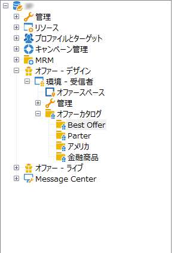

### パーソナライズされたオファーの作成 {#creating-personalized-offers}

各カテゴリにパーソナライズされたオファーを 2 つずつ、合計 4 つのオファーを作成します。

1. 「**Best Offer**」カテゴリに移動し、1 つ目のパーソナライズされたオファーを作成します。

   

1. 「**[!UICONTROL 実施要件]**」タブに移動し、アプリケーションのコンテキストに応じてオファーの重み付けを指定します。

   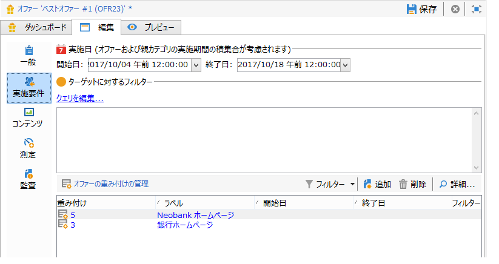

1. 「**[!UICONTROL コンテンツ]**」タブに移動し、オファーのコンテンツを定義します。

   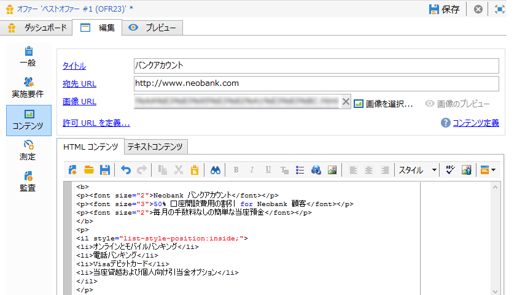

1. 「**Best Offer**」カテゴリに 2 つ目のオファーを作成します。

   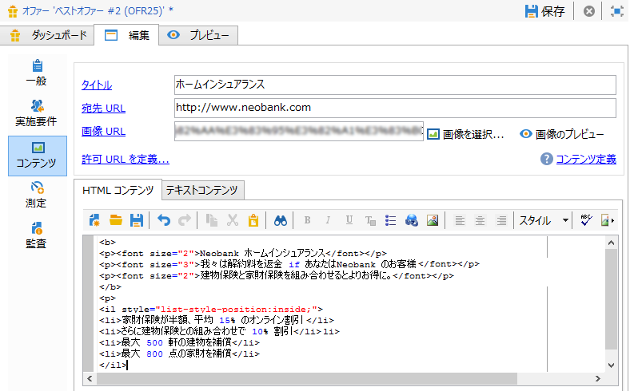

1. 「**Partner**」カテゴリに移動し、パーソナライズされたオファーを作成します。

   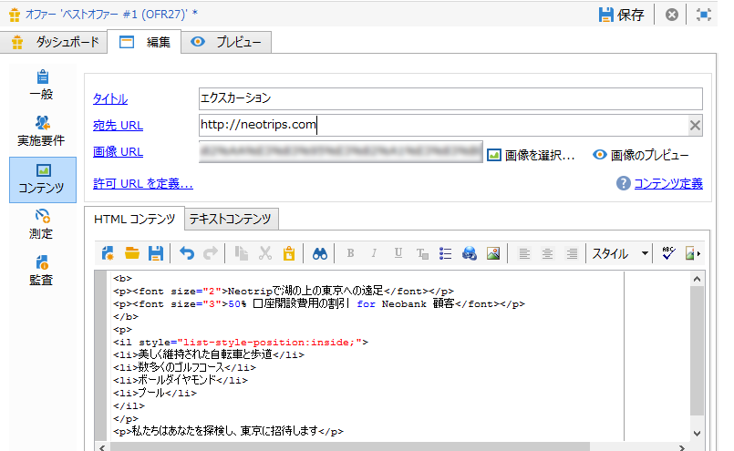

1. 「**[!UICONTROL 実施要件]**」タブに移動し、アプリケーションのコンテキストに応じてオファーの重み付けを指定します。

   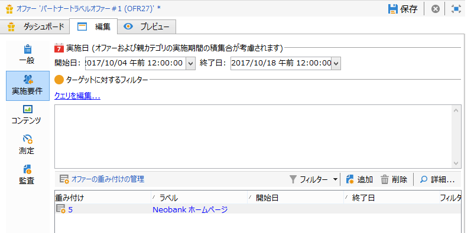

1. 「**Partner**」カテゴリに 2 つ目のオファーを作成します。

   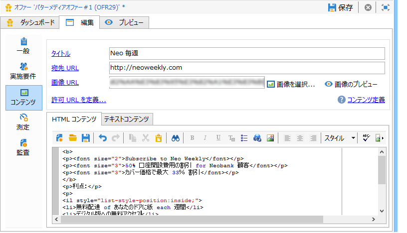

1. 「**[!UICONTROL 実施要件]**」タブに移動し、このカテゴリの最初のオファーと同じ値の重み付けを適用して、交互に Web サイトに表示されるようにします。
1. 各オファーに対して承認サイクルを実行し、更新を開始します。コンテンツの承認処理では、「**Partner**」または「**Best Offer**」オファースペースを有効化します。

### Web ページのオファースペースの設定 {#configuring-offer-spaces-on-the-web-page}

Neobank の Web サイトにはオファー用のスペースが 3 つあります。そのうち 2 つは、自社の商品やサービスに関する「**Best Offer**」カテゴリのオファー、もう 1 つは、パートナー企業による「**Partner**」カテゴリのオファーです。

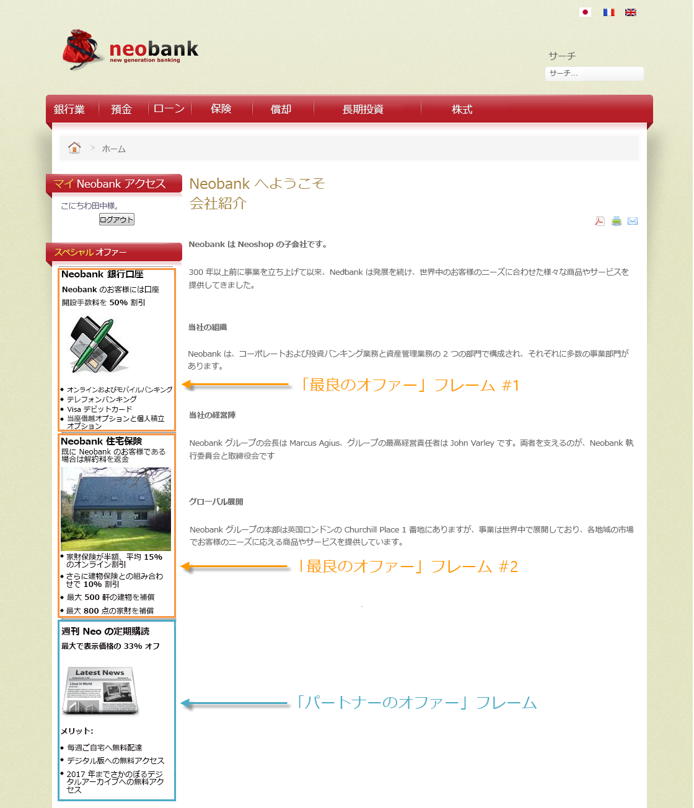

これらのオファースペースを Web サイトの HTML ページに設定するには、次の手順に従います。

1. HTML ページのコンテンツに、@id 属性を持つ

   要素を 3 つ挿入します。この @id 属性の値によって、Web サイトの様々なオファースペースに含まれるオファーの呼び出しが実行されます。

   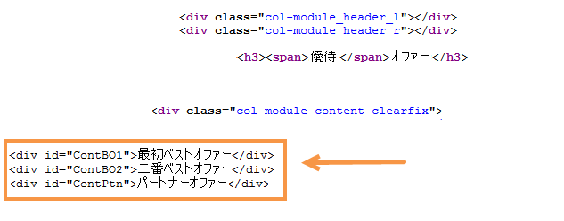

1. 各種の属性値を定義するスクリプトを挿入します。

   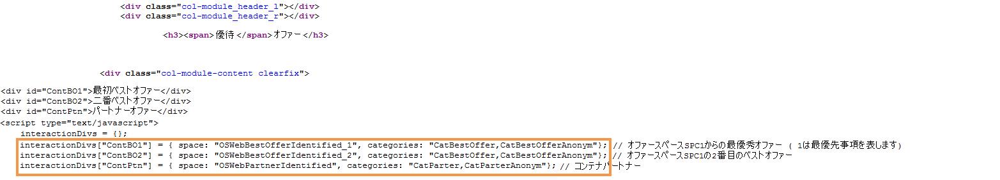

   この例では、**ContBO1** および **ContBO2** に **OsWebBestOfferIdentified** という値が設定されています。この値は、識別された環境に先ほど作成した「**Best Offer**」オファースペースの内部名です。**CatBestOffer** および **CatBestOfferAnonym** という値は、匿名環境および識別された環境にある「**Best Offer**」カテゴリの内部名に一致します。

   

   同様に、「**ContPtn**」に設定されている値 **OSWebPartnerIdentified** は、識別された環境に作成した「**Partner**」オファースペースの内部名に一致します。**CatPartner** および **CatPartnerAnonym** という値は、匿名環境および識別された環境にある「**Partner**」カテゴリの内部名に一致します。

   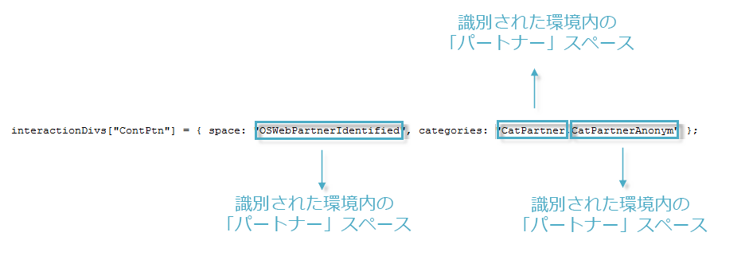

1. 変数 **interactionTarget** には、Neobank サイトにログオンするユーザーを識別するための情報を割り当てます。

   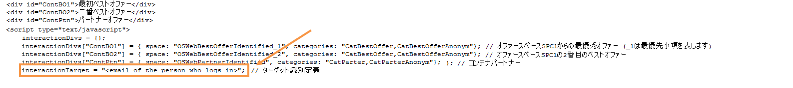

   ユーザーの識別手段としては、ブラウザーの Cookie、URL 内の読み取りパラメーター、E メール、ユーザー自身の本人確認情報などが使用できます。受信者テーブルに含まれる情報のうち、プライマリキー以外のフィールドを使用する場合は、スペースの詳細設定パラメーターに定義する必要があります（[識別されたオファースペースの詳細設定](#specifying-the-advanced-settings-of-the-identified-offer-spaces)を参照）。

1. 呼び出し URL を挿入します。

   

   この URL には、識別された環境の内部名 **EnvNeobankRecip** が含まれています。

Web ページが閲覧されると、スクリプトによってインタラクションエンジンが呼び出され、Web ページの適切なスペースにオファーコンテンツが表示されます。Adobe Campaign サーバーに対する 1 回の呼び出しのみで、エンジンは、選択する環境、オファースペース、カテゴリを認識します。

この例では、識別された環境（**EnvNeobankIdnRecip**）をエンジンが認識します。また、Web ページに含まれる第 1、第 2 のオファースペースについては「**OSWebBestOfferIdentified**」オファースペースおよび「**Best Offer**」カテゴリ（**CatBestOffer**）を認識し、第 3 のオファースペースについては「**OSWebPartnerIdentified**」オファースペースおよび「**Partner**」カテゴリ（**CatPartner**）を認識します。

エンジンが受信者を識別できない場合は、識別されたオファースペースから参照されている匿名オファースペースへの切り替えがおこなわれ、スクリプトの指定どおり、匿名カテゴリ（「**CatPartner**」および「**CatPartnerAnonym**」）が使用されます。
