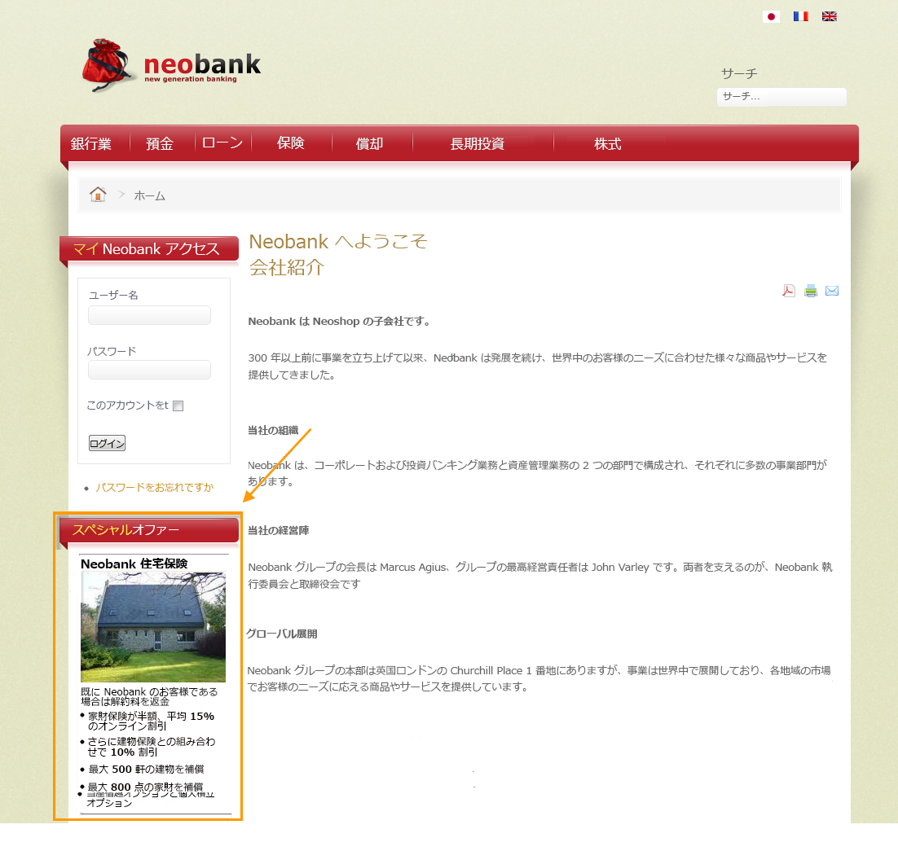
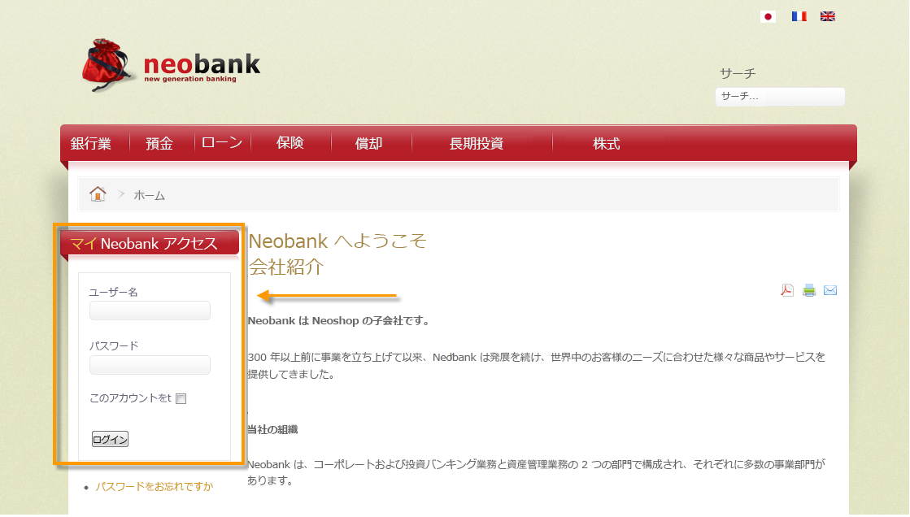
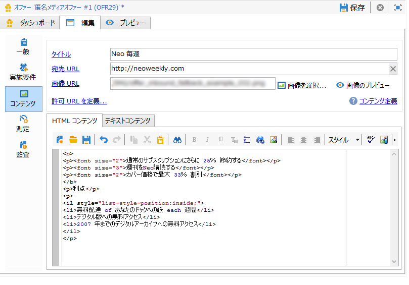
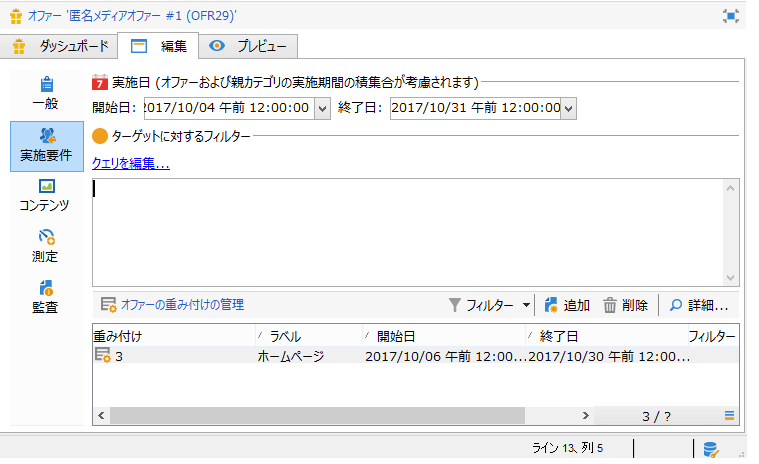
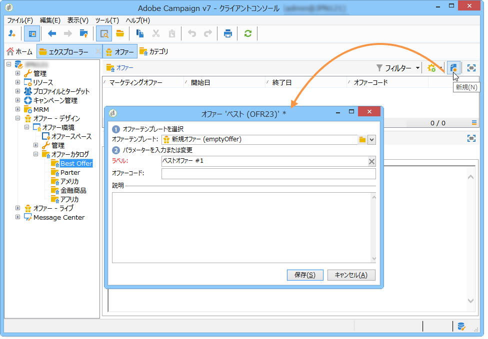
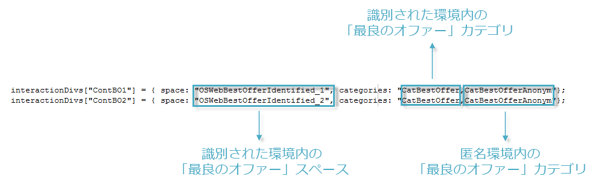
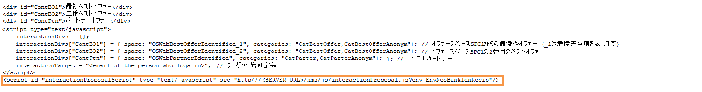

# インバウンドチャネル{#offers-on-an-inbound-channel}

## 匿名訪問者に対するオファー提案 {#presenting-an-offer-to-an-anonymous-visitor}

Neobank という会社のサイトで、ページを閲覧した匿名訪問者に対するオファーを Web サイト上に表示するものとします。

このインタラクションを実現するには、次の手順を実行します。

1. [匿名環境の作成](#creating-an-anonymous-environment)
1. [匿名オファースペースの作成](#creating-anonymous-offer-spaces)
1. [オファーカテゴリとテーマを作成します](#creating-an-offer-category-and-a-theme)。
1. [匿名オファーを作成します](#creating-anonymous-offers)。
1. [Web サイト上の Web オファースペースの設定](#configure-the-web-offer-space-on-the-website).

### 匿名環境の作成 {#creating-an-anonymous-environment}

Follow the procedure detailed in [Creating an offer environment](../../interaction/using/live-design-environments.md#creating-an-offer-environment) to create your anonymous environment based on the **Visitors**&#39; dimensions.

新しい環境を格納したツリー構造ができます。


### 匿名オファースペースの作成 {#creating-anonymous-offer-spaces}

1. In your anonymous environment (**Visitors**) go to the **[!UICONTROL Administration]** > **[!UICONTROL Spaces]** node.
1. Click **[!UICONTROL New]** to create call channels.

   

   >[!NOTE]
   >
   >スペースは、この匿名環境に自動的にリンクされます。

1. Change the label and select the **[!UICONTROL Inbound Web]** channel. チェックボックスをオンにする必要も **[!UICONTROL Enable unitary mode]** あります。

   

1. このスペースで使用するオファーコンテンツフィールドを選択し、必要に応じて関連するボックスをオンにして指定します。

   これにより、次の要素に不足があるオファーは、このスペースの実施要件を満たさないことになります。

   * タイトル
   * HTML コンテンツ
   * 画像 URL
   * 宛先 URL
   

1. 次の例のように、HTML レンダリング関数を編集します。

   ```
   function (imageUrl, targetUrl, shortContent, htmlSource){
         var html = "<p><b>" + shortContent + "</b></p>";
         html += "<p>" + htmlSource + "</p>";
         html += "<a _urlType='11' href='" + targetUrl + "'></a>";
         return html;
       }   
   ```

   >[!CAUTION]
   >
   >オファーを正しく表示するために、レンダリング関数では、事前に選択された順序のとおりにスペース用のフィールドを列挙する必要があります。

   

1. オファースペースを保存します。

### オファーカテゴリとテーマの作成 {#creating-an-offer-category-and-a-theme}

1. Go to the **[!UICONTROL Offer catalog]** node within the environment you have just created.
1. ノードを右クリックし **[!UICONTROL Offer catalog]** 、を選択しま **[!UICONTROL Create a new 'Offer category' folder]**&#x200B;す。

   新規カテゴリに、例えば「**Financial products**」（金融商品）という名前を付けます。

1. Go to the category&#39;s **[!UICONTROL Eligibility]** tab and enter **financing** as a theme, then save changes.

   

### 匿名オファーの作成 {#creating-anonymous-offers}

1. 作成したカテゴリに移動します。
1. クリック **[!UICONTROL New]**.

   

1. 標準で用意されている匿名オファーテンプレートか、別の作成済みテンプレートを選択します。

   

1. ラベルを変更し、オファーを保存します。

   

1. Go to the **[!UICONTROL Eligibility]** tab and specify the weight of the offers according to its application contexts.

   この例では、オファーは、年末まで優先項目としてホームページに表示されるように設定されています。

   

1. Go to the **[!UICONTROL Content]** tab and define the content of the offer.

   >[!NOTE]
   >
   >You can select **[!UICONTROL Content definitions]** to display the list of elements required for the web space.

   

1. 2 つ目のオファーを作成します。

   

1. Go to the **[!UICONTROL Eligibility]** tab and apply the same weight as for the first offer.
1. 各オファーに対して承認サイクルを実行し、オファーおよび承認されたオファースペースを、オンライン環境で利用可能な状態にします。

### Web サイト上の Web オファースペースの設定 {#configure-the-web-offer-space-on-the-website}

To make the offers you have just configured visible on the website, insert a JavaScript code into the HTML page of your site to call up the Interaction engine (for more on this, refer to [About inbound channels](../../interaction/using/about-inbound-channels.md)).

1. Go to the HTML page and insert an @id attribute with a value matching the internal name of the anonymous offer space created previously (refer to [Creating anonymous offer spaces](#creating-anonymous-offer-spaces)), preceded by **i_**.

   

1. 呼び出し URL を挿入します。

   

   上記の青いURLボックスは、インスタンス名、環境の内部名(匿名環境の作成を参照 [)、およびカテゴリにリンクされたテーマ(オファーカテゴリとテ](#creating-an-anonymous-environment)ーマの作成[](#creating-an-offer-category-and-a-theme))に対応します。 テーマの指定はオプションです。

この Web サイトの訪問者がホームページにアクセスすると、HTML ページに設定されたとおりに、「**financing**」のテーマに属するオファーが表示されます。



同じユーザーが何回もページにアクセスすると、カテゴリの各オファーに適用されている重み付けは等しいので、いずれかのオファーが表示されます。

## コンタクト先が識別されていない場合の匿名環境への切り替え {#switching-to-an-anonymous-environment-in-case-of-unidentified-contacts}

Neobank が、異なる 2 つのターゲットに向けたマーケティングオファーを作成するものとします。匿名の Web サイトブラウザーに対しては、汎用的なオファーを表示します。ユーザーが Neobank 発行の ID を持った顧客であると判明した場合は、ログイン後すぐに、パーソナライズされたオファーを表示するようにします。

このケーススタディで使用するシナリオは次のとおりです。

1. 訪問者が、ログインすることなく Neobank の Web サイトを閲覧します。

   

   3 つの匿名オファーがページに表示されます。そのうち 2 つは Neobank の商品に関するオファー「**Best Offer**」（ベストオファー）で、もう 1 つは Neobank のパートナー企業によるオファーです。

   

1. このユーザーが、Neobank の顧客として、自分の資格情報でログインします。

   

   パーソナライズされた 3 つのオファーが表示されます。

   

このケーススタディを実装するには、2 つのオファー環境が必要です。1 つは匿名インタラクション用の環境、もう 1 つは識別されたコンタクト向けに設定された特別なオファーを提示する環境です。識別されたオファー環境については、連絡先がログインせず識別されない場合、自動的に匿名オファー環境へと切り替わるように設定します。

次の手順に従います。

* 匿名のインバウンドインタラクションに特化したオファーカタログの作成手順：

   1. [匿名コンタクト向け環境の作成](#creating-an-environment-for-anonymous-contacts)
   1. [匿名環境向けオファースペースの設定](#configuring-offer-spaces-for-the-anonymous-environment)
   1. [匿名環境のオファーカテゴリの作成](#creating-offer-categories-in-an-anonymous-environment)
   1. [匿名訪問者向けオファーの作成](#creating-offers-for-anonymous-visitors)

* 識別されたインバウンドインタラクションに特化したオファーカタログの作成手順：

   1. [識別された環境のオファースペースの設定](#configure-the-offer-spaces-in-the-identified-environment)
   1. [識別された環境のオファーカテゴリの作成](#creating-offer-categories-in-an-identified-environment)
   1. [パーソナライズされたオファーの作成](#creating-personalized-offers)

* オファーエンジン呼び出しの設定：

   1. [Web ページのオファースペースの設定](#configuring-offer-spaces-on-the-web-page)
   1. [識別されたオファースペースの詳細設定](#specifying-the-advanced-settings-of-the-identified-offer-spaces)

### 匿名コンタクト向け環境の作成 {#creating-an-environment-for-anonymous-contacts}

1. 配信マッピングウィザードで、匿名インバウンドインタラクション向けのオファー環境を作成します（**訪問者**&#x200B;マッピング）。For more on this, refer to [Creating an offer environment](../../interaction/using/live-design-environments.md#creating-an-offer-environment).

   

### 匿名環境向けオファースペースの設定 {#configuring-offer-spaces-for-the-anonymous-environment}

The offers which must be presented on the web site belong to two different categories: **Best Offer** and **Partner**. この例では、各カテゴリに特定のオファースペースを 1 つずつ作成します。

「**Best Offer**」カテゴリに対応するオファースペースを作成するには、次の手順に従います。

1. Adobe Campaign ツリーで、先ほど作成した匿名環境に移動し、オファースペースを 1 つ追加します。

   

1. Create a new **[!UICONTROL Inbound web]** type space.

   

1. ラベルを入力：例え **ば、Web Best Anonymous** Offerを使用します。
1. このオファースペースに使用されるオファーコンテンツのフィールドを追加し、レンダリング関数を設定します。

   

   >[!CAUTION]
   >
   >オファーを正しく表示するために、レンダリング関数では、事前に選択された順序のとおりにスペース用のフィールドを列挙する必要があります。

1. 同じ手順で、「**Partner**」カテゴリに対応するインバウンド Web チャネルのオファースペースを作成します。

   

### 匿名環境のオファーカテゴリの作成 {#creating-offer-categories-in-an-anonymous-environment}

まず、「**Best Offer**」（ベストオファー）および「**Partner**」（パートナー）という 2 つのオファーカテゴリを作成します。各カテゴリには、匿名コンタクト向けのオファーを 2 件ずつ用意します。

1. Go to the **[!UICONTROL Offer catalog]** in the anonymous environment that you have just created.
1. Add an **[!UICONTROL Offer category]** folder with **Best Offer** as a label.

   

1. カテゴリをもう 1 つ追加し、&quot;**Partner**&quot; というラベルを付けます。

   

### 匿名訪問者向けオファーの作成 {#creating-offers-for-anonymous-visitors}

次は、上で作成した各カテゴリ内に 2 つずつオファーを作成します。

1. 「**Best Offer**」カテゴリに移動し、匿名オファーを作成します。

   

1. Go to the **[!UICONTROL Eligibility]** tab and specify the weight of the offers according to its application contexts.

   

1. Go to the **[!UICONTROL Content]** tab and define the content of the offer.

   

1. 「**Best Offer**」カテゴリに 2 つ目のオファーを作成します。

   

1. 「**Partner**」カテゴリに移動し、匿名オファーを作成します。
1. Go to the **[!UICONTROL Content]** tab and define the content of the offer.

   

1. Go to the **[!UICONTROL Eligibility]** tab and specify the weight of the offers according to its application contexts.

   

1. 「**Partner**」カテゴリに 2 つ目のオファーを作成します。

   

1. Go to the **[!UICONTROL Eligibility]** tab and apply the same weight that you applied to the first offer in this category so that the offers are displayed successively on the website.

   

1. 各オファーに対して承認サイクルを実行し、ライブ環境への反映を開始します。コンテンツの承認時には、オファーに応じて「**Partner**」または「**Best Offer**」のいずれかのオファースペースを有効化します。

### 識別された環境のオファースペースの設定 {#configure-the-offer-spaces-in-the-identified-environment}

The offers which you are going to present on the website are taken from two different categories: **Best Offer** and **Partner**. この例では、各カテゴリに特定のオファースペースを 1 つずつ作成します。

匿名オファースペースの場合と同じ手順で、2 つのオファースペースを作成します。Refer to [Configuring offer spaces for the anonymous environment](#configuring-offer-spaces-for-the-anonymous-environment).

1. Adobe Campaign ツリー内で、先ほど作成した環境に移動し、「**Best Offer**」および「**Partner**」オファースペースを追加します。
1. 匿名環境用のオファースペース [の設定で詳細を説明するプロセスを適用します](#configuring-offer-spaces-for-the-anonymous-environment)。

   

1. オプションを選 **[!UICONTROL Fall back on an anonymous environment if no individuals were identified]** 択します。

   

1. ドロップダウンリストを使用して、前に作成した匿名Webオファースペースを選択します(「匿 [名環境用のオファースペースの設定](#configuring-offer-spaces-for-the-anonymous-environment)」を参照)。

   

### 識別されたオファースペースの詳細設定 {#specifying-the-advanced-settings-of-the-identified-offer-spaces}

この例では、Adobe Campaign データベースの E メールアドレス情報を利用してコンタクト先を識別します。受信者の E メールをスペースに追加するには、次の手順に従います。

1. 識別された環境で、オファースペースフォルダーに移動します。
1. Select the **Best Offer** offer space and click **[!UICONTROL Advanced parameters]**.

   

1. タブで、をク **[!UICONTROL Target identification]** リックしま **[!UICONTROL Add]**&#x200B;す。

   

1. Click **[!UICONTROL Edit expression]**, go to the recipients table and select the **[!UICONTROL Email]** field.

   

1. Click **[!UICONTROL OK]** to close the **[!UICONTROL Advanced parameters]** window and finish configuring the **Best Offer** offer space.
1. 「**Partner**」オファースペースについても同じ手順を実行します。

   

### 識別された環境のオファーカテゴリの作成 {#creating-offer-categories-in-an-identified-environment}

「**Best Offer**」および「**Partner**」という 2 つのカテゴリを作成し、パーソナライズされたオファーを各カテゴリに 2 つずつ用意します。

1. Go to the **[!UICONTROL Offer catalogs]** node in the identified environment.
1. As in the anonymous environment, add two **[!UICONTROL Offer category]** folders with **Best Offer** and **Partner** as a labels.

   

### パーソナライズされたオファーの作成 {#creating-personalized-offers}

各カテゴリにパーソナライズされたオファーを 2 つずつ、合計 4 つのオファーを作成します。

1. 「**Best Offer**」カテゴリに移動し、1 つ目のパーソナライズされたオファーを作成します。

   

1. Go to the **[!UICONTROL Eligibility]** tab and specify the weight of the offers according to its application contexts.

   

1. Go to the **[!UICONTROL Content]** tab and define the content of the offer.

   

1. 「**Best Offer**」カテゴリに 2 つ目のオファーを作成します。

   

1. 「**Partner**」カテゴリに移動し、パーソナライズされたオファーを作成します。

   

1. Go to the **[!UICONTROL Eligibility]** tab and specify the weight of the offers according to its application contexts.

   

1. 「**Partner**」カテゴリに 2 つ目のオファーを作成します。

   

1. Go to the **[!UICONTROL Eligibility]** tab and apply the same weight that you applied to the first offer in this category so that the offers are displayed successively on the website.
1. 各オファーに対して承認サイクルを実行し、更新を開始します。コンテンツの承認処理では、「**Partner**」または「**Best Offer**」オファースペースを有効化します。

### Web ページのオファースペースの設定 {#configuring-offer-spaces-on-the-web-page}

Neobank の Web サイトにはオファー用のスペースが 3 つあります。そのうち 2 つは、自社の商品やサービスに関する「**Best Offer**」カテゴリのオファー、もう 1 つは、パートナー企業による「**Partner**」カテゴリのオファーです。


これらのオファースペースを Web サイトの HTML ページに設定するには、次の手順に従います。

1. HTMLページのコンテンツに、

   エレメントの値が@idの場合、Webサイトの様々なオファースペースにあるオファーを呼び出すことができます。

   

1. 各種の属性値を定義するスクリプトを挿入します。

   

   この例では、**ContBO1** および **ContBO2** に **OsWebBestOfferIdentified** という値が設定されています。この値は、識別された環境に先ほど作成した「**Best Offer**」オファースペースの内部名です。**CatBestOffer** および **CatBestOfferAnonym** という値は、匿名環境および識別された環境にある「**Best Offer**」カテゴリの内部名に一致します。

   

   同様に、「**ContPtn**」に設定されている値 **OSWebPartnerIdentified** は、識別された環境に作成した「**Partner**」オファースペースの内部名に一致します。**CatPartner** および **CatPartnerAnonym** という値は、匿名環境および識別された環境にある「**Partner**」カテゴリの内部名に一致します。

   

1. 変数 **interactionTarget** には、Neobank サイトにログオンするユーザーを識別するための情報を割り当てます。

   

   ユーザーの識別手段としては、ブラウザーの Cookie、URL 内の読み取りパラメーター、E メール、ユーザー自身の本人確認情報などが使用できます。If a field of the recipient table other than the primary key is used, it needs to be defined in the advanced parameters of the space (refer to [Specifying the advanced settings of the identified offer spaces](#specifying-the-advanced-settings-of-the-identified-offer-spaces)).

1. 呼び出し URL を挿入します。

   

   この URL には、識別された環境の内部名 **EnvNeobankRecip** が含まれています。

Web ページが閲覧されると、スクリプトによってインタラクションエンジンが呼び出され、Web ページの適切なスペースにオファーコンテンツが表示されます。Adobe Campaign サーバーに対する 1 回の呼び出しのみで、エンジンは、選択する環境、オファースペース、カテゴリを認識します。

この例では、識別された環境（**EnvNeobankIdnRecip**）をエンジンが認識します。また、Web ページに含まれる第 1、第 2 のオファースペースについては「**OSWebBestOfferIdentified**」オファースペースおよび「**Best Offer**」カテゴリ（**CatBestOffer**）を認識し、第 3 のオファースペースについては「**OSWebPartnerIdentified**」オファースペースおよび「**Partner**」カテゴリ（**CatPartner**）を認識します。

エンジンが受信者を識別できない場合は、識別されたオファースペースから参照されている匿名オファースペースへの切り替えがおこなわれ、スクリプトの指定どおり、匿名カテゴリ（「**CatPartner**」および「**CatPartnerAnonym**」）が使用されます。
